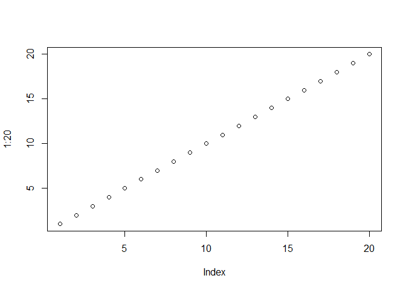

##Background
Your first weekly project requires you to submit a review of 4-5 different data visualizations used to answer specific questions. Some fun websites are [wonkblog](https://www.washingtonpost.com/news/wonk/?utm_term=.8eddb2e87599), [fivethiryeight](http://fivethirtyeight.com/), and [priceonomics](https://priceonomics.com/) (but you can use any website, blog, or article with a good visualization).
The submit word above will require you to create an account on slack. Our slack channel is f18dwv, and it requires that you create an account with your @byui.edu email account.

##Reading
This reading will help you complete the tasks below.

o [Making your first R Markdown File](https://byuistats.github.io/M335/rmarkdown_help.html)

o [Intro to R Markdown](http://rmarkdown.rstudio.com/articles_intro.html)

o [Chapter 27: R for Data Science - R Markdown](http://r4ds.had.co.nz/r-markdown.html)

o [Chapter 30: R for Data Science - R Markdown workflow](http://r4ds.had.co.nz/r-markdown-workflow.html)


##Tasks
[x] Find 4-5 examples of data-driven answers and write a one-paragraph review of each. 

[Which cleaning products pollute your home the most](https://priceonomics.com/which-cleaning-products-pollute-your-home-the-most/) This article explains the levels of VOCs that are released into your home by the average cleaning products. VOCs are chemicals that are dangerous to inhale and cause health problems. The graphic used in this is catching to the eye, but it is hard to understand as it uses different colors, two different scales for each product and also doesn't explain one of the categories. This graphic is catching to the eye, but it could be better.

[When does work actually get done?](https://priceonomics.com/when-does-work-actually-get-done/) is an article that adresses a concern that all employees, students and employers want to know. I wish to address the graphic that considers the day of the week in which most tasks are completed. This graphic is simple, but it communicates with the viewers. It is also a little too simple, as some more explanation could have been used when explaining the percentages and what they mean. It meant that that percent of weekly tasks are done on that day, but this was not too clear.

[After a Natural Disaster, Do Landlords Jack Up the Rent?](https://priceonomics.com/after-a-natural-disaster-do-landlords-jack-up-the/) This was a very interesting article as data scientists look to explain rental prices of Houston after the hurricane this past year. It was shocking to learn about this, but the first two graphics were able to explain very well the questions of average prices and price spikes. The graphics show visually the data that is represented by using wiggly lines to represent actual data, a fitted regression line to show trend and another line to show the date of the disaster. These two graphics are very good at portrarying data to the common viewer.

[The Coupon Code Index: Which Sites Discount the Most?](https://priceonomics.com/the-coupon-code-index-which-sites-discount-the/) As I was reading this article, there were a lot of different graphics that were used, but at the same time, there were a lot of questions being addressed. The graphic that I wish to consider is the one addressing the best online pizza discounts. The graphic here was also very simple, but it was able to present information clearly. This graphic hit the goal of communicating a message and allowing for people to then act on the information that was presented.

[x] List 2-3 items that are unique/good

The cleaning product visual allows for us to see two different categories of data. It also ranks the products so that we can see which product is most hazardous. 

The visual telling us about the most succesful day tells us a great message. It communicates clearly the most productive days and it values the simplicity of the question.

The natural disaster graphic was able to show uniqueness in the organization of the data. I have not seen a graphic that included such distinct lines, yet did not cause a lot of confusion. The graphic was clear, it allowed for an amateur to follow it, and it also presented interesting data.

The pizza graphic did not really have any unique traits to it, but it was able to communicate clearly. That is the purpose of a graphic, to be able to communicate clearly. Albeit, the data was very limited, and there was not much variety to this particular graphic, but it served its purpose.

[x] Identify 1 issue with the each example

The main problem with the cleaning products graphic is that the percentage category is unexplained and does not really communicate anything. This could be improved by using another graphic to explain this detail.

The only concern that I have with the graphic of daily productivity is that the percentages are not clearly explained. This could be improved by having a y-axis that explained what was being measured.

One concern that I have with the natural disaster graphic is the price spike graphic. It is still clear and presented in the same way as the previous graphic, but it did not allow for adequate explanation of what the spike was. They could also improve by using a wider x-scale to view a more broad set of time.

The only thing that worries me about the pizza visualization is that the data seems to be too limited. With only comparing three companies, and only presenting data on online savings, it seems like a very limited question was answered.

[x] Create an .Rmd file in R-Studio 

[x] Title it Case Study 1 in the YAML

[x] Include links to the visualization post you found

[x] Write a one paragraph critique of each visualization

[x] Add the R code below to your .Rmd file

[x] Knit the file to .html and keep the .md file as well

[x] Create an account on slack. You might create a catchy username that matches your other social media usernames and that can follow you for your career. Mine is hathawayj. 

[x] Upload your intermediary .md file to the general channel in our Slack group

##Code Snippet

```r
plot(1:20)
```

<!-- -->
