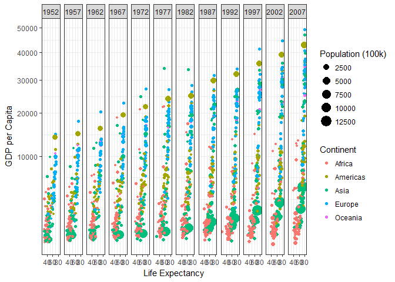
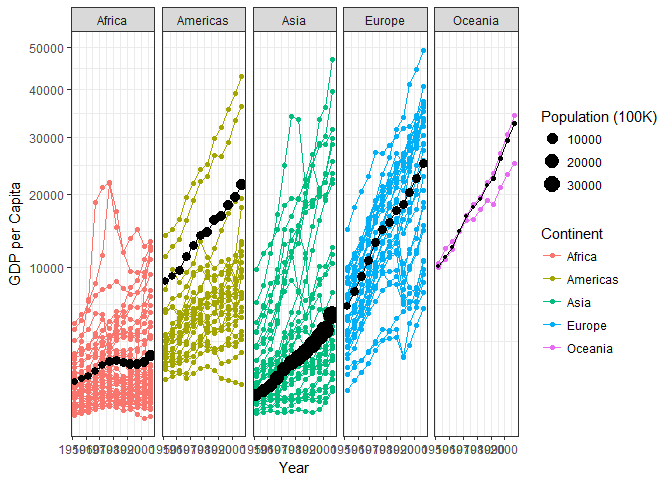

##Background

The first thing that I learned while working on this case study is that I don't fully comprehend ggplot2. I have gone through the reading, but it was difficult for me to make the connections between the examples and the data that we were given. I was very confused and I felt like I was, and am far behind. Although the information was given, I could not comprehend it. I then went onto the class github and was able to look at the coding of other students. By doing this, I was able to understand some more about how to use ggplot2. I still feel behind, but I am working hard trying to catch up and understand the code that is associated with the program. I was able to see how beautiful this program is, once I came to understand it a little bit more. The complexity of one graph is able to be simplified, through more complicated coding, but that simplification makes graphics communicate and speak to the audience and I am grateful for that. 

##Images


```r
ggplot(data = gapminder1, mapping = aes(x = lifeExp, y = gdpPercap)) +
geom_point(mapping = aes(color = continent, size = pop_100k)) +
facet_wrap(~ year, nrow = 1) +
labs(x = "Life Expectancy", y = "GDP per Capita", size = "Population (100k)", color = "Continent") +
scale_y_continuous(trans = "sqrt") +
theme_bw()
```

<!-- -->


```r
ggplot(data = gapminder1, mapping = aes(x = year, y = gdpPercap), position = "jitter") +
geom_point(mapping = aes(color = continent, group = country)) + #Continent Data
geom_line(mapping = aes(color = continent, group = country)) + #Continent Data
geom_point(data = gapminder2, mapping = aes(y = weighted_mean_gdp, size = population)) + #Black Line
geom_line(data = gapminder2, mapping = aes(y = weighted_mean_gdp)) + #Black Line
facet_wrap(~ continent, nrow = 1) +
labs(x = "Year", y = "GDP per Capita", color = "Continent", size = "Population (100K)") +
scale_y_continuous(trans = "sqrt") +
theme_bw()
```

<!-- -->
