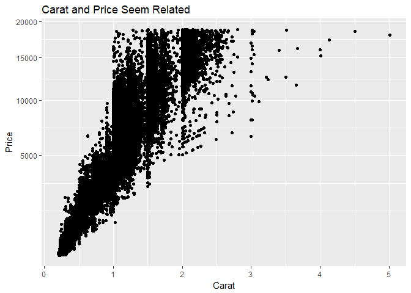
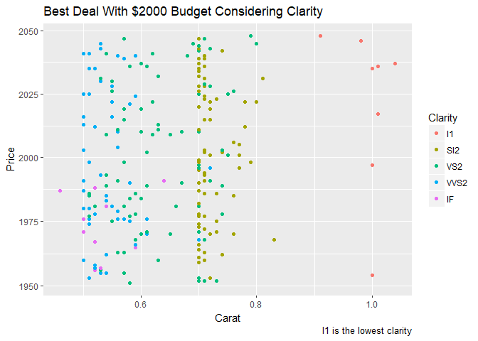
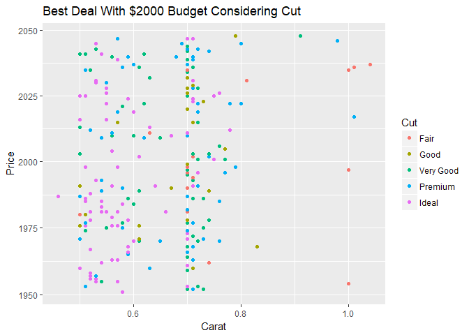
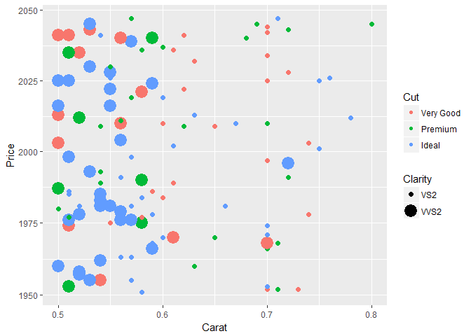

##Background

In library(ggplot2) there is a diamonds dataset that shows features of diamonds. Your brother is about to go out and buy a diamond ring for his fiancee and needs some advice on what type of diamond to purchase. He knows that karat has a strong relationship with price. He wants to know what other elements of the diamond he could sacrifice to maximize the karat size for a budget around $2,000. Some interesting details on diamonds can be found here.

##Reading

This reading will help you complete the tasks below.

o [Graphical Perception: Theory, Experimentation, and Applications](https://www.jstor.org/stable/2288400?seq=1#page_scan_tab_contents)

o [Chapter 28: R for Data Science - Graphics for communication](http://r4ds.had.co.nz/graphics-for-communication.html)

##Tasks

[x] Use the graphical perception rules you learned in your reading to make a graph that is accurate but poorly built to communicate data.


```r
ggplot(data = diamonds, mapping = aes(x = carat, y = price)) +
geom_point(mapping = aes()) +
labs(title = "Carat and Price Seem Related", x = "Carat", y = "Price") +
scale_y_continuous(trans = "sqrt") +
theme_get()
```

<!-- -->

<div style="padding-left:30px;">

I felt like this was an accurate graph in depicting information about the data that we have, but it does not communicate clearly what we want to be communicating. We are trying to let Hathaway know what he can do to maximize carat at two thousand dollars. This has tons of accurate information but it does not tell us how to do that. It is just points on a huge scale that is irrelevant.

</div>

[x] Use the graphical perception rules you learned in your reading to make a graph that is accurate and optimizes data communication.

<div style="padding-left:30px;">

The things that are consideredmost in selecting a diamond ring are cut and clarity. The following two graphics show how the price and carat size of a ring are effected by these two variables. In order to limit the data, we organized it into the given budget, so that we can be realistic in selecting a ring.

</div>


```r
ggplot(data = diamonds2, mapping = aes(x = carat, y = price)) +
geom_point(mapping = aes(color = clarity)) +
labs(title = "Best Deal With $2000 Budget Considering Clarity", x = "Carat", y = "Price", color = "Clarity", caption = "I1 is the lowest clarity") +
scale_y_continuous(trans = "sqrt") +
theme_get()
```

<!-- -->

<div style="padding-left:30px;">

The preceding graphic shows us that there is a consistent grouping of diamonds given their clarity. This means that we should consider this when looking for a ring. The bigger the carat of the diamond means that the clarity of the stone will decrease.

</div>


```r
ggplot(data = diamonds2, mapping = aes(x = carat, y = price)) +
geom_point(mapping = aes(color = cut)) +
labs(title = "Best Deal With $2000 Budget Considering Cut", x = "Carat", y = "Price", color = "Cut") +
scale_y_continuous(trans = "sqrt") +
theme_get()
```

<!-- -->

<div style="padding-left:30px;">

The second graphic is a little more complicated to interpret. Cut seems to not have as much of a dramatic impact on the diamond as the clarity does. As you can see, the colors are much more spread out with less of a trend.

</div>


```r
ggplot(data = diamonds3, mapping = aes(x = carat, y = price), position = "jitter") +
geom_point(mapping = aes(color = cut, size = clarity)) + 
labs(x = "Carat", y = "Price", color = "Cut", size = "Clarity") +
scale_y_continuous(trans = "sqrt") +
theme_get()
```

```
## Warning: Using size for a discrete variable is not advised.
```

<!-- -->

<div style="padding-left:30px;">

This last graphic is just for fun. This graphic shows us what it would look like to consider both of the explored variables at the same time. We see that the higher clarity, has a lot more "Ideal" cuts that the other two cuts. Given this information, it appears that by staying in our budget and buying a ring that is both clear and well cut, we will have a diamond between .7 and .8 carats. On the same note, if you don't care as much about clarity or size, buying a ring at about 1 carat would fit well into the budget. You're welcome brother.

</div>

[x] Create an .Rmd file with 1-2 paragraphs summarizing your 2 graphics and the choices you made in the data presentation

[x] Compile your .md and .html file into your git repository


