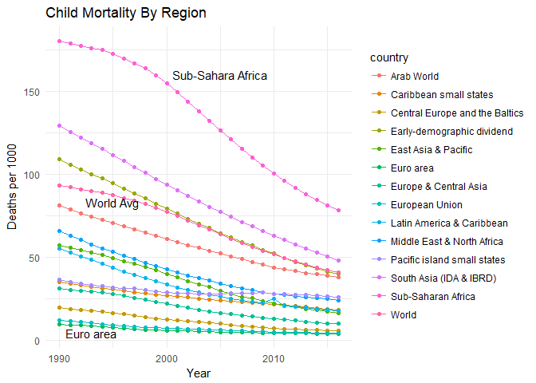

##Background

The [Our World in Data](https://ourworldindata.org/) website has world data. It is nice that they have provided graphics and then the data that they used to generate the graphics. We are going to recreate some of their visualizations in R and then make them better.


##Reading

This reading will help you complete the tasks below.

o [Chapter 6: R for Data Science - Scripts](http://r4ds.had.co.nz/workflow-scripts.html)

o [Chapter 11: R for Data Science - Data Import](http://r4ds.had.co.nz/data-import.html)

##Tasks

[x] Review the Our World in Data webpage and find a graphic that interests you.


```r
ggplot(suicide1, aes(x = Year, y = tenth)) +
  geom_point(aes(color = Age)) +
  geom_line(aes(group=Age, color=Age)) +
  labs(title = "World Wide Suicides Per Population of 100000", x = "Year", y = "Number of Suicides") +
  scale_y_log10() +
  theme_minimal()
```

<!-- -->

<div style="padding-left:30px;">

In This graphic we are able to see how the number of suicides per 100000 people has been moving from 1990 to 2008. In this graphic wer are able to see that youth have a much lower suicide rate than the rest of the population. An interesting presentation of the data is that the highest two age groups are actually the oldest age groups. This representation allows us to see how age groups differ in suicide rate. 

</div>

[x] Recreate that graphic in R after downloading the data from their website

[x] Explore the world data on child_mortality and create an interesting graphic that highlights this dataset. 


[x] Use devtools::install_github("drsimonj/ourworldindata") to get a larger dataset on child_mortality. This will require install.packages("devtools").


```r
RegionMortality <- RegionMortalityRates %>% 
  filter(country != "East Asia & Pacific (IDA & IBRD countries)", country != "Europe & Central Asia (IDA & IBRD countries)", country != "Latin America & the Caribbean (IDA & IBRD countries)", country != "Middle East & North Africa (IDA & IBRD countries)", country != "Sub-Saharan Africa (IDA & IBRD countries)")

Mortality <- ggplot(RegionMortality, aes(year, deaths)) +
  geom_line(aes(colour = country)) +
  geom_point(aes(colour = country)) +
  labs(title = "Child Mortality By Region", x="Year", y="Deaths per 1000") +
  theme_minimal() 

Mortality + annotate("text", x = 2005, y = 160, label = "Sub-Sahara Africa") +
  annotate("text", x = 1993, y = 4, label = "Euro area") +
  annotate("text", x = 1995, y = 83, label = "World Avg")
```

<!-- -->

<div style="padding-left:30px;">

In this graphic we are able to see how child mortality is spread so far throughout the world. In this graphic, I chose to label the region with the highest mortality, the lowest mortality and then the World average throughout 1990 to 2016. Although the graphic allows us to see how the child mortality is continuing to decrease, their is still a large gap between the regions. Although this graphic does not explain why this is happening, we are able to see that there is something there that is causing us to see such a difference. This information allows us to take action and further investigate the causes of these differences. 

Another interseting aspect of this graphic is that we have a decreasing trend for almost all regions. There is one exception with the Pacific Island Small States, where in about 2002 they flatlined, then the mortality increased for a few years, and then they haveslowly declined.

</div>

[x] Create a graphic that you could use in a presentation to summarize world child mortatility

[x] Include your plots in an .Rmd file with short paragraph describing your plots

[x] Push your .Rmd, .md, and .html to your GitHub repo
