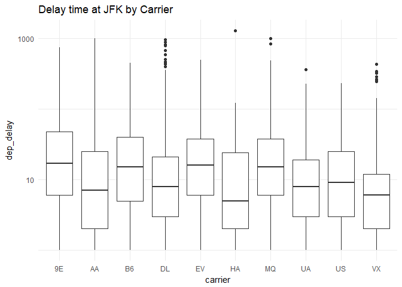
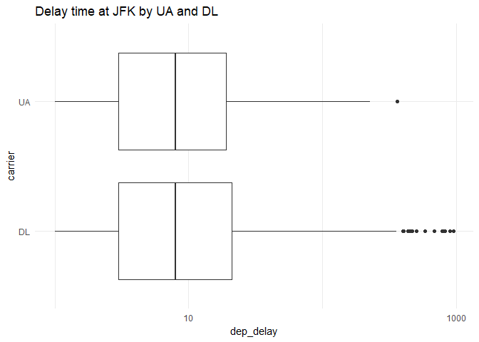
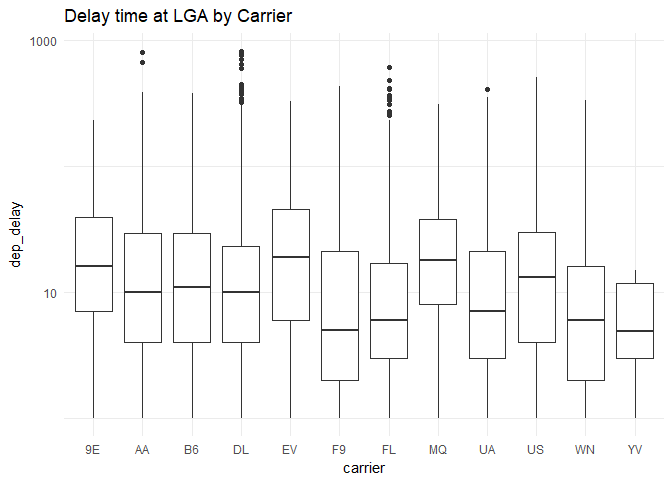
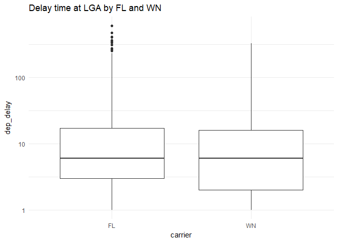
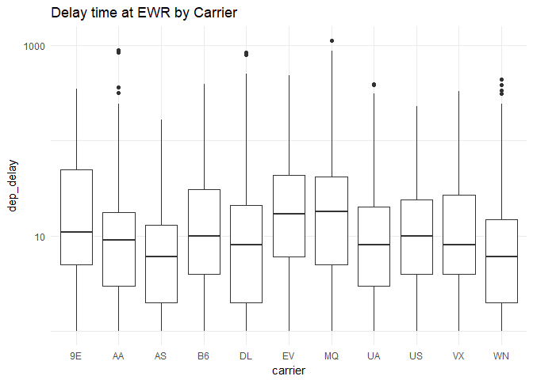
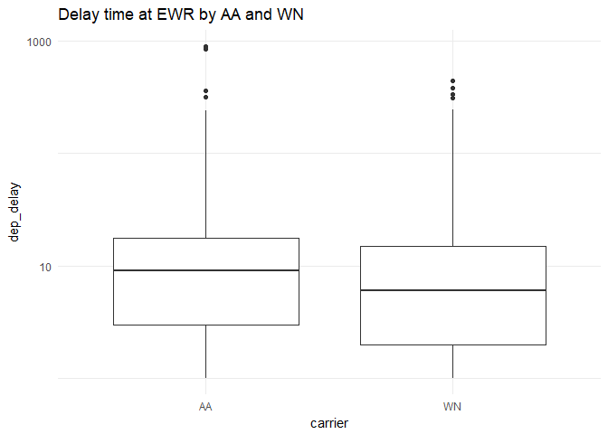
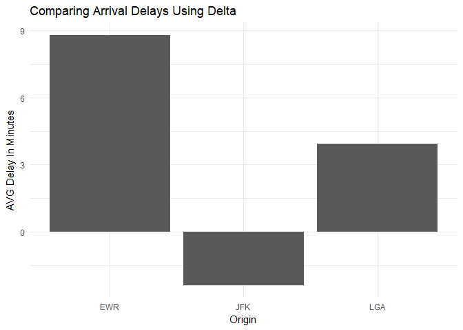

##Background

You just started your internship at a big firm in New York, and your manager gave you an extensive file of flights that departed JFK, LGA, or EWR in 2013. From this data (install.packages("nycflights13"), library(nycflights13)) your manager wants you to answer the following questions;

If I am leaving before noon, which two airlines do you recommend at each airport (JFK, LGA, EWR) that will have the lowest delay time at the 75th percentile?

Which origin airport is best to minimize my chances of a late arrival when I am using Delta Airlines?

Which destination airport is the worst (you decide on the metric for worst) airport for arrival time?

Make sure to include one visualization that shows the complexity of the data.

##Reading
This reading will help you complete the tasks below.

o [What do people do with new data](https://simplystatistics.org/2014/06/13/what-i-do-when-i-get-a-new-data-set-as-told-through-tweets/)

o [Posting Issues on GitHub](https://simplystatistics.org/2014/06/13/what-i-do-when-i-get-a-new-data-set-as-told-through-tweets/)

o [Being a good critiquer](https://sifterapp.com/blog/2012/08/tips-for-effectively-reporting-bugs-and-issues/)

o [Example of GitHub Issue conversation](https://github.com/STAT545-UBC/Discussion/issues/387)

o [reprex R Package](https://github.com/tidyverse/reprex#what-is-a-reprex)

##Questions


###If I am leaving before noon, which two airlines do you recommend at each airport (JFK, LGA, EWR) that will have the lowest delay time at the 75th percentile?


```r
ggplot(JFK, aes(x = carrier, y = dep_delay)) +
  geom_boxplot(na.rm = TRUE) +
  labs(title = "Delay time at JFK by Carrier") +
  scale_y_log10() +
  theme_minimal()
```

<!-- -->

```r
ggplot(JFK1, aes(x = carrier, y = dep_delay)) +
  geom_boxplot(na.rm = TRUE) +
  labs(title = "Delay time at JFK by UA and DL") +
  scale_y_log10() +
  theme_minimal() +
  coord_flip()
```

<!-- -->

<div style="padding-left:30px;">

In the above graphics we are able to see the 75th percentile for each carrier leaving from the JFK airport. It is clear that VX has the lowest 75th percentile, but DL and UA are very close together. By running the second graphic we see that UA is just below DL, but in reality the difference between the two is so small that I would look at other factors before choosing which of the two carriers to use. I would choose UA though as we see more outliers for DL that are far above the other percentiles. 

</div>


```r
ggplot(LGA, aes(x = carrier, y = dep_delay)) +
  geom_boxplot() +
  labs(title = "Delay time at LGA by Carrier") +
  scale_y_log10() +
  theme_minimal()
```

<!-- -->

```r
####This graphic tells us that out of LGA YV has the lowest, but we are left
####comparing two other carriers, FL and WN
ggplot(LGA1, aes(x = carrier, y = dep_delay)) +
  geom_boxplot() +
  labs(title = "Delay time at LGA by FL and WN") +
  scale_y_log10() +
  theme_minimal()
```

<!-- -->

<div style="padding-left:30px;">
These two graphics are exactly the same as the graphics from JFK. We ran into the same problem, but concluded that YV has the lowest 75th percentile and that we are in a similar situation between FL and WN. Other factors may effect our choice more than delay time between these two carriers. The 25th percentile on WN is a little lower though, and we also see many outliers above the FL, which would suggest to me that WN would be the more correct of the two. 

</div>


```r
ggplot(EWR, aes(x = carrier, y = dep_delay)) +
  geom_boxplot() +
  labs(title = "Delay time at EWR by Carrier") +
  scale_y_log10() +
  theme_minimal()
```

<!-- -->

```r
####This graphic tells us that out of the carriers AS is the lowest and again 
####we must take a closer look at two of them, AA and WN
ggplot(EWR1, aes(x = carrier, y = dep_delay)) +
  geom_boxplot() +
  labs(title = "Delay time at EWR by AA and WN") +
  scale_y_log10() +
  theme_minimal()
```

<!-- -->

<div style="padding-left:30px;">
These two graphics teach us about EWR. At this airport, AS is the lowest at 75th percentile regarding delay time. Then we have another close call between AA and WN. Again, we should consider other things when choosing our flights. We may want to consider that the median is lower for WN and I would advise that selection.
 
</div>

###Which origin airport is best to minimize my chances of a late arrival when I am using Delta Airlines?


```r
ggplot(Delta, aes(x = origin, y = AVG_Delay)) +
  geom_col() +
  labs(title = "Comparing Arrival Delays Using Delta", x = "Origin", y = "AVG Delay In Minutes") +
  theme_minimal()
```

<!-- -->

<div style="padding-left:30px;">

After manipulating the data to include only Delta flights from the three different airports, I ran into the problem of having NA in the data. After Removing those observations, I was able to use summarize to determine the average delay time when flying from the three different origins. This graphic explains that average delay time when flying from these three different points. EWR has the worst arrival time with an average of almost 9 minutes behind of schedule. The best origin to fly from, if you do not want to be late is JFK. IF you fly Delta from here you will on average arrive two minutes faster than you were scheduled to do. 

</div>

##DataBending - Quote
I made up databending. It does not mean that we make up data or that we alter it. Like airbenders we control our data to answer the questions we need answered. The key to databending is flexibility and finding and following the path of least resistence.


