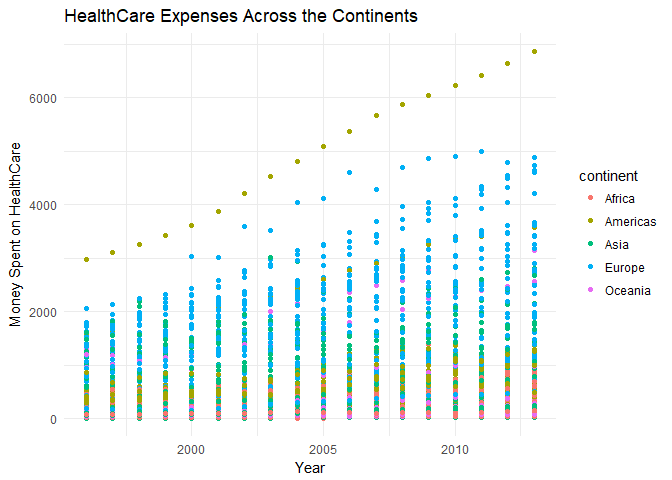
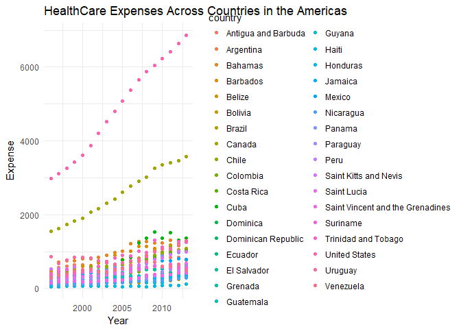
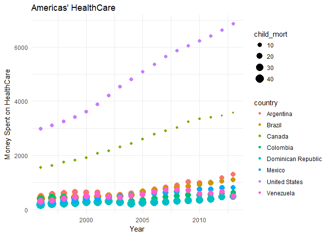
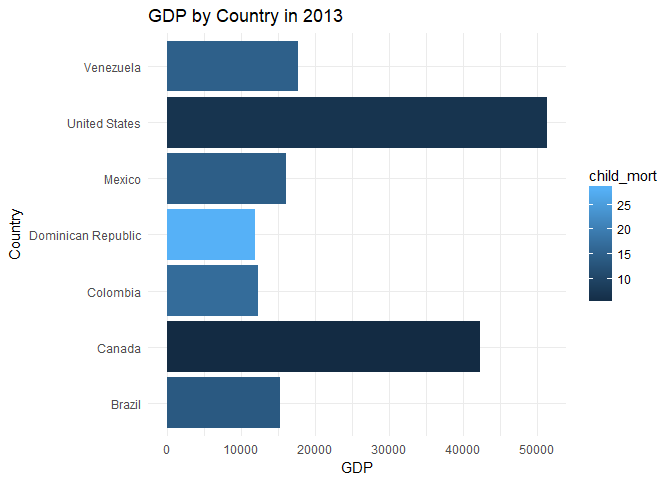

##Background

The [Our World in Data](https://ourworldindata.org/) website has world data. It is nice that they have provided graphics and then the data that they used to generate the graphics. Once again, we are going to recreate some of their visualizations in R and then make them better.

##Reading

This reading will help you complete the tasks below.

o [Chapter 7: R for Data Science - Exploratory Data Analysis](http://r4ds.had.co.nz/exploratory-data-analysis.html)

o [devtoools R Package](https://github.com/hadley/devtools)

##Tasks

[x] Explore the world data on financing_healthcare and create an interesting graphic that highlights this dataset in relation to child mortality. 

[x] Use devtools::install_github("drsimonj/ourworldindata") to get a larger dataset on financing_healthcare

[x] Create a graphic that you could use in a final presentation to summarize world child mortatility (child_mort column)

[x] Push your .Rmd, .md, and .html to your GitHub repo

##Child Mortality


```r
Mortality <- financing_healthcare %>%
  filter(!is.na(child_mort), 
         !is.na(continent),
         child_mort >0, year > 1995) 

ggplot(Mortality, aes(x = year, y = health_exp_total, color = continent)) +
  geom_point() +
  labs(title = "HealthCare Expenses Across the Continents", y = "Money Spent on HealthCare", x = "Year") +
  theme_minimal()
```

```
## Warning: Removed 128 rows containing missing values (geom_point).
```

<!-- -->

<div style="padding-left:30px;">

In this graphic we are able to see a few different groupings of healthcare expenditures by continent. Although this does not tell us about child mortality, it does show us that the "Western World" is spending more money on healthcare. Another interesting thing about this graphic is that there is a very distinct seperation between some of the points in the American continent. We will look at this further to more fully understand what is going on.

</div>


```r
AmMortality <- Mortality %>% 
  filter(continent == "Americas") 

ggplot(AmMortality, aes(x = year, y = health_exp_total, color = country)) +
  geom_point() +
  labs(title= "HealthCare Expenses Across Countries in the Americas", x = "Year", y = "Expense") +
  theme_minimal()
```

<!-- -->

<div style="padding-left:30px;">

Here we are able to see a lot more information. We are able to see that the difference in HealthCare expenses also differentiates between the countries in the Americas. This also helps us to narrow down our search for understanding more about child mortality. 

</div>


```r
AmericaMortality <- AmMortality %>% 
  filter(country != "Antigua and Barbuda", country != "Bahamas", country != "Barbados",
         country != "Belize", country != "Bolivia", country != "Chile", 
         country != "Costa Rica", country != "Cuba", country != "Dominica",
         country != "Ecuador", country != "El Salvador", country != "Grenada",
         country != "Guatemala", country != "Guyana", country != "Haiti",
         country != "Honduras", country != "Nicaragua", country != "Panama",
         country != "Paraguay", country != "Peru", country != "Saint Kitts and Nevis",
         country != "Saint Lucia", country != "Saint Vincent and the Grenadines",
         country != "Suriname", country != "Trinidad and Tobago", country != "Jamaica",
         country != "Uruguay")

ggplot(AmericaMortality, aes(x = year, y = health_exp_total, color = country,
                             size = child_mort)) +
  geom_point() +
  labs(title = "Americas' HealthCare", y = "Money Spent on HealthCare", x = "Year") +
  theme_minimal()
```

<!-- -->

<div style="padding-left:30px;">

In this graphic, we took a selection of countries from the Americas to explore in more detail what is going on. We selected countries from North America, South America, and Central America. In the graphic we are able to see a very clear distinction between North America and the other two in the expenses of HealthCare, as well as the child mortality rates. Although this is helpful is still leaves a question, why do other countries not spend more money on healthcare?

</div>


```r
####I have my graphics listed, but it would be nice to explain in a table the
####differences in GDP between the countries in my Americas' HealthCare plot.

#I excluded Argentina because the GDP was not available.
AmericaGDP <- AmericaMortality %>% 
  filter(year == 2013, country != "Argentina") 

ggplot(AmericaGDP, aes(x = country, y = gdp, fill = child_mort)) +
  geom_col() +
  labs(title="GDP by Country in 2013", y = "GDP", x = "Country") +
  theme_minimal() +
  coord_flip()
```

<!-- -->

<div style="padding-left:30px;">

This final graphic allows us to see a little bit more. We excluded Argentina from this selection as the GDP was not available. He we see a very clear reasoning in why HealthCare expenditure is so different. The United States clearly has more to spend and that hold still for Canada as well. The really concerning aspect of this graphic is that the rest of our selected American countries, are far below North America in regards to HealthCare Expenditure, GDP and Child Mortality. Although we cannot give money to these countries to fill in this gap, we are now able to understand a little bit more about why child mortality is so prevelant in these countries and we are able to see how we can aide in some way.

</div>


