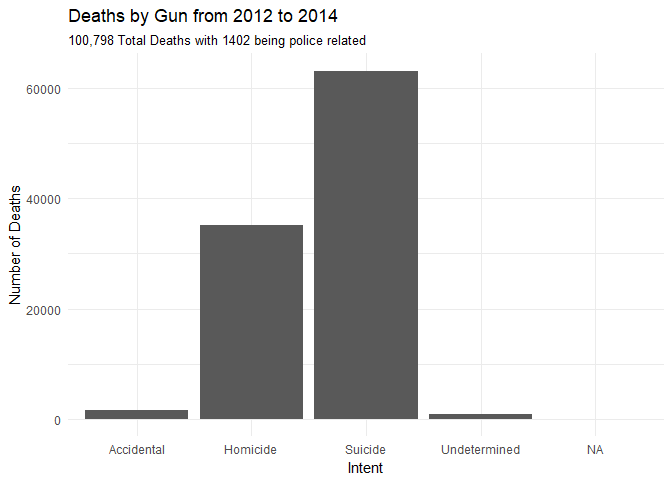
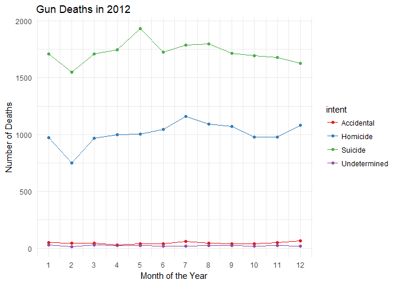
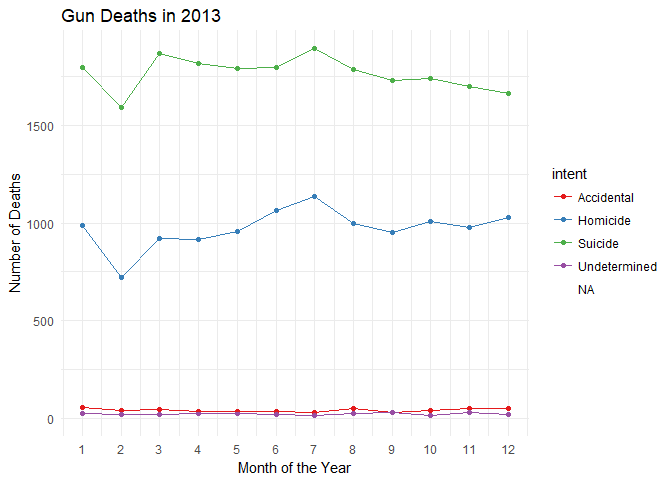
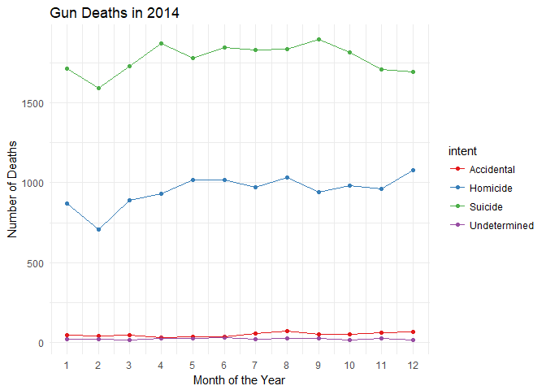
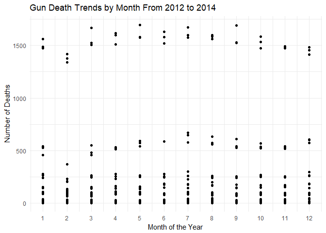
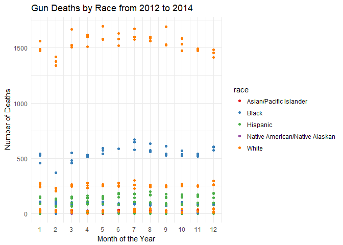
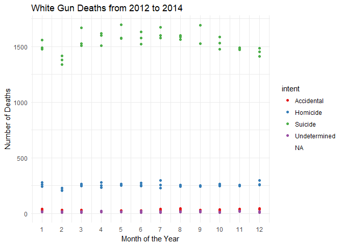

##Background

The world is a dangerous place. During 2015 and 2016 there was a lot of discussion in the [news about police shootings](https://www.cbsnews.com/pictures/controversial-police-shootings/). [FiveThirtyEight](fivethirtyeight.com/) reported on [gun deaths in 2016](https://fivethirtyeight.com/features/gun-deaths/). As leaders in data journalism, they have posted a clean version of this data in their GitHub repo called [full_data.csv](https://github.com/fivethirtyeight/guns-data) for us to use.

While their visualizations focused on yearly averages, our client wants to create commercials that help reduce the gun deaths in the US. They would like to target the commercials in different seasons of the year (think month variable) to audiences that could have the most impact in reducing gun deaths. Our challenge is to summarize and visualize seasonal trends accross the other variables in these data.

##Reading

This reading will help you complete the tasks below.

o [Effectively Communicating Numbers (pg 13-20)](http://perceptualedge.com/articles/Whitepapers/Communicating_Numbers.pdf)

##Tasks

<div style="padding-left:30px;">

We need to keep things simple. Lines, dots and bars are used in order to communicate data, and they each have their own strengths and weaknesses. When creating graphs we also need to remember that simple is best. We should be eliminating lines, colors and any other nonsense that is not communicating clearly what is going on. There are several steps to most accurately communicate when analyzing data. 1st, know your data and your questions. 2nd, determine if you need a table, graph or both to communicate. 3rd, use this chart  to understand when to use graphs and which ones. 4th and lastly, determine where to put your variables, how to label them and which ones should be included. By using these steps in data wrangling and visualization, we will be able to communicate effectively, as long as we know what path we are headed towards.

</div>

<div style="padding-left:30px;">

The article provided by FiveThirtyEight was very powerful, but the most powerful part of it was the fact that the interactive graphic was made in a very good way. It allowed us to see the big picture and to see how much we focus on the things that do not have enough strenght or weight when considering the big picture. The article was very good at portraying the picture to help us to visualize what was really going on. The article mainly explained the data, but the graphic told the story. 

</div>


```r
ggplot(Guns1, aes(x = intent, y = count)) +
  geom_col() +
  labs(title = "Deaths by Gun from 2012 to 2014", subtitle = "100,798 Total Deaths with 1402 being police related",
       x = "Intent", y = "Number of Deaths") +
  theme_minimal()
```

<!-- -->

<div style="padding-left:30px;">

The article in FiveThirtyEight was very powerful in the fact that the graphic communicated so much. Although my replication of the graphic is much more simple, it portrays the same ideas. Media puts such a focus on police killing people and police related deaths, when in reality more people die due to accidental gun deaths. The main focus that I see in this data is that over 60000 people die to suicide by use of a gun. That is worth putting our focus on. 

</div>


```r
ggplot(Guns2012, aes(x = month, y = count, color = intent)) +
  geom_point() +
  geom_line() +
  scale_colour_brewer(palette = "Set1") +
  labs(title = "Gun Deaths in 2012", x = "Month of the Year",
       y = "Number of Deaths") +
  scale_x_continuous(breaks = seq(1, 12, by = 1)) +
  theme_minimal() 
```

<!-- -->

```r
ggplot(Guns2013, aes(x = month, y = count, color = intent)) +
  geom_point() +
  geom_line() +
  scale_colour_brewer(palette = "Set1") +
  labs(title = "Gun Deaths in 2013", x = "Month of the Year",
       y = "Number of Deaths") +
  scale_x_continuous(breaks = seq(1, 12, by = 1)) +
  theme_minimal() 
```

```
## Warning: Removed 1 rows containing missing values (geom_point).
```

<!-- -->

```r
ggplot(Guns2014, aes(x = month, y = count, color = intent)) +
  geom_point() +
  geom_line() +
  scale_colour_brewer(palette = "Set1") +
  labs(title = "Gun Deaths in 2014", x = "Month of the Year",
       y = "Number of Deaths") +
  scale_x_continuous(breaks = seq(1, 12, by = 1)) +
  theme_minimal() 
```

<!-- -->

```r
ggplot(GunsSeason, aes(x = month, y = count)) +
  geom_point() +
  scale_colour_brewer(palette = "Set1") +
  labs(title = "Gun Death Trends by Month From 2012 to 2014", x = "Month of the Year",
       y = "Number of Deaths") +
  scale_x_continuous(breaks = seq(1, 12, by = 1)) +
  theme_minimal() 
```

<!-- -->

<div style="padding-left:30px;">

In these four graphics we are looking at the trends over the months. Each year is represented with its own graphic and then another graphic combines the years to map out the trend. Although we are unable to see the trend for the smallest of the intent categories, we are able to notice bigger seasonal trends with suicides and homicides. It appears that there is a spike from March to October in suicides. Then we see a decline during the Winter months. When looking at homicides, we see that they typically stay the same, but that there is a decreas as well during the Winter months. 

</div>


```r
ggplot(GunsSeason, aes(x = month, y = count, color = race)) +
  geom_point() +
  scale_colour_brewer(palette = "Set1") +
  labs(title = "Gun Deaths by Race from 2012 to 2014", x = "Month of the Year",
       y = "Number of Deaths") +
  scale_x_continuous(breaks = seq(1, 12, by = 1)) +
  theme_minimal() 
```

<!-- -->

<div style="padding-left:30px;">

The last graphic shows us a picture of the races that are at the highest risk and during what months. Across the board, we see over three times the number of white deaths by guns. This shows us that we should really be putting a good amount of time and focus to white people during the year other than during the winter. This focus should also push us to focus on suicides. This point is illustrated in the below graphic.

</div>


```r
ggplot(White, aes(x = month, y = count, color = intent)) +
  geom_point() +
  scale_colour_brewer(palette = "Set1") +
  labs(title = "White Gun Deaths from 2012 to 2014", x = "Month of the Year",
       y = "Number of Deaths") +
  scale_x_continuous(breaks = seq(1, 12, by = 1)) +
  theme_minimal()
```

```
## Warning: Removed 1 rows containing missing values (geom_point).
```

<!-- -->


