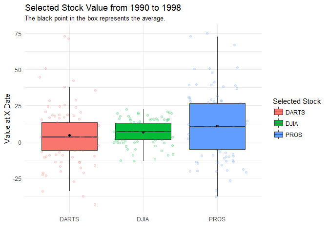

##Background
Data formats are varied and differ by domains and software. We could spend weeks on the different formats and file types that companies and governments use to store their data. We will practice with a few standard formats that are often used for storing data. In the future, you will most likely have to do some research to figure out other formats (but you can do it with R or Python). We have a challenge to read in the five formats of the [DOW data](https://github.com/byuistats/data/tree/master/Dart_Expert_Dow_6month_anova) and checking that they are all identical using all.equal(). One final note, your R script should do all the work. That is your script should download the files and/or read directly from the web location of the file.

##Reading

This reading will help you complete the tasks below.

o [Chapter 11: R for Data Science - Data Import](http://r4ds.had.co.nz/data-import.html)

o [haven R Package](haven.tidyverse.org/)

o [readxl R Package](readxl.tidyverse.org/)

o [downloader R Package](https://github.com/wch/downloader)

##Tasks


<div style="padding-left:30px;">

I was able to download the data given by Brother Hathaway using the different methods discussed in this weeks assignment. I was also able to use the all.equal() code to verify that they are all the same. I had some confusion and difficulty with the code so I looked to get some assistance from Blake Cromar's code. I was abl to create five different data sets and then manipulate the first to be able to read the given average a little bit better.

</div>


```r
ggplot(Data1, mapping = aes(x = variable, y = value)) +
  geom_boxplot(mapping = aes(fill = variable),
               outlier.shape = NA) +
  stat_summary(fun.y = "mean", geom = "point") +
  geom_jitter(mapping = aes(color = variable), alpha = 0.2) +
  theme_minimal() +
  labs(color = "Selected Stock",
       fill = "Selected Stock",
       x = "",
       y = "Value at X Date",
       title = "Selected Stock Value from 1990 to 1998",
       subtitle = "The black point in the box represents the average.")
```

<!-- -->

<div style="padding-left:30px;">

After working on my own to create the graphics, I thought to myself there must be a way to overlap these graphics and present them in the way that we were asked. I created three different graphics to communicate what was asked of us. I then looked for help from the code of Cameron Collett and Blake Cromar to see what they did. I saw that Blake did what I was looking for, so I borrowed some of his code to understand what he did. I changed the code to simplify it and make it my own, to where I would use it in the future. This graphic now represents what the three I created were all saying. First, that the three stock selections have a lot of variation over the given time frame. Second, that the 25th to 75th percentile fall within a similar range, while PROS has a larger variation. Lastly, that PROS has a higher average than that of the other two.

Regarding purchase of these selected stock, it would be wise to wait for a decline in PROS and then purchase it. This would allow for the highest profit as it will rise toward the average. 

</div>

