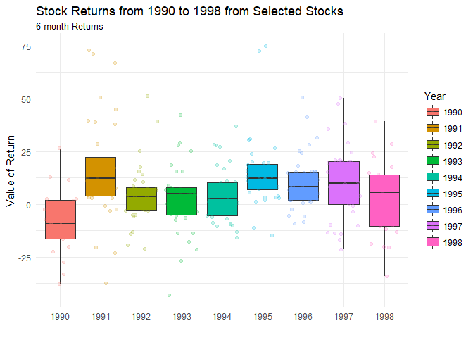

##Background

With stock return data from the previous task, we need to tidy this data for the creation of a time series plot. We want to look at the returns for each six-month period of the year in which the returns were reported. Your plot should highlight the tighter spread of the DJIA as compared to the other two selection methods (DARTS and PROS). We need to display a table of the DJIA returns with months on the rows and years in the columns (i.e. “spread” the data).

##Reading

This reading will help you complete the tasks below.

o [Chapter 12: R for Data Science - Tidy Data](http://r4ds.had.co.nz/tidy-data.html)

o [tidy R Package functions](https://rpubs.com/bradleyboehmke/data_wrangling)

o [openxlsx R package](https://github.com/awalker89/openxlsx)

##Tasks


```r
ggplot(data = Stock, mapping = aes(x = year_end, y = value)) +
  geom_boxplot(mapping = aes(group = year_end, fill = year_end),
               outlier.shape = NA) +
  geom_jitter(mapping = aes(color = year_end), alpha = 0.2) +
  theme_minimal() +
  labs(x = "",
       y = "Value of Return",
       title = "Stock Returns from 1990 to 1998 from Selected Stocks",
       subtitle = "6-month Returns",
       fill = "Year",
       color = "Year")
```

<!-- -->

<div style="padding-left:30px;">

This graphic allows us to see the returns through the years of the given data set. The boxplot across the graphic allows us to see the percentiles and where the jittered data points fall, in reference to the rest, while allowing us to see trends. Although the graphic is not specific about the selected stocks, further investigation would allow us to look at this for those specific variables. 

</div>


```r
pander(DJIA)
```


----------------------------------------------------------------------------
 month_end   1990    1991   1992   1993   1994   1995   1996   1997   1998  
----------- ------- ------ ------ ------ ------ ------ ------ ------ -------
   April      NA     16.2   10.6   5.8    0.5    12.8   14.8   15.3   22.5  

  August     -2.3    4.4    -0.3   7.3    1.5    15.3   0.6    8.3    -13.1 

 December    -9.3    6.6    0.2     8     3.6    9.3    15.5   -0.7    NA   

 February     NA      11    8.6    2.5    5.5    3.2    15.6   20.1   10.7  

  January     NA     -0.8   6.5    -0.8   11.2   1.8     15    19.6   -0.3  

   July      11.5    7.6    4.2    3.7    -5.3   19.6   1.3    20.8    7.1  

   June       2.5    17.7   3.6    7.7    -6.2    16    10.2   16.2    15   

   March      NA     15.8   7.2     9     1.6    7.3    18.4   9.6     7.6  

    May       NA     17.3   17.6   6.7    1.3    19.5    9     13.3   10.6  

 November    -12.8   -3.3   -2.8   4.9    -0.3   13.1   15.1   3.8     NA   

  October    -8.5    4.4     -5    5.7    6.9    8.2    7.2     3      NA   

 September   -9.2    3.4    -0.1   5.2    4.4     14    5.8    20.2   -11.8 
----------------------------------------------------------------------------

<div style="padding-left:30px;">

This table allows us to see certain years and how the DJIA was doing during specific months of those years. Although this table is not something that communicates a lot, it presents the information that one might want. The graphic is able to communicate better, but this does allow for the invester to see the real numbers that were used for this data set. 

</div>


