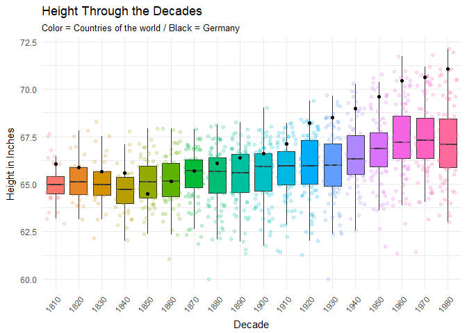
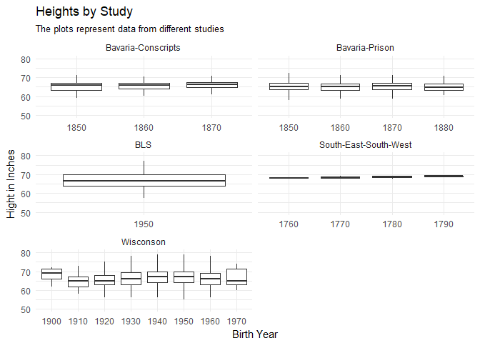

##Background

The [Scientific American](https://www.scientificamerican.com/article/why-are-we-getting-taller/) argues that humans have been getting taller over the years. As the data scientists that we are becoming, we would like to find data that validates this concept. Our challenge is to show different male heights across the centuries.

This project is not as severe as the two quotes below, but it will give you a taste of pulling various data and file formats together into “tidy” data for visualization and analysis. You will not need to search for data as all the files are listed [here](https://byuistats.github.io/M335/maleheight.html)

“Classroom data are like teddy bears and real data are like a grizzly bear with salmon blood dripping out its mouth.” - [Jenny Bryan](https://twitter.com/JennyBryan)

“Up to 80% of data analysis is spent on the process of cleaning and preparing data” - Hadley Wickham

##Reading

This reading will help you complete the tasks below.

o [Hadley on Tidy Data](http://vita.had.co.nz/papers/tidy-data.pdf)

o [foreign R Package and read.dbf()](https://www.rdocumentation.org/packages/foreign/versions/0.8-69/topics/read.dbf)

##Tasks


```r
ggplot(data = Heights, mapping = aes(x = year_decade, y = height.in)) +
  geom_boxplot(mapping = aes(fill = year_decade),
               outlier.shape = NA) +
  geom_jitter(mapping = aes(color = year_decade), alpha = 0.2) +
  geom_point(data = Germany, color = "black") +
  theme_minimal() +
  theme(legend.position = "None", axis.text.x = element_text(angle = 50, vjust = 1, hjust = 1)) +
  labs(color = "Year",
       fill = "Year",
       x = "Decade",
       y = "Height in Inches",
       title = "Height Through the Decades",
       subtitle = "Color = Countries of the world / Black = Germany")   
```

<!-- -->

<div style="padding-left:30px;">

This graphic, inspired by the graphic that Blake Cromar produced, is able to show the height measured through different decades beginning in 1810. The box blots represent the variance of the data points and the measurements for each decade, represented by a color. Then the black points are able to show us the progressive measurement of Germany. This graphic allows us to see that through time, heights are continuing to increase. Now, but running a regression we would be able to predict with confidence where we would be in x amount of years, but that is a task for another day.

</div>


```r
ggplot(data = CompleteDecade, 
       mapping = aes(x = birth_year, y = height.in)) +
  geom_boxplot(outlier.shape = NA) +
  facet_wrap(~study, nrow = 3, scales = "free_x") + 
  ylim(50, 80) +
  theme_minimal() +
  theme(legend.position = "None") +
  labs(x = "Birth Year",
       y = "Hight in Inches",
       title = "Heights by Study",
       subtitle = "The plots represent data from different studies")
```

```
## Warning: Removed 22 rows containing non-finite values (stat_boxplot).
```

<!-- -->

<div style="padding-left:30px;">

The small multiples plot here allows us to see a few things. Given the fact that we have data from different sources, we are able to still see some trends. The Bavarian data has some contradicting information. One says that the height was increasing from 1850 to 1870, while the other appears to show a decrease. The south-east-south-west data shows a general trend in the late 1700's. Lastly the Wisconsin data shows that there was a lot of variation throughout the given time period. Fluctuating from tall to shorter, then growing and shrinking. Given the datasets and information, we would be great beneficiaries of continued research regarding the heights of pelople throughout the world. This data is also in contention one with another as the data points do not necessarily agree with each other.

</div>


