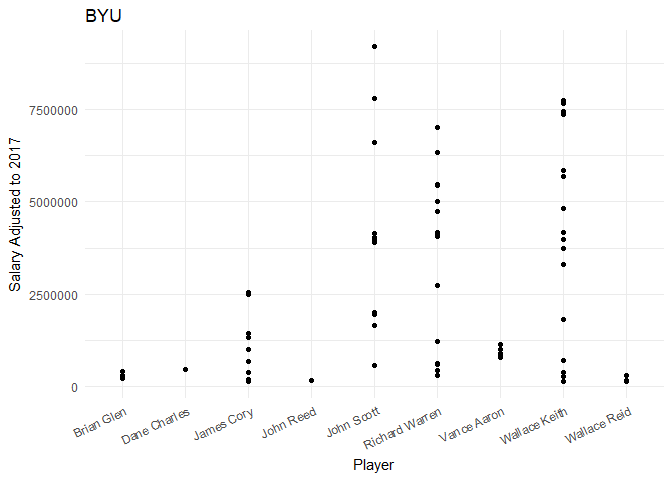

##Background
Over the campfire, you and a friend get into a debate about which college in Utah has had the best MLB success. As an avid BYU fan, you want to prove your point, and you go to data to settle the debate. You need a clear visualization that depicts the performance of BYU players compared to other Utah college players that have played in the major leagues. The library(Lahman) package has a comprehensive set of baseball data. It is great for testing out our relational data skills. We will also need a function to inflation adjust the player salaries - library(blscrapeR). See [this guide for an example](https://cran.r-project.org/web/packages/blscrapeR/vignettes/Inflation_and_Prices.html).

##Reading

This reading will help you complete the tasks below.

o [Chapter 13: R for Data Science - Relational Data](http://r4ds.had.co.nz/relational-data.html)

o [Chapter 4: The Truthful Art: Data, Charts, and Maps for Communication](http://ptgmedia.pearsoncmg.com/images/9780321934079/samplepages/9780321934079.pdf)

##Tasks

[x] Install the library(Lahman) and examine the available data sets

[x] Find the 4-5 different data sets that you will need to show full college and player names as well as their annual earnings

<div style="padding-left:30px;">

Althought there is a lot of data in this Lahman compilation, The five data sets that I will be using to merge are the Master, Salaries, Appearances, Schools, and CollegePlaying. Master allows us to see names of specific codes for ID, Salaries allows us to see how much they make, Schools and CollegePlaying allow us to see where they went to college and Appearances allow us to see how much they actually played in the MLB.

</div>

[x] Install the library(blscrapeR) and use the inflation_adjust(2017) function to get all earnings in 2017 dollars


[x] Make a plot showing how professional baseball player earnings that played baseball at BYU compared to the players from other Utah schools


```r
ggplot(PlayersUtah, aes(x = nameGiven, y = NewSalary, color = name_full)) +
  geom_point() +
  labs(title = "Utah Colleges", x="Player", y="Salary Adjusted to 2017") +
  theme_minimal() +
  theme(axis.text.x = element_text(angle = 25, vjust = 1, hjust = 1)) 
```

<!-- -->

```r
ggplot(PlayersBYU, aes(x = nameGiven, y = NewSalary)) +
  geom_point() +
  labs(title = "BYU", x="Player", y="Salary Adjusted to 2017") +
  theme_minimal() +
  theme(axis.text.x = element_text(angle = 25, vjust = 1, hjust = 1)) 
```

<!-- -->

[x] Save your .R script and image to your repository and be ready to share your code and image at the beginning of class


