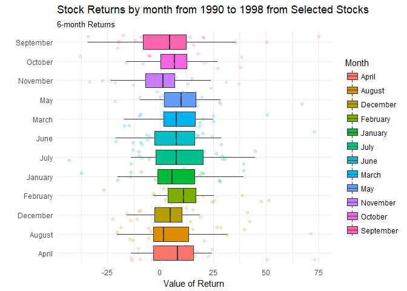

##Background

When we are visualizing data with categorical variables, we have to deal with character strings as groupings. The problem with summarizing categorical data in a table or a plot is how to order the groups. Using the concept of Factors allows us to dictate the order of these groupings for presentation. We will revisit the [stock data](https://github.com/byuistats/data/tree/master/Dart_Expert_Dow_6month_anova) from a previous task to create a table and a plot that has the months correctly labeled and ordered.

##Reading

This reading will help you complete the tasks below.

o [Chapter 15: R for Data Science - Factors](http://r4ds.had.co.nz/factors.html)

o [Statistical Concepts in Presenting Data (pgs 72 - 85)](http://biostat.mc.vanderbilt.edu/wiki/pub/Main/RafeDonahue/fscipdpfcbg_currentversion.pdf)

o [forcats R package](http://stat545.com/block029_factors.html)

##Tasks


```r
ggplot(data = Stock, mapping = aes(x = month_end, y = value)) +
  geom_boxplot(mapping = aes(group = month_end, fill = month_end),
               outlier.shape = NA) +
  geom_jitter(mapping = aes(color = month_end), alpha = 0.2) +
  theme_minimal() +
  labs(x = "",
       y = "Value of Return",
       title = "Stock Returns by month from 1990 to 1998 from Selected Stocks",
       subtitle = "6-month Returns",
       fill = "Month",
       color = "Month") +
  coord_flip()
```

<!-- -->

<div style="padding-left:30px;">

This graphic allows us to see the returns through the years of the given data set, by grouping them in the respective months. The boxplot across the graphic allows us to see the percentiles and where the jittered data points fall, in reference to the rest, while allowing us to see trends. This allows for us to see the trend that happens along the months, given eight years of data. It appears that they all seem to be fairly similar across the months. If I were to pick a month based on this data to get my six month return, I would pick July as that month has a higher 75th percentile. 

</div>


