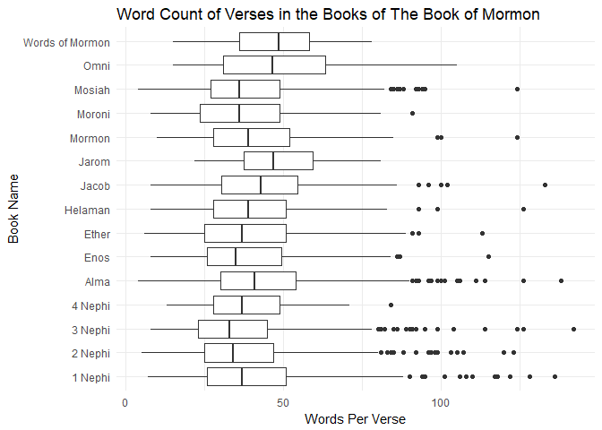

##Background
In 1978 Susan Easton Black penned an [article](https://www.lds.org/ensign/1978/07/discovery?lang=eng) in the Ensign title Even statistically, he is the dominant figure of the Book of Mormon. which makes some statistical claims about the Book of Mormon. We are going to use some of our “string” skills to count words and occurrences in the New Testament and in the Book of Mormon.

What is the average verse length (number of words) in the New Testament compared to the Book of Mormon?

How often is the word Jesus in the New Testament compared to the Book of Mormon?

How does the word count distribution by verse look for each book in the Book of Mormon?

##Reading

This reading will help you complete the tasks below.

o [Chapter 21: Iteration (21.1-21.5 is all you will need)](http://r4ds.had.co.nz/iteration.html)

o [stringi R package and the stri_stats_latex() function](https://rdrr.io/rforge/stringi/man/stri_stats_latex.html)

##Tasks


```r
BOM1 <- BOM %>% 
  group_by(verse_id, volume_title, book_title, verse_title) %>% 
  summarise(words = stri_stats_latex(scripture_text)["Words"])

BOM1 %>% 
  group_by(volume_title) %>% 
  summarise(mwords=mean(words)) %>% 
  pander()
```


---------------------------------
      volume_title        mwords 
------------------------ --------
     Book of Mormon       40.51  

 Doctrine and Covenants   30.69  

     New Testament        22.71  

     Old Testament        26.42  

  Pearl of Great Price    41.66  
---------------------------------

<div style="padding-left:30px;">

#### Question 1
This table allows us to see that the Book of Mormon, Pearl of Great Price and the Doctrine and Covenants average more words than their biblical friends. When looking just at the Book of Mormon and the NEw Testament, we see that the Book of Mormon nearly doubles the average word count per verse. Although this is not really anything significant, we are able to see some fun comparisons.

</div>


<div style="padding-left:30px;">

#### Question 2
The code hidden above shows that the New Testament uses the title "Jesus" far more than the Book of Mormon does. The New Testament references this title 984 times, while the Book of Mormon only references it 184 times.

</div>


```r
ggplot(BOM3, aes(x = book_title, y = words)) +
  geom_boxplot() +
  labs(title = "Word Count of Verses in the Books of The Book of Mormon", 
       y = "Words Per Verse", x = "Book Name") +
  theme_minimal() +
  coord_flip()
```

<!-- -->

<div style="padding-left:30px;">

#### Question 3
The above graphic allows us to see the comparisons of verse length through the different books in the Book of Mormon. This is very interesting to see as we look at who wrote the Book of Mormon. It was compiled by a prophet/historian named Mormon. It is interesting that the median length of verses falls within about 30 to 50 words. It is also interesting to see that there are a lot of points that are outliers, in the sense that their specific points are present in the graphic as they extend to the right more than the box plots themselves. Further explanation of this will lead to a more comprehensive understanding of the data. 

</div>
