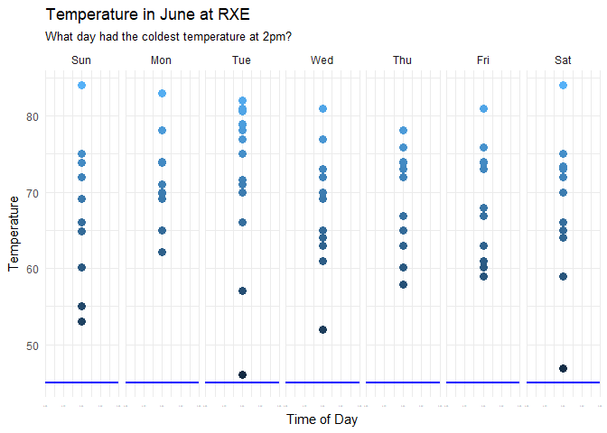

##Background
Use the library(riem) package that is described [here](https://github.com/ropensci/riem) and get the month of June for 2015, 2016, and 2017. You would use riem_measures(station = "RXE", date_start = "2015-06-01", date_end = "2017-07-01") for station RXE. Once you have downloaded and formated the data, make sure to save it to your analysis folder as it will take a minute or two to download each time. We have a few coding tasks to help us get used to using dates. Create a visualization for each question.

What day of the week had the highest temperature reading?

What day of the week had the lowest temperature at 2 pm?

##Reading

This reading will help you complete the tasks below.

o [Chapter 16: R for Data Science - Dates and Times](http://r4ds.had.co.nz/dates-and-times.html)

o [Time Series Visualization Gallery](https://vcg.informatik.uni-rostock.de/~ct/timeviz/timeviz.html)

##Tasks


###Which day of the week had the hottest temperature in June?

```r
ggplot(data = RXE1, aes(x = Hour, y = tmpf)) +
  geom_point(aes(color = tmpf), 
             size = 3) +
  theme_minimal() +
  facet_wrap(~Day, 1) +
  labs(x = "Time of Day",
       y = "Temperature",
       title = "Temperature in June at RXE",
       subtitle = "0 = Noon | 12 = Midnight | 23 = 11 AM") +
  theme(legend.position = "None") +
  geom_hline(yintercept = 98, 
             color = "red", 
             size = 1)
```

<!-- -->

###Which day of the week had the lowest temperature reading at 2pm?

```r
ggplot(data = RXE2, aes(x = Hour, y = tmpf)) +
  geom_point(aes(color = tmpf), 
             size = 3) +
  theme_minimal() +
  facet_wrap(~Day, 1) +
  labs(x = "Time of Day",
       y = "Temperature",
       title = "Temperature in June at RXE",
       subtitle = "What day had the coldest temperature at 2pm?") +
  theme(legend.position = "None",
        axis.text.x = element_text(size = 0.001)) +
  geom_hline(yintercept = 45, 
             color = "blue", 
             size = 1)
```

<!-- -->


