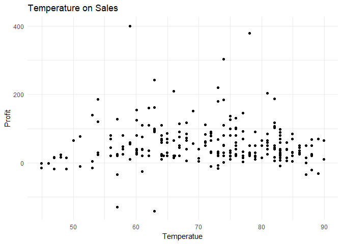

##Background
A car wash business wants to see if the temperature hurts their bottom line. They have point of sale data for the months of April, May, June, and July. You will need to aggregate the data into hourly sales totals and merge the sales data together with the temperature data to provide insight into the relationship between temperature and car wash sales.

##Reading

This reading will help you complete the tasks below.

o [lubridate Vignette](https://cran.r-project.org/web/packages/lubridate/vignettes/lubridate.html)

o [Plotly: Time Series Blog Post](https://plotlyblog.tumblr.com/post/117105992082/time-series-graphs-eleven-stunning-ways-you-can)

##Tasks


####Does temperature effect the car wash sales?

```r
ggplot(data = CarWash2, aes(x = temperature, y = total_sales)) +
  geom_point() +
  theme_minimal() +
  labs(x = "Temperatue",
       y = "Profit",
       title = "Temperature on Sales") 
```

<!-- -->


