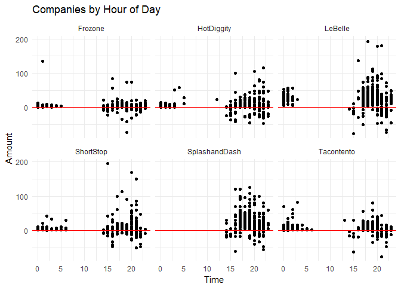
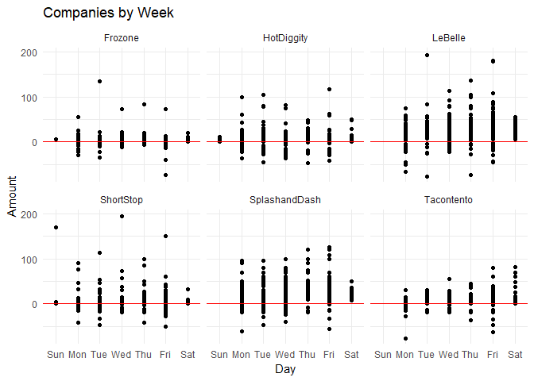
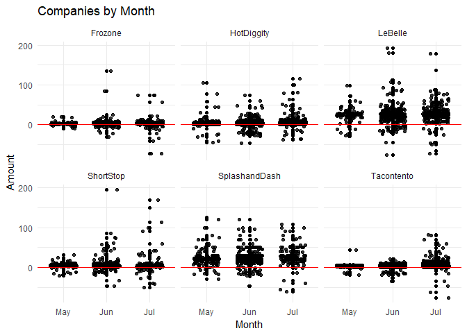

##Background
We have transaction data for a few businesses that have been in operation for three months. Each of these companies has come to your investment company for a loan to expand their business. Your boss has asked you to go through the transactions for each business and provide daily, weekly, and monthly gross revenue summaries and comparisons. Your boss would like a short write up with tables and visualizations that help with the decision of which company did the best over the three month period. You will also need to provide a short paragraph with your recommendation after building your analysis.
In our course we are only looking at understanding and visualizing recorded time series data. If you would like to learn more about forecasting I would recommend [Forecasting: Principles and Practice](https://www.otexts.org/fpp2/) and for a quick introduction see [here](https://afit-r.github.io/ts_exploration).

##Reading

This reading will help you complete the tasks below.

o [lubridate R package](lubridate.tidyverse.org/)

##Tasks


```r
ggplot(data = Sales1, aes(x = Hour, y = Amount, group = Name)) +
  geom_point() +
  facet_wrap(~Name) +
  theme_minimal()  +
  labs(x = "Time",
       y = "Amount",
       title = "Companies by Hour of Day") +
  geom_hline(yintercept = 0, 
             color = "red", 
             size = .5)
```

<!-- -->

#### <a href="javascript:showhide('Hourly')">Hourly Table </a>

<div id="Hourly" style="display:none;">


```r
Hourly <- group_by(Sales1, Name, Year, Month, Weekday1, Hour)
View(Hourly)
Hourly1 <- summarise(Hourly, AVG = mean(Amount, na.rm = TRUE))
pander(knitr::kable(Hourly1))
```


  * Name             Year  Month   Weekday1    Hour           AVG
  * --------------  -----  ------  ---------  -----  ------------
  * Frozone          2016  May     Mon           16    -4.5050000
  * Frozone          2016  May     Mon           17     1.4285714
  * Frozone          2016  May     Mon           18     1.0000000
  * Frozone          2016  May     Mon           19     1.0000000
  * Frozone          2016  May     Mon           20     7.0000000
  * Frozone          2016  May     Mon           22    -2.8600000
  * Frozone          2016  May     Tue           16     4.2500000
  * Frozone          2016  May     Tue           17     2.5000000
  * Frozone          2016  May     Tue           18     2.5000000
  * Frozone          2016  May     Tue           19     1.6113333
  * Frozone          2016  May     Tue           23    -3.2800000
  * Frozone          2016  May     Wed           16    18.5000000
  * Frozone          2016  May     Wed           17     2.7894737
  * Frozone          2016  May     Wed           18     2.7812500
  * Frozone          2016  May     Wed           19     2.4000000
  * Frozone          2016  May     Wed           22    -2.3600000
  * Frozone          2016  May     Thu           16     3.0000000
  * Frozone          2016  May     Thu           17     2.4000000
  * Frozone          2016  May     Thu           18     1.2500000
  * Frozone          2016  May     Thu           22    -5.1800000
  * Frozone          2016  May     Thu           23    20.0000000
  * Frozone          2016  May     Fri           16     2.5000000
  * Frozone          2016  May     Fri           17     2.7500000
  * Frozone          2016  May     Fri           18     2.7000000
  * Frozone          2016  May     Fri           19     2.5000000
  * Frozone          2016  May     Fri           20     2.0000000
  * Frozone          2016  May     Fri           21    -4.3000000
  * Frozone          2016  May     Fri           22     4.0000000
  * Frozone          2016  May     Fri           23     4.0833333
  * Frozone          2016  May     Sat            0     2.8571429
  * Frozone          2016  May     Sat           18    20.0000000
  * Frozone          2016  Jun     Mon           14    -2.6600000
  * Frozone          2016  Jun     Mon           16     4.2500000
  * Frozone          2016  Jun     Mon           17     3.9175862
  * Frozone          2016  Jun     Mon           18     3.4264706
  * Frozone          2016  Jun     Mon           19     3.9542857
  * Frozone          2016  Jun     Mon           20    -5.4800000
  * Frozone          2016  Jun     Mon           21   -12.6100000
  * Frozone          2016  Jun     Mon           22    -2.5000000
  * Frozone          2016  Jun     Tue            1   135.0000000
  * Frozone          2016  Jun     Tue           15    -6.2966667
  * Frozone          2016  Jun     Tue           16     3.4166667
  * Frozone          2016  Jun     Tue           17     2.6718750
  * Frozone          2016  Jun     Tue           18     2.9042553
  * Frozone          2016  Jun     Tue           19     2.9189189
  * Frozone          2016  Jun     Tue           21    -6.2800000
  * Frozone          2016  Jun     Tue           22     3.0000000
  * Frozone          2016  Jun     Wed            0     3.5000000
  * Frozone          2016  Jun     Wed            1     2.1250000
  * Frozone          2016  Jun     Wed            2     2.8000000
  * Frozone          2016  Jun     Wed           15    -1.3675000
  * Frozone          2016  Jun     Wed           16     2.6111111
  * Frozone          2016  Jun     Wed           17     2.9074074
  * Frozone          2016  Jun     Wed           18     2.5000000
  * Frozone          2016  Jun     Wed           19     2.9176190
  * Frozone          2016  Jun     Wed           20    -4.8300000
  * Frozone          2016  Jun     Wed           22    -6.5733333
  * Frozone          2016  Jun     Thu            2     7.0000000
  * Frozone          2016  Jun     Thu            3     3.4000000
  * Frozone          2016  Jun     Thu            4     4.0000000
  * Frozone          2016  Jun     Thu            5     3.4000000
  * Frozone          2016  Jun     Thu           16    18.6340000
  * Frozone          2016  Jun     Thu           17     3.6830303
  * Frozone          2016  Jun     Thu           18     3.6521739
  * Frozone          2016  Jun     Thu           19     3.5394737
  * Frozone          2016  Jun     Thu           20     3.3580000
  * Frozone          2016  Jun     Thu           21     3.0000000
  * Frozone          2016  Jun     Thu           22    -6.7900000
  * Frozone          2016  Jun     Fri            2     2.9000000
  * Frozone          2016  Jun     Fri            3     4.7500000
  * Frozone          2016  Jun     Fri           16     1.8040000
  * Frozone          2016  Jun     Fri           17     3.4347826
  * Frozone          2016  Jun     Fri           18     3.3545455
  * Frozone          2016  Jun     Fri           19     2.7900000
  * Frozone          2016  Jun     Fri           20    -2.9700000
  * Frozone          2016  Jun     Fri           21    -2.5600000
  * Frozone          2016  Jun     Fri           22     3.5502273
  * Frozone          2016  Jun     Fri           23     3.9071429
  * Frozone          2016  Jun     Sat            0     3.5803571
  * Frozone          2016  Jun     Sat            1     3.6862745
  * Frozone          2016  Jun     Sat            2    10.0000000
  * Frozone          2016  Jul     Sun            0     5.0000000
  * Frozone          2016  Jul     Mon           14     5.1250000
  * Frozone          2016  Jul     Mon           16    17.1000000
  * Frozone          2016  Jul     Mon           17     5.1111111
  * Frozone          2016  Jul     Mon           18     4.8437500
  * Frozone          2016  Jul     Mon           19     5.1666667
  * Frozone          2016  Jul     Mon           20     5.5000000
  * Frozone          2016  Jul     Mon           21   -15.3700000
  * Frozone          2016  Jul     Tue           16     4.0000000
  * Frozone          2016  Jul     Tue           17     4.0081250
  * Frozone          2016  Jul     Tue           18     0.6127273
  * Frozone          2016  Jul     Tue           19     3.6090909
  * Frozone          2016  Jul     Tue           21     6.1500000
  * Frozone          2016  Jul     Wed           14     5.9566667
  * Frozone          2016  Jul     Wed           15    -1.2450000
  * Frozone          2016  Jul     Wed           16     3.4866667
  * Frozone          2016  Jul     Wed           17     4.2444444
  * Frozone          2016  Jul     Wed           18     3.6666667
  * Frozone          2016  Jul     Wed           19     3.0833333
  * Frozone          2016  Jul     Wed           20    26.9166667
  * Frozone          2016  Jul     Wed           21    -4.9200000
  * Frozone          2016  Jul     Wed           22    13.0000000
  * Frozone          2016  Jul     Wed           23     3.6666667
  * Frozone          2016  Jul     Thu            0     2.3333333
  * Frozone          2016  Jul     Thu            1     1.5000000
  * Frozone          2016  Jul     Thu            3     2.7142857
  * Frozone          2016  Jul     Thu            4     4.0833333
  * Frozone          2016  Jul     Thu            5     3.3333333
  * Frozone          2016  Jul     Thu           16     4.8000000
  * Frozone          2016  Jul     Thu           17     4.4727273
  * Frozone          2016  Jul     Thu           18     4.4425926
  * Frozone          2016  Jul     Thu           19     4.4718750
  * Frozone          2016  Jul     Thu           20     3.5000000
  * Frozone          2016  Jul     Thu           22    12.3000000
  * Frozone          2016  Jul     Fri           14    -8.7100000
  * Frozone          2016  Jul     Fri           16     2.4642857
  * Frozone          2016  Jul     Fri           17     3.8913793
  * Frozone          2016  Jul     Fri           18     4.1083333
  * Frozone          2016  Jul     Fri           19     1.0728302
  * Frozone          2016  Jul     Fri           20     2.8571429
  * Frozone          2016  Jul     Fri           21    -0.3800000
  * Frozone          2016  Jul     Fri           22     2.5869231
  * Frozone          2016  Jul     Fri           23     3.7115385
  * Frozone          2016  Jul     Sat            0     3.9846154
  * Frozone          2016  Jul     Sat            1     3.4400000
  * Frozone          2016  Jul     Sat            2     3.0000000
  * Frozone          2016  Jul     Sat           16     4.0000000
  * Frozone          2016  Jul     Sat           17     4.2000000
  * Frozone          2016  Jul     Sat           18     3.6666667
  * Frozone          2016  Jul     Sat           19     4.5833333
  * Frozone          2016  Jul     Sat           20     3.0000000
  * Frozone          2016  Jul     Sat           21     5.0000000
  * Frozone          2016  Jul     Sat           22     4.2000000
  * Frozone          2016  Jul     Sat           23     5.0000000
  * HotDiggity       2016  May     Sun           21     0.0500000
  * HotDiggity       2016  May     Mon           14    -0.0500000
  * HotDiggity       2016  May     Mon           15     3.0833333
  * HotDiggity       2016  May     Mon           16     3.4351852
  * HotDiggity       2016  May     Mon           17     3.2714286
  * HotDiggity       2016  May     Mon           18     3.7155963
  * HotDiggity       2016  May     Mon           19     3.1230769
  * HotDiggity       2016  May     Tue           14     3.0000000
  * HotDiggity       2016  May     Tue           15     3.0000000
  * HotDiggity       2016  May     Tue           16     3.7442308
  * HotDiggity       2016  May     Tue           17     3.0259843
  * HotDiggity       2016  May     Tue           18     3.1776119
  * HotDiggity       2016  May     Tue           19     2.7057692
  * HotDiggity       2016  May     Tue           20    44.6666667
  * HotDiggity       2016  May     Tue           21    33.0000000
  * HotDiggity       2016  May     Tue           22     2.7500000
  * HotDiggity       2016  May     Tue           23   -25.3400000
  * HotDiggity       2016  May     Wed           14     3.0000000
  * HotDiggity       2016  May     Wed           15     2.9333333
  * HotDiggity       2016  May     Wed           16     3.3236842
  * HotDiggity       2016  May     Wed           17     3.2120000
  * HotDiggity       2016  May     Wed           18     2.8777778
  * HotDiggity       2016  May     Wed           19     2.9041667
  * HotDiggity       2016  May     Wed           20     2.0000000
  * HotDiggity       2016  May     Wed           22   -14.0750000
  * HotDiggity       2016  May     Thu           15     2.7391304
  * HotDiggity       2016  May     Thu           16     3.0625000
  * HotDiggity       2016  May     Thu           17     3.0635417
  * HotDiggity       2016  May     Thu           18     3.1584746
  * HotDiggity       2016  May     Thu           19     3.1557895
  * HotDiggity       2016  May     Thu           20     3.5047619
  * HotDiggity       2016  May     Thu           21     3.0000000
  * HotDiggity       2016  May     Thu           22     1.5000000
  * HotDiggity       2016  May     Fri            0     4.2500000
  * HotDiggity       2016  May     Fri            1     5.6923077
  * HotDiggity       2016  May     Fri            2     4.0916667
  * HotDiggity       2016  May     Fri            3     4.7500000
  * HotDiggity       2016  May     Fri            4    58.0000000
  * HotDiggity       2016  May     Fri           15     2.6714286
  * HotDiggity       2016  May     Fri           16     2.2681132
  * HotDiggity       2016  May     Fri           17     3.0195876
  * HotDiggity       2016  May     Fri           18     3.2923077
  * HotDiggity       2016  May     Fri           19     3.3050000
  * HotDiggity       2016  May     Fri           20    -2.5000000
  * HotDiggity       2016  May     Fri           21    -4.2950000
  * HotDiggity       2016  May     Fri           22     2.2962963
  * HotDiggity       2016  May     Fri           23     2.1750000
  * HotDiggity       2016  May     Sat            0     2.0000000
  * HotDiggity       2016  Jun     Sun            0     3.1875000
  * HotDiggity       2016  Jun     Sun            1     3.5652174
  * HotDiggity       2016  Jun     Sun            2     2.5000000
  * HotDiggity       2016  Jun     Sun            3     6.6875000
  * HotDiggity       2016  Jun     Mon           15    -0.5000000
  * HotDiggity       2016  Jun     Mon           16     3.1550000
  * HotDiggity       2016  Jun     Mon           17     3.0973856
  * HotDiggity       2016  Jun     Mon           18     3.8219231
  * HotDiggity       2016  Jun     Mon           19     3.6490196
  * HotDiggity       2016  Jun     Mon           20     4.5000000
  * HotDiggity       2016  Jun     Mon           21     1.8600000
  * HotDiggity       2016  Jun     Mon           22    16.2725000
  * HotDiggity       2016  Jun     Mon           23   -19.2500000
  * HotDiggity       2016  Jun     Tue           15   -23.4400000
  * HotDiggity       2016  Jun     Tue           16     3.3028571
  * HotDiggity       2016  Jun     Tue           17     3.4692308
  * HotDiggity       2016  Jun     Tue           18     3.6071429
  * HotDiggity       2016  Jun     Tue           19     3.3867647
  * HotDiggity       2016  Jun     Tue           21    -7.9533333
  * HotDiggity       2016  Jun     Tue           22    15.4750000
  * HotDiggity       2016  Jun     Wed            0     4.7916667
  * HotDiggity       2016  Jun     Wed            1     4.0909091
  * HotDiggity       2016  Jun     Wed           15    -2.4187500
  * HotDiggity       2016  Jun     Wed           16     2.9625000
  * HotDiggity       2016  Jun     Wed           17     3.0530952
  * HotDiggity       2016  Jun     Wed           18     3.4692973
  * HotDiggity       2016  Jun     Wed           19     2.8576068
  * HotDiggity       2016  Jun     Wed           20     0.9528571
  * HotDiggity       2016  Jun     Wed           21     0.4675000
  * HotDiggity       2016  Jun     Wed           22     6.9840000
  * HotDiggity       2016  Jun     Thu           15     2.7500000
  * HotDiggity       2016  Jun     Thu           16     3.1693548
  * HotDiggity       2016  Jun     Thu           17     3.6806667
  * HotDiggity       2016  Jun     Thu           18     3.7449324
  * HotDiggity       2016  Jun     Thu           19     4.1996063
  * HotDiggity       2016  Jun     Thu           20     7.2333333
  * HotDiggity       2016  Jun     Thu           21    14.2250000
  * HotDiggity       2016  Jun     Thu           22    -3.3012500
  * HotDiggity       2016  Jun     Fri           14   -24.6500000
  * HotDiggity       2016  Jun     Fri           15     3.0000000
  * HotDiggity       2016  Jun     Fri           16     3.2727273
  * HotDiggity       2016  Jun     Fri           17     3.6314685
  * HotDiggity       2016  Jun     Fri           18     3.4532500
  * HotDiggity       2016  Jun     Fri           19     3.1962338
  * HotDiggity       2016  Jun     Fri           20     5.2550000
  * HotDiggity       2016  Jun     Fri           21     5.1888889
  * HotDiggity       2016  Jun     Fri           22     2.6555556
  * HotDiggity       2016  Jun     Fri           23     3.5109890
  * HotDiggity       2016  Jun     Sat            0     3.9642857
  * HotDiggity       2016  Jun     Sat            1     4.6190476
  * HotDiggity       2016  Jun     Sat            2     2.3888889
  * HotDiggity       2016  Jun     Sat            3     1.9285714
  * HotDiggity       2016  Jun     Sat            5    20.0000000
  * HotDiggity       2016  Jun     Sat           18     2.5000000
  * HotDiggity       2016  Jul     Mon           15     6.5000000
  * HotDiggity       2016  Jul     Mon           16     5.6213793
  * HotDiggity       2016  Jul     Mon           17     5.0764706
  * HotDiggity       2016  Jul     Mon           18     4.8833333
  * HotDiggity       2016  Jul     Mon           19     3.9083333
  * HotDiggity       2016  Jul     Mon           23     8.0000000
  * HotDiggity       2016  Jul     Tue            0     5.7187500
  * HotDiggity       2016  Jul     Tue            1     3.6875000
  * HotDiggity       2016  Jul     Tue            2     3.0000000
  * HotDiggity       2016  Jul     Tue           12    22.6100000
  * HotDiggity       2016  Jul     Tue           16     2.2122222
  * HotDiggity       2016  Jul     Tue           17     4.1074074
  * HotDiggity       2016  Jul     Tue           18     5.4988372
  * HotDiggity       2016  Jul     Tue           19     4.3819149
  * HotDiggity       2016  Jul     Tue           20     4.4666667
  * HotDiggity       2016  Jul     Tue           21    42.8600000
  * HotDiggity       2016  Jul     Wed           15   -15.9733333
  * HotDiggity       2016  Jul     Wed           16     2.6671429
  * HotDiggity       2016  Jul     Wed           17     4.8998361
  * HotDiggity       2016  Jul     Wed           18     3.7892857
  * HotDiggity       2016  Jul     Wed           19     3.6244186
  * HotDiggity       2016  Jul     Wed           20    40.6500000
  * HotDiggity       2016  Jul     Wed           21    27.0600000
  * HotDiggity       2016  Jul     Thu           16     4.2062500
  * HotDiggity       2016  Jul     Thu           17     3.9676829
  * HotDiggity       2016  Jul     Thu           18     3.7570312
  * HotDiggity       2016  Jul     Thu           19     4.8428571
  * HotDiggity       2016  Jul     Thu           20     4.9872727
  * HotDiggity       2016  Jul     Thu           22    48.4000000
  * HotDiggity       2016  Jul     Fri           14   -24.2400000
  * HotDiggity       2016  Jul     Fri           16     4.0785714
  * HotDiggity       2016  Jul     Fri           17     4.6878205
  * HotDiggity       2016  Jul     Fri           18     4.0191304
  * HotDiggity       2016  Jul     Fri           19     3.9166667
  * HotDiggity       2016  Jul     Fri           20     4.7760000
  * HotDiggity       2016  Jul     Fri           21     1.3333333
  * HotDiggity       2016  Jul     Fri           22     7.0076000
  * HotDiggity       2016  Jul     Fri           23     3.7352941
  * HotDiggity       2016  Jul     Sat            0     3.8970588
  * HotDiggity       2016  Jul     Sat            1     3.5119048
  * HotDiggity       2016  Jul     Sat            2     4.5000000
  * HotDiggity       2016  Jul     Sat            3    50.5500000
  * HotDiggity       2016  Jul     Sat           19     3.5000000
  * HotDiggity       2016  Jul     Sat           20     4.7777778
  * HotDiggity       2016  Jul     Sat           21     4.5000000
  * HotDiggity       2016  Jul     Sat           23    48.0000000
  * LeBelle          2016  May     Mon           17    29.0000000
  * LeBelle          2016  May     Mon           18    11.6666667
  * LeBelle          2016  May     Mon           19    21.9000000
  * LeBelle          2016  May     Mon           20    18.0000000
  * LeBelle          2016  May     Tue           17    35.4166667
  * LeBelle          2016  May     Tue           18    24.5250000
  * LeBelle          2016  May     Tue           19    26.0000000
  * LeBelle          2016  May     Tue           20    -5.1700000
  * LeBelle          2016  May     Tue           21   -12.2800000
  * LeBelle          2016  May     Tue           23    35.2000000
  * LeBelle          2016  May     Wed           17    23.8125000
  * LeBelle          2016  May     Wed           18    23.7400000
  * LeBelle          2016  May     Wed           19    26.5500000
  * LeBelle          2016  May     Wed           20    37.0500000
  * LeBelle          2016  May     Wed           21    23.7525000
  * LeBelle          2016  May     Wed           22   -21.3150000
  * LeBelle          2016  May     Thu           17    24.5000000
  * LeBelle          2016  May     Thu           18    34.1666667
  * LeBelle          2016  May     Thu           19    27.3333333
  * LeBelle          2016  May     Thu           20    33.3500000
  * LeBelle          2016  May     Thu           21    99.0000000
  * LeBelle          2016  May     Thu           22   -28.0900000
  * LeBelle          2016  May     Fri           16     0.0000000
  * LeBelle          2016  May     Fri           17    18.5000000
  * LeBelle          2016  May     Fri           18    27.3500000
  * LeBelle          2016  May     Fri           19    26.1666667
  * LeBelle          2016  May     Fri           20    26.4833333
  * LeBelle          2016  May     Fri           21   -11.7800000
  * LeBelle          2016  May     Fri           22    34.0600000
  * LeBelle          2016  May     Fri           23    25.0000000
  * LeBelle          2016  May     Sat            0    21.8000000
  * LeBelle          2016  May     Sat           17    23.4000000
  * LeBelle          2016  May     Sat           18    26.1000000
  * LeBelle          2016  Jun     Mon           15   -15.7400000
  * LeBelle          2016  Jun     Mon           17    13.6312500
  * LeBelle          2016  Jun     Mon           18    26.1666667
  * LeBelle          2016  Jun     Mon           19    30.1500000
  * LeBelle          2016  Jun     Mon           20    28.9300000
  * LeBelle          2016  Jun     Mon           21    18.1275000
  * LeBelle          2016  Jun     Mon           22   -11.6150000
  * LeBelle          2016  Jun     Mon           23   -26.0600000
  * LeBelle          2016  Jun     Tue           15   -76.1800000
  * LeBelle          2016  Jun     Tue           17    28.3333333
  * LeBelle          2016  Jun     Tue           18    64.8500000
  * LeBelle          2016  Jun     Tue           19    24.6428571
  * LeBelle          2016  Jun     Tue           21   -23.4300000
  * LeBelle          2016  Jun     Wed           14    -4.8300000
  * LeBelle          2016  Jun     Wed           17    32.3357143
  * LeBelle          2016  Jun     Wed           18    30.6000000
  * LeBelle          2016  Jun     Wed           19    32.8680000
  * LeBelle          2016  Jun     Wed           20    29.9423077
  * LeBelle          2016  Jun     Wed           21    11.3022222
  * LeBelle          2016  Jun     Wed           22   -11.6760000
  * LeBelle          2016  Jun     Thu            1    23.8250000
  * LeBelle          2016  Jun     Thu            2    21.0130769
  * LeBelle          2016  Jun     Thu           15   -15.4900000
  * LeBelle          2016  Jun     Thu           16    36.8250000
  * LeBelle          2016  Jun     Thu           17    20.5914286
  * LeBelle          2016  Jun     Thu           18    25.3093750
  * LeBelle          2016  Jun     Thu           19    28.7687500
  * LeBelle          2016  Jun     Thu           20    32.0450000
  * LeBelle          2016  Jun     Thu           21    27.8000000
  * LeBelle          2016  Jun     Thu           22    -7.8933333
  * LeBelle          2016  Jun     Fri           15    -2.5140000
  * LeBelle          2016  Jun     Fri           17    22.1500000
  * LeBelle          2016  Jun     Fri           18    27.1812500
  * LeBelle          2016  Jun     Fri           19    33.3406250
  * LeBelle          2016  Jun     Fri           20    30.5806667
  * LeBelle          2016  Jun     Fri           21    47.3233333
  * LeBelle          2016  Jun     Fri           22    15.2181818
  * LeBelle          2016  Jun     Fri           23    21.6147059
  * LeBelle          2016  Jun     Sat            0    22.3552941
  * LeBelle          2016  Jun     Sat            1    25.5423077
  * LeBelle          2016  Jun     Sat            2    21.0000000
  * LeBelle          2016  Jun     Sat            3    24.0000000
  * LeBelle          2016  Jul     Mon           17    32.0000000
  * LeBelle          2016  Jul     Mon           18    25.2580000
  * LeBelle          2016  Jul     Mon           19    28.1057143
  * LeBelle          2016  Jul     Mon           20   -22.4000000
  * LeBelle          2016  Jul     Mon           21    19.6850000
  * LeBelle          2016  Jul     Mon           22   -11.4933333
  * LeBelle          2016  Jul     Tue           17    16.5214286
  * LeBelle          2016  Jul     Tue           18    33.0083333
  * LeBelle          2016  Jul     Tue           19    26.0250000
  * LeBelle          2016  Jul     Tue           20    25.2666667
  * LeBelle          2016  Jul     Wed           17    24.9800000
  * LeBelle          2016  Jul     Wed           18    20.3722222
  * LeBelle          2016  Jul     Wed           19    48.0833333
  * LeBelle          2016  Jul     Wed           20    29.0020000
  * LeBelle          2016  Jul     Wed           21     4.4775000
  * LeBelle          2016  Jul     Thu            0    52.6500000
  * LeBelle          2016  Jul     Thu            1    37.2266667
  * LeBelle          2016  Jul     Thu           16    80.8500000
  * LeBelle          2016  Jul     Thu           17    24.7000000
  * LeBelle          2016  Jul     Thu           18    26.2333333
  * LeBelle          2016  Jul     Thu           19    23.4500000
  * LeBelle          2016  Jul     Thu           20    25.0937500
  * LeBelle          2016  Jul     Thu           22   -72.6800000
  * LeBelle          2016  Jul     Fri           17    26.6611111
  * LeBelle          2016  Jul     Fri           18    29.1264706
  * LeBelle          2016  Jul     Fri           19    34.7911765
  * LeBelle          2016  Jul     Fri           20    35.1578947
  * LeBelle          2016  Jul     Fri           21    12.6337500
  * LeBelle          2016  Jul     Fri           22    25.9633333
  * LeBelle          2016  Jul     Fri           23    28.8777778
  * LeBelle          2016  Jul     Sat            0    26.6518750
  * LeBelle          2016  Jul     Sat            1    41.2800000
  * LeBelle          2016  Jul     Sat            2    32.2166667
  * ShortStop        2016  May     Sun            2     5.0000000
  * ShortStop        2016  May     Sun            3     5.0000000
  * ShortStop        2016  May     Mon           15   -15.9100000
  * ShortStop        2016  May     Mon           16     4.0950000
  * ShortStop        2016  May     Mon           17     4.1681481
  * ShortStop        2016  May     Mon           18     3.9538095
  * ShortStop        2016  May     Mon           19     3.8600000
  * ShortStop        2016  May     Mon           20     2.0441176
  * ShortStop        2016  May     Mon           21     3.4866667
  * ShortStop        2016  May     Tue           17     3.9818182
  * ShortStop        2016  May     Tue           18     4.5614035
  * ShortStop        2016  May     Tue           19     4.5948276
  * ShortStop        2016  May     Tue           20     4.9290000
  * ShortStop        2016  May     Tue           21     5.0000000
  * ShortStop        2016  May     Tue           22   -11.5500000
  * ShortStop        2016  May     Wed           16     0.4466667
  * ShortStop        2016  May     Wed           17     3.5862069
  * ShortStop        2016  May     Wed           18     4.0576923
  * ShortStop        2016  May     Wed           19     4.9090909
  * ShortStop        2016  May     Wed           20     4.5000000
  * ShortStop        2016  May     Wed           21    -0.2750000
  * ShortStop        2016  May     Thu           17     4.3048780
  * ShortStop        2016  May     Thu           18     4.6063830
  * ShortStop        2016  May     Thu           19     3.7115385
  * ShortStop        2016  May     Thu           20     7.2500000
  * ShortStop        2016  May     Thu           22   -18.5400000
  * ShortStop        2016  May     Fri            1     5.1428571
  * ShortStop        2016  May     Fri            2     5.3333333
  * ShortStop        2016  May     Fri            3     4.6000000
  * ShortStop        2016  May     Fri            4     4.6666667
  * ShortStop        2016  May     Fri           16     5.0000000
  * ShortStop        2016  May     Fri           17     4.1964912
  * ShortStop        2016  May     Fri           18     4.6276596
  * ShortStop        2016  May     Fri           19     3.8333333
  * ShortStop        2016  May     Fri           21    -7.2900000
  * ShortStop        2016  Jun     Mon           14    -8.4900000
  * ShortStop        2016  Jun     Mon           16    15.0000000
  * ShortStop        2016  Jun     Mon           17     3.3160000
  * ShortStop        2016  Jun     Mon           18     4.0684932
  * ShortStop        2016  Jun     Mon           19     3.7735849
  * ShortStop        2016  Jun     Mon           20     2.7708333
  * ShortStop        2016  Jun     Mon           21    28.5000000
  * ShortStop        2016  Jun     Mon           22   -12.6500000
  * ShortStop        2016  Jun     Mon           23    -9.7100000
  * ShortStop        2016  Jun     Tue            1     6.0000000
  * ShortStop        2016  Jun     Tue           16   -26.5250000
  * ShortStop        2016  Jun     Tue           17     3.2142857
  * ShortStop        2016  Jun     Tue           18     3.2236842
  * ShortStop        2016  Jun     Tue           19     3.5263158
  * ShortStop        2016  Jun     Tue           20    19.3000000
  * ShortStop        2016  Jun     Tue           21    15.0000000
  * ShortStop        2016  Jun     Tue           22    -3.4175000
  * ShortStop        2016  Jun     Wed            3     2.7500000
  * ShortStop        2016  Jun     Wed            4     4.7500000
  * ShortStop        2016  Jun     Wed           14    -7.8100000
  * ShortStop        2016  Jun     Wed           15    92.9200000
  * ShortStop        2016  Jun     Wed           16     2.0000000
  * ShortStop        2016  Jun     Wed           17     3.5253165
  * ShortStop        2016  Jun     Wed           18     3.5478261
  * ShortStop        2016  Jun     Wed           19     3.5205479
  * ShortStop        2016  Jun     Wed           20    13.4600000
  * ShortStop        2016  Jun     Wed           21    -7.6100000
  * ShortStop        2016  Jun     Wed           22    -9.7000000
  * ShortStop        2016  Jun     Thu            1     6.1666667
  * ShortStop        2016  Jun     Thu            2     4.3000000
  * ShortStop        2016  Jun     Thu            3     3.0000000
  * ShortStop        2016  Jun     Thu           15     6.0000000
  * ShortStop        2016  Jun     Thu           16     1.7066667
  * ShortStop        2016  Jun     Thu           17     3.9792857
  * ShortStop        2016  Jun     Thu           18     3.9920635
  * ShortStop        2016  Jun     Thu           19     3.5846154
  * ShortStop        2016  Jun     Thu           20     9.4285714
  * ShortStop        2016  Jun     Thu           21    52.5000000
  * ShortStop        2016  Jun     Thu           22    -9.6333333
  * ShortStop        2016  Jun     Fri            1     3.5000000
  * ShortStop        2016  Jun     Fri            2     4.7000000
  * ShortStop        2016  Jun     Fri            3     3.0000000
  * ShortStop        2016  Jun     Fri           16     2.9000000
  * ShortStop        2016  Jun     Fri           17     4.9765625
  * ShortStop        2016  Jun     Fri           18     3.8525641
  * ShortStop        2016  Jun     Fri           19     3.3754717
  * ShortStop        2016  Jun     Fri           20     5.7083333
  * ShortStop        2016  Jun     Fri           21     6.5600000
  * ShortStop        2016  Jun     Fri           22   -15.2500000
  * ShortStop        2016  Jun     Fri           23     3.0000000
  * ShortStop        2016  Jun     Sat            0     5.5714286
  * ShortStop        2016  Jun     Sat            1     3.5000000
  * ShortStop        2016  Jun     Sat            2     3.0000000
  * ShortStop        2016  Jun     Sat            3    12.6666667
  * ShortStop        2016  Jun     Sat            4     2.0000000
  * ShortStop        2016  Jul     Sun           20    84.7500000
  * ShortStop        2016  Jul     Mon           16   -19.7750000
  * ShortStop        2016  Jul     Mon           17     2.1624000
  * ShortStop        2016  Jul     Mon           18     2.3625000
  * ShortStop        2016  Jul     Mon           19    10.7272727
  * ShortStop        2016  Jul     Mon           20    18.2500000
  * ShortStop        2016  Jul     Mon           22   -15.1800000
  * ShortStop        2016  Jul     Mon           23     2.6000000
  * ShortStop        2016  Jul     Tue            0     2.9166667
  * ShortStop        2016  Jul     Tue            1     3.2619048
  * ShortStop        2016  Jul     Tue            2     3.0416667
  * ShortStop        2016  Jul     Tue            3     2.0000000
  * ShortStop        2016  Jul     Tue           15     4.5100000
  * ShortStop        2016  Jul     Tue           16    15.0000000
  * ShortStop        2016  Jul     Tue           17     2.4705882
  * ShortStop        2016  Jul     Tue           18     7.2309524
  * ShortStop        2016  Jul     Tue           19     2.6160714
  * ShortStop        2016  Jul     Tue           20     2.0714286
  * ShortStop        2016  Jul     Wed           16     2.4500000
  * ShortStop        2016  Jul     Wed           17     3.2500000
  * ShortStop        2016  Jul     Wed           18     2.9677419
  * ShortStop        2016  Jul     Wed           19     2.8837209
  * ShortStop        2016  Jul     Wed           20    10.4966667
  * ShortStop        2016  Jul     Wed           21    -7.5300000
  * ShortStop        2016  Jul     Thu            3     3.3333333
  * ShortStop        2016  Jul     Thu            4     2.5000000
  * ShortStop        2016  Jul     Thu            5    10.5000000
  * ShortStop        2016  Jul     Thu           14     1.2500000
  * ShortStop        2016  Jul     Thu           15     1.6250000
  * ShortStop        2016  Jul     Thu           16     2.3333333
  * ShortStop        2016  Jul     Thu           17     4.3695652
  * ShortStop        2016  Jul     Thu           18     3.1547619
  * ShortStop        2016  Jul     Thu           19     2.2928571
  * ShortStop        2016  Jul     Thu           20     2.6279070
  * ShortStop        2016  Jul     Thu           21     4.2272727
  * ShortStop        2016  Jul     Thu           22    -9.3250000
  * ShortStop        2016  Jul     Thu           23     3.0000000
  * ShortStop        2016  Jul     Fri            4     2.0000000
  * ShortStop        2016  Jul     Fri            5     2.3000000
  * ShortStop        2016  Jul     Fri            6     7.3333333
  * ShortStop        2016  Jul     Fri           15     6.7657143
  * ShortStop        2016  Jul     Fri           16     2.5625000
  * ShortStop        2016  Jul     Fri           17     2.9050000
  * ShortStop        2016  Jul     Fri           18     2.8482143
  * ShortStop        2016  Jul     Fri           19     2.2220000
  * ShortStop        2016  Jul     Fri           20   -12.0150000
  * ShortStop        2016  Jul     Fri           21    19.2300000
  * ShortStop        2016  Jul     Sat           14     1.0000000
  * ShortStop        2016  Jul     Sat           15     4.0000000
  * ShortStop        2016  Jul     Sat           17     8.0000000
  * ShortStop        2016  Jul     Sat           19     2.0000000
  * SplashandDash    2016  May     Mon           14    -0.5000000
  * SplashandDash    2016  May     Mon           16    -4.8750000
  * SplashandDash    2016  May     Mon           17    26.8383333
  * SplashandDash    2016  May     Mon           18    23.7500000
  * SplashandDash    2016  May     Mon           19    14.5266667
  * SplashandDash    2016  May     Mon           20    30.0000000
  * SplashandDash    2016  May     Mon           21    25.5600000
  * SplashandDash    2016  May     Mon           22    20.0000000
  * SplashandDash    2016  May     Tue           15    -9.6733333
  * SplashandDash    2016  May     Tue           16    32.5000000
  * SplashandDash    2016  May     Tue           17    36.6666667
  * SplashandDash    2016  May     Tue           18    21.2500000
  * SplashandDash    2016  May     Tue           19    37.1428571
  * SplashandDash    2016  May     Tue           20     2.1525000
  * SplashandDash    2016  May     Tue           21    22.6666667
  * SplashandDash    2016  May     Tue           22    21.3333333
  * SplashandDash    2016  May     Tue           23    18.3333333
  * SplashandDash    2016  May     Wed           16   -18.1700000
  * SplashandDash    2016  May     Wed           17    32.3333333
  * SplashandDash    2016  May     Wed           18    17.5000000
  * SplashandDash    2016  May     Wed           19    23.4000000
  * SplashandDash    2016  May     Wed           20    26.2857143
  * SplashandDash    2016  May     Wed           21    20.0000000
  * SplashandDash    2016  May     Wed           22    11.7500000
  * SplashandDash    2016  May     Thu           16   120.0000000
  * SplashandDash    2016  May     Thu           17    20.0000000
  * SplashandDash    2016  May     Thu           18    10.0000000
  * SplashandDash    2016  May     Thu           19    32.0000000
  * SplashandDash    2016  May     Thu           20    32.3140000
  * SplashandDash    2016  May     Thu           21    15.0000000
  * SplashandDash    2016  May     Thu           22    20.0000000
  * SplashandDash    2016  May     Fri           17    40.0000000
  * SplashandDash    2016  May     Fri           18    38.0000000
  * SplashandDash    2016  May     Fri           19    50.4166667
  * SplashandDash    2016  May     Fri           20    16.7777778
  * SplashandDash    2016  May     Sat           18    23.0000000
  * SplashandDash    2016  May     Sat           19     8.0000000
  * SplashandDash    2016  May     Sat           21    15.0000000
  * SplashandDash    2016  Jun     Mon           14    10.9040000
  * SplashandDash    2016  Jun     Mon           17    26.6666667
  * SplashandDash    2016  Jun     Mon           18    28.7500000
  * SplashandDash    2016  Jun     Mon           19    22.8571429
  * SplashandDash    2016  Jun     Mon           20    15.0933333
  * SplashandDash    2016  Jun     Mon           21     8.8550000
  * SplashandDash    2016  Jun     Mon           22    12.4933333
  * SplashandDash    2016  Jun     Tue           16    30.0000000
  * SplashandDash    2016  Jun     Tue           17    39.0909091
  * SplashandDash    2016  Jun     Tue           19    23.2500000
  * SplashandDash    2016  Jun     Tue           20    20.0000000
  * SplashandDash    2016  Jun     Tue           21    11.3575000
  * SplashandDash    2016  Jun     Tue           22    13.2857143
  * SplashandDash    2016  Jun     Wed           15   -10.7500000
  * SplashandDash    2016  Jun     Wed           17    24.4444444
  * SplashandDash    2016  Jun     Wed           18    30.1000000
  * SplashandDash    2016  Jun     Wed           19    13.4718182
  * SplashandDash    2016  Jun     Wed           20    31.2733333
  * SplashandDash    2016  Jun     Wed           21    21.5800000
  * SplashandDash    2016  Jun     Wed           22    26.4285714
  * SplashandDash    2016  Jun     Wed           23    60.0000000
  * SplashandDash    2016  Jun     Thu           17    36.2469231
  * SplashandDash    2016  Jun     Thu           18    28.0769231
  * SplashandDash    2016  Jun     Thu           19    35.0909091
  * SplashandDash    2016  Jun     Thu           20    28.4285714
  * SplashandDash    2016  Jun     Thu           21    32.5000000
  * SplashandDash    2016  Jun     Thu           22    18.5916667
  * SplashandDash    2016  Jun     Fri           14   -15.5700000
  * SplashandDash    2016  Jun     Fri           17    31.2500000
  * SplashandDash    2016  Jun     Fri           18    25.7692308
  * SplashandDash    2016  Jun     Fri           19    15.7450000
  * SplashandDash    2016  Jun     Fri           20    24.6666667
  * SplashandDash    2016  Jun     Fri           21    17.5000000
  * SplashandDash    2016  Jun     Fri           22     6.1075000
  * SplashandDash    2016  Jun     Sat           17    20.0000000
  * SplashandDash    2016  Jun     Sat           18    30.0000000
  * SplashandDash    2016  Jun     Sat           19    15.0000000
  * SplashandDash    2016  Jul     Mon           14   -14.7200000
  * SplashandDash    2016  Jul     Mon           16   -61.2500000
  * SplashandDash    2016  Jul     Mon           17    61.6666667
  * SplashandDash    2016  Jul     Mon           19    70.0000000
  * SplashandDash    2016  Jul     Mon           20    50.0000000
  * SplashandDash    2016  Jul     Mon           22    15.0000000
  * SplashandDash    2016  Jul     Tue           17    25.0000000
  * SplashandDash    2016  Jul     Tue           18    20.7500000
  * SplashandDash    2016  Jul     Tue           19    19.7500000
  * SplashandDash    2016  Jul     Tue           20    25.0000000
  * SplashandDash    2016  Jul     Wed           17    38.7142857
  * SplashandDash    2016  Jul     Wed           18    30.4545455
  * SplashandDash    2016  Jul     Wed           19    20.7142857
  * SplashandDash    2016  Jul     Wed           20    10.9800000
  * SplashandDash    2016  Jul     Wed           21    25.0000000
  * SplashandDash    2016  Jul     Wed           22    55.0000000
  * SplashandDash    2016  Jul     Thu           17    32.3750000
  * SplashandDash    2016  Jul     Thu           18    32.5000000
  * SplashandDash    2016  Jul     Thu           19    42.0000000
  * SplashandDash    2016  Jul     Thu           20    43.3333333
  * SplashandDash    2016  Jul     Thu           21    20.0000000
  * SplashandDash    2016  Jul     Thu           22    17.0000000
  * SplashandDash    2016  Jul     Fri           16    30.0000000
  * SplashandDash    2016  Jul     Fri           17    38.2500000
  * SplashandDash    2016  Jul     Fri           18    26.8888889
  * SplashandDash    2016  Jul     Fri           19    31.2666667
  * SplashandDash    2016  Jul     Fri           20    23.7500000
  * SplashandDash    2016  Jul     Fri           21    15.3575000
  * SplashandDash    2016  Jul     Fri           22     7.1950000
  * SplashandDash    2016  Jul     Fri           23     5.0000000
  * Tacontento       2016  May     Mon           17     2.9622642
  * Tacontento       2016  May     Mon           18     2.8521127
  * Tacontento       2016  May     Mon           19     2.5135135
  * Tacontento       2016  May     Mon           20    -0.4575000
  * Tacontento       2016  May     Tue           17     3.0714286
  * Tacontento       2016  May     Tue           18     3.0000000
  * Tacontento       2016  May     Tue           19     3.2000000
  * Tacontento       2016  May     Tue           20     4.5000000
  * Tacontento       2016  May     Tue           21     3.0185185
  * Tacontento       2016  May     Tue           22     6.0000000
  * Tacontento       2016  May     Tue           23    -4.4400000
  * Tacontento       2016  May     Wed           17     3.3918919
  * Tacontento       2016  May     Wed           18     3.1107595
  * Tacontento       2016  May     Wed           19     3.2244898
  * Tacontento       2016  May     Wed           20     2.7500000
  * Tacontento       2016  May     Wed           21   -15.6800000
  * Tacontento       2016  May     Thu           17     2.9663415
  * Tacontento       2016  May     Thu           18     2.9605479
  * Tacontento       2016  May     Thu           19     2.9500000
  * Tacontento       2016  May     Thu           20     3.0441176
  * Tacontento       2016  May     Thu           21    15.6233333
  * Tacontento       2016  May     Fri           14    -3.0000000
  * Tacontento       2016  May     Fri           15   -19.0300000
  * Tacontento       2016  May     Fri           16     3.0000000
  * Tacontento       2016  May     Fri           17     2.7065217
  * Tacontento       2016  May     Fri           18     2.5229167
  * Tacontento       2016  May     Fri           19     2.6805556
  * Tacontento       2016  May     Fri           20     2.5937500
  * Tacontento       2016  May     Fri           21   -17.1800000
  * Tacontento       2016  Jun     Mon           14   -15.6100000
  * Tacontento       2016  Jun     Mon           17     3.0564516
  * Tacontento       2016  Jun     Mon           18     3.2459350
  * Tacontento       2016  Jun     Mon           19     3.2341772
  * Tacontento       2016  Jun     Mon           20    -0.0863636
  * Tacontento       2016  Jun     Mon           21   -10.9000000
  * Tacontento       2016  Jun     Mon           22    -7.0400000
  * Tacontento       2016  Jun     Tue           15   -17.5000000
  * Tacontento       2016  Jun     Tue           16    -4.3200000
  * Tacontento       2016  Jun     Tue           17     3.0294118
  * Tacontento       2016  Jun     Tue           18     2.7095588
  * Tacontento       2016  Jun     Tue           19     3.0879630
  * Tacontento       2016  Jun     Tue           20     4.8461538
  * Tacontento       2016  Jun     Tue           21     0.9726667
  * Tacontento       2016  Jun     Wed           17     3.2276786
  * Tacontento       2016  Jun     Wed           18     3.2112676
  * Tacontento       2016  Jun     Wed           19     2.5835897
  * Tacontento       2016  Jun     Wed           20     2.0210526
  * Tacontento       2016  Jun     Wed           21   -10.9175000
  * Tacontento       2016  Jun     Wed           22   -13.5900000
  * Tacontento       2016  Jun     Thu           16     5.8333333
  * Tacontento       2016  Jun     Thu           17     2.8300000
  * Tacontento       2016  Jun     Thu           18     3.1534091
  * Tacontento       2016  Jun     Thu           19     2.7609649
  * Tacontento       2016  Jun     Thu           20     2.3047170
  * Tacontento       2016  Jun     Thu           22   -18.8600000
  * Tacontento       2016  Jun     Fri           17     3.3937500
  * Tacontento       2016  Jun     Fri           18     3.6436441
  * Tacontento       2016  Jun     Fri           19     2.6838835
  * Tacontento       2016  Jun     Fri           20     2.5813953
  * Tacontento       2016  Jun     Fri           21     1.5000000
  * Tacontento       2016  Jun     Fri           22     2.0966667
  * Tacontento       2016  Jun     Fri           23     5.2500000
  * Tacontento       2016  Jun     Sat            0     5.1785714
  * Tacontento       2016  Jun     Sat            1     3.8333333
  * Tacontento       2016  Jun     Sat            2     3.5000000
  * Tacontento       2016  Jun     Sat            3     4.0576923
  * Tacontento       2016  Jun     Sat            4     1.6451613
  * Tacontento       2016  Jun     Sat            5     2.4827586
  * Tacontento       2016  Jun     Sat            6     1.5000000
  * Tacontento       2016  Jun     Sat           18     4.1111111
  * Tacontento       2016  Jun     Sat           19     4.4545455
  * Tacontento       2016  Jun     Sat           20     3.8250000
  * Tacontento       2016  Jun     Sat           21     4.2500000
  * Tacontento       2016  Jul     Mon           17     3.6858333
  * Tacontento       2016  Jul     Mon           18     4.2717391
  * Tacontento       2016  Jul     Mon           19     3.4256250
  * Tacontento       2016  Jul     Mon           20     5.7290909
  * Tacontento       2016  Jul     Mon           21   -76.2300000
  * Tacontento       2016  Jul     Tue           13    30.0000000
  * Tacontento       2016  Jul     Tue           16     1.0000000
  * Tacontento       2016  Jul     Tue           17     2.5555556
  * Tacontento       2016  Jul     Tue           18     4.5390625
  * Tacontento       2016  Jul     Tue           19     3.8823529
  * Tacontento       2016  Jul     Tue           20     3.0000000
  * Tacontento       2016  Jul     Wed            1    13.3333333
  * Tacontento       2016  Jul     Wed            2    11.2500000
  * Tacontento       2016  Jul     Wed           15    -9.4700000
  * Tacontento       2016  Jul     Wed           17     6.3214286
  * Tacontento       2016  Jul     Wed           18     3.8755556
  * Tacontento       2016  Jul     Wed           19     3.0937500
  * Tacontento       2016  Jul     Wed           20     2.2142857
  * Tacontento       2016  Jul     Thu            1    13.7500000
  * Tacontento       2016  Jul     Thu           17     3.6508929
  * Tacontento       2016  Jul     Thu           18     3.8060000
  * Tacontento       2016  Jul     Thu           19     3.5836066
  * Tacontento       2016  Jul     Thu           20    16.4363636
  * Tacontento       2016  Jul     Thu           22   -35.5600000
  * Tacontento       2016  Jul     Fri            1    17.0000000
  * Tacontento       2016  Jul     Fri            2    12.5000000
  * Tacontento       2016  Jul     Fri            4    15.0000000
  * Tacontento       2016  Jul     Fri           15   -16.5250000
  * Tacontento       2016  Jul     Fri           17     4.9661017
  * Tacontento       2016  Jul     Fri           18     4.9531250
  * Tacontento       2016  Jul     Fri           19     8.6698113
  * Tacontento       2016  Jul     Fri           20     6.9062500
  * Tacontento       2016  Jul     Fri           21    15.0000000
  * Tacontento       2016  Jul     Fri           22     1.0768750
  * Tacontento       2016  Jul     Fri           23     3.8639706
  * Tacontento       2016  Jul     Sat            0     5.0718085
  * Tacontento       2016  Jul     Sat            1     3.5189189
  * Tacontento       2016  Jul     Sat            2     6.4913158
  * Tacontento       2016  Jul     Sat            3    22.2857143

<!-- end of list -->

</div>

<div style="padding-left:30px;">

This graphi allows us to see the table in a simplified manner. In it, the red line represents even. We excluded the extreme highs and lows as we cannot depend on thiese numbers to truly reflect actual business, especially when coming to loans. We are able to see that SplashandDash and LeBelle have consistent high marks, but they are grouped together which makes them appear to be larger. None of the business are open from 6-14 which indicates night time. We are also able to see that Splash and Dash only have traffic from 14-24.

</div>


```r
#Weekly
ggplot(data = Sales1, aes(x = Weekday1, y = Amount, group = Name)) +
  geom_point() +
  facet_wrap(~Name) +
  theme_minimal() +
  labs(x = "Day",
       y = "Amount",
       title = "Companies by Week") +
  geom_hline(yintercept = 0, 
             color = "red", 
             size = .5)
```

<!-- -->

#### <a href="javascript:showhide('Weekly')">Weekly Table </a>

<div id="Weekly" style="display:none;">


```r
Weekly <- group_by(Sales1, Name, Year, Month, Weekday1) 
Weekly1 <- summarise(Weekly, AVG = mean(Amount, na.rm = TRUE))
pander(knitr::kable(Weekly1))
```


  * Name             Year  Month   Weekday1           AVG
  * --------------  -----  ------  ---------  -----------
  * Frozone          2016  May     Mon          0.9074194
  * Frozone          2016  May     Tue          2.1540000
  * Frozone          2016  May     Wed          2.9914286
  * Frozone          2016  May     Thu          2.9546667
  * Frozone          2016  May     Fri          2.7486486
  * Frozone          2016  May     Sat          5.0000000
  * Frozone          2016  Jun     Mon          3.0908264
  * Frozone          2016  Jun     Tue          3.6197656
  * Frozone          2016  Jun     Wed          2.4044000
  * Frozone          2016  Jun     Thu          4.1489147
  * Frozone          2016  Jun     Fri          3.5128856
  * Frozone          2016  Jun     Sat          3.6898148
  * Frozone          2016  Jul     Sun          5.0000000
  * Frozone          2016  Jul     Mon          5.2002703
  * Frozone          2016  Jul     Tue          3.6092157
  * Frozone          2016  Jul     Wed          5.4676119
  * Frozone          2016  Jul     Thu          4.2127451
  * Frozone          2016  Jul     Fri          2.8794979
  * Frozone          2016  Jul     Sat          3.8051724
  * HotDiggity       2016  May     Sun          0.0500000
  * HotDiggity       2016  May     Mon          3.4321705
  * HotDiggity       2016  May     Tue          3.5465632
  * HotDiggity       2016  May     Wed          2.9498611
  * HotDiggity       2016  May     Thu          3.1157068
  * HotDiggity       2016  May     Fri          3.1020853
  * HotDiggity       2016  May     Sat          2.0000000
  * HotDiggity       2016  Jun     Sun          4.0487805
  * HotDiggity       2016  Jun     Mon          3.4229157
  * HotDiggity       2016  Jun     Tue          3.3671159
  * HotDiggity       2016  Jun     Wed          3.0583483
  * HotDiggity       2016  Jun     Thu          3.7860385
  * HotDiggity       2016  Jun     Fri          3.3756134
  * HotDiggity       2016  Jun     Sat          4.2179487
  * HotDiggity       2016  Jul     Mon          5.0142439
  * HotDiggity       2016  Jul     Tue          4.9209845
  * HotDiggity       2016  Jul     Wed          4.0457692
  * HotDiggity       2016  Jul     Thu          4.3407759
  * HotDiggity       2016  Jul     Fri          4.2889785
  * HotDiggity       2016  Jul     Sat          4.7479381
  * LeBelle          2016  May     Mon         17.4875000
  * LeBelle          2016  May     Tue         25.9700000
  * LeBelle          2016  May     Wed         20.7121053
  * LeBelle          2016  May     Thu         30.7311111
  * LeBelle          2016  May     Fri         23.6928000
  * LeBelle          2016  May     Sat         22.9800000
  * LeBelle          2016  Jun     Mon         14.4719355
  * LeBelle          2016  Jun     Tue         30.3883333
  * LeBelle          2016  Jun     Wed         22.7158000
  * LeBelle          2016  Jun     Thu         23.6160294
  * LeBelle          2016  Jun     Fri         25.7585714
  * LeBelle          2016  Jun     Sat         23.6590625
  * LeBelle          2016  Jul     Mon         22.4803226
  * LeBelle          2016  Jul     Tue         24.8022727
  * LeBelle          2016  Jul     Wed         26.3994872
  * LeBelle          2016  Jul     Thu         26.6321429
  * LeBelle          2016  Jul     Fri         29.5447059
  * LeBelle          2016  Jul     Sat         32.2665625
  * ShortStop        2016  May     Sun          5.0000000
  * ShortStop        2016  May     Mon          3.5593939
  * ShortStop        2016  May     Tue          4.3346448
  * ShortStop        2016  May     Wed          3.7331944
  * ShortStop        2016  May     Thu          4.1492308
  * ShortStop        2016  May     Fri          4.1711364
  * ShortStop        2016  Jun     Mon          4.1358511
  * ShortStop        2016  Jun     Tue          3.1085119
  * ShortStop        2016  Jun     Wed          4.1710508
  * ShortStop        2016  Jun     Thu          4.4165289
  * ShortStop        2016  Jun     Fri          4.0710480
  * ShortStop        2016  Jun     Sat          6.1666667
  * ShortStop        2016  Jul     Sun         84.7500000
  * ShortStop        2016  Jul     Mon          3.1983099
  * ShortStop        2016  Jul     Tue          3.6860741
  * ShortStop        2016  Jul     Wed          3.2515267
  * ShortStop        2016  Jul     Thu          2.8943627
  * ShortStop        2016  Jul     Fri          3.4216964
  * ShortStop        2016  Jul     Sat          3.7500000
  * SplashandDash    2016  May     Mon         20.4364286
  * SplashandDash    2016  May     Tue         21.5140476
  * SplashandDash    2016  May     Wed         20.4225000
  * SplashandDash    2016  May     Thu         31.8570588
  * SplashandDash    2016  May     Fri         33.7400000
  * SplashandDash    2016  May     Sat         13.5000000
  * SplashandDash    2016  Jun     Mon         17.7389362
  * SplashandDash    2016  Jun     Tue         25.0565116
  * SplashandDash    2016  Jun     Wed         23.8873077
  * SplashandDash    2016  Jun     Thu         30.8528571
  * SplashandDash    2016  Jun     Fri         21.3771429
  * SplashandDash    2016  Jun     Sat         22.5000000
  * SplashandDash    2016  Jul     Mon         32.6700000
  * SplashandDash    2016  Jul     Tue         22.2857143
  * SplashandDash    2016  Jul     Wed         29.6432258
  * SplashandDash    2016  Jul     Thu         32.1071429
  * SplashandDash    2016  Jul     Fri         26.5620000
  * Tacontento       2016  May     Mon          2.7313333
  * Tacontento       2016  May     Tue          3.0392653
  * Tacontento       2016  May     Wed          3.0779885
  * Tacontento       2016  May     Thu          3.1563317
  * Tacontento       2016  May     Fri          2.4158130
  * Tacontento       2016  Jun     Mon          2.7646897
  * Tacontento       2016  Jun     Tue          2.7992857
  * Tacontento       2016  Jun     Wed          2.7046348
  * Tacontento       2016  Jun     Thu          2.8310377
  * Tacontento       2016  Jun     Fri          3.1505000
  * Tacontento       2016  Jun     Sat          3.3327922
  * Tacontento       2016  Jul     Mon          2.9219048
  * Tacontento       2016  Jul     Tue          4.0694444
  * Tacontento       2016  Jul     Wed          4.4857868
  * Tacontento       2016  Jul     Thu          4.4458470
  * Tacontento       2016  Jul     Fri          5.5877469
  * Tacontento       2016  Jul     Sat          5.0800800

<!-- end of list -->

</div>

<div style="padding-left:30px;">

This information also provides us with valuable information. First, half of the businesses are open on sunday and it appears to be a day that is not needed. Then we are able to see that throughout the week, businesses tend to do better approaching the weekend. Also, we again see the two previous companies performing well.

</div>


```r
#Monthly
ggplot(data = Sales1, aes(x = Month, y = Amount, group = Name)) +
  geom_point() +
  geom_jitter(width = .3, alpha = .8) +
  theme_minimal() +
  facet_wrap(~Name) +
  labs(x = "Month",
       y = "Amount",
       title = "Companies by Month") +
  geom_hline(yintercept = 0, 
             color = "red", 
             size = .5)
```

<!-- -->

#### <a href="javascript:showhide('Monthly')">Monthly Table </a>

<div id="Monthly" style="display:none;">


```r
pander(knitr::kable(Monthly1))
```


  * Name             Year  Month          AVG
  * --------------  -----  ------  ----------
  * Frozone          2016  May       2.471309
  * Frozone          2016  Jun       3.361821
  * Frozone          2016  Jul       3.769348
  * HotDiggity       2016  May       3.214905
  * HotDiggity       2016  Jun       3.428734
  * HotDiggity       2016  Jul       4.500612
  * LeBelle          2016  May      24.259556
  * LeBelle          2016  Jun      23.580759
  * LeBelle          2016  Jul      27.627490
  * ShortStop        2016  May       4.050439
  * ShortStop        2016  Jun       4.066667
  * ShortStop        2016  Jul       3.491647
  * SplashandDash    2016  May      24.213264
  * SplashandDash    2016  Jun      23.991732
  * SplashandDash    2016  Jul      28.424773
  * Tacontento       2016  May       2.870029
  * Tacontento       2016  Jun       2.878629
  * Tacontento       2016  Jul       4.813071

<!-- end of list -->

</div>

<div style="padding-left:30px;">

Finally in the monthly graphic we are able to see that these two companies are still performing very well, even more importantly that they are consistent. These companies are above even and thus would allow them to pay off the loan. 

</div>

##Suggestion

<div style="padding-left:30px;">

I would suggest investing in or loaning to LeBelle. They are consistently been above even and they even have moments of large successes. The key in loaning money is making sure we would get the money back, plus interest, and with them it would happen.

</div>

