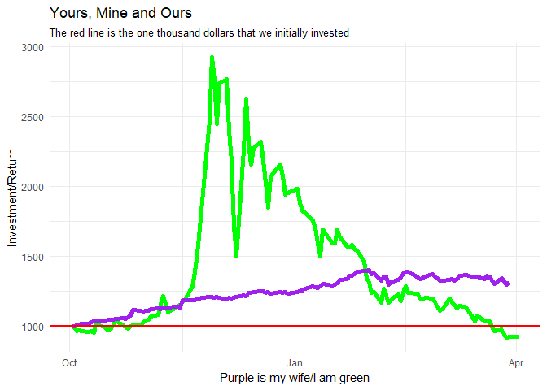

##Background
The stock market is overflowing with data. There are many packages in R that allow us to get quick access to information on publicly traded companies. Imagine that you and a friend each purchased about $1,000 of stock in three different stocks at the start of October last year, and you want to compare your performance up to this week. Use the stock shares purchased and share prices to demonstrate how each of you fared over the period you were competing (assuming that you did not change your allocations).

##Reading

This reading will help you complete the tasks below.

o [tidyquants R package](https://github.com/business-science/tidyquant)

o [John Rauser Talk (Review)](https://www.youtube.com/watch?v=fSgEeI2Xpdc&feature=youtu.be)

##Tasks


<div style="padding-left:30px;">

For this exercise I went against my wife in choosing which stocks to invest in. I chose Bitcoin(BTSC), Google(GOOG) and IBM(IBM). My wife chose Amazon(AMZN), Nike(NKE) and Walmart(WMT). We were each given a thousand dollars and chose to invest it in these companies. With help from Blake Cromar, I was able to manipulate the data and then create a graphic that told the perfect story to our investments.

</div>


```r
ggplot(MeReturns, aes(x = date, y = investment.growth)) +
  geom_line(size = 2, color = "green") +
  geom_line(data = WifeReturns,
            size = 2,
            color = "purple") +
  labs(title = "Yours, Mine and Ours",
       subtitle = "The red line is the one thousand dollars that we initially invested",
       x = "Purple is my wife/I am green", 
       y = "Investment/Return") +
  theme_minimal() +
  geom_hline(yintercept = 1000, 
             color = "red", 
             size = 1)
```

<!-- -->

<div style="padding-left:30px;">

In this graphic we see that I was doing amazing. Then, with a little change in the weather, I went downhill. After the time period had ended, my wife's investment continued upward and I eventually made it below the initial investment thus making myself look bad. All in all, this was a fun graphic and way to see data come to life. In reality, all of her stocks consistently rose, without really faltering. She was the tortoise, while I was the hare.

</div>


