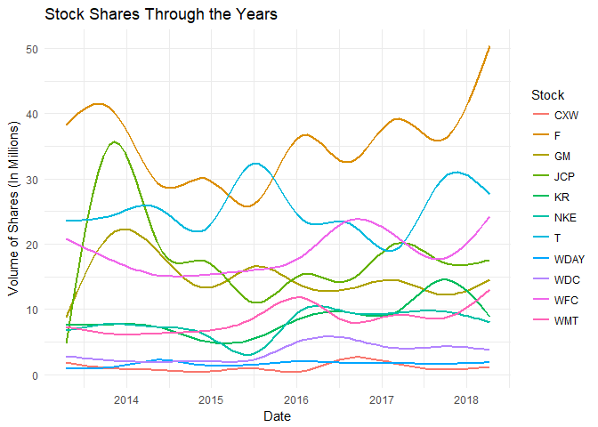

##Background
Your data science income has ballooned, and you need to find somewhere to invest $25,000 that you have saved over the last year. You have a savvy investment friend that is kind enough to tell you ten stocks he has been watching during the last year. You will need to visualize the last five years performance to help in the in the conversation with your friend.

Your friend is going to give you his tickers at the beginning of your half-hour meeting with him (he is a busy friend). You will need to build an .Rmd file that will build a suite of visualizations rapidly for your conversation. You will need a series of stock performance graphics using library(dygraphs) and library(ggplot2). In real life, you might use one or the other, but this task is built to help you move from ts and xts to tidy objects for visualization.

Specifically, in class the Tuesday following this case study you will get 5 - 10 ticker symbols and will need to build visualizations quickly that allows you to answer questions about the stocks in a few seconds.


##Reading
This reading will help you complete the tasks below.

o [See task 16](https://byuistats.github.io/M335/class_tasks/task16_details.html)

##Tasks


```r
dygraph(Returns,
        ylab = "Adjusted Value") %>% 
  dyRangeSelector()  %>%
  dyShading(from = today() - dyears(Years), 
            to = today()) 
```

<!--html_preserve--><div id="htmlwidget-80d3fd3bbf9a76ec512e" style="width:672px;height:480px;" class="dygraphs html-widget"></div>
<script type="application/json" data-for="htmlwidget-80d3fd3bbf9a76ec512e">{"x":{"attrs":{"ylabel":"Adjusted Value","labels":["day","CXW","F","GM","JCP","KR","NKE","T","WDAY","WDC","WFC","WMT"],"legend":"auto","retainDateWindow":false,"axes":{"x":{"pixelsPerLabel":60}},"showRangeSelector":true,"rangeSelectorHeight":40,"rangeSelectorPlotFillColor":" #A7B1C4","rangeSelectorPlotStrokeColor":"#808FAB","interactionModel":"Dygraph.Interaction.defaultModel"},"scale":"daily","annotations":[],"shadings":[{"from":"2013-04-13T00:00:00.000Z","to":"2018-04-12T00:00:00.000Z","color":"#EFEFEF","axis":"x"}],"events":[],"format":"date","data":[["2013-04-15T00:00:00.000Z","2013-04-16T00:00:00.000Z","2013-04-17T00:00:00.000Z","2013-04-18T00:00:00.000Z","2013-04-19T00:00:00.000Z","2013-04-22T00:00:00.000Z","2013-04-23T00:00:00.000Z","2013-04-24T00:00:00.000Z","2013-04-25T00:00:00.000Z","2013-04-26T00:00:00.000Z","2013-04-29T00:00:00.000Z","2013-04-30T00:00:00.000Z","2013-05-01T00:00:00.000Z","2013-05-02T00:00:00.000Z","2013-05-03T00:00:00.000Z","2013-05-06T00:00:00.000Z","2013-05-07T00:00:00.000Z","2013-05-08T00:00:00.000Z","2013-05-09T00:00:00.000Z","2013-05-10T00:00:00.000Z","2013-05-13T00:00:00.000Z","2013-05-14T00:00:00.000Z","2013-05-15T00:00:00.000Z","2013-05-16T00:00:00.000Z","2013-05-17T00:00:00.000Z","2013-05-20T00:00:00.000Z","2013-05-21T00:00:00.000Z","2013-05-22T00:00:00.000Z","2013-05-23T00:00:00.000Z","2013-05-24T00:00:00.000Z","2013-05-28T00:00:00.000Z","2013-05-29T00:00:00.000Z","2013-05-30T00:00:00.000Z","2013-05-31T00:00:00.000Z","2013-06-03T00:00:00.000Z","2013-06-04T00:00:00.000Z","2013-06-05T00:00:00.000Z","2013-06-06T00:00:00.000Z","2013-06-07T00:00:00.000Z","2013-06-10T00:00:00.000Z","2013-06-11T00:00:00.000Z","2013-06-12T00:00:00.000Z","2013-06-13T00:00:00.000Z","2013-06-14T00:00:00.000Z","2013-06-17T00:00:00.000Z","2013-06-18T00:00:00.000Z","2013-06-19T00:00:00.000Z","2013-06-20T00:00:00.000Z","2013-06-21T00:00:00.000Z","2013-06-24T00:00:00.000Z","2013-06-25T00:00:00.000Z","2013-06-26T00:00:00.000Z","2013-06-27T00:00:00.000Z","2013-06-28T00:00:00.000Z","2013-07-01T00:00:00.000Z","2013-07-02T00:00:00.000Z","2013-07-03T00:00:00.000Z","2013-07-05T00:00:00.000Z","2013-07-08T00:00:00.000Z","2013-07-09T00:00:00.000Z","2013-07-10T00:00:00.000Z","2013-07-11T00:00:00.000Z","2013-07-12T00:00:00.000Z","2013-07-15T00:00:00.000Z","2013-07-16T00:00:00.000Z","2013-07-17T00:00:00.000Z","2013-07-18T00:00:00.000Z","2013-07-19T00:00:00.000Z","2013-07-22T00:00:00.000Z","2013-07-23T00:00:00.000Z","2013-07-24T00:00:00.000Z","2013-07-25T00:00:00.000Z","2013-07-26T00:00:00.000Z","2013-07-29T00:00:00.000Z","2013-07-30T00:00:00.000Z","2013-07-31T00:00:00.000Z","2013-08-01T00:00:00.000Z","2013-08-02T00:00:00.000Z","2013-08-05T00:00:00.000Z","2013-08-06T00:00:00.000Z","2013-08-07T00:00:00.000Z","2013-08-08T00:00:00.000Z","2013-08-09T00:00:00.000Z","2013-08-12T00:00:00.000Z","2013-08-13T00:00:00.000Z","2013-08-14T00:00:00.000Z","2013-08-15T00:00:00.000Z","2013-08-16T00:00:00.000Z","2013-08-19T00:00:00.000Z","2013-08-20T00:00:00.000Z","2013-08-21T00:00:00.000Z","2013-08-22T00:00:00.000Z","2013-08-23T00:00:00.000Z","2013-08-26T00:00:00.000Z","2013-08-27T00:00:00.000Z","2013-08-28T00:00:00.000Z","2013-08-29T00:00:00.000Z","2013-08-30T00:00:00.000Z","2013-09-03T00:00:00.000Z","2013-09-04T00:00:00.000Z","2013-09-05T00:00:00.000Z","2013-09-06T00:00:00.000Z","2013-09-09T00:00:00.000Z","2013-09-10T00:00:00.000Z","2013-09-11T00:00:00.000Z","2013-09-12T00:00:00.000Z","2013-09-13T00:00:00.000Z","2013-09-16T00:00:00.000Z","2013-09-17T00:00:00.000Z","2013-09-18T00:00:00.000Z","2013-09-19T00:00:00.000Z","2013-09-20T00:00:00.000Z","2013-09-23T00:00:00.000Z","2013-09-24T00:00:00.000Z","2013-09-25T00:00:00.000Z","2013-09-26T00:00:00.000Z","2013-09-27T00:00:00.000Z","2013-09-30T00:00:00.000Z","2013-10-01T00:00:00.000Z","2013-10-02T00:00:00.000Z","2013-10-03T00:00:00.000Z","2013-10-04T00:00:00.000Z","2013-10-07T00:00:00.000Z","2013-10-08T00:00:00.000Z","2013-10-09T00:00:00.000Z","2013-10-10T00:00:00.000Z","2013-10-11T00:00:00.000Z","2013-10-14T00:00:00.000Z","2013-10-15T00:00:00.000Z","2013-10-16T00:00:00.000Z","2013-10-17T00:00:00.000Z","2013-10-18T00:00:00.000Z","2013-10-21T00:00:00.000Z","2013-10-22T00:00:00.000Z","2013-10-23T00:00:00.000Z","2013-10-24T00:00:00.000Z","2013-10-25T00:00:00.000Z","2013-10-28T00:00:00.000Z","2013-10-29T00:00:00.000Z","2013-10-30T00:00:00.000Z","2013-10-31T00:00:00.000Z","2013-11-01T00:00:00.000Z","2013-11-04T00:00:00.000Z","2013-11-05T00:00:00.000Z","2013-11-06T00:00:00.000Z","2013-11-07T00:00:00.000Z","2013-11-08T00:00:00.000Z","2013-11-11T00:00:00.000Z","2013-11-12T00:00:00.000Z","2013-11-13T00:00:00.000Z","2013-11-14T00:00:00.000Z","2013-11-15T00:00:00.000Z","2013-11-18T00:00:00.000Z","2013-11-19T00:00:00.000Z","2013-11-20T00:00:00.000Z","2013-11-21T00:00:00.000Z","2013-11-22T00:00:00.000Z","2013-11-25T00:00:00.000Z","2013-11-26T00:00:00.000Z","2013-11-27T00:00:00.000Z","2013-11-29T00:00:00.000Z","2013-12-02T00:00:00.000Z","2013-12-03T00:00:00.000Z","2013-12-04T00:00:00.000Z","2013-12-05T00:00:00.000Z","2013-12-06T00:00:00.000Z","2013-12-09T00:00:00.000Z","2013-12-10T00:00:00.000Z","2013-12-11T00:00:00.000Z","2013-12-12T00:00:00.000Z","2013-12-13T00:00:00.000Z","2013-12-16T00:00:00.000Z","2013-12-17T00:00:00.000Z","2013-12-18T00:00:00.000Z","2013-12-19T00:00:00.000Z","2013-12-20T00:00:00.000Z","2013-12-23T00:00:00.000Z","2013-12-24T00:00:00.000Z","2013-12-26T00:00:00.000Z","2013-12-27T00:00:00.000Z","2013-12-30T00:00:00.000Z","2013-12-31T00:00:00.000Z","2014-01-02T00:00:00.000Z","2014-01-03T00:00:00.000Z","2014-01-06T00:00:00.000Z","2014-01-07T00:00:00.000Z","2014-01-08T00:00:00.000Z","2014-01-09T00:00:00.000Z","2014-01-10T00:00:00.000Z","2014-01-13T00:00:00.000Z","2014-01-14T00:00:00.000Z","2014-01-15T00:00:00.000Z","2014-01-16T00:00:00.000Z","2014-01-17T00:00:00.000Z","2014-01-21T00:00:00.000Z","2014-01-22T00:00:00.000Z","2014-01-23T00:00:00.000Z","2014-01-24T00:00:00.000Z","2014-01-27T00:00:00.000Z","2014-01-28T00:00:00.000Z","2014-01-29T00:00:00.000Z","2014-01-30T00:00:00.000Z","2014-01-31T00:00:00.000Z","2014-02-03T00:00:00.000Z","2014-02-04T00:00:00.000Z","2014-02-05T00:00:00.000Z","2014-02-06T00:00:00.000Z","2014-02-07T00:00:00.000Z","2014-02-10T00:00:00.000Z","2014-02-11T00:00:00.000Z","2014-02-12T00:00:00.000Z","2014-02-13T00:00:00.000Z","2014-02-14T00:00:00.000Z","2014-02-18T00:00:00.000Z","2014-02-19T00:00:00.000Z","2014-02-20T00:00:00.000Z","2014-02-21T00:00:00.000Z","2014-02-24T00:00:00.000Z","2014-02-25T00:00:00.000Z","2014-02-26T00:00:00.000Z","2014-02-27T00:00:00.000Z","2014-02-28T00:00:00.000Z","2014-03-03T00:00:00.000Z","2014-03-04T00:00:00.000Z","2014-03-05T00:00:00.000Z","2014-03-06T00:00:00.000Z","2014-03-07T00:00:00.000Z","2014-03-10T00:00:00.000Z","2014-03-11T00:00:00.000Z","2014-03-12T00:00:00.000Z","2014-03-13T00:00:00.000Z","2014-03-14T00:00:00.000Z","2014-03-17T00:00:00.000Z","2014-03-18T00:00:00.000Z","2014-03-19T00:00:00.000Z","2014-03-20T00:00:00.000Z","2014-03-21T00:00:00.000Z","2014-03-24T00:00:00.000Z","2014-03-25T00:00:00.000Z","2014-03-26T00:00:00.000Z","2014-03-27T00:00:00.000Z","2014-03-28T00:00:00.000Z","2014-03-31T00:00:00.000Z","2014-04-01T00:00:00.000Z","2014-04-02T00:00:00.000Z","2014-04-03T00:00:00.000Z","2014-04-04T00:00:00.000Z","2014-04-07T00:00:00.000Z","2014-04-08T00:00:00.000Z","2014-04-09T00:00:00.000Z","2014-04-10T00:00:00.000Z","2014-04-11T00:00:00.000Z","2014-04-14T00:00:00.000Z","2014-04-15T00:00:00.000Z","2014-04-16T00:00:00.000Z","2014-04-17T00:00:00.000Z","2014-04-21T00:00:00.000Z","2014-04-22T00:00:00.000Z","2014-04-23T00:00:00.000Z","2014-04-24T00:00:00.000Z","2014-04-25T00:00:00.000Z","2014-04-28T00:00:00.000Z","2014-04-29T00:00:00.000Z","2014-04-30T00:00:00.000Z","2014-05-01T00:00:00.000Z","2014-05-02T00:00:00.000Z","2014-05-05T00:00:00.000Z","2014-05-06T00:00:00.000Z","2014-05-07T00:00:00.000Z","2014-05-08T00:00:00.000Z","2014-05-09T00:00:00.000Z","2014-05-12T00:00:00.000Z","2014-05-13T00:00:00.000Z","2014-05-14T00:00:00.000Z","2014-05-15T00:00:00.000Z","2014-05-16T00:00:00.000Z","2014-05-19T00:00:00.000Z","2014-05-20T00:00:00.000Z","2014-05-21T00:00:00.000Z","2014-05-22T00:00:00.000Z","2014-05-23T00:00:00.000Z","2014-05-27T00:00:00.000Z","2014-05-28T00:00:00.000Z","2014-05-29T00:00:00.000Z","2014-05-30T00:00:00.000Z","2014-06-02T00:00:00.000Z","2014-06-03T00:00:00.000Z","2014-06-04T00:00:00.000Z","2014-06-05T00:00:00.000Z","2014-06-06T00:00:00.000Z","2014-06-09T00:00:00.000Z","2014-06-10T00:00:00.000Z","2014-06-11T00:00:00.000Z","2014-06-12T00:00:00.000Z","2014-06-13T00:00:00.000Z","2014-06-16T00:00:00.000Z","2014-06-17T00:00:00.000Z","2014-06-18T00:00:00.000Z","2014-06-19T00:00:00.000Z","2014-06-20T00:00:00.000Z","2014-06-23T00:00:00.000Z","2014-06-24T00:00:00.000Z","2014-06-25T00:00:00.000Z","2014-06-26T00:00:00.000Z","2014-06-27T00:00:00.000Z","2014-06-30T00:00:00.000Z","2014-07-01T00:00:00.000Z","2014-07-02T00:00:00.000Z","2014-07-03T00:00:00.000Z","2014-07-07T00:00:00.000Z","2014-07-08T00:00:00.000Z","2014-07-09T00:00:00.000Z","2014-07-10T00:00:00.000Z","2014-07-11T00:00:00.000Z","2014-07-14T00:00:00.000Z","2014-07-15T00:00:00.000Z","2014-07-16T00:00:00.000Z","2014-07-17T00:00:00.000Z","2014-07-18T00:00:00.000Z","2014-07-21T00:00:00.000Z","2014-07-22T00:00:00.000Z","2014-07-23T00:00:00.000Z","2014-07-24T00:00:00.000Z","2014-07-25T00:00:00.000Z","2014-07-28T00:00:00.000Z","2014-07-29T00:00:00.000Z","2014-07-30T00:00:00.000Z","2014-07-31T00:00:00.000Z","2014-08-01T00:00:00.000Z","2014-08-04T00:00:00.000Z","2014-08-05T00:00:00.000Z","2014-08-06T00:00:00.000Z","2014-08-07T00:00:00.000Z","2014-08-08T00:00:00.000Z","2014-08-11T00:00:00.000Z","2014-08-12T00:00:00.000Z","2014-08-13T00:00:00.000Z","2014-08-14T00:00:00.000Z","2014-08-15T00:00:00.000Z","2014-08-18T00:00:00.000Z","2014-08-19T00:00:00.000Z","2014-08-20T00:00:00.000Z","2014-08-21T00:00:00.000Z","2014-08-22T00:00:00.000Z","2014-08-25T00:00:00.000Z","2014-08-26T00:00:00.000Z","2014-08-27T00:00:00.000Z","2014-08-28T00:00:00.000Z","2014-08-29T00:00:00.000Z","2014-09-02T00:00:00.000Z","2014-09-03T00:00:00.000Z","2014-09-04T00:00:00.000Z","2014-09-05T00:00:00.000Z","2014-09-08T00:00:00.000Z","2014-09-09T00:00:00.000Z","2014-09-10T00:00:00.000Z","2014-09-11T00:00:00.000Z","2014-09-12T00:00:00.000Z","2014-09-15T00:00:00.000Z","2014-09-16T00:00:00.000Z","2014-09-17T00:00:00.000Z","2014-09-18T00:00:00.000Z","2014-09-19T00:00:00.000Z","2014-09-22T00:00:00.000Z","2014-09-23T00:00:00.000Z","2014-09-24T00:00:00.000Z","2014-09-25T00:00:00.000Z","2014-09-26T00:00:00.000Z","2014-09-29T00:00:00.000Z","2014-09-30T00:00:00.000Z","2014-10-01T00:00:00.000Z","2014-10-02T00:00:00.000Z","2014-10-03T00:00:00.000Z","2014-10-06T00:00:00.000Z","2014-10-07T00:00:00.000Z","2014-10-08T00:00:00.000Z","2014-10-09T00:00:00.000Z","2014-10-10T00:00:00.000Z","2014-10-13T00:00:00.000Z","2014-10-14T00:00:00.000Z","2014-10-15T00:00:00.000Z","2014-10-16T00:00:00.000Z","2014-10-17T00:00:00.000Z","2014-10-20T00:00:00.000Z","2014-10-21T00:00:00.000Z","2014-10-22T00:00:00.000Z","2014-10-23T00:00:00.000Z","2014-10-24T00:00:00.000Z","2014-10-27T00:00:00.000Z","2014-10-28T00:00:00.000Z","2014-10-29T00:00:00.000Z","2014-10-30T00:00:00.000Z","2014-10-31T00:00:00.000Z","2014-11-03T00:00:00.000Z","2014-11-04T00:00:00.000Z","2014-11-05T00:00:00.000Z","2014-11-06T00:00:00.000Z","2014-11-07T00:00:00.000Z","2014-11-10T00:00:00.000Z","2014-11-11T00:00:00.000Z","2014-11-12T00:00:00.000Z","2014-11-13T00:00:00.000Z","2014-11-14T00:00:00.000Z","2014-11-17T00:00:00.000Z","2014-11-18T00:00:00.000Z","2014-11-19T00:00:00.000Z","2014-11-20T00:00:00.000Z","2014-11-21T00:00:00.000Z","2014-11-24T00:00:00.000Z","2014-11-25T00:00:00.000Z","2014-11-26T00:00:00.000Z","2014-11-28T00:00:00.000Z","2014-12-01T00:00:00.000Z","2014-12-02T00:00:00.000Z","2014-12-03T00:00:00.000Z","2014-12-04T00:00:00.000Z","2014-12-05T00:00:00.000Z","2014-12-08T00:00:00.000Z","2014-12-09T00:00:00.000Z","2014-12-10T00:00:00.000Z","2014-12-11T00:00:00.000Z","2014-12-12T00:00:00.000Z","2014-12-15T00:00:00.000Z","2014-12-16T00:00:00.000Z","2014-12-17T00:00:00.000Z","2014-12-18T00:00:00.000Z","2014-12-19T00:00:00.000Z","2014-12-22T00:00:00.000Z","2014-12-23T00:00:00.000Z","2014-12-24T00:00:00.000Z","2014-12-26T00:00:00.000Z","2014-12-29T00:00:00.000Z","2014-12-30T00:00:00.000Z","2014-12-31T00:00:00.000Z","2015-01-02T00:00:00.000Z","2015-01-05T00:00:00.000Z","2015-01-06T00:00:00.000Z","2015-01-07T00:00:00.000Z","2015-01-08T00:00:00.000Z","2015-01-09T00:00:00.000Z","2015-01-12T00:00:00.000Z","2015-01-13T00:00:00.000Z","2015-01-14T00:00:00.000Z","2015-01-15T00:00:00.000Z","2015-01-16T00:00:00.000Z","2015-01-20T00:00:00.000Z","2015-01-21T00:00:00.000Z","2015-01-22T00:00:00.000Z","2015-01-23T00:00:00.000Z","2015-01-26T00:00:00.000Z","2015-01-27T00:00:00.000Z","2015-01-28T00:00:00.000Z","2015-01-29T00:00:00.000Z","2015-01-30T00:00:00.000Z","2015-02-02T00:00:00.000Z","2015-02-03T00:00:00.000Z","2015-02-04T00:00:00.000Z","2015-02-05T00:00:00.000Z","2015-02-06T00:00:00.000Z","2015-02-09T00:00:00.000Z","2015-02-10T00:00:00.000Z","2015-02-11T00:00:00.000Z","2015-02-12T00:00:00.000Z","2015-02-13T00:00:00.000Z","2015-02-17T00:00:00.000Z","2015-02-18T00:00:00.000Z","2015-02-19T00:00:00.000Z","2015-02-20T00:00:00.000Z","2015-02-23T00:00:00.000Z","2015-02-24T00:00:00.000Z","2015-02-25T00:00:00.000Z","2015-02-26T00:00:00.000Z","2015-02-27T00:00:00.000Z","2015-03-02T00:00:00.000Z","2015-03-03T00:00:00.000Z","2015-03-04T00:00:00.000Z","2015-03-05T00:00:00.000Z","2015-03-06T00:00:00.000Z","2015-03-09T00:00:00.000Z","2015-03-10T00:00:00.000Z","2015-03-11T00:00:00.000Z","2015-03-12T00:00:00.000Z","2015-03-13T00:00:00.000Z","2015-03-16T00:00:00.000Z","2015-03-17T00:00:00.000Z","2015-03-18T00:00:00.000Z","2015-03-19T00:00:00.000Z","2015-03-20T00:00:00.000Z","2015-03-23T00:00:00.000Z","2015-03-24T00:00:00.000Z","2015-03-25T00:00:00.000Z","2015-03-26T00:00:00.000Z","2015-03-27T00:00:00.000Z","2015-03-30T00:00:00.000Z","2015-03-31T00:00:00.000Z","2015-04-01T00:00:00.000Z","2015-04-02T00:00:00.000Z","2015-04-06T00:00:00.000Z","2015-04-07T00:00:00.000Z","2015-04-08T00:00:00.000Z","2015-04-09T00:00:00.000Z","2015-04-10T00:00:00.000Z","2015-04-13T00:00:00.000Z","2015-04-14T00:00:00.000Z","2015-04-15T00:00:00.000Z","2015-04-16T00:00:00.000Z","2015-04-17T00:00:00.000Z","2015-04-20T00:00:00.000Z","2015-04-21T00:00:00.000Z","2015-04-22T00:00:00.000Z","2015-04-23T00:00:00.000Z","2015-04-24T00:00:00.000Z","2015-04-27T00:00:00.000Z","2015-04-28T00:00:00.000Z","2015-04-29T00:00:00.000Z","2015-04-30T00:00:00.000Z","2015-05-01T00:00:00.000Z","2015-05-04T00:00:00.000Z","2015-05-05T00:00:00.000Z","2015-05-06T00:00:00.000Z","2015-05-07T00:00:00.000Z","2015-05-08T00:00:00.000Z","2015-05-11T00:00:00.000Z","2015-05-12T00:00:00.000Z","2015-05-13T00:00:00.000Z","2015-05-14T00:00:00.000Z","2015-05-15T00:00:00.000Z","2015-05-18T00:00:00.000Z","2015-05-19T00:00:00.000Z","2015-05-20T00:00:00.000Z","2015-05-21T00:00:00.000Z","2015-05-22T00:00:00.000Z","2015-05-26T00:00:00.000Z","2015-05-27T00:00:00.000Z","2015-05-28T00:00:00.000Z","2015-05-29T00:00:00.000Z","2015-06-01T00:00:00.000Z","2015-06-02T00:00:00.000Z","2015-06-03T00:00:00.000Z","2015-06-04T00:00:00.000Z","2015-06-05T00:00:00.000Z","2015-06-08T00:00:00.000Z","2015-06-09T00:00:00.000Z","2015-06-10T00:00:00.000Z","2015-06-11T00:00:00.000Z","2015-06-12T00:00:00.000Z","2015-06-15T00:00:00.000Z","2015-06-16T00:00:00.000Z","2015-06-17T00:00:00.000Z","2015-06-18T00:00:00.000Z","2015-06-19T00:00:00.000Z","2015-06-22T00:00:00.000Z","2015-06-23T00:00:00.000Z","2015-06-24T00:00:00.000Z","2015-06-25T00:00:00.000Z","2015-06-26T00:00:00.000Z","2015-06-29T00:00:00.000Z","2015-06-30T00:00:00.000Z","2015-07-01T00:00:00.000Z","2015-07-02T00:00:00.000Z","2015-07-06T00:00:00.000Z","2015-07-07T00:00:00.000Z","2015-07-08T00:00:00.000Z","2015-07-09T00:00:00.000Z","2015-07-10T00:00:00.000Z","2015-07-13T00:00:00.000Z","2015-07-14T00:00:00.000Z","2015-07-15T00:00:00.000Z","2015-07-16T00:00:00.000Z","2015-07-17T00:00:00.000Z","2015-07-20T00:00:00.000Z","2015-07-21T00:00:00.000Z","2015-07-22T00:00:00.000Z","2015-07-23T00:00:00.000Z","2015-07-24T00:00:00.000Z","2015-07-27T00:00:00.000Z","2015-07-28T00:00:00.000Z","2015-07-29T00:00:00.000Z","2015-07-30T00:00:00.000Z","2015-07-31T00:00:00.000Z","2015-08-03T00:00:00.000Z","2015-08-04T00:00:00.000Z","2015-08-05T00:00:00.000Z","2015-08-06T00:00:00.000Z","2015-08-07T00:00:00.000Z","2015-08-10T00:00:00.000Z","2015-08-11T00:00:00.000Z","2015-08-12T00:00:00.000Z","2015-08-13T00:00:00.000Z","2015-08-14T00:00:00.000Z","2015-08-17T00:00:00.000Z","2015-08-18T00:00:00.000Z","2015-08-19T00:00:00.000Z","2015-08-20T00:00:00.000Z","2015-08-21T00:00:00.000Z","2015-08-24T00:00:00.000Z","2015-08-25T00:00:00.000Z","2015-08-26T00:00:00.000Z","2015-08-27T00:00:00.000Z","2015-08-28T00:00:00.000Z","2015-08-31T00:00:00.000Z","2015-09-01T00:00:00.000Z","2015-09-02T00:00:00.000Z","2015-09-03T00:00:00.000Z","2015-09-04T00:00:00.000Z","2015-09-08T00:00:00.000Z","2015-09-09T00:00:00.000Z","2015-09-10T00:00:00.000Z","2015-09-11T00:00:00.000Z","2015-09-14T00:00:00.000Z","2015-09-15T00:00:00.000Z","2015-09-16T00:00:00.000Z","2015-09-17T00:00:00.000Z","2015-09-18T00:00:00.000Z","2015-09-21T00:00:00.000Z","2015-09-22T00:00:00.000Z","2015-09-23T00:00:00.000Z","2015-09-24T00:00:00.000Z","2015-09-25T00:00:00.000Z","2015-09-28T00:00:00.000Z","2015-09-29T00:00:00.000Z","2015-09-30T00:00:00.000Z","2015-10-01T00:00:00.000Z","2015-10-02T00:00:00.000Z","2015-10-05T00:00:00.000Z","2015-10-06T00:00:00.000Z","2015-10-07T00:00:00.000Z","2015-10-08T00:00:00.000Z","2015-10-09T00:00:00.000Z","2015-10-12T00:00:00.000Z","2015-10-13T00:00:00.000Z","2015-10-14T00:00:00.000Z","2015-10-15T00:00:00.000Z","2015-10-16T00:00:00.000Z","2015-10-19T00:00:00.000Z","2015-10-20T00:00:00.000Z","2015-10-21T00:00:00.000Z","2015-10-22T00:00:00.000Z","2015-10-23T00:00:00.000Z","2015-10-26T00:00:00.000Z","2015-10-27T00:00:00.000Z","2015-10-28T00:00:00.000Z","2015-10-29T00:00:00.000Z","2015-10-30T00:00:00.000Z","2015-11-02T00:00:00.000Z","2015-11-03T00:00:00.000Z","2015-11-04T00:00:00.000Z","2015-11-05T00:00:00.000Z","2015-11-06T00:00:00.000Z","2015-11-09T00:00:00.000Z","2015-11-10T00:00:00.000Z","2015-11-11T00:00:00.000Z","2015-11-12T00:00:00.000Z","2015-11-13T00:00:00.000Z","2015-11-16T00:00:00.000Z","2015-11-17T00:00:00.000Z","2015-11-18T00:00:00.000Z","2015-11-19T00:00:00.000Z","2015-11-20T00:00:00.000Z","2015-11-23T00:00:00.000Z","2015-11-24T00:00:00.000Z","2015-11-25T00:00:00.000Z","2015-11-27T00:00:00.000Z","2015-11-30T00:00:00.000Z","2015-12-01T00:00:00.000Z","2015-12-02T00:00:00.000Z","2015-12-03T00:00:00.000Z","2015-12-04T00:00:00.000Z","2015-12-07T00:00:00.000Z","2015-12-08T00:00:00.000Z","2015-12-09T00:00:00.000Z","2015-12-10T00:00:00.000Z","2015-12-11T00:00:00.000Z","2015-12-14T00:00:00.000Z","2015-12-15T00:00:00.000Z","2015-12-16T00:00:00.000Z","2015-12-17T00:00:00.000Z","2015-12-18T00:00:00.000Z","2015-12-21T00:00:00.000Z","2015-12-22T00:00:00.000Z","2015-12-23T00:00:00.000Z","2015-12-24T00:00:00.000Z","2015-12-28T00:00:00.000Z","2015-12-29T00:00:00.000Z","2015-12-30T00:00:00.000Z","2015-12-31T00:00:00.000Z","2016-01-04T00:00:00.000Z","2016-01-05T00:00:00.000Z","2016-01-06T00:00:00.000Z","2016-01-07T00:00:00.000Z","2016-01-08T00:00:00.000Z","2016-01-11T00:00:00.000Z","2016-01-12T00:00:00.000Z","2016-01-13T00:00:00.000Z","2016-01-14T00:00:00.000Z","2016-01-15T00:00:00.000Z","2016-01-19T00:00:00.000Z","2016-01-20T00:00:00.000Z","2016-01-21T00:00:00.000Z","2016-01-22T00:00:00.000Z","2016-01-25T00:00:00.000Z","2016-01-26T00:00:00.000Z","2016-01-27T00:00:00.000Z","2016-01-28T00:00:00.000Z","2016-01-29T00:00:00.000Z","2016-02-01T00:00:00.000Z","2016-02-02T00:00:00.000Z","2016-02-03T00:00:00.000Z","2016-02-04T00:00:00.000Z","2016-02-05T00:00:00.000Z","2016-02-08T00:00:00.000Z","2016-02-09T00:00:00.000Z","2016-02-10T00:00:00.000Z","2016-02-11T00:00:00.000Z","2016-02-12T00:00:00.000Z","2016-02-16T00:00:00.000Z","2016-02-17T00:00:00.000Z","2016-02-18T00:00:00.000Z","2016-02-19T00:00:00.000Z","2016-02-22T00:00:00.000Z","2016-02-23T00:00:00.000Z","2016-02-24T00:00:00.000Z","2016-02-25T00:00:00.000Z","2016-02-26T00:00:00.000Z","2016-02-29T00:00:00.000Z","2016-03-01T00:00:00.000Z","2016-03-02T00:00:00.000Z","2016-03-03T00:00:00.000Z","2016-03-04T00:00:00.000Z","2016-03-07T00:00:00.000Z","2016-03-08T00:00:00.000Z","2016-03-09T00:00:00.000Z","2016-03-10T00:00:00.000Z","2016-03-11T00:00:00.000Z","2016-03-14T00:00:00.000Z","2016-03-15T00:00:00.000Z","2016-03-16T00:00:00.000Z","2016-03-17T00:00:00.000Z","2016-03-18T00:00:00.000Z","2016-03-21T00:00:00.000Z","2016-03-22T00:00:00.000Z","2016-03-23T00:00:00.000Z","2016-03-24T00:00:00.000Z","2016-03-28T00:00:00.000Z","2016-03-29T00:00:00.000Z","2016-03-30T00:00:00.000Z","2016-03-31T00:00:00.000Z","2016-04-01T00:00:00.000Z","2016-04-04T00:00:00.000Z","2016-04-05T00:00:00.000Z","2016-04-06T00:00:00.000Z","2016-04-07T00:00:00.000Z","2016-04-08T00:00:00.000Z","2016-04-11T00:00:00.000Z","2016-04-12T00:00:00.000Z","2016-04-13T00:00:00.000Z","2016-04-14T00:00:00.000Z","2016-04-15T00:00:00.000Z","2016-04-18T00:00:00.000Z","2016-04-19T00:00:00.000Z","2016-04-20T00:00:00.000Z","2016-04-21T00:00:00.000Z","2016-04-22T00:00:00.000Z","2016-04-25T00:00:00.000Z","2016-04-26T00:00:00.000Z","2016-04-27T00:00:00.000Z","2016-04-28T00:00:00.000Z","2016-04-29T00:00:00.000Z","2016-05-02T00:00:00.000Z","2016-05-03T00:00:00.000Z","2016-05-04T00:00:00.000Z","2016-05-05T00:00:00.000Z","2016-05-06T00:00:00.000Z","2016-05-09T00:00:00.000Z","2016-05-10T00:00:00.000Z","2016-05-11T00:00:00.000Z","2016-05-12T00:00:00.000Z","2016-05-13T00:00:00.000Z","2016-05-16T00:00:00.000Z","2016-05-17T00:00:00.000Z","2016-05-18T00:00:00.000Z","2016-05-19T00:00:00.000Z","2016-05-20T00:00:00.000Z","2016-05-23T00:00:00.000Z","2016-05-24T00:00:00.000Z","2016-05-25T00:00:00.000Z","2016-05-26T00:00:00.000Z","2016-05-27T00:00:00.000Z","2016-05-31T00:00:00.000Z","2016-06-01T00:00:00.000Z","2016-06-02T00:00:00.000Z","2016-06-03T00:00:00.000Z","2016-06-06T00:00:00.000Z","2016-06-07T00:00:00.000Z","2016-06-08T00:00:00.000Z","2016-06-09T00:00:00.000Z","2016-06-10T00:00:00.000Z","2016-06-13T00:00:00.000Z","2016-06-14T00:00:00.000Z","2016-06-15T00:00:00.000Z","2016-06-16T00:00:00.000Z","2016-06-17T00:00:00.000Z","2016-06-20T00:00:00.000Z","2016-06-21T00:00:00.000Z","2016-06-22T00:00:00.000Z","2016-06-23T00:00:00.000Z","2016-06-24T00:00:00.000Z","2016-06-27T00:00:00.000Z","2016-06-28T00:00:00.000Z","2016-06-29T00:00:00.000Z","2016-06-30T00:00:00.000Z","2016-07-01T00:00:00.000Z","2016-07-05T00:00:00.000Z","2016-07-06T00:00:00.000Z","2016-07-07T00:00:00.000Z","2016-07-08T00:00:00.000Z","2016-07-11T00:00:00.000Z","2016-07-12T00:00:00.000Z","2016-07-13T00:00:00.000Z","2016-07-14T00:00:00.000Z","2016-07-15T00:00:00.000Z","2016-07-18T00:00:00.000Z","2016-07-19T00:00:00.000Z","2016-07-20T00:00:00.000Z","2016-07-21T00:00:00.000Z","2016-07-22T00:00:00.000Z","2016-07-25T00:00:00.000Z","2016-07-26T00:00:00.000Z","2016-07-27T00:00:00.000Z","2016-07-28T00:00:00.000Z","2016-07-29T00:00:00.000Z","2016-08-01T00:00:00.000Z","2016-08-02T00:00:00.000Z","2016-08-03T00:00:00.000Z","2016-08-04T00:00:00.000Z","2016-08-05T00:00:00.000Z","2016-08-08T00:00:00.000Z","2016-08-09T00:00:00.000Z","2016-08-10T00:00:00.000Z","2016-08-11T00:00:00.000Z","2016-08-12T00:00:00.000Z","2016-08-15T00:00:00.000Z","2016-08-16T00:00:00.000Z","2016-08-17T00:00:00.000Z","2016-08-18T00:00:00.000Z","2016-08-19T00:00:00.000Z","2016-08-22T00:00:00.000Z","2016-08-23T00:00:00.000Z","2016-08-24T00:00:00.000Z","2016-08-25T00:00:00.000Z","2016-08-26T00:00:00.000Z","2016-08-29T00:00:00.000Z","2016-08-30T00:00:00.000Z","2016-08-31T00:00:00.000Z","2016-09-01T00:00:00.000Z","2016-09-02T00:00:00.000Z","2016-09-06T00:00:00.000Z","2016-09-07T00:00:00.000Z","2016-09-08T00:00:00.000Z","2016-09-09T00:00:00.000Z","2016-09-12T00:00:00.000Z","2016-09-13T00:00:00.000Z","2016-09-14T00:00:00.000Z","2016-09-15T00:00:00.000Z","2016-09-16T00:00:00.000Z","2016-09-19T00:00:00.000Z","2016-09-20T00:00:00.000Z","2016-09-21T00:00:00.000Z","2016-09-22T00:00:00.000Z","2016-09-23T00:00:00.000Z","2016-09-26T00:00:00.000Z","2016-09-27T00:00:00.000Z","2016-09-28T00:00:00.000Z","2016-09-29T00:00:00.000Z","2016-09-30T00:00:00.000Z","2016-10-03T00:00:00.000Z","2016-10-04T00:00:00.000Z","2016-10-05T00:00:00.000Z","2016-10-06T00:00:00.000Z","2016-10-07T00:00:00.000Z","2016-10-10T00:00:00.000Z","2016-10-11T00:00:00.000Z","2016-10-12T00:00:00.000Z","2016-10-13T00:00:00.000Z","2016-10-14T00:00:00.000Z","2016-10-17T00:00:00.000Z","2016-10-18T00:00:00.000Z","2016-10-19T00:00:00.000Z","2016-10-20T00:00:00.000Z","2016-10-21T00:00:00.000Z","2016-10-24T00:00:00.000Z","2016-10-25T00:00:00.000Z","2016-10-26T00:00:00.000Z","2016-10-27T00:00:00.000Z","2016-10-28T00:00:00.000Z","2016-10-31T00:00:00.000Z","2016-11-01T00:00:00.000Z","2016-11-02T00:00:00.000Z","2016-11-03T00:00:00.000Z","2016-11-04T00:00:00.000Z","2016-11-07T00:00:00.000Z","2016-11-08T00:00:00.000Z","2016-11-09T00:00:00.000Z","2016-11-10T00:00:00.000Z","2016-11-11T00:00:00.000Z","2016-11-14T00:00:00.000Z","2016-11-15T00:00:00.000Z","2016-11-16T00:00:00.000Z","2016-11-17T00:00:00.000Z","2016-11-18T00:00:00.000Z","2016-11-21T00:00:00.000Z","2016-11-22T00:00:00.000Z","2016-11-23T00:00:00.000Z","2016-11-25T00:00:00.000Z","2016-11-28T00:00:00.000Z","2016-11-29T00:00:00.000Z","2016-11-30T00:00:00.000Z","2016-12-01T00:00:00.000Z","2016-12-02T00:00:00.000Z","2016-12-05T00:00:00.000Z","2016-12-06T00:00:00.000Z","2016-12-07T00:00:00.000Z","2016-12-08T00:00:00.000Z","2016-12-09T00:00:00.000Z","2016-12-12T00:00:00.000Z","2016-12-13T00:00:00.000Z","2016-12-14T00:00:00.000Z","2016-12-15T00:00:00.000Z","2016-12-16T00:00:00.000Z","2016-12-19T00:00:00.000Z","2016-12-20T00:00:00.000Z","2016-12-21T00:00:00.000Z","2016-12-22T00:00:00.000Z","2016-12-23T00:00:00.000Z","2016-12-27T00:00:00.000Z","2016-12-28T00:00:00.000Z","2016-12-29T00:00:00.000Z","2016-12-30T00:00:00.000Z","2017-01-03T00:00:00.000Z","2017-01-04T00:00:00.000Z","2017-01-05T00:00:00.000Z","2017-01-06T00:00:00.000Z","2017-01-09T00:00:00.000Z","2017-01-10T00:00:00.000Z","2017-01-11T00:00:00.000Z","2017-01-12T00:00:00.000Z","2017-01-13T00:00:00.000Z","2017-01-17T00:00:00.000Z","2017-01-18T00:00:00.000Z","2017-01-19T00:00:00.000Z","2017-01-20T00:00:00.000Z","2017-01-23T00:00:00.000Z","2017-01-24T00:00:00.000Z","2017-01-25T00:00:00.000Z","2017-01-26T00:00:00.000Z","2017-01-27T00:00:00.000Z","2017-01-30T00:00:00.000Z","2017-01-31T00:00:00.000Z","2017-02-01T00:00:00.000Z","2017-02-02T00:00:00.000Z","2017-02-03T00:00:00.000Z","2017-02-06T00:00:00.000Z","2017-02-07T00:00:00.000Z","2017-02-08T00:00:00.000Z","2017-02-09T00:00:00.000Z","2017-02-10T00:00:00.000Z","2017-02-13T00:00:00.000Z","2017-02-14T00:00:00.000Z","2017-02-15T00:00:00.000Z","2017-02-16T00:00:00.000Z","2017-02-17T00:00:00.000Z","2017-02-21T00:00:00.000Z","2017-02-22T00:00:00.000Z","2017-02-23T00:00:00.000Z","2017-02-24T00:00:00.000Z","2017-02-27T00:00:00.000Z","2017-02-28T00:00:00.000Z","2017-03-01T00:00:00.000Z","2017-03-02T00:00:00.000Z","2017-03-03T00:00:00.000Z","2017-03-06T00:00:00.000Z","2017-03-07T00:00:00.000Z","2017-03-08T00:00:00.000Z","2017-03-09T00:00:00.000Z","2017-03-10T00:00:00.000Z","2017-03-13T00:00:00.000Z","2017-03-14T00:00:00.000Z","2017-03-15T00:00:00.000Z","2017-03-16T00:00:00.000Z","2017-03-17T00:00:00.000Z","2017-03-20T00:00:00.000Z","2017-03-21T00:00:00.000Z","2017-03-22T00:00:00.000Z","2017-03-23T00:00:00.000Z","2017-03-24T00:00:00.000Z","2017-03-27T00:00:00.000Z","2017-03-28T00:00:00.000Z","2017-03-29T00:00:00.000Z","2017-03-30T00:00:00.000Z","2017-03-31T00:00:00.000Z","2017-04-03T00:00:00.000Z","2017-04-04T00:00:00.000Z","2017-04-05T00:00:00.000Z","2017-04-06T00:00:00.000Z","2017-04-07T00:00:00.000Z","2017-04-10T00:00:00.000Z","2017-04-11T00:00:00.000Z","2017-04-12T00:00:00.000Z","2017-04-13T00:00:00.000Z","2017-04-17T00:00:00.000Z","2017-04-18T00:00:00.000Z","2017-04-19T00:00:00.000Z","2017-04-20T00:00:00.000Z","2017-04-21T00:00:00.000Z","2017-04-24T00:00:00.000Z","2017-04-25T00:00:00.000Z","2017-04-26T00:00:00.000Z","2017-04-27T00:00:00.000Z","2017-04-28T00:00:00.000Z","2017-05-01T00:00:00.000Z","2017-05-02T00:00:00.000Z","2017-05-03T00:00:00.000Z","2017-05-04T00:00:00.000Z","2017-05-05T00:00:00.000Z","2017-05-08T00:00:00.000Z","2017-05-09T00:00:00.000Z","2017-05-10T00:00:00.000Z","2017-05-11T00:00:00.000Z","2017-05-12T00:00:00.000Z","2017-05-15T00:00:00.000Z","2017-05-16T00:00:00.000Z","2017-05-17T00:00:00.000Z","2017-05-18T00:00:00.000Z","2017-05-19T00:00:00.000Z","2017-05-22T00:00:00.000Z","2017-05-23T00:00:00.000Z","2017-05-24T00:00:00.000Z","2017-05-25T00:00:00.000Z","2017-05-26T00:00:00.000Z","2017-05-30T00:00:00.000Z","2017-05-31T00:00:00.000Z","2017-06-01T00:00:00.000Z","2017-06-02T00:00:00.000Z","2017-06-05T00:00:00.000Z","2017-06-06T00:00:00.000Z","2017-06-07T00:00:00.000Z","2017-06-08T00:00:00.000Z","2017-06-09T00:00:00.000Z","2017-06-12T00:00:00.000Z","2017-06-13T00:00:00.000Z","2017-06-14T00:00:00.000Z","2017-06-15T00:00:00.000Z","2017-06-16T00:00:00.000Z","2017-06-19T00:00:00.000Z","2017-06-20T00:00:00.000Z","2017-06-21T00:00:00.000Z","2017-06-22T00:00:00.000Z","2017-06-23T00:00:00.000Z","2017-06-26T00:00:00.000Z","2017-06-27T00:00:00.000Z","2017-06-28T00:00:00.000Z","2017-06-29T00:00:00.000Z","2017-06-30T00:00:00.000Z","2017-07-03T00:00:00.000Z","2017-07-05T00:00:00.000Z","2017-07-06T00:00:00.000Z","2017-07-07T00:00:00.000Z","2017-07-10T00:00:00.000Z","2017-07-11T00:00:00.000Z","2017-07-12T00:00:00.000Z","2017-07-13T00:00:00.000Z","2017-07-14T00:00:00.000Z","2017-07-17T00:00:00.000Z","2017-07-18T00:00:00.000Z","2017-07-19T00:00:00.000Z","2017-07-20T00:00:00.000Z","2017-07-21T00:00:00.000Z","2017-07-24T00:00:00.000Z","2017-07-25T00:00:00.000Z","2017-07-26T00:00:00.000Z","2017-07-27T00:00:00.000Z","2017-07-28T00:00:00.000Z","2017-07-31T00:00:00.000Z","2017-08-01T00:00:00.000Z","2017-08-02T00:00:00.000Z","2017-08-03T00:00:00.000Z","2017-08-04T00:00:00.000Z","2017-08-07T00:00:00.000Z","2017-08-08T00:00:00.000Z","2017-08-09T00:00:00.000Z","2017-08-10T00:00:00.000Z","2017-08-11T00:00:00.000Z","2017-08-14T00:00:00.000Z","2017-08-15T00:00:00.000Z","2017-08-16T00:00:00.000Z","2017-08-17T00:00:00.000Z","2017-08-18T00:00:00.000Z","2017-08-21T00:00:00.000Z","2017-08-22T00:00:00.000Z","2017-08-23T00:00:00.000Z","2017-08-24T00:00:00.000Z","2017-08-25T00:00:00.000Z","2017-08-28T00:00:00.000Z","2017-08-29T00:00:00.000Z","2017-08-30T00:00:00.000Z","2017-08-31T00:00:00.000Z","2017-09-01T00:00:00.000Z","2017-09-05T00:00:00.000Z","2017-09-06T00:00:00.000Z","2017-09-07T00:00:00.000Z","2017-09-08T00:00:00.000Z","2017-09-11T00:00:00.000Z","2017-09-12T00:00:00.000Z","2017-09-13T00:00:00.000Z","2017-09-14T00:00:00.000Z","2017-09-15T00:00:00.000Z","2017-09-18T00:00:00.000Z","2017-09-19T00:00:00.000Z","2017-09-20T00:00:00.000Z","2017-09-21T00:00:00.000Z","2017-09-22T00:00:00.000Z","2017-09-25T00:00:00.000Z","2017-09-26T00:00:00.000Z","2017-09-27T00:00:00.000Z","2017-09-28T00:00:00.000Z","2017-09-29T00:00:00.000Z","2017-10-02T00:00:00.000Z","2017-10-03T00:00:00.000Z","2017-10-04T00:00:00.000Z","2017-10-05T00:00:00.000Z","2017-10-06T00:00:00.000Z","2017-10-09T00:00:00.000Z","2017-10-10T00:00:00.000Z","2017-10-11T00:00:00.000Z","2017-10-12T00:00:00.000Z","2017-10-13T00:00:00.000Z","2017-10-16T00:00:00.000Z","2017-10-17T00:00:00.000Z","2017-10-18T00:00:00.000Z","2017-10-19T00:00:00.000Z","2017-10-20T00:00:00.000Z","2017-10-23T00:00:00.000Z","2017-10-24T00:00:00.000Z","2017-10-25T00:00:00.000Z","2017-10-26T00:00:00.000Z","2017-10-27T00:00:00.000Z","2017-10-30T00:00:00.000Z","2017-10-31T00:00:00.000Z","2017-11-01T00:00:00.000Z","2017-11-02T00:00:00.000Z","2017-11-03T00:00:00.000Z","2017-11-06T00:00:00.000Z","2017-11-07T00:00:00.000Z","2017-11-08T00:00:00.000Z","2017-11-09T00:00:00.000Z","2017-11-10T00:00:00.000Z","2017-11-13T00:00:00.000Z","2017-11-14T00:00:00.000Z","2017-11-15T00:00:00.000Z","2017-11-16T00:00:00.000Z","2017-11-17T00:00:00.000Z","2017-11-20T00:00:00.000Z","2017-11-21T00:00:00.000Z","2017-11-22T00:00:00.000Z","2017-11-24T00:00:00.000Z","2017-11-27T00:00:00.000Z","2017-11-28T00:00:00.000Z","2017-11-29T00:00:00.000Z","2017-11-30T00:00:00.000Z","2017-12-01T00:00:00.000Z","2017-12-04T00:00:00.000Z","2017-12-05T00:00:00.000Z","2017-12-06T00:00:00.000Z","2017-12-07T00:00:00.000Z","2017-12-08T00:00:00.000Z","2017-12-11T00:00:00.000Z","2017-12-12T00:00:00.000Z","2017-12-13T00:00:00.000Z","2017-12-14T00:00:00.000Z","2017-12-15T00:00:00.000Z","2017-12-18T00:00:00.000Z","2017-12-19T00:00:00.000Z","2017-12-20T00:00:00.000Z","2017-12-21T00:00:00.000Z","2017-12-22T00:00:00.000Z","2017-12-26T00:00:00.000Z","2017-12-27T00:00:00.000Z","2017-12-28T00:00:00.000Z","2017-12-29T00:00:00.000Z","2018-01-02T00:00:00.000Z","2018-01-03T00:00:00.000Z","2018-01-04T00:00:00.000Z","2018-01-05T00:00:00.000Z","2018-01-08T00:00:00.000Z","2018-01-09T00:00:00.000Z","2018-01-10T00:00:00.000Z","2018-01-11T00:00:00.000Z","2018-01-12T00:00:00.000Z","2018-01-16T00:00:00.000Z","2018-01-17T00:00:00.000Z","2018-01-18T00:00:00.000Z","2018-01-19T00:00:00.000Z","2018-01-22T00:00:00.000Z","2018-01-23T00:00:00.000Z","2018-01-24T00:00:00.000Z","2018-01-25T00:00:00.000Z","2018-01-26T00:00:00.000Z","2018-01-29T00:00:00.000Z","2018-01-30T00:00:00.000Z","2018-01-31T00:00:00.000Z","2018-02-01T00:00:00.000Z","2018-02-02T00:00:00.000Z","2018-02-05T00:00:00.000Z","2018-02-06T00:00:00.000Z","2018-02-07T00:00:00.000Z","2018-02-08T00:00:00.000Z","2018-02-09T00:00:00.000Z","2018-02-12T00:00:00.000Z","2018-02-13T00:00:00.000Z","2018-02-14T00:00:00.000Z","2018-02-15T00:00:00.000Z","2018-02-16T00:00:00.000Z","2018-02-20T00:00:00.000Z","2018-02-21T00:00:00.000Z","2018-02-22T00:00:00.000Z","2018-02-23T00:00:00.000Z","2018-02-26T00:00:00.000Z","2018-02-27T00:00:00.000Z","2018-02-28T00:00:00.000Z","2018-03-01T00:00:00.000Z","2018-03-02T00:00:00.000Z","2018-03-05T00:00:00.000Z","2018-03-06T00:00:00.000Z","2018-03-07T00:00:00.000Z","2018-03-08T00:00:00.000Z","2018-03-09T00:00:00.000Z","2018-03-12T00:00:00.000Z","2018-03-13T00:00:00.000Z","2018-03-14T00:00:00.000Z","2018-03-15T00:00:00.000Z","2018-03-16T00:00:00.000Z","2018-03-19T00:00:00.000Z","2018-03-20T00:00:00.000Z","2018-03-21T00:00:00.000Z","2018-03-22T00:00:00.000Z","2018-03-23T00:00:00.000Z","2018-03-26T00:00:00.000Z","2018-03-27T00:00:00.000Z","2018-03-28T00:00:00.000Z","2018-03-29T00:00:00.000Z","2018-04-02T00:00:00.000Z","2018-04-03T00:00:00.000Z","2018-04-04T00:00:00.000Z","2018-04-05T00:00:00.000Z","2018-04-06T00:00:00.000Z","2018-04-09T00:00:00.000Z","2018-04-10T00:00:00.000Z","2018-04-11T00:00:00.000Z"],[24.160072,24.231434,23.748505,24.309549,24.749857,25.410332,25.658897,25.573671,25.474247,25.389025,25.545271,25.708609,25.701508,25.893255,26.326464,26.319365,26.667355,27.001146,27.107672,27.626104,27.384636,27.867569,28.002497,27.55508,28.038004,27.789446,27.633207,26.688662,26.241249,26.305164,26.219942,25.389025,25.552366,24.962919,24.77117,24.735661,24.586521,25.516859,25.460043,25.154663,24.799576,23.975758,24.195919,24.252737,24.444479,24.444479,23.961559,23.485733,23.464436,23.272682,23.897642,24.068087,24.281141,24.053883,23.527994,22.843626,23.405535,23.09576,22.764385,23.203817,23.571222,24.111519,24.262796,23.92421,23.693684,23.772932,23.7153,23.902599,23.873785,24.140331,23.837765,24.111519,24.082699,23.967436,24.104307,23.808949,23.844967,23.909803,23.888193,23.527994,23.70809,24.500525,24.968782,25.091249,24.651815,24.421286,24.089903,24.039476,23.953028,24.817495,24.997595,24.089903,24.550951,24.514931,24.003456,23.99625,24.23398,23.729704,23.383917,23.311882,23.261452,23.283062,23.520796,23.823355,24.291615,24.601385,24.522139,24.385262,24.493317,25.242533,25.220917,24.867924,25.19931,25.213711,25.494669,25.545094,25.379406,25.233337,25.83952,25.810305,25.540087,25.576599,25.123783,24.824341,24.700188,25.423233,25.598503,25.766481,26.058624,26.993458,27.329412,27.387846,27.358631,27.081106,27.314814,27.497395,27.643469,27.672678,27.417065,27.015373,27.022675,26.971552,26.935034,26.328852,26.321545,25.788397,25.803001,25.83952,25.919859,25.766481,26.146261,26.401878,26.241207,25.905251,25.635025,25.196817,24.605242,24.517599,24.43726,24.539507,24.356926,24.408045,24.459175,24.364229,24.656359,24.970409,25.160301,25.079962,24.188948,24.181641,24.072092,23.509729,23.655796,24.013662,23.582762,23.663097,23.736137,23.641186,23.926027,23.947933,23.999815,23.770044,23.910872,23.858992,23.984991,24.355583,24.622416,24.407469,24.741009,24.807716,25.311728,25.215372,25.245024,25.28949,25.341372,25.482199,25.660084,25.000425,24.681713,24.563122,24.511238,25.067137,24.881834,24.192524,24.577946,24.229588,24.340765,24.377821,23.47357,23.451336,23.606983,23.347567,24.12582,24.214756,24.007227,24.148056,24.377821,24.377821,24.689125,24.659479,24.629827,24.718773,24.815128,25.030075,25.111605,24.800303,24.696535,24.696535,24.770655,25.022655,24.622416,24.296291,24.281473,24.466768,23.992401,23.918282,23.999815,23.8664,23.78487,23.614397,23.406862,23.429098,23.594835,23.451696,23.97904,23.775635,23.753036,23.843433,24.016706,24.310513,24.03931,23.73797,23.903704,24.167379,24.325583,24.52145,24.619387,24.82279,24.770054,24.574184,24.408449,24.257778,24.626917,24.709787,24.82279,24.792654,24.890596,24.852922,25.237131,24.996056,25.056326,24.883059,24.58172,24.446114,24.220114,24.333117,24.250246,23.768103,23.866039,23.963972,24.393383,24.483789,24.574184,24.641987,24.506384,24.694719,24.513918,24.860458,25.320002,25.131664,24.875523,24.86799,24.86799,24.988525,25.199461,25.063862,24.634451,24.830324,24.913191,25.274797,25.056326,25.191927,25.199461,25.267265,25.3652,25.128071,25.495241,25.334604,25.28871,25.22751,25.449343,25.602331,25.579378,25.533485,25.541134,25.3652,25.3652,25.326956,25.44169,25.196913,25.311655,25.533485,25.380495,25.22751,25.250462,25.273411,25.112776,24.646164,24.623215,24.845043,24.936834,25.311655,26.244873,26.849171,27.025106,26.856819,27.071005,27.055702,27.139845,27.262232,27.231634,27.392279,27.277529,27.315781,27.376978,27.354027,27.323433,27.223988,27.262232,27.277529,27.384623,27.331081,27.399921,27.246939,27.246939,27.201044,27.254587,26.810923,26.749737,27.338728,27.361675,26.772671,26.856819,26.397858,26.367262,26.482002,26.474352,26.803276,26.887419,26.670084,26.483799,26.398418,26.452749,26.413937,26.297514,26.809801,26.390654,26.336321,26.15003,26.266462,25.878365,26.072414,26.592463,27.143562,27.236708,27.283281,27.585997,27.632565,27.795568,28.129337,28.129337,28.323383,28.548477,28.641619,28.897766,28.408758,28.21471,28.1759,28.517433,28.292334,28.012905,28.059473,27.943047,27.741236,27.570471,27.485088,27.725706,27.958563,28.152611,28.012905,28.1759,28.137089,28.377718,28.556238,28.633862,28.851196,28.789101,28.680431,28.742529,28.284569,28.695955,28.478621,27.81109,28.051714,28.501909,28.944344,28.851196,29.542007,29.410053,29.448864,29.417818,29.751577,28.87052,28.587317,28.925589,29.208788,29.043581,29.46838,29.672911,29.350382,29.71225,29.633577,29.515581,29.68865,29.987576,29.940378,30.113441,30.947308,30.601179,31.033844,31.002367,30.884375,31.285578,30.93158,30.876507,31.269835,30.994507,31.191175,30.860773,30.042641,30.357307,30.302238,30.837175,31.40357,31.55304,32.135162,31.6553,31.899166,32.072239,31.820503,31.521572,31.238369,31.379969,31.891306,31.686764,31.435036,31.576633,30.357307,30.561846,30.247175,30.538244,31.159704,30.860773,31.214777,31.513702,31.891306,32.190235,33.118496,32.819565,32.418369,31.883438,31.946371,32.323967,32.685833,32.088062,32.159798,32.16777,32.367023,32.27935,32.151829,31.625793,31.944599,31.848955,31.944599,31.577972,31.291044,31.171494,31.155552,31.354807,31.370745,31.585945,31.418571,31.211342,31.171494,30.422289,29.322403,29.202847,29.178942,28.381914,28.636967,27.712421,27.704447,27.417522,27.417522,27.32188,27.927622,28.087023,28.190634,28.278309,28.365974,27.903706,28.087023,27.824003,28.238457,28.262363,28.023254,28.310184,28.24642,28.047165,27.879795,27.55302,27.385641,27.194359,27.250145,27.32188,27.178417,27.138559,27.31391,27.433462,27.73633,27.297968,26.923368,26.811787,26.827728,26.883516,27.098713,26.771938,26.79624,26.885344,26.966345,27.201258,27.411867,27.338964,27.128359,27.541475,27.606279,27.930298,27.897896,28.14901,28.019405,28.416321,28.019405,28.197613,28.035603,27.930298,27.970798,27.905993,28.440626,28.221914,28.489229,28.667435,28.140915,27.792591,27.338964,26.998749,26.601828,26.569426,26.366913,25.994293,25.702681,25.759382,25.662176,25.419161,25.111343,24.358004,23.151043,22.786522,23.580364,24.349909,24.439007,23.799074,23.304949,23.758577,23.701868,23.491257,23.782875,23.89628,23.936781,24.106895,24.366108,24.665821,24.989838,25.297657,25.735081,25.492065,25.18425,25.135647,24.609119,24.868332,24.252701,24.2041,24.369089,23.83287,24.129852,24.740316,24.591824,24.987803,25.111546,24.946556,24.897058,24.558826,24.501081,24.558826,24.723818,24.657822,24.748568,24.591824,24.509329,24.657822,24.45158,23.915365,24.393835,24.146353,23.511139,24.501081,24.699068,24.039106,23.643131,22.98317,22.248962,22.488195,21.720991,20.706303,20.351568,20.549559,20.417568,20.772295,20.722799,21.490004,21.564251,21.41576,21.374514,21.481756,21.267267,21.259022,21.028028,21.028028,20.689802,20.995037,20.467066,20.310326,20.368071,20.71455,20.475313,20.53306,21.110525,21.011532,21.539507,21.514753,21.605499,22.199467,22.290209,22.488195,22.653187,22.341831,22.291342,22.863562,23.292727,23.216993,22.661602,22.40074,22.712091,22.501717,21.845346,22.526962,22.468058,23.048691,22.543793,22.712091,23.292727,22.821486,23.696646,23.225409,23.292727,24.243624,24.369848,24.050077,24.622299,25.110369,24.630714,24.546562,24.033245,23.982756,23.200163,22.964544,24.756937,24.832672,24.891579,24.2857,24.277281,24.15106,24.193132,24.723276,24.411921,24.344603,24.933655,25.017803,25.699417,25.396477,26.036016,25.44697,25.707834,25.329159,25.73308,26.271639,26.086508,26.574579,26.894348,26.742876,26.414694,26.7008,26.423107,26.439938,27.045818,27.68536,27.411587,27.420141,27.480028,26.975258,26.513264,26.983816,26.504709,26.573153,26.915371,27.095037,27.283255,27.129255,27.086479,27.291811,27.206255,26.72715,26.051275,26.171047,26.282269,26.556046,26.675817,26.667263,26.025604,26.530378,26.598818,26.983816,28.575127,28.549454,28.566568,28.806118,28.438238,28.446791,28.463902,28.609346,27.933468,27.480028,27.300362,27.736689,27.68536,28.15591,28.292793,28.660683,28.797567,28.746233,28.660683,29.045675,29.345112,29.362226,29.499115,29.413557,29.473444,29.387884,29.216785,28.76334,28.789011,28.951563,29.002899,29.225336,29.405003,29.353666,29.687332,29.42211,29.43922,29.81566,30.171953,30.432657,29.320324,29.129147,29.129147,28.242758,28.173233,28.286207,28.685949,29.137835,28.677259,28.738091,28.694641,28.433943,28.207994,27.843014,27.999437,28.190615,27.903847,27.686592,27.512791,27.851704,28.277517,27.686592,26.965315,25.296818,24.905766,24.801485,24.332222,23.949856,23.802126,23.637016,23.454523,23.245962,23.654396,15.26847,16.580671,16.823994,15.989744,15.642141,15.763804,15.216329,14.590643,13.921507,13.843296,13.591284,13.947576,13.947576,13.912817,13.964956,13.460932,13.495692,13.34796,13.921507,14.077929,14.008409,14.425531,13.730325,13.643423,14.19959,13.817225,13.869366,12.843937,12.687514,12.470943,12.516062,12.705563,12.633372,12.4168,12.335585,12.137059,12.137059,12.091941,12.95823,12.840919,12.831897,12.949207,13.129683,12.687514,12.362658,12.624349,12.380705,12.4168,12.29949,12.046824,11.893417,13.039444,12.687514,12.525086,12.76873,13.138707,12.95823,12.804825,18.327415,17.876221,17.542341,18.769579,18.426672,18.634224,17.930365,18.255222,19.193703,19.942678,20.294611,19.852442,20.123158,20.096085,20.493134,21.485756,21.043589,20.935305,21.503803,21.90085,22.577642,22.361071,22.4874,22.9025,22.370094,22.135473,21.657209,21.774521,21.882803,21.287233,21.196991,21.521854,21.801592,21.801592,22.416885,22.462799,22.866873,22.830143,22.370968,22.719938,23.225033,24.317863,24.66684,24.510717,24.997444,25.456617,25.557636,25.263765,25.768858,26.025993,27.229029,26.815773,27.091278,26.751488,26.687204,26.668839,26.999443,26.88006,27.082096,27.026993,26.72394,27.063726,28.459616,28.275949,29.120827,29.919794,30.066727,30.020807,30.09428,31.278952,31.683018,31.223846,32.169746,31.646282,30.948341,31.545261,31.150377,31.60955,29.910608,29.276949,29.074911,29.350416,29.23103,29.304495,29.276949,29.699389,29.984077,30.351412,30.048363,29.130009,29.699389,29.883057,29.157562,28.973892,28.80859,29.01981,29.271103,29.243181,28.880201,29.01981,29.159418,29.689928,29.71785,29.829533,31.06739,30.778868,30.881248,31.355909,31.06739,31.048773,31.225615,31.653742,31.774733,32.063259,32.34248,32.519306,32.063259,31.858501,31.346605,30.583416,30.350739,31.151154,31.653742,31.421062,31.346605,30.536882,30.965012,31.495522,31.82127,28.610292,28.591677,29.168724,28.303156,27.307285,27.335209,28.265928,28.005325,27.474817,26.758163,27.204906,27.79126,27.539967,27.484123,26.953611,27.800568,29.429327,28.517218,28.154242,27.409664,27.028072,26.088047,26.339338,25.752989,25.790213,26.330034,26.40449,26.655783,25.846058,26.190424,25.935324,26.058147,26.0487,26.426628,25.850286,25.982563,25.538498,25.41567,26.436077,26.266008,26.814005,27.078554,26.832901,27.333656,27.428139,27.276968,26.927383,27.106899,26.33215,26.143185,25.727463,26.171528,26.010908,24.971605,25.510153,25.699118,24.527538,24.877123,24.111818,23.99844,24.555883,24.527538,24.527538,23.89451,23.233137,23.072517,23.053619,23.611065,23.554375,23.412653,23.478788,23.89451,24.650366,25.018847,25.321188,25.273949,24.914917,25.321188,24.962158,25.396774,24.810987,24.603127,24.508644,24.385817,24.650366,24.848778,24.177958,24.423611,24.036232,24.121267,24.36692,24.074026,24.650366,24.801537,25.704109,25.118399,24.916759,24.907158,25.147203,24.647909,24.849545,24.916759,24.945564,24.926359,24.907158,24.695917,25.540878,25.281628,24.955166,25.07999,24.695917,23.754936,23.591705,23.76454,23.956575,23.476484,23.678122,23.534096,23.639715,23.553299,23.870161,23.994984,24.974369,24.791935,23.630114,23.399672,22.007402,22.24745,22.477892,22.285856,22.285856,22.132225,22.276257,22.084217,22.189838,22.506699,22.420282,22.573912,22.285856,22.228245,21.584921,21.498507,21.661737,21.652136,21.20085,20.951202,20.912794,20.903194,21.20085,21.632933,21.316072,21.076027,21.258459,21.469702,21.508106,21.469702,21.469702,22.017696,22.066626,22.369982,22.105768,22.242767,23.045189,21.958984,21.234846,22.12534,21.841555,22.056841,21.743698,21.508842,21.861128,21.949198,21.763269,22.086197,22.291697,23.514902,22.565693,22.311266,22.712477,22.379766,21.83177,20.921705,20.275852,19.933355,19.493002,19.708284,19.78657,20.804277,21.195704,21.009775,20.853205,20.814064,21.166346,21.205488,21.636057,21.391417,20.344353,20.344353,20.862991,20.853205,20.833635,21.244631,21.29356,20.755348,21.058704,21.459915,21.283773,20.941277,20.872776,21.029346,20.334568,20.324781,20.520493,20.021425,19.072218,18.856936,18.993933,19.629999,19.52,19,19.82,20.52,20.639999,20.73,20.83,20.620001,20.450001],[10.597581,10.736701,10.581214,10.433913,10.581214,10.687598,10.933105,10.908554,11.023122,11.186792,11.178607,11.219525,11.029923,11.054654,11.400884,11.615217,11.697654,11.714142,11.705898,11.631704,11.549269,11.763601,12.093348,12.068616,12.431333,12.406601,12.324167,12.340652,12.208756,12.19227,12.596205,12.884729,13.107306,12.925946,13.099064,13.008383,12.571475,12.728102,12.967166,12.950677,12.785807,12.670396,12.843513,12.670396,12.81878,12.901217,12.629177,12.216998,12.365384,12.093348,12.340652,12.604448,12.901217,12.752833,12.975408,13.338128,13.544218,13.766794,13.857472,13.882206,13.783281,13.997617,14.10478,14.113024,13.684359,13.832744,13.956395,13.816257,14.047075,13.964642,14.319117,13.981128,14.030587,14.08005,14.08005,13.997128,14.254186,14.51124,14.254186,14.121512,13.905915,14.080051,14.113218,14.154682,14.146385,14.005421,13.623984,13.516185,13.366928,13.524475,13.474724,13.607398,13.640567,13.607398,13.167915,13.284004,13.682028,13.424972,13.549352,14.022007,14.345398,14.096635,14.353689,14.552706,14.544412,14.420029,14.386861,14.386861,14.461486,14.619039,14.643915,14.420029,14.262477,14.31223,14.254186,14.320521,14.138097,13.988836,14.254186,14.270768,14.055175,14.171265,13.939083,13.682028,13.781534,14.038589,14.187847,14.245893,14.071757,14.337107,14.478071,14.536121,14.51124,14.594163,14.527823,14.726838,14.594163,14.569286,14.602457,14.460684,14.268875,14.085407,14.17714,14.252196,14.102086,13.801862,14.052048,14.085407,13.943634,14.260537,14.252196,14.235518,14.160463,14.068727,14.110425,14.252196,14.185482,14.127107,14.068727,14.20216,14.243857,14.227177,13.810204,13.86024,13.960314,13.926957,13.810204,13.785186,13.685111,13.668431,13.835222,14.060389,13.926957,13.05131,12.759428,12.8595,12.634332,12.667692,12.784447,12.759428,12.742749,12.867841,12.87618,12.934556,12.992933,12.826143,12.959574,13.209761,13.401567,13.434927,13.676772,13.926957,13.951976,13.776847,13.685111,13.801862,13.701793,13.201421,13.101344,13.109686,12.828074,12.819668,12.575884,12.231223,12.500227,12.382537,12.483416,12.584291,12.475009,12.575884,12.609509,12.67676,12.811261,12.937356,12.819668,12.83648,12.744011,12.760823,12.735603,12.828074,12.937356,12.937356,12.777636,12.920544,13.139108,13.172733,13.130701,13.038233,12.861698,12.94576,12.760823,12.67676,12.844886,13.021418,13.013015,13.071856,13.004607,12.937356,12.886919,12.819668,12.819668,12.987793,13.113891,13.719146,13.836835,13.777989,13.559424,13.399704,13.534206,13.31564,13.139108,13.139108,13.197951,13.31564,13.508986,13.450142,13.433331,13.534206,13.643487,13.719146,13.265202,13.424923,13.551023,13.682335,13.479007,13.470534,13.334981,13.182485,13.097764,13.394289,13.360397,13.419701,13.436646,13.343453,13.29262,13.351928,13.487479,13.360397,13.479007,13.479007,13.572199,13.690807,13.817885,14.012745,13.928025,13.928025,14.021214,14.224545,14.131353,14.470233,14.40246,14.410931,14.317739,13.995801,14.029688,14.08899,14.224545,14.258432,14.216074,14.12288,14.300794,14.377039,14.571898,14.571898,14.639676,14.605785,14.580371,14.588843,14.673564,14.673564,14.49565,14.766754,14.656617,14.800644,14.868423,14.859949,15.080223,15.02939,15.012445,14.9955,15.097163,15.063277,15.114108,14.927726,14.944668,14.885364,14.898162,14.522722,14.343534,14.522722,14.394732,14.488594,14.352069,14.582454,14.650712,14.684845,14.864031,14.872565,14.770171,14.872565,14.812835,14.855501,14.846966,14.650712,14.70191,14.667779,14.812835,14.864031,14.855501,15.017624,14.906696,14.736041,14.625115,14.335002,14.189944,14.189944,14.215547,14.155815,14.053421,14.096087,14.104618,14.147281,14.20701,13.959562,13.79744,14.002227,13.823038,13.933962,12.89297,12.619923,12.449267,12.423669,12.449267,12.389538,12.031161,12.125024,11.809313,11.766646,11.553327,11.758115,11.62159,11.928769,11.962901,12.090891,12.167686,12.056762,12.287147,11.758115,11.792245,12.082359,11.974749,12.009184,12.129707,12.04362,12.009184,12.000576,12.215795,12.198576,12.05223,12.37075,12.551535,12.852841,13.033624,13.377974,13.34354,13.291887,13.309103,13.283279,13.489887,13.498495,13.438233,13.541538,13.575974,13.687887,13.782584,13.61041,13.515712,13.283279,13.283279,13.050841,13.154147,12.904493,12.293275,12.129707,12.439622,12.749536,12.938929,13.102495,13.197191,13.171366,13.300494,13.360758,13.34354,13.34354,13.223017,12.706491,12.585969,12.947537,13.274669,13.093885,13.102495,13.093885,13.007798,12.79258,12.930321,12.921712,12.887276,12.938929,12.835622,12.981974,12.783973,12.575254,12.914421,12.792668,13.279677,13.610146,13.801472,13.784078,13.792774,13.844954,13.992797,14.13194,14.227603,14.175425,14.01019,14.097153,14.288481,14.26239,14.244996,14.227603,14.358051,14.244996,14.21021,14.410232,14.062368,13.940618,14.01019,13.85365,13.940618,13.671021,13.69711,14.062368,14.088458,14.340658,14.253692,14.314569,14.21021,14.331962,14.410232,14.401535,14.071065,13.923223,13.897133,14.053672,14.036277,13.836259,13.940618,13.914526,13.82756,13.897133,13.871043,13.940618,13.801472,13.888436,13.975403,13.862346,13.705809,13.836259,13.757988,13.836259,13.705809,13.714504,13.82756,13.966705,14.063271,13.870141,13.878921,13.852585,13.633121,13.589228,13.615563,13.75602,13.738462,13.659456,13.527777,13.404878,13.589228,13.677012,13.606784,13.431212,13.615563,13.404878,13.334649,13.44877,13.422435,13.317092,13.483884,13.3961,13.343428,13.211749,12.974727,13.08007,13.062513,13.194192,13.413656,13.369763,13.211749,13.167855,13.185413,13.290756,13.26442,13.281979,13.422435,13.606784,13.554113,13.518998,13.185413,13.176635,13.159077,13.053734,12.983506,13.036179,12.614806,12.579691,12.711371,12.851828,13.001063,12.948393,12.790378,12.89572,12.790378,12.737705,12.658699,12.825492,12.632363,12.772821,13.01862,13.488638,13.391088,13.151644,13.249194,13.22259,13.125039,13.151644,13.125039,13.293536,13.036358,13.01862,13.045225,13.107304,13.01862,13.151644,13.098434,12.796915,12.291422,11.697247,11.440068,11.714985,12.025374,12.185002,12.30029,12.167267,12.30029,12.273686,12.025374,12.122925,11.998769,12.176134,12.158398,12.220475,12.690496,12.983148,12.947674,12.663888,12.699362,12.344632,12.131792,12.105188,11.998769,11.635171,11.661773,12.034241,12.122925,12.406709,12.584074,12.690496,13.080697,13.293536,13.2758,13.284668,13.249194,13.311274,13.497506,13.550716,13.621664,13.6394,13.666004,13.816764,13.89658,13.905448,13.204854,13.410901,13.195893,13.267563,13.213811,13.267563,13.124227,13.05256,13.007767,12.837554,12.792761,12.819639,12.577758,12.470256,12.577758,12.676303,12.954016,13.05256,13.079435,13.034643,13.034643,13.034643,13.016725,12.837554,13.043599,12.774846,12.524008,12.721094,12.649426,12.515048,12.44338,12.50609,12.219417,12.201499,12.425463,12.864431,12.524008,12.362753,12.300044,12.721094,12.864431,12.819639,12.703177,12.74797,12.694219,12.62255,12.515048,12.291084,11.744617,11.377316,11.233979,11.440026,11.511694,10.929391,10.920431,10.723345,10.705426,10.660634,10.75918,10.875641,10.732303,10.983141,10.747336,10.620363,10.82896,10.946864,10.438973,10.393626,10.457111,10.384558,10.511528,10.293863,10.284793,10.130611,10.47525,10.765475,11.128255,11.119184,10.974072,11.391269,11.264297,10.955935,11.237088,11.309643,11.345922,11.871951,11.989855,12.280079,12.325425,12.352633,11.998923,11.962647,11.926368,12.053342,12.035203,11.998923,12.243799,12.216592,12.370772,12.388911,12.325425,12.026133,11.844743,11.871951,11.971716,12.107759,12.243799,11.881022,11.608935,11.581728,11.627073,11.354991,11.382198,11.481961,11.618007,11.844743,11.871951,11.735909,12.017062,12.189384,12.370772,12.379843,12.343564,12.316356,12.470538,12.525555,12.919843,12.433859,12.488875,12.314655,12.204622,12.213791,12.323825,12.213791,12.369674,12.213791,12.241302,12.122095,12.213791,12.048739,12.067079,12.002892,12.094587,12.039571,12.186283,12.397182,12.342164,12.332995,12.369674,12.021231,12.112926,11.957046,12.085418,12.268807,12.250469,12.158774,12.012061,11.902026,11.773655,11.929537,12.030401,12.158774,12.305487,12.122095,12.085418,12.287147,11.480229,11.150126,11.361027,11.507739,11.526077,11.66362,11.370196,11.526077,11.691128,12.002892,12.167945,12.332995,12.360504,12.461368,12.443028,12.516384,12.516384,12.598909,12.763961,12.690604,12.681435,12.848295,12.829757,11.78224,11.735888,11.569029,11.068445,11.244576,11.198227,11.300196,11.290927,11.411439,11.355818,11.411439,11.429978,11.522678,11.439248,11.485599,11.429978,11.485599,11.457788,11.513409,11.402168,11.559759,11.476329,11.559759,11.63392,11.680269,11.531948,11.587568,11.745159,11.772969,11.800779,11.476329,11.772969,11.476329,11.253847,11.226036,11.226036,11.226036,11.124065,11.207497,11.290927,11.281658,11.133336,11.105525,11.207497,11.096256,11.188957,11.216766,11.309466,11.569029,11.485599,11.392898,11.235307,11.114796,11.086985,11.040635,11.040635,11.012825,11.022096,11.133336,11.096256,11.142606,11.300196,11.121872,11.150027,11.01863,10.99986,11.01863,10.896619,10.699522,10.652596,10.643209,10.868462,10.774607,10.868462,11.20634,11.52545,11.318969,11.300196,11.262654,11.140643,11.037402,11.065557,11.159413,11.168798,11.300196,11.187571,11.187571,11.225112,11.666233,11.487907,11.675618,11.788246,12.257523,12.229366,12.360764,12.032269,11.985342,11.760088,11.807015,11.853944,11.8821,11.994727,11.86333,11.638077,11.69439,11.628692,11.497293,11.478521,11.384666,11.816401,12.360764,11.985342,11.975956,11.853944,12.060427,11.891485,11.816401,11.853944,11.835173,11.78768,11.806678,11.740188,11.692696,11.977649,12.148623,11.749686,11.863668,11.749686,11.740188,11.702193,11.6642,11.930159,11.892163,11.721191,11.759185,11.759185,11.882665,11.930159,12.015644,11.996647,11.91116,11.949154,12.053638,12.034641,11.930159,11.844671,12.025143,11.901662,12.053638,12.025143,12.015644,11.892163,11.835174,11.901662,11.873168,11.901662,11.91116,11.920658,12.015644,12.063137,11.85417,11.6642,11.132281,11.179773,11.084788,11.037295,10.88532,11.06579,11.094287,11.094287,11.056293,10.866323,10.799832,10.695349,10.704848,10.666853,10.68585,10.714346,10.666853,10.552871,10.714346,10.723972,10.772104,11.041649,10.916504,11.003142,11.051274,11.166793,11.041649,11.041649,10.993516,10.512188,10.656586,10.589201,10.723972,10.714346,10.743225,10.627707,10.598827,10.512188,10.531441,10.531441,10.358164,10.387043,10.464055,10.685466,10.637334,10.550694,10.454428,10.521815,10.666213,10.704719,10.98389,10.92613,10.829865,10.704719,10.656586,10.685466,10.714346,10.858744,10.849117,10.800985,10.820237,10.800985,10.820237,10.704719,10.627707,10.714346,10.627707,10.762478,10.666213,10.675839,10.752852,10.772104,11.128286,10.877997,10.762478,10.839492,10.916504,10.95501,11.041649,11.166793,11.243805,11.301564,11.311192,11.388204,11.407703,11.241951,11.007947,10.988447,10.783693,10.900696,10.890945,10.939696,10.676441,10.725192,10.656941,10.676441,10.647191,10.61794,10.647191,10.500938,10.500938,10.63744,10.569189,10.530189,10.374186,10.296185,10.305934,10.383935,10.442436,10.442436,10.549688,10.520438,10.569189,10.666691,10.754442,11.066449,11.076199,11.2127,11.115199,11.076199,11.124949,11.300452,11.329702,11.271202,11.329702,11.339453,11.427204,11.417454,11.427204,11.544207,11.641708,11.631958,11.651459,11.661209,11.670959,11.787961,12.031715,11.992715,11.943964,12.002465,12.031715,12.080467,12.070717,11.817211,11.74896,11.817211,11.963465,11.885463,11.924463,11.944206,11.884978,12.033047,11.884978,12.112018,11.904721,11.944206,12.112018,12.190988,12.260086,12.200858,12.171245,12.003433,11.904721,11.884978,11.855365,12.003433,11.865236,11.845493,11.884978,11.855365,11.97382,11.963948,11.914592,11.944206,11.954077,12.05279,12.398283,12.358798,12.418025,12.467381,12.269958,12.220601,12.368669,12.447639,12.418025,12.437768,12.467381,12.299571,12.418025,12.496995,12.526608,12.556223,12.467381,12.418025,12.437768,12.339056,12.418025,12.329185,12.496995,12.595708,12.812875,13.030043,12.980686,12.911588,12.862231,12.990558,13.059656,12.931331,12.023176,11.914592,11.845493,11.865236,11.806008,11.89485,11.421029,11.499999,11.12,11.06,10.97,10.92,10.71,10.24,10.76,10.76,10.43,10.53,10.7,10.59,10.74,10.76,10.61,10.63,10.6,10.63,10.7,10.89,10.61,10.61,10.29,10.4,10.58,10.63,10.63,10.61,10.73,10.81,10.78,11.02,11.07,11.15,11.01,10.99,11.1,10.75,10.56,10.83,10.83,10.86,11.08,10.86,11.15,11.33,11.35,11.18,11.25,11.45,11.43],[24.285166,24.755579,24.58758,24.343969,24.486769,24.570774,25.074791,25.578804,25.797207,25.620808,25.864414,25.906414,25.351999,26.175222,26.964849,26.729637,26.586838,26.948048,26.586838,26.393631,26.040821,26.502834,27.141254,27.208456,28.073685,28.308893,28.056883,27.914082,27.59487,27.611668,28.5273,28.602898,29.098513,28.468489,28.913708,29.367331,28.577703,28.930513,29.426126,29.18252,28.502098,28.098885,28.980913,28.804508,28.334097,28.569302,28.27529,27.351265,27.057249,26.393631,26.729637,27.342861,27.804874,27.981277,28.560896,28.644905,28.678509,29.123709,29.098513,29.333714,29.678135,30.358555,30.57696,30.660959,30.392157,30.54336,30.946575,30.753366,30.879374,30.753366,31.198584,31.148182,30.803768,30.560169,30.660959,30.131748,30.635767,31.03898,30.870977,30.20735,29.804136,30.249346,30.257759,30.224157,30.10655,29.87974,29.022915,28.88011,28.972509,29.224525,29.006115,29.392527,29.451328,29.333714,28.300488,28.493698,28.93891,28.628099,28.678509,30.114944,30.518167,30.366964,30.644161,31.080978,30.534962,30.551764,30.291351,30.425762,30.837372,31.568195,31.274189,30.938175,31.190186,31.45059,31.232187,31.03898,30.551764,30.215752,30.165346,30.190552,29.644535,29.988943,29.552135,28.737305,28.695309,29.274927,29.694935,29.678135,29.14892,29.51013,29.955349,30.148548,29.820942,29.745338,29.442924,29.930141,29.896545,30.072947,30.291351,31.274189,31.03898,31.408587,31.475796,31.156584,30.736572,30.173746,30.795366,30.812168,30.795366,32.290623,32.341022,32.567829,32.399822,31.929401,31.660593,32.021809,31.610203,31.542994,31.643793,32.635021,32.534229,32.853436,32.038605,32.517426,32.836636,33.743866,34.35709,33.937065,33.735455,33.643059,33.634663,34.810692,34.886295,34.667889,33.853073,34.43269,34.684696,34.340282,34.877895,34.390678,34.180676,34.331879,34.39909,33.239849,33.937065,33.76907,33.953865,34.012672,33.626255,33.248249,33.617855,33.080254,32.761044,32.425022,32.206619,32.593025,32.273808,30.938175,30.879374,30.92137,30.534962,30.946575,30.308153,29.610929,30.089752,29.602528,29.594135,30.333357,29.316923,29.610929,29.871347,29.568926,30.198948,30.50136,30.266155,30.669361,30.82057,30.702972,30.324957,30.938175,30.88777,30.408957,30.417358,31.022177,31.517796,31.534592,31.660593,31.156584,29.552135,29.283318,28.636501,28.890747,29.348389,29.806023,29.585684,29.882301,29.670424,29.780602,29.246687,29.000917,29.246687,29.433136,29.170416,29.102615,29.560266,30.034851,29.500938,28.907694,29.263641,28.492428,28.221235,27.060179,27.585621,28.272081,28.789051,28.797522,28.797522,29.009396,29.144987,28.95854,28.577175,28.611078,28.806,29.221264,29.577211,29.636536,29.450089,29.450089,29.721281,29.534828,29.009396,29.509405,29.789082,29.611101,29.119572,28.814476,29.02634,28.026306,28.356833,28.322931,28.500906,28.763626,29.314489,29.195847,29.306017,29.54331,29.882301,30.950132,30.73826,31.233906,31.191175,31.105722,30.866444,30.353708,30.447714,30.815168,31.071537,31.02026,31.080084,30.951906,31.336449,31.259544,31.695362,31.532997,31.293716,31.02026,32.122639,32.250816,32.250816,31.994452,32.114098,32.447372,32.259357,32.430275,32.21664,32.114098,32.028633,31.703905,31.968815,31.985912,32.267906,31.968815,30.541714,29.969168,29.823891,29.439346,29.319702,28.90097,28.576241,28.721516,28.507881,28.542063,28.294243,28.653152,28.883879,28.798429,29.012062,29.012062,28.918066,29.396616,29.541887,29.507708,29.567528,29.259888,29.627342,29.781157,29.66152,29.635893,29.738432,29.738432,29.456436,29.593161,29.550434,28.653923,28.507374,28.697021,28.972868,28.679783,28.990114,29.059072,29.17976,29.334921,29.257343,28.826324,28.636683,29.007357,28.33497,28.593575,27.774649,27.533279,28.007402,28.602201,29.102179,29.093561,27.386738,27.740166,26.748831,26.110931,25.679911,25.955763,25.59371,25.809219,26.067825,26.154032,26.585045,26.9902,26.662628,25.895422,25.929901,26.869514,26.4816,26.533327,27.067781,26.878134,26.567806,26.490221,27.041922,27.231569,26.826414,27.024679,27.085024,27.283293,27.403976,27.85223,27.817751,27.714308,27.697067,27.697067,27.748787,27.783268,27.645342,28.817701,28.395313,28.671156,28.998735,28.524616,29.248722,28.422487,28.535557,27.804987,27.996321,27.457096,26.961357,26.726528,27.091814,27.613647,28.535557,28.900831,29.187843,29.074776,29.335693,30.092352,30.518517,30.361969,30.301085,29.857527,30.30978,31.170799,31.483906,30.953379,31.170799,30.657673,29.831436,29.074776,29.292208,29.509636,29.474852,29.413963,29.35309,29.309608,29.066082,28.561642,28.839952,28.370302,28.796467,29.553123,31.162109,31.527384,31.309961,31.309961,32.631935,32.762402,33.066803,32.718906,32.38842,32.344925,32.623234,32.745003,32.779785,32.831978,32.927643,32.666729,32.449299,32.710213,32.875462,32.675426,32.710213,32.04052,33.022617,32.926163,33.127827,33.697796,33.364586,33.82933,33.575035,33.759174,33.890709,34.083607,33.838089,33.18922,32.777092,32.750782,32.71571,33.04015,32.882317,32.2159,32.005455,32.145756,31.330267,31.663477,31.82131,32.066826,31.91777,31.987913,32.39127,32.51403,32.128216,32.54034,32.584183,32.584183,31.496878,31.207506,31.374109,31.321503,31.137354,30.742769,31.058439,31.040903,30.698925,30.48848,30.584934,30.970758,30.883074,30.462175,30.514788,30.383261,30.611246,30.734001,30.795378,30.707699,31.198738,31.303961,31.146124,31.400419,31.908998,31.540712,31.724857,31.759933,31.514414,31.163668,30.795378,30.999151,31.23835,31.530714,31.495275,31.637026,31.415543,31.548435,31.725626,32.07114,31.991409,32.062279,32.159733,31.149757,30.742228,30.458723,29.43989,29.528484,29.271563,29.43989,28.926048,29.112091,27.632565,27.473097,27.818613,28.066679,28.146414,27.84519,27.118717,27.154156,27.021265,26.923811,26.844076,27.907209,27.517393,27.508532,27.747736,28.305885,28.270447,27.916069,28.066679,27.924925,27.995806,28.226149,28.119833,28.297024,27.313629,27.34907,27.517393,27.89835,28.004663,28.093256,28.022381,27.322485,26.223915,24.629221,24.16853,24.895,25.320255,25.69235,26.082169,25.373411,25.878395,25.789804,25.586037,26.471979,26.241634,26.905296,27.039825,27.551023,27.793175,27.981514,28.080164,27.362688,27.461342,26.932205,26.654181,26.403069,26.376162,25.613844,26.142981,26.923237,27.506184,28.456837,28.483746,28.896292,29.640673,29.981472,29.550989,29.61377,29.712423,29.891788,29.88282,29.730356,29.811075,30.026316,31.766188,31.766188,32.241512,31.9904,31.362616,31.586824,31.165306,31.308802,31.900713,32.08905,31.766188,31.784122,32.062149,31.9904,31.945555,31.882778,31.470232,30.770697,31.541973,31.577854,32.698902,32.411911,32.591286,32.358105,32.483665,32.591286,32.618198,32.465725,32.519539,32.044209,31.811028,32.510567,32.402954,31.82,31.7931,31.954523,30.985937,30.842436,30.976969,31.847004,30.913532,30.514759,30.659771,31.076662,31.520746,31.357607,31.276039,31.266979,31.112911,30.822895,30.188498,29.390961,28.339664,27.179615,26.762726,27.415253,27.460564,27.632763,27.460564,26.798973,26.644905,26.663029,26.780848,26.53615,26.490833,26.871475,26.472706,26.300514,26.862411,27.288368,26.871475,26.209887,25.956125,25.865498,25.992376,25.258282,25.113276,24.379179,25.113276,25.901749,26.527086,26.30958,26.083006,26.853352,26.626778,26.137381,26.735533,26.853352,26.681158,27.197741,27.324621,28.158407,28.430296,28.629679,27.804956,28.025192,28.282135,28.685907,28.612492,28.493195,29.080496,29.32826,29.32826,29.438383,29.273203,28.731787,28.410608,28.465666,28.621664,28.438137,28.841908,27.960955,27.437891,27.162596,27.474598,26.997421,26.951536,27.098364,27.263536,28.245432,28.190369,28.043545,28.731787,29.337437,29.539324,29.970623,29.530149,29.319084,29.539324,29.511793,29.768738,29.181437,29.135555,28.676727,28.071077,28.025192,28.410608,28.245432,28.768492,28.520727,28.612492,28.00684,28.144487,28.10778,28.217901,27.823307,28.052723,28.071077,28.493195,29.043789,28.713434,28.805201,28.704258,27.731543,27.768248,27.162596,27.520481,27.740719,27.480505,27.285347,27.006542,27.025131,26.792795,26.820677,26.969372,27.16453,27.55485,27.424747,27.248171,27.712839,26.346712,25.566074,25.779816,26.179432,26.300247,26.848555,26.179432,26.393183,26.709154,27.564144,28.000933,28.437721,28.465603,28.586416,28.595711,28.688644,29.041794,29.264832,29.766672,29.887489,29.794556,29.878201,29.757383,28.800165,29.311298,29.088257,27.815067,28.103161,28.196093,28.623589,28.697937,28.87451,29.041794,29.50646,29.33918,29.608686,29.469286,29.599394,29.320591,29.580807,29.617979,29.645863,29.534344,29.311298,29.302006,29.562222,29.432114,29.664448,29.552927,29.887489,29.850313,29.991385,29.822104,28.665331,29.323658,29.097946,28.881638,29.267229,29.126158,29.831507,29.765671,30.198286,30.461618,30.207691,29.906742,29.718651,30.00079,29.605793,29.878531,30.132456,30.254713,30.734352,30.593281,30.414593,30.235907,29.991385,29.793886,29.634012,29.972576,29.681032,29.530558,29.953766,29.85972,30.132456,31.016489,29.718651,29.699841,29.464725,29.45532,29.718651,29.605793,29.577581,29.220203,29.304844,30.113646,29.84091,29.116751,30.781372,31.994574,31.298632,31.439701,31.251604,31.430292,31.035303,31.044701,31.797081,31.844099,32.210876,32.022785,32.511829,32.474205,34.261089,33.301819,33.216255,33.339844,34.509163,34.623238,35.802067,35.269695,35.516872,34.17643,34.452126,34.57571,34.604233,34.803871,34.623238,33.929256,33.929256,33.786655,33.415901,33.406387,33.121193,33.415901,35.260189,34.594723,34.214458,34.233471,35.507362,36.077759,35.659466,35.497852,35.469334,35.621441,35.459831,35.184139,34.841896,35.174625,36.391479,35.668972,35.184139,34.537685,34.803871,34.357056,33.967281,34.537685,35.013016,33.368366,33.406387,33.349354,33.43491,33.767647,35.40279,35.250683,35.203148,35.383778,35.944668,35.973186,35.412296,35.079567,35.431309,35.022522,35.583416,35.897133,36.343945,36.039738,35.668972,35.793823,35.371254,35.371254,35.409672,35.496105,35.620956,35.611351,34.89106,34.295612,33.181553,33.027893,32.903042,33.191166,33.33522,34.151554,34.132347,34.007496,33.959476,32.816612,32.912643,32.653339,32.807003,32.374828,32.624531,32.576508,32.595718,32.067501,32.557304,32.355621,32.45166,32.749382,32.413242,32.566902,32.643738,33.018291,33.171955,33.26799,32.845425,31.885027,32.153934,31.837008,32.432453,32.624531,32.903042,32.874233,32.758984,32.288391,32.480473,32.09631,31.13592,31.183943,31.424038,31.616117,31.90424,31.885027,31.308792,31.760176,32.201954,32.586117,33.066311,33.085522,33.095119,33.066311,33.347935,33.124577,33.347935,33.678108,33.51302,33.610134,33.600418,33.299377,33.357643,33.4062,33.144001,33.202263,33.211979,33.522732,33.221684,33.581001,33.852909,33.920887,34.542397,33.998573,33.862621,33.930595,34.173374,34.377312,34.474419,34.82402,35.299858,35.329002,35.377552,35.416401,35.358131,35.02795,34.785175,34.542397,34.590954,34.901707,34.736618,34.940552,33.755795,33.814064,33.765511,34.251068,34.280197,34.367596,34.260773,33.872337,33.920887,34.44529,34.513268,34.717197,33.988865,33.82378,33.901466,34.280197,34.46471,34.493843,34.571529,34.484131,34.493843,34.785175,35.484375,36.280685,36.154442,36.581726,36.208946,36.297237,36.640587,37.170334,37.484257,38.053242,38.141529,37.85704,37.964951,38.141529,38.357349,38.671272,39.534557,39.495319,39.809246,39.809246,39.613041,41.349422,42.624733,42.94846,43.017128,44.076618,44.469025,44.351299,44.606365,44.03738,45.008579,44.89085,44.164909,44.263008,44.48864,44.743706,44.292442,45.597179,44.263008,44.390541,43.792126,42.546249,42.163654,42.31081,41.790874,41.535812,41.339611,40.90797,41.310184,41.310184,41.849735,42.742451,42.183277,42.045937,42.771877,43.046562,44.027569,44.11586,43.448776,43.615547,43.331051,44.066811,42.977894,42.271568,41.977268,42.232327,41.987076,41.349422,41.596905,41.596905,41.250427,41.111839,40.98315,40.39909,40.537678,41.725597,42.062176,42.091869,41.735497,41.596905,41.37912,40.894054,40.963348,40.577278,41.37912,42.388851,43.695557,43.566868,43.774754,43.606464,42.567039,43.745052,43.626263,43.745052,43.586666,43.418381,42.71553,42.854118,42.943211,43.715359,42.725426,43.052105,42.586838,42.270058,41.982979,42.002777,40.587173,39.141876,41.438519,41.963181,40.339691,41.042542,41.577106,40.98315,41.389023,41.428616,40.67627,40.359493,40.151608,40.498081,40.498081,41.121738,39.76553,38.953789,37.409496,37.053123,37.360001,37.548088,37.360001,37.84,37.84,37.830002,38.009998,37.689999,37.849998,37.939999,37.009998,36.889999,37.580002,36.349998,35.169998,35.990002,34.869999,35.470001,36.34,35.759998,36.939999,38.029999,38,37.68,37.830002,39.07,39],[14.39,15.19,14.77,15.16,15.26,15.54,15.45,15.19,15.24,17,17.190001,16.42,16.200001,16.799999,17.26,16.92,16.4,17.610001,17.360001,17.719999,18.24,18.620001,18.969999,18.790001,18.01,18.809999,18.98,18.719999,19.389999,18.98,18.719999,17.92,17.77,17.58,17.76,17.959999,18.16,18.15,18.73,18.690001,18.120001,17.799999,18.15,17.379999,17.6,17.530001,17.110001,16.27,15.91,15.42,15.98,16.15,16.99,17.08,16.719999,16.549999,16.6,16.75,16.950001,17.049999,17.08,17.67,17.57,17.620001,17.129999,16.559999,16.5,16.35,16.129999,16.1,15.92,16.120001,16.49,16.52,16.26,14.6,14.58,14.28,13.82,13.28,12.8,13.66,12.87,13.17,12.68,13.11,13.83,13.4,13.22,14.01,13.33,13.2,13.5,13.35,13.17,12.76,12.4,12.48,12.72,13.5,14.22,14.27,14.47,14.24,13.94,13.91,13.82,13.64,13.74,13.45,13.14,12.96,12.36,11.9,10.12,10.42,9.05,8.8,8.75,8.72,8.41,7.86,7.71,7.77,7.89,7.97,8,7.87,7.17,7.47,7.35,7,6.42,6.55,7.04,6.75,6.79,7.39,7.38,7.6,7.5,8.14,8.36,8.31,7.7,8.13,8.23,8.56,8.37,8.67,8.69,9.03,8.71,8.71,9.44,9.17,8.87,9.19,9.36,10.08,10.19,10.01,10.11,9.66,8.85,8.08,8.43,8.73,8.48,8.55,8.57,8.48,8.2,8.26,7.96,8.32,8.78,8.75,8.97,9.01,9,9.15,8.88,8.74,8.67,8.19,7.37,7.64,7.34,6.72,6.93,7.01,6.9,6.52,6.49,6.75,6.84,6.7,6.51,6.42,6.29,5.77,5.92,5.68,5.08,5.22,5.66,5.51,5.71,5.99,5.96,5.99,6.14,6.11,6,5.65,5.64,5.23,5.63,5.96,7.47,7.28,7.96,8.29,8.3,8.64,8.68,8.42,8.67,8.93,8.77,8.71,8.69,8.39,8.27,8.36,8.49,8.6,8.64,8.77,8.97,8.83,8.62,8.84,8.96,8.83,8.88,8.88,8.92,8.82,8.52,7.7,7.61,7.25,7.26,7.5,8.19,8.09,8.15,8.15,7.98,8.7,8.82,8.52,8.44,8.58,8.5,8.09,8.72,8.55,8.8,9.18,9.09,8.61,8.37,9.73,9.36,8.93,8.6,8.88,9.01,8.85,8.78,9.03,8.99,8.68,8.59,8.46,8.53,8.63,8.66,8.87,8.69,8.46,8.61,8.64,8.88,9.03,9.03,9,8.69,8.55,8.55,8.74,8.95,9.05,9.07,9.36,9.25,9.07,8.76,8.94,8.74,8.75,8.61,8.55,8.7,8.56,8.58,8.66,8.65,8.77,9.06,9.19,9.22,9.23,9.38,9.38,9.63,9.24,9.08,8.98,9.2,9.37,9.59,9.46,9.35,9.74,9.5,9.87,10.25,10.33,10.17,10.19,10.69,10.8,11.2,10.85,10.8,10.54,10.62,11.18,11.08,10.94,10.83,10.77,11.14,11.06,10.85,10.9,10.98,10.77,10.23,10.17,10.21,10.45,10.14,9.86,9.87,10.04,9.31,9.63,10,9.44,9.19,8.19,7.64,7.12,7.09,7.16,7.09,7.3,7.25,7.68,7.63,7.49,7.73,7.59,7.65,7.43,7.59,7.63,7.61,7.56,7.32,7.23,7.48,7.82,7.22,7.2,7.76,7.1,7.38,7.26,7.32,7.21,7.26,7.3,7.79,7.86,7.75,8.01,7.53,7.39,7.19,6.73,6.64,6.2,6.36,6.06,6.09,6.38,6.41,6.32,6.63,6.8,6.59,6.42,6.74,6.5,6.5,6.48,6.46,6.48,6.29,6.44,6.56,7.89,7.95,7.91,8.14,7.97,8.14,7.72,7.44,7.24,7.25,7.49,7.52,7.63,7.62,7.46,7.46,7.27,7.43,7.56,7.83,7.77,7.8,7.95,8.05,7.88,7.91,8.05,8.13,8.27,8.16,8.22,8.47,8.89,8.99,9.12,8.5,7.85,7.88,7.88,7.72,7.65,7.33,7.37,7.31,7.49,7.73,7.8,7.88,7.65,7.77,7.7,8.02,8.04,7.98,7.65,7.63,7.83,8.41,8.9,9.13,9.29,8.88,9.08,9.2,9.22,9.4,9.15,8.93,8.69,8.71,8.65,8.58,8.56,8.48,8.41,8.32,8.6,8.39,8.3,8.43,8.37,8.15,8.19,8.25,8.5,8.75,8.88,8.71,8.04,8.56,8.55,8.55,8.66,8.84,8.83,8.73,8.6,8.63,8.59,8.5,8.75,8.84,8.64,8.53,8.57,8.46,8.56,8.35,8.22,8.38,8.13,8.24,8.31,8.5,8.57,8.83,8.78,8.79,8.83,8.51,8.47,8.65,8.55,8.73,9.16,9.02,8.86,8.95,9.14,9.01,9.1,8.94,8.78,8.51,8.5,8.73,8.52,8.44,8.24,8.2,8.29,8.26,8.24,8.17,8.16,8.38,8.53,8.24,8.38,8.33,8.27,8.07,8.52,8.92,8.69,8.49,8.2,8.08,7.91,7.92,7.93,8.47,8.94,9.11,9.26,9.32,9.64,9.68,9.98,9.64,9.57,9.74,9.74,9.73,9.91,9.78,9.5,9.51,9.38,9.37,9.33,9.43,9.29,9.1,9.29,9.27,9.92,9.79,9.79,9.38,9.62,9.79,9.71,9.65,9.43,9.5,9.62,9.77,9.88,9.81,9.98,9.09,9.15,8.99,9.27,9.08,9.17,8.99,9.16,8.86,8.68,8.74,8.53,8.68,8.52,8.79,7.44,7.63,7.43,7.69,7.66,7.79,8.11,8.3,8.27,8.21,7.97,7.97,7.81,7.89,8.06,7.88,7.72,7.47,7.48,7.34,7.03,7.16,7.02,6.61,6.63,6.68,6.84,7.1,6.96,6.91,6.84,6.77,6.66,6.97,7.17,7,7.26,7.17,7.3,7.31,7.36,7.3,7.01,6.57,6.31,6.56,6.75,6.66,6.79,6.93,6.82,7.26,7.46,7.46,7.73,7.36,7.4,7.37,7.39,7.49,6.99,6.99,7.42,7.83,7.63,7.32,7.4,7.55,7.7,8.36,9.59,10.2,10.18,10.58,10.84,11.21,11.68,11.86,11.51,11.55,11.22,11.48,11.19,11.23,11.52,11.57,11.53,11.26,10.96,10.91,11.22,11.43,11.22,11.06,10.63,10.54,10.43,10.58,10.16,10.02,9.79,9.75,10.06,9.66,9.85,9.9,9.74,9.81,9.55,9.53,9.47,9.49,9.63,9.66,9.28,9.62,9.32,9.03,8.93,8.26,8.43,8.09,7.89,7.8,7.58,7.39,7.26,7.3,7.6,7.74,7.68,7.83,7.91,7.66,7.86,7.79,7.78,8.36,8.45,8.46,8.64,8.58,8.42,8.2,8.08,8.02,8.35,8.26,8.48,8.46,8.58,8.42,8.55,8.46,8.43,8.69,8.88,8.88,8.93,8.66,8.54,8.47,8.49,8.68,8.56,8.49,8.57,8.46,8.7,8.55,8.87,9.09,9.15,9.47,9.65,9.4,9.49,9.66,9.71,9.28,9.13,9.2,9.39,9.5,9.34,9.15,9.94,10.55,11.29,11.15,10.75,10.28,10.25,10.1,10.13,9.83,9.97,9.89,9.81,9.67,9.43,9.44,9.49,9.44,9.99,9.81,9.9,9.91,9.63,9.58,10.1,10.1,10.09,9.8,10,9.76,9.78,9.57,9.55,9.55,9.25,9.22,9.01,8.99,9.01,9.37,9.44,9.06,9.01,8.93,8.73,8.67,8.52,8.48,8.85,8.66,8.84,8.56,8.37,8.41,8.31,8.48,8.59,8.48,8.41,8.24,8.2,8.3,8.11,8.36,8.81,9.16,9.52,9.12,9.18,9.43,9.47,9.36,9.72,9.82,9.68,9.2,9.54,9.47,9.53,9.81,9.86,10.02,10.44,10.56,10.21,9.8,9.87,9.55,9.27,8.62,8.69,9.03,9.05,8.56,8.46,8.53,8.47,8.42,8.31,8.33,8.47,7.86,7.57,7.19,7,7.05,6.94,6.76,6.94,6.81,6.69,6.85,6.85,6.95,6.94,6.77,6.45,6.55,6.65,6.53,6.72,6.69,6.63,6.64,6.98,7.07,7.14,7.02,7.27,7.31,7.03,7.03,7.06,7.05,6.86,6.46,6.64,6.34,6.24,6.36,6.26,5.96,6.02,6.24,6.3,6.36,5.99,6.01,6.06,6.16,5.99,5.85,5.63,5.59,5.5,5.57,5.59,5.79,6.1,6.15,6.16,6.02,5.61,5.68,5.95,5.82,6.03,6.11,6.02,5.91,5.69,5.72,5.57,5.73,5.58,5.62,5.47,5.52,5.45,5.38,5.35,5.44,5.49,5.38,5.49,5.47,5.56,5.71,5.29,4.55,4.34,4.6,4.67,4.49,4.56,4.64,4.62,4.65,4.66,4.71,4.71,4.7,4.83,4.89,4.92,4.72,4.79,4.56,4.87,4.86,4.77,4.92,4.84,5.02,4.84,4.59,4.33,4.38,4.56,4.67,4.82,4.64,4.64,4.65,4.76,4.7,4.53,4.55,4.48,4.56,4.62,4.98,4.94,5.1,4.92,5.04,5,5.08,5.09,5.28,5.38,5.52,5.56,5.41,5.54,5.41,5.43,5.44,5.39,5.39,5.16,4.71,3.93,3.77,3.68,3.6,3.58,3.6,3.57,3.67,3.74,3.77,3.85,3.85,3.84,3.83,3.87,3.99,3.87,4.1,4.12,4.02,4.06,4.2,4.28,4.23,4.21,4.15,3.97,3.93,3.91,4.01,3.93,3.98,3.99,3.91,3.81,3.59,3.59,3.54,3.59,3.71,3.55,3.54,3.48,3.35,3.41,3.39,3.44,3.53,3.49,3.61,3.75,3.66,3.69,3.66,3.12,2.87,2.8,2.66,2.55,2.37,2.53,2.37,2.51,2.75,3.17,2.95,2.98,3.06,3.16,3.29,3.33,3.22,3.24,3.26,3.35,3.5,3.54,3.31,3.36,3.4,3.3,3.34,3.27,3.22,3.2,2.87,3.02,2.91,3.09,3.19,3.04,3.05,3.03,3.14,3.31,3.24,3.29,3.16,3.5,3.7,3.69,3.61,3.71,3.74,3.97,4.09,4.05,3.86,3.89,3.93,3.99,3.99,3.99,3.87,3.81,3.88,3.87,3.74,3.71,3.61,3.54,3.35,3.58,3.6,3.37,3.43,3.47,3.54,3.69,3.79,3.88,3.87,3.85,3.94,4.06,4.16,4.21,4.33,3.92,3.71,3.78,3.76,3.59,3.32,3.27,3.25,3.28,3.05,3.03,3.12,3.09,3.04,3.05,2.99,2.91,2.95,2.9,3.05,3.02,2.96,3.18,3.24,3.37,3.21,3.25,3.4,3.51],[14.71918,14.980093,15.038577,15.187027,15.164534,15.389459,15.596392,15.560407,15.443441,15.420951,15.497427,15.465936,15.384964,15.5739,15.614389,15.519915,15.740344,15.623384,15.497427,15.515419,15.406506,15.792234,15.982837,15.914762,16.073591,15.75593,15.805854,15.483651,15.515415,15.533574,15.674249,15.619793,15.606178,15.279443,15.356587,15.406506,14.98901,15.029854,15.683321,15.760471,15.6924,15.565334,15.910222,15.787697,15.96468,16.118973,15.941989,14.966317,15.324821,15.424656,15.660631,15.647019,15.751394,15.674249,15.733243,16.300491,16.155273,16.368565,16.423018,16.858667,16.944889,17.149097,17.076492,17.135481,17.303391,17.444067,17.466759,17.611971,17.720884,17.666431,17.757189,18.006777,17.993166,18.083927,17.97047,17.820719,17.993166,17.779879,17.770803,17.829796,17.693659,17.97047,17.643742,17.680042,17.899555,17.753214,17.382782,17.49254,17.350771,17.277601,17.135834,17.021503,17.163271,16.856869,16.6465,16.6465,16.82028,16.737961,16.838575,17.07638,17.080956,17.103825,17.236441,17.167841,17.227291,17.661745,17.849253,18.146509,18.54438,18.548958,18.745605,18.640417,18.512369,18.68158,18.599257,18.731882,18.608404,18.448339,18.590113,18.558104,18.334011,18.548958,18.247124,18.178524,18.361454,18.608404,19.074873,19.033718,18.754744,19.148046,19.303534,19.381279,19.321823,19.532196,19.628231,19.669392,19.856892,19.737995,19.802015,19.61451,19.591644,19.527622,19.440731,19.504755,19.555061,19.047434,19.189199,18.992559,19.16634,19.419863,19.673384,19.636507,19.069538,19.290796,19.198605,19.359938,19.539707,19.618074,19.336889,19.304621,19.244698,19.26314,19.406033,19.138683,18.465693,18.640856,18.631634,18.599363,18.603979,18.433432,18.401157,18.465693,18.359674,18.474913,18.285917,18.299751,18.387331,18.387331,18.368891,18.225998,18.276701,18.22139,18.10615,18.023178,17.866453,17.977085,17.954037,18.143024,18.189123,17.797312,17.977085,18.096931,17.216518,16.958382,16.866192,16.792444,16.778614,16.631107,16.492823,16.89385,16.838537,16.787832,16.640324,16.308443,16.34993,16.340708,16.944559,16.723299,16.681816,17.09667,17.175735,17.250151,17.385027,17.487347,18.0315,18.268692,18.417517,18.501238,18.440773,18.61751,18.668671,19.505831,19.529087,19.715118,20.315086,20.170904,20.361593,20.347641,20.156954,20.40345,20.226719,20.422056,20.473217,20.463915,20.319735,20.459259,20.449961,20.282532,20.236021,20.124397,20.291834,20.440657,20.301134,20.28718,21.049923,20.910398,20.78017,20.529028,20.608095,20.798779,20.40345,20.463915,20.733669,20.473217,20.612741,20.594137,20.794128,21.022022,21.138296,21.091785,20.99877,21.180153,21.184799,21.412699,21.473162,21.631287,21.603382,21.575476,21.556873,21.417349,21.561522,21.715002,21.822735,21.860207,21.682217,22.010099,21.925779,21.799318,22.010099,21.691582,21.944519,22.014778,21.869574,21.87426,22.361393,22.253662,22.412916,22.501917,22.567492,22.544073,22.698645,22.441025,22.48786,22.127195,22.085039,22.05225,21.963255,22.141243,23.260721,23.345034,23.138939,23.031204,23.054626,23.134254,23.382505,23.152992,23.199831,23.152992,23.260721,23.171724,22.937529,23.087412,22.937529,22.86727,23.07336,23.106148,23.115513,23.082727,23.232616,23.176407,23.499605,23.499605,23.888378,23.752541,23.480871,23.541759,23.293507,22.942211,23.068676,23.120199,22.815741,23.054626,22.937529,23.143621,23.537081,23.4715,23.452642,23.834557,23.655388,23.664818,23.763834,23.825129,23.787411,23.716686,23.63653,23.801554,23.980728,24.046738,24.037308,24.202333,24.329641,24.447517,24.711557,24.598392,24.395651,24.456947,24.598392,24.438089,24.306063,24.621973,24.659695,24.749281,24.588968,24.532389,24.532389,24.886015,24.372072,24.390938,24.504099,24.51824,24.329641,24.282492,24.93317,24.999178,24.966175,25.494259,25.112335,25.423529,24.947309,25.17835,24.678553,24.150467,24.353216,24.919018,25.315083,25.503685,25.59799,25.550833,25.730011,25.758303,25.720579,25.961048,26.267523,26.611725,26.913488,27.116232,27.234108,27.252966,27.611315,27.47929,27.702316,27.70706,27.384386,27.659607,27.768749,27.754515,27.626392,27.697571,27.764004,27.9111,28.10091,28.395109,28.385618,28.229031,27.83518,28.831665,28.93606,29.116379,29.178064,29.116379,29.367872,29.206533,29.197044,29.182806,29.638344,30.198275,30.155569,30.473497,30.501966,30.392824,30.506712,30.554161,30.611105,30.468746,30.14608,29.932547,29.932547,30.838879,31.413036,31.242214,31.318132,31.318132,31.199505,31.607592,31.669279,31.507942,31.79266,32.124809,32.248188,32.703724,32.903019,32.684742,32.903019,32.765415,33.064354,33.453461,33.856804,33.951706,34.027626,33.619545,34.018143,34.204155,34.557125,34.752682,34.938709,35.02457,34.552361,34.719303,34.886242,34.781303,34.509426,34.385418,33.937061,33.836887,33.378998,33.221584,35.444302,35.463383,35.806812,35.29644,35.635101,36.388721,36.417339,36.751225,36.250404,36.15501,36.441189,36.646297,36.698757,36.80846,36.212238,36.293331,36.407803,36.841854,36.565205,36.617676,36.789387,36.713074,36.422119,36.679684,36.636753,36.760761,36.407803,35.878361,35.253517,34.995945,34.266167,33.999058,34.261402,33.574543,33.832119,34.199394,33.650867,33.111881,32.811382,32.868614,33.450531,33.393299,32.534733,33.293129,33.698559,34.242317,34.266167,34.027676,34.152344,34.732498,35.048943,35.044147,35.226349,35.365391,35.504436,35.681839,35.590736,35.571556,35.451698,34.905102,34.996197,34.665371,34.804413,34.61742,34.046864,33.893425,33.898224,34.181099,34.416042,34.353714,34.396862,34.689342,34.957848,35.259907,35.456482,35.619503,35.216751,34.972225,34.97702,35.053738,34.842773,34.766056,35.111271,35.053738,35.274284,36.146919,36.031845,36.233219,36.602402,36.894878,36.631172,36.755833,37.005154,37.129826,37.561337,37.359962,37.407917,37.081875,36.784607,36.631172,37.129826,37.206539,37.398323,37.628468,37.781898,36.976391,37.475037,37.129826,36.266781,35.998283,35.854439,36.349678,36.74395,36.878574,37.167065,37.118988,35.926567,35.272659,33.589794,32.474308,32.368523,33.734051,34.166771,33.599419,33.1763,32.551235,33.320541,33.24361,32.762798,33.705193,33.080135,34.041767,35.859249,35.984257,35.73423,35.753471,36.061195,35.320732,35.253422,35.01302,34.984165,34.580276,34.724525,34.378338,34.243713,34.686069,35.272659,35.715008,36.609318,35.705387,36.070808,36.542011,36.570858,36.734333,36.00349,34.936085,35.64769,36.070808,36.378532,36.272751,36.618946,36.820881,36.368912,36.109272,35.570763,36.253521,36.205437,36.349678,36.734333,36.311214,35.589993,35.64769,36.128506,35.772701,35.941467,35.710026,35.208553,34.764954,35.237484,35.700371,36.201843,35.989681,35.980042,35.922176,35.79681,35.845024,36.655087,36.31757,36.838322,36.751526,38.487362,39.104549,39.953178,39.933887,39.779594,39.663864,39.615662,40.367855,40.801807,40.917534,40.444996,39.191345,39.741024,40.599289,40.801807,40.946457,40.936817,41.120045,40.801807,40.338921,39.692802,40.589653,40.551079,39.606007,39.345631,39.808517,39.769947,37.802673,37.638725,37.117977,36.828671,36.50079,35.825745,35.79681,35.362854,35.468925,36.124691,36.471859,37.426571,38.680233,38.718803,38.747738,37.571224,36.288631,35.507507,35.420712,35.638309,35.232121,37.069653,37.224388,38.123806,36.808533,36.576424,37.01162,37.504852,37.427479,38.162498,38.152828,38.597694,39.284351,39.313366,36.557076,35.628643,35.831741,35.802719,36.566746,36.489384,37.369461,37.12767,36.885899,37.34045,36.837543,37.292095,36.876225,36.702145,36.353985,36.41201,36.808533,36.779518,36.837543,36.992287,37.059978,36.779518,36.963264,37.794994,36.914909,36.740829,35.947792,35.938122,36.615105,35.851078,35.696339,35.4739,35.038704,35.735031,35.270813,34.41008,35.560951,35.203114,35.11607,34.738892,34.226322,34.265007,34.042568,33.849148,33.771778,33.41394,34.661522,34.081253,33.668999,33.843597,33.814499,33.717495,33.426495,33.339203,33.785404,33.581703,33.756298,34.454708,33.892101,34.52261,34.639008,34.687504,35.327713,35.347111,35.162815,34.939713,35.201618,35.424717,35.482922,35.70602,35.056107,34.687504,34.639008,34.406208,34.124908,33.668999,33.436203,33.193703,33.630199,34.086105,35.521717,34.968807,35.356819,35.686623,35.453815,36.210423,36.45293,36.200726,36.724529,36.414127,36.268623,36.355927,36.181324,35.609016,35.250111,35.124008,35.308315,34.881512,34.900913,34.71661,35.327713,34.503208,33.368305,33.164593,32.989994,31.631985,32.204292,31.573778,31.641682,31.340981,31.321583,31.525282,31.447393,31.720005,31.866049,31.252674,31.038481,31.603168,31.74921,31.992613,31.398716,32.119186,31.895254,31.817364,31.476608,31.31109,31.145578,31.116367,31.642117,31.807629,30.493265,30.483528,30.678247,30.074614,30.133032,29.899363,30.42511,30.2596,29.977257,30.269333,30.025932,29.938309,29.646229,29.285997,29.110744,29.052328,28.721306,28.896553,28.507113,28.234501,28.078726,28.594738,28.234501,28.283184,29.315205,30.347223,30.308279,30.444584,30.016197,29.831211,30.191446,30.103823,29.948046,30.356958,30.094086,30.084349,30.201181,30.434847,30.162237,29.977257,31.369509,30.201181,30.103823,30.415373,30.084349,31.437658,32.121727,32.756924,33.851429,34.066422,32.932831,32.756924,32.688526,32.766701,32.708069,32.932831,33.108734,32.893742,32.346485,31.564701,32.600571,32.541935,32.180363,32.317169,32.864426,33.411674,33.988243,33.44099,33.636436,33.929611,35.14138,35.121834,35.063202,34.682087,34.408451,34.183697,34.281418,34.369358,33.890522,33.802567,33.724388,32.952374,32.483303,32.453979,32.356262,32.170578,32.434437,32.317169,32.756924,33.323723,34.046879,34.115284,33.48008,33.313953,32.766701,32.629887,32.708069,32.971924,32.600571,32.835106,33.186913,32.678749,33.323723,33.245544,32.923054,32.32695,32.092407,32.727612,32.717838,32.570724,32.433418,32.864944,33.286671,33.355324,33.561283,32.59034,32.354961,32.649185,31.599785,31.187864,31.442863,30.079617,29.059637,28.804644,28.255423,28.441763,28.275038,28.26523,28.137732,28.147541,28.284845,28.755604,28.981176,28.628109,28.373114,28.402534,28.696758,28.539839,28.373114,28.480997,28.775219,28.637917,28.922333,28.834064,29.118483,28.745796,28.941948,29.28521,29.60886,29.000793,29.28521,29.393091,29.422516,29.245979,29.373478,29.138096,29.373478,29.55982,29.265594,29.28521,29.569628,29.079252,28.461382,28.26523,28.834064,28.657532,28.785028,28.363304,28.490801,29.461746,29.963934,29.067873,28.693691,28.378593,28.161964,28.644457,28.782314,28.831549,28.674,28.683846,28.792162,28.998943,29.304197,29.323893,29.786692,29.668528,29.629143,29.353432,29.254961,29.737459,30.308575,29.570063,29.855619,29.816233,24.18384,21.948606,22.293247,22.037228,22.027384,22.214472,22.253859,22.263708,22.421257,22.992373,22.884056,22.96283,23.189308,22.874208,22.775742,22.805283,22.263708,22.2834,22.450794,22.568958,22.657579,22.519724,22.204624,22.588652,22.903749,22.903749,22.874208,23.317316,23.356705,23.583183,23.908129,24.144453,24.223227,24.252766,23.691498,23.760424,23.996752,23.760424,23.573338,23.209002,23.253548,23.342644,22.877375,22.857574,22.62989,22.62989,22.382408,22.709085,22.728884,20.887608,21.521164,21.501364,21.59046,21.976536,21.649857,22.194319,22.20422,22.323011,22.540796,20.848009,21.125191,21.362776,21.511265,21.045996,21.352875,21.224184,20.917305,20.590626,20.016464,19.94717,19.739283,19.986767,20.026363,20.056063,19.858074,19.759081,20.353043,20.323345,20.491634,20.422337,20.08576,20.323345,20.570829,20.788614,21.085594,20.234251,20.273848,20.461937,20.67972,20.808413,21.135092,21.253881,20.917305,20.610424,20.362942,20.432236,20.491634,20.689621,20.966803,21.283581,21.115292,21.095491,21.630058,21.729052,21.857742,21.917137,21.922115,21.513939,22.18096,23.305937,23.09687,22.678738,23.037136,22.877848,23.07696,23.455269,24.271624,25.745047,25.555891,26.760511,26.103445,26.292601,26.412067,26.561401,26.461845,26.212955,26.571356,25.784868,26.332424,26.879978,26.8302,27.198555,27.427532,28.124422,27.67642,27.586821,27.527088,27.327978,28.174198,27.7262,26.860067,27.198555,27.845665,27.646555,27.865578,27.955177,28.01491,28.124422,28.542555,28.93082,29.587887,29.498287,29.179708,29.348953,30.125486,30.742729,31.200686,30.692953,30.225042,30.075708,29.209576,28.343443,28.940777,28.771532,27.447445,27.537045,27.07909,27.995001,28.4,28.790001,28.690001,27.49,27.41,27.219999,27.42,27.85,27.27,27.120001,27.459999,27.35,27.99,28.01,26.23,22.98,24.08,23.99,24.01,23.440001,23.629999,23.690001,23.16,23.41,23.450001,23.389999,23.280001,23.870001,23.469999,23.620001,23.940001,23.280001,23.59,24.08,23.809999,23.77,23.540001,23.459999,23.48],[27.180313,27.558384,27.740593,27.412621,27.749702,27.950129,28.095892,28.027563,28.273537,28.191547,28.528627,28.970469,28.861149,28.842922,29.403204,29.134453,29.111673,29.107124,29.034241,29.498865,29.448761,30.022696,29.986261,29.353098,29.75395,29.758511,29.712955,29.357653,28.847481,28.601505,28.824703,28.665279,28.619421,28.275494,28.90373,28.789089,28.316765,28.504778,28.775335,28.908316,28.500193,28.160852,28.321348,28.380962,28.403891,28.500193,28.316765,27.871946,27.77565,27.491339,27.693106,28.362621,28.578146,29.201805,28.582737,28.715717,28.825781,29.183462,29.22015,29.316448,29.165117,29.22015,29.197222,29.050478,28.752405,29.041306,29.03672,29.050478,29.022966,28.977108,28.720304,28.656109,28.674448,28.75699,28.821194,28.853289,30.251932,30.403257,30.449121,30.513321,30.096018,30.28862,30.407848,30.499559,30.178558,29.50905,29.114677,29.188044,29.674135,29.637447,29.408161,29.742914,29.444849,29.311859,28.802853,29.05965,29.304314,28.999636,29.678234,30.066004,30.181406,29.996761,30.190645,30.846159,31.201612,31.427811,31.349333,31.478594,31.538601,32.074097,32.083328,32.023312,31.843279,32.051006,31.815582,32.471088,33.99448,33.532845,33.431293,33.186626,33.07122,33.302032,32.932728,32.443405,32.724991,33.902157,33.911381,34.188366,34.026791,34.400711,34.409946,35.051613,35.125469,35.065464,34.88081,34.857727,34.945438,34.857727,35.042381,35.14394,34.973137,35.111622,35.254738,35.637882,35.434769,34.945438,35.600952,35.619427,35.485554,35.937939,36.302635,36.570377,36.274937,35.919483,35.933323,36.048733,36.408813,36.528835,36.7458,36.62117,36.533455,36.510357,36.528835,36.385731,36.445736,36.865826,36.828884,36.570377,35.471699,35.411304,35.490292,35.508869,35.657516,36.489033,36.354309,35.926941,35.820087,36.075592,36.321796,36.307869,36.577286,36.530827,36.345016,36.247471,35.968746,35.996609,35.810802,35.810802,35.731834,34.923557,34.918903,35.039688,34.742378,34.092033,34.259266,34.143127,33.78545,33.283752,33.399891,33.776154,33.339493,34.34753,33.84119,32.926064,32.754185,32.79599,33.218716,33.766869,33.757568,34.366112,34.426495,34.779545,34.872456,34.937485,34.756313,35.109367,35.527439,36.159203,36.284637,36.428631,36.466026,36.596893,36.17157,36.746471,36.185593,36.559505,37.139076,36.914719,36.830597,36.910057,36.704395,36.606251,36.914719,37.223198,36.994179,37.050262,35.152645,34.989059,34.423519,34.222538,34.269283,34.372101,34.521671,34.769394,34.839504,34.582432,34.04493,33.105473,34.082321,34.381451,33.862644,33.301769,33.829918,33.783192,34.166447,34.601131,34.540363,34.750683,34.633846,34.301987,33.979492,33.498077,33.876667,34.09634,34.082321,34.115036,34.255257,33.769165,33.736446,34.143085,34.330036,34.881557,34.862869,34.390797,34.091671,34.559071,34.816128,34.241238,34.685261,34.998409,35.451782,35.806999,35.648087,35.925594,36.174877,36.08551,35.535206,35.808006,35.685715,35.855034,36.062,35.892662,35.34235,35.168327,35.097775,35.064846,35.318832,35.845634,35.577534,35.323547,35.488171,35.267097,35.96793,36.151367,36.53706,36.475922,36.687569,36.588795,36.899223,36.993298,36.532352,37.012115,36.452393,36.353626,36.664051,36.701675,36.179585,35.996143,36.461803,36.132549,36.236031,36.391243,36.96978,36.555874,36.875713,36.7346,37.444839,36.278355,36.113743,36.29248,36.179585,36.283066,35.911484,36.245438,36.245438,36.090218,36.334808,36.358326,36.278355,36.94627,36.927448,37.115593,37.1297,37.294323,37.632973,37.383694,37.496582,37.297836,37.170067,37.515511,37.297836,37.818356,38.821541,38.991898,38.726906,39.025017,38.717445,38.726906,38.618069,38.424057,38.570751,38.788418,38.712708,38.192184,37.913002,38.253696,37.737907,42.351635,42.171814,42.209671,41.49987,42.256992,42.725464,42.219135,41.674953,42.034592,41.277466,41.258541,40.406773,40.264809,40.307392,41.187561,41.253807,42.067711,42.891087,42.521996,42.763325,43.014114,43.364288,43.747585,43.510979,44.007843,43.993656,44.220783,44.45739,44.80283,44.764965,44.376945,44.935318,44.897465,45.337543,45.48423,45.190845,45.455841,45.64986,45.876991,46.04261,46.099403,46.350197,46.03788,46.279221,46.984291,46.227158,46.392784,46.610462,46.870724,47.00322,46.24136,45.914848,46.212971,46.132065,45.770351,45.418167,44.361588,44.975548,46.203449,45.137363,45.656124,45.675175,45.827461,46.084469,46.308151,46.108265,45.760826,45.227795,44.499615,44.237854,45.151638,46.193932,45.684689,45.622814,45.218269,44.59956,44.171215,44.256893,44.551968,44.504383,45.618046,45.765598,45.856022,44.975548,44.409184,45.151638,43.904701,43.747639,44.428223,44.042717,44.423466,43.685768,43.39069,44.142662,43.457321,43.785721,43.804756,43.719086,44.556725,44.594807,45.180199,45.218269,45.413399,46.079712,46.429161,46.491394,47.271683,46.898293,46.682869,47.132847,46.390865,46.639797,46.199383,45.639301,46.453098,45.864292,46.165882,46.213753,46.678089,47.06583,48.817879,48.568951,48.181202,47.386551,47.549316,47.812603,48.296089,48.028019,47.65464,47.707291,47.74081,47.683353,48.272148,48.214718,47.855682,47.520599,47.645054,47.788666,47.822182,47.17593,47.865261,48.008869,47.941853,48.401402,48.324814,48.320034,47.803028,47.951431,47.314754,48.243427,48.267376,48.071098,47.975365,48.564163,49.038078,49.205631,49.004566,48.904041,49.516781,50.253979,50.143871,50.091221,50.076862,49.97633,49.990688,49.507202,49.229553,49.239185,48.935951,48.979275,49.147728,49.34026,49.070721,49.10923,48.825253,48.781937,49.739765,49.999672,49.951538,49.744568,50.326973,50.418423,51.020073,51.275173,51.400322,51.597664,51.125961,50.644642,52.805775,51.823879,51.992336,52.671013,52.88279,52.868347,53.566269,52.59399,52.675816,53.195641,54.105347,54.071648,53.859867,54.071648,54.293056,54.451897,54.384502,54.913963,54.87064,54.384502,53.778049,54.615547,55.313457,55.356773,55.457855,55.270149,55.722584,56.194279,55.409718,55.116123,55.525242,55.092052,54.418205,54.678116,55.043922,55.342339,55.265327,55.332714,54.052402,51.43882,49.994862,49.831203,52.348515,54.206429,54.148659,53.787674,52.28595,53.282288,53.625759,53.064587,54.061153,53.146824,53.398388,54.09502,54.128872,55.072224,55.913986,55.764011,55.657593,56.388077,56.102654,55.841423,55.531807,60.471096,59.087513,57.892593,59.489033,59.905075,60.572678,60.117931,59.59547,59.068157,60.427555,60.442066,61.162872,60.862934,60.877445,62.304569,63.11731,64.442825,64.036461,64.084839,64.055824,63.146328,63.557537,63.286625,63.513992,63.431755,63.38821,63.465607,63.567204,63.064091,63.789745,63.751034,63.122131,62.889931,61.641808,60.945183,58.952053,59.726074,59.300365,60.848427,60.848427,64.171921,64.080002,64.104187,64.887901,64.98465,63.992924,64.491188,64.171921,62.464214,64.017105,63.973366,64.021965,62.631664,62.534443,61.392063,62.155273,62.519863,63.647659,63.302509,62.476116,63.098347,64.094894,62.568474,61.42609,62.038605,62.476116,61.494148,60.764973,59.812172,60.6483,59.783012,58.188526,57.235733,57.896862,58.276035,57.148239,56.885735,55.962109,56.701008,57.401024,58.878822,59.189941,59.014942,59.413563,57.926029,59.501057,60.288563,61.406643,60.81358,60.755249,58.499645,55.582928,53.512062,54.134293,55.816269,54.445415,54.853752,56.185726,56.555172,56.973236,57.663532,58.499645,58.538544,58.72327,60.6483,60.86219,59.88023,61.173302,60.492748,59.917641,59.71294,57.753704,58.299568,56.856941,57.393055,58.562752,59.274311,59.849415,60.297794,61.584457,61.399258,63.085567,63.261024,60.863148,60.093098,59.790928,59.937141,60.473248,59.917641,60.034611,58.455524,58.163097,58.786934,58.777191,57.919411,56.457298,57.071384,58.075371,57.987644,57.997391,58.065624,58.055878,58.114368,58.562752,57.929161,57.714722,58.036385,57.773201,57.061638,57.45153,58.085125,58.016884,57.617237,56.720478,56.954414,57.237091,57.704971,55.570271,56.525524,55.862705,55.696995,55.657997,54.702747,55.599518,55.053661,54.576035,55.160881,54.576035,54.429821,54.770981,53.825485,53.542801,53.308174,52.252384,53.083336,52.35014,52.907364,53.708992,53.875183,53.679665,52.907364,53.093113,52.271931,52.50655,53.141991,53.542801,53.34729,52.907364,51.411652,50.727325,51.900444,53.894737,53.963169,54.363983,53.963169,54.549725,54.667034,55.449112,55.556648,56.759087,56.690655,57.179455,56.573341,56.446259,56.465805,56.465805,55.713066,55.458889,55.859703,55.106953,54.539951,54.207569,54.256451,54.168465,53.689442,53.523254,53.562355,54.598606,54.725689,54.520397,53.894737,55.458889,55.185158,55.49799,55.605526,55.585976,55.928131,57.580265,57.345646,58.284138,58.870693,57.912643,57.678028,57.316319,56.700432,56.348499,57.38763,56.877865,56.279873,56.583771,55.064281,54.240826,54.907429,54.280033,54.044758,54.378067,54.093769,53.868305,53.789871,54.250629,54.319244,54.064365,53.329128,54.250629,52.201767,51.133224,51.613579,51.633183,51.113613,51.094013,51.005779,50.770508,50.770508,50.799915,51.407711,51.005779,50.603851,50.025467,50.211731,50.780308,50.86853,50.7509,50.848934,50.045071,50.94696,50.86853,50.995979,49.1922,48.643219,48.741257,48.751057,48.976528,49.907829,50.074486,50.113689,49.398064,49.770584,49.221607,49.143185,49.682358,50.574444,50.094086,50.27055,50.692078,50.329365,50.505825,50.005859,49.633343,49.084366,49.832096,49.645161,51.012714,49.75338,51.258678,50.717556,50.884815,50.707722,51.455444,50.953686,50.461758,50.097733,50.028866,50.953686,51.455444,51.298027,51.071751,50.461758,50.196121,50.23547,50.00919,51.140614,52.213017,52.203178,53.039448,52.518009,52.252369,51.839149,51.553833,52.065434,52.783653,52.409782,52.075275,52.340916,52.380272,52.58688,52.990261,52.783653,52.331074,52.222855,52.045761,52.163826,51.947372,51.514481,51.947372,51.957211,53.009933,54.416843,55.312153,55.184246,55.538433,55.725368,55.381016,55.833588,56.433739,57.299534,56.463257,56.925663,56.758404,56.236969,57.014214,57.043819,55.958206,56.027294,55.810173,55.770691,55.622654,55.691742,55.9286,56.530617,56.905647,56.846436,57.043819,57.912304,57.251068,53.214577,54.645607,55.622654,55.198284,55.879253,55.938473,55.306843,55.0009,54.833126,54.319927,54.260712,54.418621,54.389008,54.181759,54.201492,54.842995,54.616005,55.50423,55.375923,55.1292,55.66214,55.119328,54.744305,54.72456,54.438358,54.744305,54.685089,54.27058,54.349537,53.816593,53.757385,53.24419,53.589607,54.17189,53.846207,53.530396,53.490917,53.066544,52.089493,51.122311,51.003883,51.092709,50.895325,51.517082,51.329567,51.665115,51.901981,52.227657,52.296749,51.791698,52.465092,52.494801,51.969952,52.712662,52.682957,52.940426,53.504887,53.782169,54.128769,52.385872,50.603367,51.514423,51.058895,52.078888,51.890732,52.336357,52.762177,52.435383,52.841404,52.653248,58.426586,58.07999,57.000584,56.604469,57.4165,58.15921,57.614555,57.654171,57.376884,57.436302,57.228352,57.08971,57.208542,58.525612,59.367355,58.377075,58.812794,57.792805,57.58485,58.099792,58.476101,59.258423,59.208912,59.555504,59.179195,59.208912,58.882118,59.317841,58.495907,58.396881,59.199005,57.990864,57.971062,56.901554,54.415947,53.088974,53.60392,53.088974,53.316734,53.376156,53.207809,52.217522,52.049175,52.47646,53.022987,52.675194,52.426773,52.059109,51.870312,52.695068,53.062737,53.181976,53.390652,53.529762,53.162102,52.993179,53.221722,52.854057,52.903748,52.893803,53.36084,52.337341,52.297596,51.522522,51.542397,51.144924,51.751072,51.850441,52.088921,51.194607,51.204544,50.707703,50.508968,50.658016,51.045551,51.671577,51.969677,52.357216,52.72488,53.321091,53.082607,54.593006,56.451199,55.606564,54.920921,54.642693,54.722187,54.771866,55.358143,55.686058,54.801682,55.407825,55.77549,55.735744,55.556881,55.626438,56.272335,56.868546,58.816162,58.875786,59.0149,58.696922,58.945343,59.253387,59.203701,59.978779,60.038391,59.699421,59.918755,60.237789,59.539906,60.417248,61.115135,61.723297,61.982513,64.106094,64.335396,64.594612,64.614548,64.046272,63.398232,64.574669,63.099136,63.458054,62.760162,62.760162,62.361366,63.298534,63.288563,63.248684,63.787056,64.355339,63.896721,64.026337,64.096123,64.474976,63.228745,63.617569,63.916664,67.007317,66.189789,66.937523,67.79493,67.505806,67.834816,67.376198,67.126953,68.014267,67.445992,67.017288,64.195816,65.023315,65.432076,62.301552,65.292503,65.781029,65.671356,67.755051,68.084061,68.094032,67.286469,66.847801,66.927551,67.954453,69.439957,67.824844,66.827858,66.119995,65.889999,65.050003,65.239998,64.169998,65.110001,66.300003,66.82,66.169998,66.199997,66.389999,65.910004,65.709999,66.800003,66.349998,64.419998,64.629997,65.900002,66.169998,65.440002,66.440002,64.120003,66.699997,68.419998,69.589996,67.550003,67.18,67,66.830002],[29.270548,29.262835,29.139431,29.108582,29.52508,29.872158,30.080406,28.56868,28.753782,28.56868,28.769199,28.892618,28.969748,28.969748,28.800056,28.607241,28.938898,29.177998,28.792353,28.815493,28.537819,28.715221,28.946608,28.830908,28.877193,28.707508,28.491541,28.244734,28.337288,28.344994,27.905359,27.697115,27.380882,26.98753,27.049227,27.511993,27.195768,27.619982,27.342325,27.758821,27.581421,27.473442,27.997915,27.697115,27.581421,27.897646,27.188059,26.493891,26.586451,26.578735,27.018379,27.249765,27.481148,27.303751,27.22662,27.40402,27.473442,27.635412,27.79163,27.807251,27.643221,28.018147,27.971283,27.768194,28.025959,28.088444,27.916605,27.971283,27.79163,27.971283,27.651028,27.697891,27.807251,28.025959,27.666653,27.549488,27.90098,27.940037,27.861921,27.713514,27.799437,27.565111,27.182365,27.276098,27.119879,27.158932,26.830866,26.698086,26.393457,26.455946,26.151314,26.416885,26.784006,26.416885,26.315342,26.229429,26.284105,26.424702,26.026337,26.354397,26.041956,26.096634,26.26848,26.534052,26.534052,26.854307,26.80744,27.002718,27.143318,27.299536,27.190182,26.799635,26.729334,26.627781,26.596542,26.737141,26.541862,26.416885,26.604349,26.51062,26.276285,26.362213,26.557489,26.209192,26.715803,27.032431,27.072014,26.85037,26.684137,27.072014,27.26199,27.396561,27.879421,27.887339,27.926916,27.412394,27.855675,28.156473,28.710573,28.702665,28.65518,28.686834,28.853065,28.124807,28.35437,27.792347,27.839842,27.729021,27.839842,27.760683,27.831928,28.045652,28.180225,28.275219,28.021908,27.942745,28.037735,27.998159,27.926916,28.029825,27.87151,27.546963,27.499468,27.388645,27.111589,27.333229,27.459885,27.230335,26.874117,26.82662,26.79496,27.032431,26.79496,27.214504,27.269911,27.151169,27.459885,27.665697,27.831928,27.847761,27.863596,27.831928,27.665697,27.546963,27.673613,27.665697,27.465168,26.903667,26.967834,26.711153,26.855536,27.104204,27.240562,27.032011,26.927725,26.743242,27.112223,26.807413,26.879599,27.032011,26.719175,26.751261,26.727198,25.628271,26.029335,25.732544,25.668377,25.909016,26.021317,26.430408,26.422386,26.863562,26.590836,26.32613,26.350193,26.614899,26.310087,26.045385,25.804735,25.668377,25.852865,25.61223,25.556078,25.788696,25.772657,25.941103,26.10153,26.077463,25.852865,25.973192,25.949125,26.061424,26.382275,26.454472,26.438427,27.344845,27.513288,27.641634,27.850183,27.761953,28.042702,28.130932,28.130932,28.146982,28.371576,28.58013,28.515965,28.467836,28.662874,28.378441,28.540977,28.605991,28.736012,28.996071,29.337391,29.288633,29.304878,29.4918,28.378441,28.037123,28.028997,28.508469,28.784773,29.012325,28.914804,28.955435,29.061081,28.841669,29.061081,29.581194,29.613701,29.719351,29.418665,29.573067,29.678709,29.857492,29.564939,28.849791,28.662874,28.752266,28.703508,28.614119,28.719759,28.760395,28.825403,28.801031,28.605991,28.484087,28.524719,28.459713,28.451574,28.394688,28.289051,28.305298,28.467831,28.4272,28.459713,28.605991,28.736012,28.760395,28.760395,28.679127,28.654747,28.654747,28.776651,28.736012,28.833544,28.987942,29.126097,29.272375,29.272375,29.346464,29.387619,29.437012,29.519337,29.83214,30.005007,29.659267,29.774515,29.601648,29.585186,29.535793,29.222982,29.255911,29.346464,30.120253,29.930927,29.297066,29.083046,29.190056,28.901943,28.498581,28.161081,28.375107,28.375107,28.515049,28.556204,28.737301,28.597372,28.523277,28.383335,28.424498,28.515049,28.399807,28.408031,28.399807,28.605598,28.597372,28.778471,28.679689,28.786699,28.761995,28.934872,28.81962,28.531509,28.564438,28.687916,28.399807,28.556204,28.770233,28.827862,28.943106,29.198288,29.222982,29.025425,29.140667,28.877253,29.04188,29.000725,29.008961,28.778471,28.786699,29.107735,29.214758,29.083046,29.316576,28.907894,28.565937,28.2073,28.223984,28.249001,28.057173,28.424152,28.590965,28.874533,28.77445,28.073853,28.249001,28.449169,28.632662,28.69105,28.782787,29.058027,29.058027,29.016323,29.124748,28.957933,29.1164,29.291555,29.274874,29.525084,29.700237,29.94211,29.900402,29.791985,29.500065,29.424997,29.424997,28.941257,29.041342,29.2999,29.508402,29.24151,28.599297,28.357431,28.282366,28.307383,28.257347,27.431637,27.098024,27.281513,26.822792,26.897856,26.80611,27.24815,27.948746,27.973768,28.232323,28.382446,28.324064,28.499214,28.449169,28.424152,28.015471,28.249001,27.982115,28.023809,28.057644,28.336786,28.252195,28.328325,28.328325,28.192989,28.133766,28.590548,28.717428,28.759726,28.58209,28.226822,28.066107,27.753132,27.643167,27.880011,27.846174,28.387539,29.047319,29.106529,29.216496,29.49563,29.301085,29.478712,29.089613,29.275705,29.317997,29.360287,29.174202,28.835848,28.827394,28.632841,28.802015,28.937355,29.182661,29.23341,29.301085,29.106529,28.759726,28.759726,28.319864,28.2099,27.727755,27.592415,28.023811,27.710836,27.964602,27.829262,28.41291,28.083023,28.108398,28.150692,27.973053,27.592415,27.761589,27.702375,27.888468,27.617786,27.820799,28.023811,28.192989,28.049191,28.014864,28.049187,28.11783,28.212214,28.049187,28.220791,28.100666,27.894735,28.169312,28.023445,28.195053,29.370558,29.181793,29.250433,29.911119,29.825323,29.722353,29.533587,29.627968,28.932968,28.641232,28.63265,28.907219,28.735615,28.881481,29.08741,29.284761,29.456369,29.919706,29.490686,29.705193,30.091305,29.782415,29.748095,29.988348,29.85964,29.636551,29.473524,29.482105,30.056988,30.262915,29.662291,29.679455,29.610807,29.790998,29.928288,29.730942,29.525005,29.748095,29.85964,30.04841,30.022671,30.065567,30.812059,30.700516,31.043732,30.992241,30.691936,30.477425,30.52033,30.657614,30.554651,30.691936,30.248512,29.900726,30.126787,30.326763,30.535435,30.196342,30.570215,30.439795,30.344154,30.05723,29.796392,29.500776,29.813782,29.839867,29.848557,30.161564,30.257208,30.205042,30.135481,30.065929,30.05723,29.770309,29.74423,30.239815,30.126787,29.579027,29.396439,29.605112,29.761608,29.865948,29.874645,29.518166,29.022573,28.144417,27.648827,28.422644,29.074736,28.944324,28.86607,28.100945,28.535677,28.726961,28.309618,28.8139,28.500896,28.47481,28.44873,28.300917,28.570454,28.640009,28.500896,28.300917,28.309618,28.057472,27.996611,27.918358,28.10964,27.735769,27.883581,28.327007,28.283531,28.379171,29.066046,28.96171,29.208639,29.455574,29.22628,29.367386,29.296829,29.340931,29.534948,29.834795,29.658413,29.764238,29.631956,29.949442,29.755428,29.684874,29.288012,29.473215,29.58786,29.552582,29.640779,29.658413,29.526127,29.402664,29.243919,28.961708,28.917612,29.032261,28.82942,28.494299,29.138094,29.332108,29.579041,29.64959,29.684874,29.50849,29.446754,29.499672,29.605499,29.693686,29.781881,29.596682,29.191002,30.081726,30.22283,29.85243,29.605499,29.693686,29.252733,29.631956,29.817156,30.337484,30.011173,29.631956,30.064091,30.346298,30.672602,30.566772,30.654964,30.804892,30.637327,30.346298,30.293383,30.505043,30.460325,29.968452,29.995281,30.361952,30.31724,30.174149,30.674959,30.397724,30.862762,30.31724,30.889595,31.426182,31.30098,31.658709,31.730253,31.774965,32.248951,32.356277,32.248951,32.839203,32.669281,32.982292,33.187984,32.776604,32.579845,32.383099,32.615623,32.776604,32.767654,33.080666,32.705059,32.964405,32.857086,33.179043,33.420502,33.205872,33.044891,33.438385,33.70668,33.974979,33.921318,34.100182,34.064411,33.966034,34.261162,34.305878,34.2701,34.448963,34.672539,34.98555,34.484737,34.80669,34.547344,34.466854,34.77092,34.940842,35.28067,35.209129,35.03027,34.922951,35.200191,35.048153,34.984779,34.93951,34.858021,34.75843,35.011948,34.631676,34.785587,34.839916,34.993832,35.238285,35.057213,34.278557,34.4687,34.595451,34.486805,35.057213,34.984779,35.147751,35.40126,35.22924,35.20208,35.075317,35.301674,35.183964,35.591396,35.473686,35.808693,35.446533,35.56424,35.41032,34.812756,34.803696,34.812756,34.695045,34.858021,34.966667,35.165855,35.301674,35.446533,35.066265,35.165855,35.500851,35.618553,36.02599,36.089371,36.297611,36.514912,36.388153,36.560181,36.478691,36.659775,36.877068,36.922337,37.18491,37.39315,37.918282,37.592339,38.054096,38.045044,38.51585,39.122467,39.35788,39.249226,39.459801,38.727364,39.011181,38.919624,38.828072,38.99287,39.157669,39.267532,39.230915,39.157669,39.102737,38.928787,39.46896,39.313309,38.800613,39.148518,38.983723,39.633755,39.533043,39.514732,39.496422,39.44149,39.514732,39.304157,39.44149,39.551353,39.725304,39.624596,39.386555,38.416084,38.324524,37.903381,37.546314,37.454765,37.399834,37.41814,37.601254,37.24419,37.537159,37.436459,37.427303,37.500538,37.491386,37.747734,37.784363,37.711117,36.356121,37.271652,36.594154,36.520916,37.033619,36.804733,36.676556,36.584999,37.143478,37.637871,37.793514,37.665337,37.958309,37.399834,37.289967,37.180107,37.326591,36.530071,36.289131,36.242798,36.020386,36.150131,36.233532,36.446671,36.48373,36.34473,36.391064,36.474468,36.493008,35.816525,34.741562,34.157745,34.009476,33.759274,33.84267,33.833405,34.09288,33.879742,33.703671,33.944607,33.824139,34.111412,34.278225,34.695225,33.889004,33.833405,33.481262,34.074345,34.426487,34.667423,34.806435,34.973236,35.72385,35.890652,36.335461,36.641273,36.585667,35.797989,36.029659,35.779453,35.797989,36.465199,37.484558,37.447491,37.419689,38.105438,38.327847,38.086903,38.457581,38.615116,39.032127,39.356472,39.254532,39.588142,39.597404,39.523277,39.402802,39.532539,39.412067,39.86615,39.634476,39.523277,38.735809,38.248329,38.257702,38.07021,38.445194,38.398319,38.53894,38.248329,38.435822,38.857674,39.37328,38.773312,38.80143,39.157661,39.382652,39.204536,39.523273,39.429531,38.604565,38.670185,38.492065,38.548313,38.63269,38.726437,38.792057,38.107712,38.201454,38.548313,38.670185,38.885799,39.120167,38.988918,39.326408,39.710762,39.204536,39.176411,39.410774,39.4389,39.382652,39.335781,39.260784,39.157661,39.317032,39.701385,39.720139,39.457649,39.92638,39.785759,39.945129,39.76701,39.448277,39.04517,39.04517,39.073296,38.89518,38.960796,38.857674,39.148285,38.951424,38.970173,39.082668,38.913921,38.515488,38.506001,38.306786,38.240376,38.477547,38.211918,38.230892,38.18346,38.18346,38.287815,37.87989,37.965267,37.889374,38.363701,37.860916,37.595291,37.092503,36.950207,36.428448,36.058464,36.580231,36.589714,36.257683,36.47588,36.466393,36.513824,36.608688,36.229221,35.536705,36.001545,36.276661,36.286148,36.343063,36.191277,36.267174,36.162819,36.570744,36.551765,36.87431,36.87431,36.817398,36.741501,36.769958,36.523308,36.79842,37.064041,36.694065,36.732018,36.845852,36.95969,36.912258,36.675095,36.191277,36.143845,36.001545,36.191277,35.764385,35.992058,35.688488,35.792843,36.153336,36.162819,35.730366,35.538166,35.394012,35.172977,35.394012,34.798183,34.884674,34.971165,34.586761,34.721302,35.0961,35.086487,34.817406,34.807796,36.547222,37.873413,37.479408,37.479408,37.364082,36.777866,36.787476,36.931625,37.018116,36.864357,36.864357,36.700981,36.614494,36.998898,36.672153,36.739426,36.133987,35.912956,36.114769,36.499172,36.441513,36.210869,36.508785,36.460728,36.374241,36.201256,35.999447,36.018665,35.643875,35.14415,34.211964,34.202358,34.346508,34.846233,35.124928,34.903896,35.653481,35.961006,36.720207,36.931625,36.729816,37.085392,37.594723,37.210323,37.258373,37.517841,37.642773,37.585117,37.940689,37.959908,37.969517,37.551098,37.268902,37.46352,37.161861,34.894592,34.738899,35.196243,35.254631,34.748631,34.729168,34.583206,34.301014,33.921513,32.588398,32.773281,33.055473,32.637051,32.744091,32.646782,32.277008,32.403511,31.975357,32.179703,32.539742,33.084667,33.298744,33.250088,32.812206,32.89978,33.590668,33.580933,33.707436,33.405785,33.931244,33.87286,33.746361,34.466434,35.497902,35.400593,35.517361,36.266632,35.566013,35.137863,35.196243,35.741169,35.906597,37.074284,37.015903,36.72398,37.210518,37.424595,37.025631,37.512173,37.83329,37.89167,38.008446,37.843018,38.12521,37.83329,37.502445,36.636406,36.976978,37.113209,37.220249,36.963898,36.106106,35.968071,36.382179,36.204704,36.332878,36.62867,36.687824,37.338566,36.668106,36.500492,36.924461,37.289265,36.737125,36.914597,36.924461,38.610462,37.535759,36.115967,36.31316,36.411755,35.070843,35.544106,35.859615,36.086384,35.899052,36.480774,36.618809,36.254002,35.800457,35.958214,36.204704,36.934319,36.352596,35.790596,35.494808,35.839893,36.184986,36.352596,36.392036,36.58923,36.530071,36.835724,36.865299,36.510353,36.520214,36.480774,36.066669,35.830036,35.494808,34.873646,34.213051,34.20319,34.410244,35.060982,35.149719,34.607437,34.873646,35.376492,35.632843,35.130001,35.169998,35.810001,35.25],[59.450001,60,58.990002,57.68,58.709999,58.150002,59.439999,58.830002,60.810001,61.919998,63.34,62.650002,61.619999,62.310001,63.799999,65.68,63.150002,63.759998,64.959999,67.410004,66.300003,68.699997,66.800003,67.209999,67.980003,67.919998,68.489998,65.75,66.169998,66.160004,65.739998,65.07,65.419998,64.230003,62.209999,60.34,62.080002,63.5,65.459999,65.989998,61.689999,61.900002,61.09,61.09,62.060001,61.200001,62.75,62.560001,62.990002,63.049999,62.959999,64.620003,64.330002,64.089996,64.129997,64.07,65.360001,65.510002,64.709999,65.18,65.32,65.050003,67.910004,67.709999,66.889999,67.599998,67.589996,68.300003,67.510002,66.550003,68.220001,68.089996,68.57,68.43,68.860001,68.290001,69.650002,73.07,72.809998,73.139999,72.669998,72.870003,74.370003,74.059998,74,74.010002,74.199997,73.669998,73.269997,73.93,73.839996,74.959999,75.760002,76.010002,76.010002,74.760002,74.709999,72.529999,73.870003,73.589996,73.970001,76,76.599998,77.029999,77.93,76.419998,76.839996,76.989998,78.120003,81.099998,83.129997,80.940002,80.419998,80.580002,80.269997,82.370003,81.650002,80.93,82.68,82.629997,82.400002,82.389999,81.269997,78.419998,77.419998,81.82,81.699997,81.5,80.18,81.160004,80.290001,80.099998,81.18,79.690002,78.75,81.459999,79.779999,77.059998,75.620003,75.349998,74.870003,75.349998,77.190002,77.599998,77.339996,75.190002,74.080002,73.849998,74.290001,74.199997,74.199997,75.730003,73.669998,73.860001,72.209999,73.879997,74.07,73.300003,82.599998,82.059998,82.349998,80.5,78.169998,79.279999,81.82,81.440002,80.230003,80.330002,79.209999,79.720001,79.980003,80,79.900002,80.5,80.129997,81.849998,82.669998,82.370003,82.510002,82.059998,82.419998,83.160004,81.769997,82.470001,84.589996,88.129997,89,88.839996,89.690002,87.879997,91.290001,90.839996,94,92.480003,93.150002,92.32,91.489998,88.989998,87.089996,87.589996,86.199997,89.769997,89.540001,87.940002,88.620003,88.589996,90.699997,92.559998,92,95.870003,94.970001,98.32,96.800003,97.349998,97.540001,98.199997,100.449997,100.360001,98.75,100.279999,115.470001,109.919998,106.300003,109.080002,107.029999,104.790001,102.080002,100.949997,100.910004,102.629997,101.209999,100.910004,101.57,104.25,102.050003,100.150002,97.099998,95.580002,94.419998,92.589996,90.900002,90.760002,91.43,95.279999,92.169998,83.910004,80.68,78.139999,81.199997,83.019997,75.620003,71.860001,73,77.809998,77.57,79.800003,77.93,81.370003,76.639999,72.589996,67.610001,67.309998,73.300003,73.07,74.830002,75.730003,76.239998,73.260002,67.480003,67.059998,68.209999,72.440002,72.029999,71,70.690002,71.760002,74.519997,75.510002,75.370003,76.830002,78.300003,82.129997,84.040001,80.959999,78.370003,75.43,75.790001,76.800003,80.010002,81.010002,80.279999,79.830002,81.199997,81.519997,83.860001,85.599998,85.830002,87.239998,86.629997,84.860001,85.739998,86.330002,87.059998,88.459999,88.849998,89.860001,90.93,90.019997,88.959999,87.25,81.790001,81.93,80.57,80.389999,81.519997,79.470001,79.279999,77.470001,79.050003,79.260002,79.870003,79.830002,81.959999,81.419998,79.870003,80.849998,86,83.839996,82.650002,85.120003,83.709999,82.110001,83.629997,83.910004,85.870003,84.800003,86.440002,86.559998,86.540001,88.440002,88.660004,88.410004,87.809998,88.419998,89,90.779999,90.300003,85.889999,91.07,89.949997,88.599998,88.239998,90.07,93.980003,91.349998,91.809998,92.580002,91.290001,85.610001,86.169998,85.720001,85.989998,89.050003,84,83.599998,84.599998,82.089996,82.040001,82.769997,82.5,80.519997,81.639999,83.330002,82.989998,80.059998,81.57,81.099998,79.279999,78.419998,78.610001,78.550003,80.540001,82.970001,82.699997,84.620003,82.559998,85.730003,89.510002,89.580002,93.860001,91.220001,92.5,95.480003,95.629997,95.510002,92.650002,94.989998,94.559998,95.160004,94.620003,94.470001,94.199997,95.290001,93.309998,92.870003,90.900002,91.650002,93,92.489998,87.370003,87.870003,87.050003,85.010002,83.559998,82.730003,82.290001,83.360001,81.959999,83.650002,82.449997,82.980003,81.580002,80.889999,78.870003,80.620003,84.57,85.449997,84.139999,84.860001,84.279999,84.959999,83.690002,83.07,81.610001,80.410004,80.010002,79.419998,79.349998,82.779999,82.599998,83.489998,83.849998,81.010002,78.059998,78.400002,78.32,80.389999,81.400002,83.199997,82.779999,80.629997,78.660004,79.169998,79.459999,81.389999,84.739998,84.919998,87.629997,86.43,86.089996,86.139999,88.870003,91.169998,91.839996,90.919998,91.300003,91.870003,92.739998,91.989998,93.029999,93.940002,88.650002,85.5,88.809998,88.120003,82.639999,84.209999,82.610001,83.029999,81.290001,82.330002,83.169998,82.559998,83.870003,83.400002,84.889999,85.349998,84.910004,85.220001,86.489998,83.260002,83.980003,85.059998,86.139999,84.410004,83.410004,86.230003,88.5,87.480003,88,87.690002,88.699997,87.269997,86.379997,88.18,89.720001,84.370003,86.110001,86.019997,87.589996,87.900002,88.529999,87.769997,86.639999,90.220001,91.209999,89.5,90.739998,90.07,90.480003,89.68,89.510002,90.260002,88.410004,89.190002,90.849998,90.080002,91.900002,90.650002,90.43,91.82,92.18,92.489998,82,80.139999,78.919998,79.089996,79.800003,80.650002,78.209999,79.379997,78.040001,78.129997,79.599998,80.059998,79.629997,79.57,78.989998,79.099998,80.470001,79.970001,80.349998,81.459999,79.199997,79.540001,78.599998,76.309998,76.389999,75.900002,75.790001,76.68,77.650002,76.830002,77.959999,79.519997,79.269997,82.18,83.209999,84.449997,84.699997,84.599998,84.769997,83.989998,83.019997,82.589996,81.080002,83.150002,83.389999,83.75,84.330002,84,82.800003,83.400002,81.919998,82.510002,83.25,83.059998,82.959999,82.260002,84.18,84.800003,82.580002,82.379997,77.019997,71.839996,69.339996,70.019997,72.400002,75.370003,72.760002,70.260002,69.589996,71.110001,71.690002,70.089996,71.769997,70.269997,70.160004,71.360001,69.870003,70.669998,71.959999,72.019997,73.489998,73.18,72.889999,72.629997,72.489998,72.57,70.550003,70.699997,68.860001,72.199997,74.089996,75.5,74.849998,76.360001,75.860001,77.57,77.510002,76.5,74.93,77.290001,78.690002,78.529999,79.879997,78.230003,79.889999,79.849998,78.949997,77.199997,78.800003,78.449997,78.970001,81.349998,80.209999,80.25,78.57,82.18,81.540001,81.519997,82,81.919998,78.910004,80.589996,80.93,83.68,84.300003,83.110001,80.480003,82.699997,83.349998,83.220001,83.709999,84.480003,84.080002,83.610001,84.580002,82.980003,83.610001,83.389999,83.809998,78.980003,79,78.970001,81.290001,80.519997,78.550003,78.550003,79.239998,79.839996,79.68,79.610001,79.75,80.279999,79.68,77.760002,77.239998,74.400002,71.75,71.07,70.25,71.900002,71.260002,70.5,67.870003,66.099998,67.489998,68.599998,69.470001,67.370003,66.650002,64.5,62.029999,63.009998,64.839996,61.790001,63.060001,64.839996,54.240002,48.970001,48.900002,49.959999,50.330002,49.25,50.529999,54.779999,54.040001,57.119999,57.32,56.529999,57.560001,59.380001,59.52,60.450001,71.739998,71.910004,74.300003,73.110001,72.550003,71.230003,72.879997,71.690002,71.190002,72.550003,70.269997,71.389999,70.160004,72,73.029999,72,71.260002,72.050003,72.199997,74.339996,76.139999,76.839996,78.599998,78.919998,78.129997,79.010002,77.980003,78.290001,77.029999,76.410004,78.870003,77.669998,76.800003,77.660004,75.379997,76.260002,77.440002,76.949997,76.230003,76.260002,75.93,75.169998,74.980003,75.449997,72.400002,71.269997,71.519997,70.970001,70.230003,72.610001,71.610001,71.050003,70.650002,72.410004,71.830002,72.720001,73.580002,75.260002,75.190002,76.940002,77.82,78,76.029999,75.839996,77.379997,78.18,80.139999,81.839996,81.32,80.459999,79.889999,77.629997,78.889999,80.849998,80.230003,79.300003,78.599998,79.330002,79.410004,78.209999,80.330002,74.029999,69.459999,70.720001,73.889999,74.669998,74.339996,72.650002,72.599998,73.790001,75.709999,77.57,80.480003,79.730003,79.940002,78.849998,78.410004,78.959999,79.82,78.18,79.970001,80.029999,80.099998,81.239998,83.089996,83.339996,82.739998,80.389999,82.029999,82.339996,83.089996,82.620003,83.050003,82.510002,83.650002,83.489998,83.650002,82.25,80.699997,81.370003,82.080002,79.239998,79.949997,79.650002,85.330002,83.080002,83.360001,84.970001,84.790001,87.889999,88.980003,90.099998,89.279999,88.730003,87.220001,87.510002,86.669998,86.730003,88.5,88.93,88.650002,88.690002,90.519997,90.279999,89.510002,88.32,89.790001,90.879997,90.360001,91.690002,91.18,90.489998,92.050003,91.559998,91.040001,91.779999,88.290001,87.620003,87.150002,87.010002,86.080002,86.540001,87.300003,88.07,88.480003,88.540001,87.709999,86.68,85.760002,86.199997,86.68,84.959999,83.099998,83,82.769997,85.589996,85.699997,84.970001,82.080002,82.739998,80.519997,81.410004,80.919998,83.139999,82.75,83.849998,83.150002,83.129997,83.639999,83.18,84.050003,84.32,81.599998,71.400002,73.68,73.5,72.699997,71.809998,70.650002,70.019997,70.559998,68.919998,69.410004,69,69.129997,68.660004,67.900002,66.550003,67.470001,68.099998,66.93,67.040001,66.089996,68.379997,71.360001,72.279999,73.849998,74.760002,74.349998,81.699997,80.120003,80.889999,80.989998,82.110001,82.040001,81.779999,82.080002,82.629997,84.730003,84.099998,84.769997,82.709999,83.089996,82.379997,82.669998,84.400002,85.370003,86.050003,85.800003,86,85.519997,85.410004,86.239998,87.059998,85.5,88.43,88.639999,88.220001,88.190002,89.660004,90.190002,82.93,84.949997,84,83.940002,82.669998,82.800003,82.889999,82.230003,82.650002,84.489998,83.959999,83.580002,85.040001,84.959999,85.5,81.82,81.449997,81.470001,82.949997,82.919998,83.730003,84.580002,83.699997,83.279999,82.32,82.290001,82.400002,82.970001,82.519997,81.860001,81.309998,83.449997,83.599998,83.760002,83.580002,84.349998,85.709999,85,86.879997,86.870003,86.620003,86.830002,87.400002,88.650002,89.349998,89.269997,90.650002,91.860001,90.260002,89.779999,90.169998,89.07,90.889999,95.720001,96.529999,93.75,95.440002,97.82,99.489998,98.440002,99.419998,100.5,99.989998,99.309998,99.980003,101.5,104.410004,102.870003,102.660004,102.5,102.839996,97.970001,97.349998,98.669998,98.580002,98.269997,98.389999,100.209999,98.940002,102.239998,102.830002,103.330002,102.230003,98.360001,98.940002,96.449997,97,95.529999,96.949997,95.639999,97.099998,98.410004,99.379997,102.949997,102.220001,103.779999,102.889999,102.540001,102.699997,103.129997,102.639999,103.650002,103.830002,105.199997,102.68,103.25,102.110001,103.510002,100.080002,100.910004,101.169998,100.800003,101.110001,101.160004,98.139999,99.379997,102.370003,101.900002,106.199997,102.900002,101.400002,101.32,104.889999,103.790001,104.370003,103.57,103.5,104.410004,107.540001,109.690002,108.839996,108.160004,108.5,109.82,107.900002,108.269997,106.980003,107.019997,105.550003,105.040001,106.559998,106.279999,105,103.830002,103.889999,100.269997,99.800003,100.720001,101.849998,105.389999,103.290001,104.519997,105.260002,107.029999,110.230003,108.690002,108.309998,108.510002,108.639999,109.360001,107.230003,107.620003,107.18,106.769997,108.559998,107.75,107.18,105.800003,107.120003,108.510002,108.419998,110.989998,110.269997,110.599998,109.760002,108.419998,108.529999,110.879997,106.150002,107.309998,106.169998,107.470001,106.610001,109.339996,111.68,113.800003,115.290001,115.150002,116.139999,114.940002,114.760002,106.540001,103,100.519997,96.580002,99.199997,102.349998,104.199997,104.849998,104.809998,102.489998,101.470001,103.349998,103.470001,103.650002,102.93,102,102.889999,102.32,102.93,103.059998,102.199997,101.739998,103.400002,105.169998,109.25,109.32,109.940002,109.699997,114.139999,114.239998,112.900002,110.089996,112.260002,113.279999,114.110001,115.300003,117.209999,115.870003,115.32,118.809998,116.519997,120.260002,119.889999,119.029999,117.489998,114.75,116.07,117.769997,110.970001,112.959999,115.629997,116.629997,120.709999,124.309998,124.010002,126.019997,125.669998,124.360001,127.330002,127.800003,128.210007,126.669998,123.949997,131.279999,132.919998,135.949997,137.580002,136.940002,137.619995,139.070007,137.339996,138.789993,136.419998,135.330002,131.600006,133.080002,133.429993,131.220001,127.639999,131.740005,126.440002,123.769997,127.110001,125.239998,125.010002,126.040001,126,122.580002,123.290001,126.5,126.629997],[45.34779,46.118954,44.824821,43.654778,44.25753,44.771629,47.191483,46.890121,46.624199,47.235809,47.971516,48.999725,48.574257,50.222954,50.657276,51.525944,52.14642,52.305965,51.127071,51.827316,51.33094,52.483246,52.802341,52.341415,53.591228,52.695976,53.821693,53.538052,55.186733,55.222198,55.718582,56.489742,56.542923,56.126308,56.551785,56.214951,55.674252,56.604969,56.862019,57.269768,57.20771,56.649281,56.959526,56.622692,57.305214,57.322941,56.347908,54.504219,53.351902,51.889355,53.236675,54.037754,55.73785,55.266102,56.129494,56.236309,56.263004,57.420139,58.052109,58.9244,59.841202,59.654274,60.401958,60.740177,60.428661,61.016121,61.995239,62.119858,62.386868,60.375252,60.108234,56.547832,55.746754,55.720047,57.936386,57.30442,59.138012,57.998703,57.678265,57.375629,56.627953,59.387238,60.081512,60.677872,60.891506,60.962723,58.764168,57.500237,57.144203,57.856281,59.075718,59.903507,58.239014,57.678265,54.687534,55.595425,54.046661,55.185989,56.30751,57.722771,57.945282,57.847378,58.212326,58.826481,58.603947,57.393429,57.28661,57.874077,57.936386,57.215408,57.31332,56.681347,56.316414,57.571442,58.239014,56.577084,56.577084,56.648575,57.220425,57.667171,57.318703,58.104992,57.542084,56.630703,56.398388,58.551746,59.623959,61.562878,61.044636,61.938152,62.956757,64.118324,64.609741,64.538269,62.64402,63.02824,64.895668,64.716972,64.993942,65.413902,62.215153,62.411697,64.395302,63.609016,63.769844,62.75124,64.03791,63.939621,64.448929,64.725899,67.772766,67.50473,66.352089,65.771317,66.066185,66.861397,67.12944,66.843521,66.888199,68.076561,67.049042,67.406448,67.486847,69.309608,68.603737,70.50692,70.408638,70.882195,69.559807,70.462234,70.632004,72.964088,74.518799,73.357216,73.357216,73.87545,73.830788,74.037025,74.503349,74.270203,74.960709,75.238701,74.144646,74.682709,74.332962,76.80806,77.489586,76.153412,76.637657,75.87542,78.816788,79.794296,79.76738,79.650795,79.686668,78.98719,78.063515,76.225143,75.857468,74.763428,75.507736,77.964882,77.274353,74.880005,74.880005,74.198441,74.745491,75.938194,75.947144,76.108559,77.184677,77.72274,77.758621,77.426819,76.6287,77.337128,78.924416,79.453514,78.727135,80.063309,79.292091,78.009705,78.82576,79.596992,79.211388,77.76757,75.552567,76.323784,74.619942,75.47187,75.516701,76.24308,76.350685,77.408882,77.005341,78.906479,79.471451,78.897522,80.574463,80.376534,80.709427,80.448509,82.616943,84.164543,84.704422,84.092575,81.429245,80.619438,81.861137,82.10408,79.332779,79.368767,81.294266,80.412521,81.2313,81.924118,83.01284,82.859856,81.375244,80.799408,78.97287,78.756935,78.684937,79.251793,74.033134,75.292809,75.490753,75.949646,74.995888,75.211838,73.736191,74.195084,74.32106,76.777451,76.750443,77.299301,76.759438,75.436775,75.274818,75.256828,76.327545,78.657951,78.459991,78.396996,79.044846,78.873894,79.080833,80.214561,82.73391,82.922874,82.454979,81.681175,81.609184,80.745415,82.886879,82.293037,83.066833,83.669655,82.131073,82.293037,82.410011,81.537209,83.091682,83.046486,83.95929,83.417023,85.369156,86.688637,87.248993,86.516922,85.278778,85.224556,86.227737,88.360603,88.957069,89.210136,91.487625,88.704041,89.887955,89.499336,90.520592,90.014465,90.014465,89.797569,91.108025,91.089958,91.43338,90.276581,90.647125,92.273888,91.867195,92.075066,91.822006,91.550873,91.225533,89.933159,90.737488,90.701347,90.936325,91.135155,90.38501,90.59288,91.008621,91.279747,92.102165,92.138321,92.825172,92.246773,93.096306,92.183517,91.948517,91.23455,91.207436,90.773651,90.240417,90.276581,90.430206,90.276581,88.161774,88.658844,88.405792,89.996414,89.038414,88.749207,87.682777,88.884781,86.932671,87.926796,86.986885,87.953911,85.830391,86.311356,86.574524,85.939278,84.677872,86.810471,84.750473,82.09153,78.47065,77.926147,77.227379,77.662979,78.806419,79.704826,82.291168,81.011604,82.209503,83.198669,84.351173,84.469154,86.928452,86.383957,89.269775,91.429604,90.748962,91.910553,88.81604,88.661743,88.607307,87.981133,88.598221,88.779732,89.306068,89.424057,91.102921,90.667313,92.355225,92.29171,93.253654,93.135666,94.07946,93.716469,92.700081,93.217354,93.598495,94.12484,95.349953,95.331787,97.827393,97.310127,98.045197,95.858154,95.649422,94.823616,97.963509,101.965561,103.34494,103.707932,102.818604,102.646187,102.628021,102.582642,102.282104,100.815857,100.569977,99.240311,97.027298,98.484436,100.524422,102.20015,100.469788,99.613716,99.058182,95.351593,96.872482,97.07283,97.109261,95.888901,96.626579,91.963745,88.912849,90.916412,92.036591,88.548584,89.632301,91.699623,94.750526,94.814285,94.167671,93.439087,94.786949,96.61747,97.61927,98.001762,97.236763,99.267647,100.032654,101.371399,101.171043,99.240311,96.672134,97.755875,97.428032,99.067299,96.143906,95.952652,95.970863,93.375351,93.420883,90.515717,89.149635,89.759804,88.512131,89.431953,87.993027,89.140526,90.433754,91.47197,90.743378,89.195183,86.171608,85.279099,84.450371,84.632507,83.332306,84.559258,85.154419,85.328384,86.170776,85.987656,86.088364,87.800613,87.44352,88.047836,90.684868,89.576942,91.051147,93.010605,91.270882,91.847725,91.811111,91.334984,90.556686,89.641052,87.745689,89.494545,90.950409,91.115234,88.624695,86.866661,86.83918,88.386612,87.947121,87.864716,87.864716,90.10804,89.43045,89.613571,87.525925,86.830048,87.214592,87.196297,85.337555,86.408852,90.858849,89.146599,88.935997,88.771194,89.860802,87.351936,86.866661,84.78817,84.275414,85.703804,86.491257,85.163582,84.009872,83.368927,84.257095,84.623344,83.341446,83.87252,81.143913,80.329002,78.699173,77.325699,75.045776,72.245132,73.184814,74.502228,73.534897,73.534897,72.143791,71.259384,71.029068,71.591034,72.189842,72.493881,72.678131,72.714973,72.208282,72.493881,72.337257,71.766068,71.176483,70.467102,71.618675,72.549149,79.633636,79.283554,79.09008,77.745064,78.021431,77.560799,76.934334,78.27018,76.639542,76.611908,75.14711,76.003876,77.017242,76.750099,75.276085,73.507263,73.184814,70.863235,69.241829,72.438599,74.99971,74.879936,75.506401,74.115288,74.760178,75.358994,73.719147,77.293633,75.902534,74.843094,74.188995,74.290329,74.382454,74.769394,74.37326,69.89592,70.255219,66.376709,65.814751,65.777908,64.92112,62.875931,63.90773,73.716141,72.277832,73.716141,76.221611,77.038193,78.402275,79.126076,79.803474,78.884811,78.290932,77.195953,75.275116,73.790382,74.681213,69.466148,66.292564,64.919205,64.34388,62.320961,62.330227,62.654999,62.93338,62.005451,62.951958,63.592239,63.610794,62.961243,62.998352,61.810585,58.998901,58.089516,57.903923,55.890274,57.207962,57.959595,59.61134,57.542019,57.263638,56.901733,57.374992,57.189407,57.2822,57.9132,59.323685,57.903923,59.036015,59.926853,58.804031,59.388634,58.414291,58.785477,57.606979,55.101524,56.493446,56.567673,55.120083,54.618992,54.804585,55.389179,55.973797,56.808945,55.955231,57.134228,57.162296,56.189167,56.516659,56.273376,55.019524,54.111889,51.828766,49.405296,48.993587,46.775951,46.083534,44.20277,43.463558,42.845993,41.114937,41.872856,39.739445,42.424919,40.862289,42.752415,44.895191,46.02739,43.875267,44.951328,45.980606,42.911488,39.215446,37.596676,37.643463,37.521824,38.438816,40.02951,40.506721,41.55471,41.28336,43.136055,40.020157,41.096222,41.161724,41.068146,40.731293,43.136055,44.305691,45.53146,45.718605,46.850807,43.454201,44.3899,44.81097,46.673031,45.091679,42.677559,43.164131,43.042488,45.86832,46.12096,48.039154,45.587608,45.026184,44.988758,45.213326,43.624905,44.66494,44.059826,43.747818,41.724472,42.282307,40.892441,40.75061,41.819016,41.573193,42.357944,39.540386,38.282883,38.793449,39.067642,40.920807,40.986984,41.28009,40.977528,42.112118,43.568172,43.549263,38.642174,38.62326,37.214481,37.441399,36.051525,35.238407,34.945313,36.278442,34.737301,34.37801,33.508163,33.631073,34.74675,36.363544,36.278442,37.40358,38.254517,39.975315,41.743378,41.960838,42.537586,44.003098,45.033684,45.742798,45.166046,45.402428,47.028667,46.574829,45.544247,44.296192,43.757275,43.870728,43.738358,43.889641,44.050377,45.014771,46.206093,45.714436,48.04034,45.232239,39.88076,41.705563,43.608658,45.196163,44.440666,42.767086,43.47477,45.578693,47.194889,47.319214,49.576157,49.738735,49.490086,49.404018,49.843925,48.964108,49.604843,49.394459,50.111702,49.796108,51.393185,51.106285,51.354931,45.435242,44.058128,43.082676,42.824459,42.365429,43.436516,43.369572,43.302628,41.284771,41.973335,42.374992,43.838173,43.780788,42.776646,43.80949,44.56498,44.125076,44.469353,43.426952,44.411976,44.880569,45.024021,45.043148,44.631931,44.297215,44.918831,45.473495,50.972397,51.134979,49.33707,50.025635,50.083008,49.719604,50.95327,52.540779,52.244316,52.043488,53.678818,53.621433,53.487549,54.520378,56.289597,55.952007,56.202789,56.395691,56.771858,56.607883,57.138378,55.990597,56.588596,57.157665,54.611317,54.42807,53.318863,52.89447,51.293362,52.074627,51.69846,51.949238,51.187263,51.621304,51.727398,54.514866,57.466312,57.109436,56.366756,55.209332,53.241699,53.183826,53.068089,55.624073,55.228615,55.440811,54.823517,56.800789,57.369858,57.591702,57.418083,56.713985,58.768421,58.999905,59.019196,58.874519,59.405003,60.060883,60.446686,61.401569,59.424294,61.102566,59.887272,61.584824,66.696815,65.828735,65.307884,63.938267,65.49115,64.787048,65.481506,64.7967,65.934837,66.503899,66.76432,67.699913,67.854225,67.680611,67.233749,66.476021,66.009727,67.447479,68.52578,68.535492,68.370346,69.808083,68.817207,69.40979,68.729774,68.972641,69.574944,71.148682,69.623505,70.556091,70.575531,73.839584,77.735077,76.22934,77.249359,76.957924,77.453377,76.899643,76.967636,76.870491,76.685928,76.792778,74.879036,75.821342,75.151031,76.22934,74.228157,73.839584,73.781288,72.770996,72.761276,72.343552,72.460129,72.518425,73.92701,74.684738,76.083626,74.101875,75.325897,74.607033,74.607033,74.267021,72.139549,72.858421,73.538429,73.538429,74.52932,74.937317,74.675026,74.237869,71.12925,72.790421,74.014442,75.947624,76.326492,78.259659,79.559761,81.866684,80.674118,80.292885,81.123772,80.840286,82.199036,83.254745,82.87352,84.114967,82.316338,81.622307,82.267464,81.00647,80.938049,82.511841,81.241081,83.841255,84.926292,82.707352,83.782608,87.067055,85.727859,85.32708,87.213684,87.164803,88.679947,87.878387,86.881317,87.526482,87.663338,87.63401,87.018173,86.959534,83.303635,84.173615,84.71125,86.001556,86.050438,87.682884,87.262558,87.985916,89.237129,88.03479,89.53038,89.46196,87.40918,87.917488,87.907707,88.973198,84.075867,84.691689,88.025017,85.825615,85.346634,85.160904,86.646721,86.245949,88.982979,88.220512,91.241028,90.576324,89.784538,92.064774,90.079391,87.081665,83.828392,84.929199,84.644165,85.450111,87.740173,90.177681,92.516891,91.209686,92.821587,92.949348,92.654488,92.860901,93.381813,93.195068,92.998505,92.143402,91.366943,90.325111,83.513863,83.661301,84.201874,82.924149,83.061752,79.778992,79.58242,79.946075,79.602066,77.832932,78.530754,81.410545,82.383575,84.378792,81.066544,81.7742,82.42289,85.165085,86.796631,87.917084,88.703377,89.008072,88.526466,88.752533,86.757309,88.860641,87.96624,88.025208,86.904747,85.509079,85.882568,87.258583,84.270668,84.319817,87.003021,87.651718,88.379036,84.889877,84.024963,84.997993,84.61467,84.801422,87.1996,85.707062,85.400658,82.425468,82.039978,83.374359,82.613274,82.88015,83.295288,85.015167,84.629677,84.768059,86.784462,85.825684,84.787819,84.511063,84.491302,85.410545,86.97226,86.873413,86.280357,88.346184,86.10244,84.797707,88.23745,88.207802,87.575211,86.003601,86.833885,85.094231,86.112328,86.616425,87.891502,87.417061,90.520744,89.31485,90.155014,90.24398,89.828835,91.28183,91.835358,91.706856,85.54892,85.884979,80.06311,77.947861,78.442085,76.218102,77.651337,76.959427,77.443764,80.527679,80.260796,80.824196,82.662689,81.684143,80.675941,82.652809,83.265633,81.81263,79.895081,79.746811,79.074684,80.023575,80.202599,79.098618,80.938583,82.221588,81.724297,82.241478,80.99826,80.182709,80.471138,81.803864,82.669151,83.425018,84.698082,85.931358,85.135689,85.772217,86.866249,86.49826,87.512726,89.113998,86.975655,86.607666,88.49736,87.174576,84.78759,81.008202,83.793015,83.255943,79.655579,80.152863,81.893372,82.519958,82.878006,84.081444,84.44944,85.991028,85.205315,85.066071,88.656494,88.736061,86.717072,86.567886,86.796631,87.771317,89.462097,93.291222,94.753235,96.692665,99.010033,102.302071,102.351807,102.640228,101.675491,105.872597,102.600449,103.107674,102.282181,100.283089,91.839134,93.758659,91.68,90.800003,92.269997,89.989998,91.209999,92.510002,90.529999,87.769997,88.559998,90.720001,89.629997],[31.747881,32.173267,31.739204,31.487442,31.852057,31.886795,32.234035,32.416348,32.676804,32.885151,32.885151,32.971962,32.520531,32.477119,32.763611,32.902512,33.336586,33.642818,33.15284,33.275337,33.42408,33.91407,34.386551,34.351566,34.894043,35.17403,35.594021,35.086533,35.007786,35.20903,35.454025,35.655258,36.092762,35.480263,35.637756,35.384026,34.841545,35.629021,36.092762,36.110252,35.576515,35.235279,35.821503,35.139027,35.532768,35.734016,35.576515,35.077782,35.839005,34.824036,35.261524,35.891502,36.364002,36.110252,36.188999,36.066498,36.066498,36.810226,37.47522,37.361465,36.810226,36.65274,37.300232,37.930202,37.641457,38.070206,38.857677,38.892681,39.050182,38.997677,38.77018,38.192699,38.070206,37.842712,37.851452,38.061443,38.726429,38.92767,38.796429,38.525177,38.119949,38.07589,38.084698,38.058266,38.163986,37.970161,37.873272,37.661823,37.43277,37.520866,37.318249,37.423962,37.670631,37.344666,36.21703,36.34037,36.34037,36.19059,36.463692,36.560604,36.842518,36.49894,36.754417,37.397537,37.441589,37.230148,37.168484,37.785164,37.749924,38.155178,37.846828,37.749924,37.2742,36.763226,36.833706,36.657516,36.639889,36.402035,36.5518,36.349171,36.120117,36.384403,35.785351,35.450573,35.556293,36.50774,36.49894,36.780849,36.595844,37.186104,37.600163,37.600163,37.547302,37.829212,37.670631,37.608974,37.758743,37.732307,37.846828,37.970161,37.608974,37.591347,37.617775,37.556118,37.653706,37.006031,37.893253,37.928745,37.511753,37.937611,38.230404,38.629658,38.514309,38.647392,38.70063,39.108749,39.357166,39.463642,39.312809,39.277321,39.055515,39.197472,38.798214,38.81596,38.372353,39.135365,39.321678,39.135365,38.6119,38.594154,38.798214,39.020023,38.674004,39.862892,39.942741,39.889503,40.111309,40.271011,40.404091,40.368607,40.368607,40.279877,39.942741,40.226646,40.297623,40.279877,40.741234,40.954166,40.758984,40.421833,40.448448,41.16711,41.15823,41.15823,41.255833,41.406647,41.122742,40.350857,40.395222,40.776733,40.448448,40.856579,40.226646,39.419281,39.72094,39.506561,39.997826,40.524818,40.658794,41.060749,41.078613,41.069675,41.203667,41.203667,40.667721,40.757046,40.730259,41.159004,41.159004,41.132198,41.132198,41.462692,41.221531,41.748516,42.061131,42.284443,42.829296,43.007942,42.70425,42.981144,42.731041,42.338039,42.990067,43.231232,42.70425,43.793953,43.87434,43.749302,43.731434,43.320553,43.856476,44.026188,44.428139,44.454933,44.445995,44.50853,44.267361,43.463467,43.615322,43.856476,42.614925,42.945408,42.97221,43.570656,43.847557,43.704643,43.87434,43.972599,44.294151,44.05299,43.811821,43.713566,44.186974,44.338818,44.338818,44.285225,44.267361,43.847557,44.432297,44.378326,44.153423,44.765167,44.81015,44.342339,44.108437,44.153423,44.522274,44.045464,44.684196,44.972076,45.125011,45.475864,45.3769,45.223972,45.682781,45.961666,45.961666,45.916676,46.447464,46.762321,47.239117,47.311092,46.996227,46.519432,46.690353,45.961666,46.474449,46.816303,46.798313,47.580975,47.661945,47.221134,47.320095,47.113178,47.589973,47.284107,47.42804,47.374062,47.679939,47.230129,47.00523,46.951241,46.60939,46.321514,46.159584,46.195564,46.033634,45.592808,46.132587,45.925678,46.195564,46.177578,46.411472,46.420467,46.420467,46.366501,46.870281,45.79073,45.29594,45.871696,45.340931,45.349983,45.023869,45.295639,45.19598,45.096325,45.286568,45.639877,45.485874,45.920708,46.074715,46.065655,46.464264,46.364601,46.609207,46.708855,46.509552,46.337429,46.60014,46.717911,46.699799,46.717911,46.790386,46.627323,46.264954,46.672615,46.736031,46.835686,47.053101,47.388287,47.569458,48.230785,48.339497,47.922768,47.198048,47.225224,46.572964,46.989685,46.826618,46.989685,46.437073,46.563915,47.198048,47.134628,46.274014,47.243343,46.310249,45.875408,45.476814,44.23571,43.347916,43.601574,44.108887,44.55278,45.703281,45.449635,45.839172,46.382721,46.482372,46.908146,47.261456,47.524162,48.094894,48.348553,48.257961,48.81422,49.297535,49.09692,49.087803,48.859814,48.823345,48.686554,48.650074,48.732143,48.577129,48.659203,48.768631,49.069553,49.334003,49.133389,49.498142,49.680527,49.078663,49.443439,49.598461,49.698769,50.182076,49.944981,49.999695,49.479908,49.634933,48.969246,48.504173,48.121174,49.051311,50.346222,49.653168,50.127369,50.583313,50.464771,50.410053,50.802166,50.53772,49.990574,49.881153,48.513298,47.50108,47.783775,48.841579,48.039101,47.4646,47.282223,46.735081,46.25177,47.090721,47.41901,47.510201,49.033081,48.568008,48.859814,48.303555,47.564915,48.112049,47.346054,48.157646,48.741276,48.677021,49.264473,49.98045,49.760155,50.090603,49.475601,50.3568,50.788216,50.824928,50.044712,50.081425,50.329262,50.577091,50.824928,50.788216,50.622993,50.292542,50.990154,50.898369,50.320076,50.33844,50.108955,50.182396,48.915672,49.292015,51.026878,50.797398,51.155388,51.32061,51.559265,50.953438,51.412392,51.201279,50.806576,50.063061,50.026348,49.677536,50.274181,49.934559,49.512321,49.907017,49.640823,49.585747,49.567387,49.741795,49.861122,50.108955,49.741795,50.310913,50.310913,49.613285,49.897839,49.824402,50.182396,50.3568,50.209938,50.457775,50.861649,50.907539,50.577091,50.659706,51.155388,51.146214,50.753448,50.651798,51.797722,51.298687,51.261715,51.381866,51.788479,51.307926,51.520477,52.121166,51.825451,51.76075,51.751518,51.437302,51.816208,51.945576,51.714546,51.788479,51.917858,52.59248,51.88089,52.315228,51.862408,52.398411,52.869717,52.915924,52.758823,52.657166,52.87896,52.832752,53.32254,52.721859,53.516609,53.498131,53.174686,52.832752,53.082264,51.806965,51.973301,52.59248,52.435379,52.158131,51.982548,51.058414,51.289448,51.825451,52.435379,52.906681,53.396465,53.756882,53.544338,53.645985,53.55357,54.08033,53.79385,53.396465,53.220882,53.0453,53.562813,53.7384,53.479641,53.516609,53.433441,53.624119,53.512497,53.456696,53.893875,53.214851,52.759068,52.917194,53.326473,53.345062,53.521809,53.075325,52.200966,50.201111,47.671051,46.526947,48.647732,50.256916,49.801136,49.605804,47.429207,48.359375,48.768654,47.70826,49.233727,48.545406,48.889568,48.945374,49.084904,49.736031,49.968563,48.564011,47.475719,47.9501,47.150158,47.233868,47.019936,47.884991,46.852509,47.336193,47.764072,47.847786,47.680355,48.750046,48.396584,48.545406,48.870964,48.498905,48.536106,48.238453,47.903587,49.01049,49.187222,48.889568,49.37326,49.410469,50.284828,50.926632,50.498764,50.340626,51.577759,51.242893,50.359234,51.019657,51.09407,51.117481,51.379715,52.306911,51.951023,52.363113,52.260078,51.670052,51.108112,51.76371,51.47337,52.138332,52.419304,52.278816,52.072777,51.773071,51.716885,51.876095,51.604488,52.1758,51.585766,50.761589,52.138332,51.90419,50.948902,50.686661,50.892704,49.928047,49.825027,51.426552,52.306911,51.951023,50.377598,50.59301,50.892704,51.548298,51.342255,51.21114,51.78244,51.407814,50.911442,49.553421,49.534695,48.588772,47.20266,46.415951,46.912327,48.101761,46.575169,47.427437,45.722889,45.151592,44.83316,44.964279,45.910202,44.636478,45.198414,45.488747,45.816547,47.043442,46.771835,45.732254,44.925301,45.53878,45.170692,43.887108,43.839924,43.575653,42.62241,44.6516,45.529339,45.425522,45.048,45.387768,46.425961,45.397213,44.934742,45.066879,45.368893,44.283508,45.982365,46.784607,46.973362,47.294254,47.256512,46.293819,46.048435,45.784168,47.256512,47.07719,47.171566,46.756294,46.935616,47.700096,47.822792,47.53965,46.963924,46.152252,45.963493,45.350006,45.916298,45.642593,45.727543,45.774723,44.840351,45.378334,44.292946,44.425083,44.387333,45.085747,46.274944,46.048435,45.53878,46.095627,47.07719,47.615154,47.237633,47.775604,47.671783,48.058739,48.068188,47.577404,47.171566,47.747288,47.190445,46.543736,46.562759,46.61982,46.486671,46.981216,46.676888,46.791008,45.878017,45.90654,45.288364,46.267941,46.011162,46.363037,46.315495,46.791008,48.027351,48.074905,48.360218,48.236584,48.502876,48.607491,47.732536,48.017845,47.808617,47.551838,46.733944,45.973118,45.621231,44.584602,44.489494,44.556068,44.31831,44.632153,44.917465,44.670197,45.564175,43.471889,42.806164,43.842796,44.670197,45.012569,44.727257,43.947407,44.365864,44.508522,45.45005,45.725849,45.982624,45.90654,46.543736,45.373959,45.916054,46.001648,46.229897,45.93507,45.954094,45.763882,45.621231,45.649761,45.773399,45.621231,45.469067,45.364452,45.604122,45.862961,46.668247,46.888741,46.907917,46.188911,46.246433,45.920483,46.275192,46.43816,46.601143,46.524445,46.639488,46.620316,46.409405,46.620316,46.38065,46.505276,47.511883,48.528076,48.700634,48.345928,48.460968,47.92411,47.7132,47.837833,46.706593,46.534039,45.019329,44.597511,44.242805,43.552555,44.108589,44.635857,43.936031,43.83057,43.849751,43.025288,43.226608,43.437519,42.536366,42.450089,42.018684,41.941982,43.130741,43.312889,43.456696,43.76347,43.571735,43.447105,42.900665,42.862316,42.660988,43.092396,43.38958,43.073219,43.226608,43.638836,43.83057,44.242805,44.492058,44.319496,44.108589,44.089417,43.73175,43.828419,43.113083,43.886417,44.021751,46.390068,49.908718,50.005386,51.445709,50.836712,49.95705,50.740051,51.059048,50.382381,50.479053,50.421051,50.865707,49.86039,50.131046,51.155704,52.52837,51.793713,52.538036,53.698032,55.37035,55.380016,55.235016,53.920361,53.978359,52.876369,53.350029,53.495029,53.379032,54.229691,53.852695,53.891357,54.094357,54.084694,53.475697,53.0117,53.272697,54.13303,54.181358,53.340363,53.205032,52.431705,52.799034,52.973034,52.683037,53.466026,51.987034,52.460705,52.760372,53.234032,52.441368,52.876369,54.732357,55.273689,54.703358,54.210361,54.45203,54.413097,54.257374,55.736683,55.035957,54.831581,54.140594,55.21114,55.337658,55.551769,56.42767,56.982414,56.563927,56.534729,56.690445,56.797497,56.924019,56.262226,56.505531,56.330353,58.130817,57.13813,57.313309,57.040806,56.739105,56.651516,57.128395,57.27438,57.128395,57.18679,57.13813,57.731792,57.099197,56.087048,54.354698,53.848625,53.770767,54.335239,53.907013,54.461754,54.179516,54.734261,54.169788,54.004341,53.722103,53.507996,53.887547,53.371738,53.079773,52.709949,51.697792,49.975182,51.308498,51.045731,50.753765,52.067619,51.581005,52.213608,53.099239,53.079773,52.982449,52.398514,53.001919,53.079773,53.756012,54.07943,54.010826,53.942223,53.589401,53.628605,52.668152,51.962513,52.256527,52.197723,51.198071,51.335278,52.001713,51.952713,52.32513,52.031113,51.727295,51.364677,51.119663,50.120007,51.04126,50.776649,50.688442,50.776649,51.05106,51.511684,52.726952,53.011173,53.363991,53.44239,52.824963,52.815155,53.15818,52.393734,51.923309,51.443085,51.403881,51.844906,52.09972,53.246384,54.667461,54.304844,54.667461,54.667461,54.451855,54.628265,54.481251,53.942223,54.06963,54.491051,53.893219,53.618805,53.707008,53.844219,53.785416,53.089573,53.18758,53.961823,53.814816,53.618805,52.236923,52.864159,53.001373,52.932266,52.715096,52.162273,51.866123,52.033943,52.112915,51.283691,51.273815,52.162273,52.172142,52.014194,51.135612,51.017151,51.155354,51.550228,51.362659,51.490993,51.105995,50.967793,50.760487,50.701256,50.414974,50.316257,49.457417,49.240238,49.042805,48.944084,50.010235,50.908562,50.799973,50.632153,50.997406,52.033943,52.675602,53.0606,53.366627,53.554192,53.337009,53.109959,53.514698,53.554192,54.44265,54.758545,54.867134,54.255081,54.679565,54.867134,54.432774,54.896748,54.946102,54.501877,53.001369,53.109959,52.507786,52.72496,53.0606,54.215595,54.205723,54.709183,54.541363,54.906616,55.153408,55.133663,55.419949,55.489052,56.145138,56.015907,55.846916,54.723614,53.938297,53.67984,53.490967,53.401501,53.719604,53.431324,54.276283,53.828953,53.729542,54.196758,53.739487,53.769306,53.630138,55.240532,56.343952,56.135197,55.866798,57.04974,58.202862,58.222744,59.008064,58.958359,58.520966,59.972313,59.047825,58.868893,59.515038,60.558811,60.002132,59.783436,61.244724,61.185078,60.76757,60.588634,60.936558,60.310295,60.727806,61.195019,61.960457,62.377964,61.672173,61.890865,62.74577,62.636421,62.17915,62.129444,63.501266,63.57085,63.839249,64.34623,64.107643,65.091782,65.260773,65.539108,65.429764,64.89296,65.389999,65.510002,64.07,58.16,57.279999,57.540001,55.400002,56.130001,56.5,58,59.549999,60.02,59.950001,59.950001,59.73,58.810001,59.169998,59.970001,59.209999,58.41,57.310001,57.41,57.59,57.07,56.599998,56.720001,58.23,58.02,57.560001,56.630001,56.830002,55.900002,55.48,54.900002,54.790001,52.529999,50.98,52.290001,51.099998,51.48,52.41,51.349998,52.080002,52.91,53.259998,52.23,52.25,52.619999,51.93],[68.897545,69.081909,68.932632,67.747337,68.739471,68.458511,69.441872,68.511185,69.055565,69.397995,68.827263,68.239014,68.537529,68.888741,69.582375,69.213608,69.213608,69.116455,69.248932,69.68174,69.337265,69.584579,70.538513,69.337265,68.780785,68.365662,68.356834,68.038849,67.420547,68.286163,68.294983,67.332237,66.802254,66.104462,66.855255,67.076088,66.466621,66.802254,67.420547,66.908264,66.466621,66.104462,66.245811,66.130981,66.201622,66.890594,65.768829,64.50573,64.929703,65.539177,65.689323,66.254623,66.475456,65.795326,65.883644,65.989639,66.033806,66.43129,67.756218,68.038849,67.809196,68.56881,68.56881,68.038849,68.339165,68.188995,68.312653,68.966293,68.780785,69.381424,69.098785,68.904457,68.89563,68.886787,68.798462,68.842628,69.089943,69.55809,69.575729,68.780785,68.75415,68.647514,68.336479,68.496437,68.300934,67.892166,66.123764,65.857147,65.386185,65.075172,65.359535,65.279549,65.26178,64.89743,64.746376,64.319832,64.364243,64.853012,64.586418,64.790802,64.577522,64.506424,65.323982,65.723885,65.803848,65.679436,66.079323,66.452553,66.781357,67.90992,67.723328,67.38562,67.90992,67.314552,66.337036,66.310371,66.079323,65.723885,65.395073,65.51059,65.012939,64.693054,63.866615,64.781914,64.870773,66.461426,66.488098,66.363686,66.088219,67.181236,67.341202,67.278999,66.781357,67.821068,67.447838,67.90992,67.607788,68.549751,68.478653,68.345375,68.203178,68.487541,68.718597,68.798561,69.456169,68.87854,69.278435,70.211517,69.944931,70.11377,70.273712,70.398125,70.398125,70.424774,70.11377,70.078201,70.922432,71.473389,71.695534,71.917709,71.9888,72.077652,72.166512,71.701744,71.00457,71.451469,71.460403,70.682777,70.691711,70.164368,69.788971,69.485085,69.047112,69.663841,69.038177,69.208,69.601265,69.72641,70.066055,70.137573,70.280571,70.334198,70.530853,70.298462,69.905159,70.11969,69.565521,69.797913,69.753242,69.261612,69.681725,69.413589,68.609146,68.099655,67.786835,67.348862,67.000275,66.517616,66.276276,66.741081,66.23159,66.812592,66.75,64.944511,65.00708,65.132202,65.087517,65.918755,65.927719,66.857277,67.000275,67.357796,67.742149,67.330994,66.901955,65.713188,65.355659,65.561241,65.561241,66.839386,66.642746,66.767876,66.249481,67.152229,66.857277,66.928764,67.090706,66.955772,67.396538,67.945305,67.405556,66.820808,67.180649,67.261627,66.910759,67.810356,68.458061,69.051788,69.150726,68.575012,68.494041,68.377098,68.754921,69.06076,69.429611,69.68148,69.546547,69.546547,70.32917,70.140266,69.168747,68.817894,69.609528,69.159729,69.465599,69.861404,69.807419,69.771439,70.203255,70.446114,70.725014,71.750534,71.669556,71.705559,71.696548,71.174789,70.725014,70.17627,70.565475,71.226242,71.687851,71.642586,71.633545,71.271492,69.542671,69.705574,69.343513,68.510773,68.483643,68.239243,68.43837,68.420273,68.365944,68.773285,69.488335,69.479286,69.434044,69.814186,69.986176,69.886612,69.705574,69.352585,68.936195,68.546997,68.139671,68.19397,67.877167,68.519836,68.673706,68.501732,68.601295,68.764236,68.447426,67.804756,68.19397,67.949593,68.139671,68.447426,68.565086,68.854736,69.379707,69.886612,69.750839,69.533592,69.2892,69.551704,69.569794,69.343513,69.778,69.488335,69.370674,69.687477,69.10817,68.764236,68.528885,68.284508,67.687096,66.600929,66.56472,66.56472,66.383682,67.604553,67.376785,68.032791,67.750351,67.622795,67.449692,67.777679,67.331245,67.86879,68.224121,68.297005,68.834579,68.998573,68.96212,68.807251,69.10791,69.153481,68.789009,69.016808,69.253685,69.754784,70.620354,69.727478,69.918777,69.709244,69.335678,69.035011,69.071465,69.536125,69.463242,69.445023,70.009918,69.527008,68.880135,70.228569,69.353905,69.691017,69.317467,69.672798,69.353905,69.454132,70.447227,70.474579,70.429016,71.285461,70.939247,71.331009,70.665909,71.048584,68.515678,67.258347,67.513451,68.461014,69.262787,69.271904,69.472343,69.590805,69.782127,69.563454,69.599907,69.654564,69.490562,69.499702,70.39257,70.793465,70.893684,71.768356,72.378792,71.987038,72.160126,75.567696,75.585915,76.141693,76.34214,77.435471,77.06192,77.12571,77.809044,77.39904,77.426376,79.758827,78.556145,78.720139,77.822289,77.657356,77.070976,77.171776,76.557915,76.026527,76.805283,76.786942,76.906067,76.008186,77.171776,78.738464,78.023842,79.141602,79.398148,79.187408,79.627197,79.379814,79.517235,78.683487,78.70182,78.472778,79.077461,81.175575,82.888878,81.862724,82.476578,81.826065,79.352333,80.0578,79.498924,79.425629,79.379814,80.900719,81.093132,81.203056,80.195251,79.544731,80.369316,77.858925,78.52774,78.967529,79.388977,79.966179,80.012001,78.710991,79.975349,79.10495,78.692665,78.619362,78.75679,79.059143,76.521248,77.235901,77.510765,77.483269,76.56707,76.777802,76.896904,76.924393,76.383842,75.660042,76.56707,75.669182,75.934891,75.192772,74.372452,75.487717,75.487717,76.76889,76.151352,76.06839,75.137466,76.722816,76.787315,76.547691,74.95314,75.4785,74.980782,76.06839,75.810333,74.390877,74.409317,74.648964,74.197327,74.685829,74.510712,74.335579,74.003777,73.874733,73.496826,73.035973,71.782448,72.02211,71.920708,72.289391,72.980682,73.588997,73.1558,72.906937,71.782448,71.93914,72.446098,72.980682,72.012894,72.022171,72.374611,72.838387,72.439545,73.237221,72.495193,73.01461,73.496918,74.127617,70.890579,70.398994,70.593781,70.361893,69.471481,69.740448,69.415817,68.887123,69.313797,69.128288,69.462189,68.775833,67.764839,67.347443,67.21759,67.644249,67.653534,67.180489,66.716743,67.106277,67.458748,67.690628,67.468018,67.514412,67.310341,67.134102,66.651794,66.892967,66.243683,65.789207,66.670349,66.651794,67.273239,68.441925,67.764839,67.505127,67.82048,68.525391,68.441925,68.31208,68.479027,68.070915,67.801933,67.468018,67.85759,67.254692,66.39209,66.206589,66.874413,66.994987,66.930061,66.763115,66.948608,67.013542,68.647789,67.975418,66.53727,66.752052,67.172295,67.779305,67.340385,67.592529,67.153625,64.884354,64.034515,63.90379,62.138805,59.720116,58.926338,60.541904,61.709229,60.644634,60.448528,59.598717,60.177708,60.569927,59.664085,61.989384,60.812729,59.878876,60.373814,60.02829,60.065643,60.411175,60.205727,59.150459,59.505329,59.383934,59.505329,59.608055,59.561356,59.449295,59.561356,60.551235,60.018948,60.681988,61.513126,61.335682,61.970718,62.456314,62.278877,62.50301,62.316238,56.059399,55.405704,54.994808,54.957443,54.864063,54.761337,55.004143,54.443832,54.182346,53.678066,53.827484,54.126316,53.453941,53.799469,54.266396,54.509201,54.733326,54.892078,54.621262,54.798695,53.771454,53.183121,52.688175,54.042267,55.956673,56.899872,56.685081,56.096752,56.274185,55.956673,56.255508,55.928654,54.948109,55.088188,54.946941,55.596691,56.180538,56.971546,56.133457,55.681446,56.086372,55.898037,56.867962,56.161701,56.783211,55.540188,55.417774,56.076954,57.009216,57.527138,57.282295,57.206966,58.016815,58.082729,57.724888,57.875557,59.250404,59.843666,61.23735,59.834251,60.47459,59.909588,58.308731,59.382244,58.318142,58.911411,57.291714,58.271061,59.033825,59.749504,60.267422,60.220333,60.47459,62.489784,63.563297,62.960621,62.405033,62.546288,63.092453,62.998287,61.971859,61.95303,61.510441,62.320282,62.056606,62.254372,60.380428,60.888927,61.802361,62.602795,63.205463,64.071815,62.631027,62.470943,62.58395,62.348537,62.282608,62.885281,63.93055,64.071815,64.062309,63.948479,63.72081,63.901051,64.593559,64.498703,63.986416,63.512093,64.479729,64.38485,63.995911,64.508179,64.622025,64.536636,65.267097,64.973015,65.513748,65.551697,65.115303,65.494774,64.716881,64.565102,63.938992,65.267097,65.599129,65.267097,65.513748,66.272659,66.187286,65.656044,64.954048,65.1912,65.902702,65.741432,65.855263,65.37146,63.436207,64.119232,63.559532,63.739777,63.758751,64.745331,65.409401,65.257607,63.46109,63.881554,62.05637,63.088409,62.209263,60.34586,66.127213,66.757896,66.413895,67.121017,67.350365,67.703941,67.608391,67.637039,67.369484,67.799492,67.723045,67.895058,67.875938,68.114845,67.933273,67.981064,67.39814,67.799492,67.961952,68.133965,67.799492,67.942841,68.286858,68.56398,68.89843,68.764648,68.325073,68.334633,69.242447,69.777573,69.576904,69.892258,70.542061,70.264938,70.561157,70.7714,70.016472,70.350929,70.427376,70.398712,70.561157,70.38916,70.51339,70.255371,70.284035,70.475166,70.45607,70.064262,69.987801,69.729797,70.503838,69.88269,69.701134,70.045151,70.484726,70.083374,70.274483,71.150024,71.005714,71.0923,70.543892,70.130165,70.168648,71.486786,70.0532,69.947357,69.245003,69.495155,68.523407,68.446434,68.696594,68.609993,68.735085,70.082062,69.754929,70.236008,69.331589,69.110313,67.638245,69.216141,68.754318,68.812035,69.658722,70.110931,69.360451,69.245003,69.45668,69.533646,69.610619,68.908257,69.59137,69.071831,68.051956,69.38932,69.283485,69.033333,68.95636,66.733826,66.098808,65.406082,64.838417,64.905769,65.646614,65.858276,65.636986,66.262375,66.281616,66.127686,65.752449,66.570259,66.733826,66.955116,67.186035,67.339973,67.368828,66.676109,66.820419,66.993599,66.541412,67.137917,67.147537,68.407944,68.686966,68.533028,67.82103,68.715836,68.686966,66.570259,65.944878,66.743446,67.465057,68.14817,68.533028,68.494537,68.667732,67.763313,67.994232,68.196274,67.291862,67.695961,68.41304,68.161087,67.909149,69.449898,69.575874,69.130112,68.878166,68.781265,69.362686,69.595245,69.033218,67.434326,67.385872,67.540909,67.162994,67.114555,66.978882,66.533134,66.920738,67.066093,66.145531,66.581581,66.116455,66.407158,65.86451,65.050529,66.30056,66.000175,65.52536,65.098976,64.585396,65.312172,64.817963,64.662918,63.626064,64.362526,64.672615,64.178413,64.63385,64.440041,64.343147,64.817963,65.709457,66.940125,65.912956,65.670692,66.533134,66.56221,66.736633,67.221138,69.23671,69.488655,69.101044,70.147598,69.517723,68.732826,68.267685,68.568085,67.860695,67.71534,67.70565,68.135155,68.193718,68.427994,68.281578,69.033218,68.896561,68.759888,68.223007,68.31086,68.232773,68.574425,68.193718,67.949692,67.998497,68.642754,69.052727,69.882462,70.360771,70.116745,70.29245,69.941025,69.72628,71.161209,71.317398,71.678574,71.688339,71.405258,71.737144,72.127602,72.303299,73.0159,73.152557,72.996376,73.259941,73.630867,73.640633,73.386833,73.435638,73.718719,73.953003,74.519165,74.675346,74.304413,74.890106,75.371605,74.811485,74.398766,74.968712,73.809151,73.818977,76.197067,77.405754,77.189575,77.130615,76.796501,76.953728,76.776848,76.796501,77.238708,78.42775,78.241043,78.869957,77.562988,77.779182,77.562988,78.04451,77.867622,78.142776,78.516197,77.543343,73.936897,74.192406,74.231705,74.919579,74.212044,73.543823,74.192406,74.693558,75.184906,74.614952,74.369278,74.054825,74.015511,74.162918,74.025345,71.961708,72.197563,72.659409,73.750191,75.017845,75.047333,74.880272,74.555984,74.703392,74.831139,75.558327,77.160095,77.533516,78.39827,78.42775,78.604637,79.105797,79.135277,79.469391,79.086151,79.872292,80.176926,80.701019,79.761597,79.504494,79.801147,79.870369,80.078041,78.812286,78.426636,78.822174,79.128723,79.069397,77.467438,77.754204,77.160889,77.892639,77.665215,77.200447,77.497108,78.911179,79.188065,79.227615,78.001419,78.199203,78.723297,78.970512,78.792519,79.484718,79.108948,79.158394,79.603386,79.118835,78.64418,78.268417,78.505745,78.40686,78.070648,77.269669,77.57621,78.337639,78.209084,78.52552,78.120087,79.633041,83.192947,84.775131,85.140999,85.655212,84.785011,85.022346,85.259674,85.437668,86.466087,87.662613,87.000069,87.494507,87.632942,87.18795,85.981537,86.337532,86.960518,87.810936,88.681129,87.712044,87.959267,89.254677,89.294235,89.907318,89.97654,90.075424,88.829468,98.510422,96.384369,96.394257,95.444946,95.336182,95.543831,95.543831,95.692162,96.473358,96.147049,96.265701,95.929489,96.740356,96.196487,96.206421,95.977791,96.355537,96.126892,97.180618,96.554344,96.53447,97.319786,98.214455,98.164749,97.478836,97.627945,98.572319,98.67173,98.810898,98.164749,98.005692,98.860596,98.950066,99.536568,101.007797,99.795029,99.079292,99.427216,100.272186,100.093254,102.091331,103.681854,103.970131,104.825035,105.272377,105.163025,105.968224,107.747612,108.900742,107.09153,105.968224,104.894623,103.860794,99.496803,100.30201,102.240448,99.427216,98.781075,98.960007,100.381531,101.09726,102.618202,104.159012,93.552246,90.977592,92.220184,92.339478,92.568115,90.977592,89.476547,88.552063,88.243889,89.446724,88.532173,87.219994,87.919998,88.720001,88.07,88.300003,87.669998,87.510002,89.169998,87.449997,87.949997,88.18,87.139999,85.419998,87.5,86.050003,87.769997,88.970001,85.550003,86.800003,87.220001,87.809998,86.690002,86.279999,86.449997,85.910004]]},"evals":["attrs.interactionModel"],"jsHooks":[]}</script><!--/html_preserve-->

<div style="padding-left:30px;">

This graphic is intense. It is able to show us the trends of all of our desired stocks over the past several years. It is interesting to note that all of the stocks stayed in the same relative position during this time frame that is given. 

</div>


```r
dygraph(PortfolioDaily,
        ylab = "Value of Portfolio") %>% 
  dyRangeSelector()
```

<!--html_preserve--><div id="htmlwidget-23c0171fd0e717547a95" style="width:672px;height:480px;" class="dygraphs html-widget"></div>
<script type="application/json" data-for="htmlwidget-23c0171fd0e717547a95">{"x":{"attrs":{"ylabel":"Value of Portfolio","labels":["day","investment.growth"],"legend":"auto","retainDateWindow":false,"axes":{"x":{"pixelsPerLabel":60}},"showRangeSelector":true,"rangeSelectorHeight":40,"rangeSelectorPlotFillColor":" #A7B1C4","rangeSelectorPlotStrokeColor":"#808FAB","interactionModel":"Dygraph.Interaction.defaultModel"},"scale":"daily","annotations":[],"shadings":[],"events":[],"format":"date","data":[["2013-04-15T00:00:00.000Z","2013-04-16T00:00:00.000Z","2013-04-17T00:00:00.000Z","2013-04-18T00:00:00.000Z","2013-04-19T00:00:00.000Z","2013-04-22T00:00:00.000Z","2013-04-23T00:00:00.000Z","2013-04-24T00:00:00.000Z","2013-04-25T00:00:00.000Z","2013-04-26T00:00:00.000Z","2013-04-29T00:00:00.000Z","2013-04-30T00:00:00.000Z","2013-05-01T00:00:00.000Z","2013-05-02T00:00:00.000Z","2013-05-03T00:00:00.000Z","2013-05-06T00:00:00.000Z","2013-05-07T00:00:00.000Z","2013-05-08T00:00:00.000Z","2013-05-09T00:00:00.000Z","2013-05-10T00:00:00.000Z","2013-05-13T00:00:00.000Z","2013-05-14T00:00:00.000Z","2013-05-15T00:00:00.000Z","2013-05-16T00:00:00.000Z","2013-05-17T00:00:00.000Z","2013-05-20T00:00:00.000Z","2013-05-21T00:00:00.000Z","2013-05-22T00:00:00.000Z","2013-05-23T00:00:00.000Z","2013-05-24T00:00:00.000Z","2013-05-28T00:00:00.000Z","2013-05-29T00:00:00.000Z","2013-05-30T00:00:00.000Z","2013-05-31T00:00:00.000Z","2013-06-03T00:00:00.000Z","2013-06-04T00:00:00.000Z","2013-06-05T00:00:00.000Z","2013-06-06T00:00:00.000Z","2013-06-07T00:00:00.000Z","2013-06-10T00:00:00.000Z","2013-06-11T00:00:00.000Z","2013-06-12T00:00:00.000Z","2013-06-13T00:00:00.000Z","2013-06-14T00:00:00.000Z","2013-06-17T00:00:00.000Z","2013-06-18T00:00:00.000Z","2013-06-19T00:00:00.000Z","2013-06-20T00:00:00.000Z","2013-06-21T00:00:00.000Z","2013-06-24T00:00:00.000Z","2013-06-25T00:00:00.000Z","2013-06-26T00:00:00.000Z","2013-06-27T00:00:00.000Z","2013-06-28T00:00:00.000Z","2013-07-01T00:00:00.000Z","2013-07-02T00:00:00.000Z","2013-07-03T00:00:00.000Z","2013-07-05T00:00:00.000Z","2013-07-08T00:00:00.000Z","2013-07-09T00:00:00.000Z","2013-07-10T00:00:00.000Z","2013-07-11T00:00:00.000Z","2013-07-12T00:00:00.000Z","2013-07-15T00:00:00.000Z","2013-07-16T00:00:00.000Z","2013-07-17T00:00:00.000Z","2013-07-18T00:00:00.000Z","2013-07-19T00:00:00.000Z","2013-07-22T00:00:00.000Z","2013-07-23T00:00:00.000Z","2013-07-24T00:00:00.000Z","2013-07-25T00:00:00.000Z","2013-07-26T00:00:00.000Z","2013-07-29T00:00:00.000Z","2013-07-30T00:00:00.000Z","2013-07-31T00:00:00.000Z","2013-08-01T00:00:00.000Z","2013-08-02T00:00:00.000Z","2013-08-05T00:00:00.000Z","2013-08-06T00:00:00.000Z","2013-08-07T00:00:00.000Z","2013-08-08T00:00:00.000Z","2013-08-09T00:00:00.000Z","2013-08-12T00:00:00.000Z","2013-08-13T00:00:00.000Z","2013-08-14T00:00:00.000Z","2013-08-15T00:00:00.000Z","2013-08-16T00:00:00.000Z","2013-08-19T00:00:00.000Z","2013-08-20T00:00:00.000Z","2013-08-21T00:00:00.000Z","2013-08-22T00:00:00.000Z","2013-08-23T00:00:00.000Z","2013-08-26T00:00:00.000Z","2013-08-27T00:00:00.000Z","2013-08-28T00:00:00.000Z","2013-08-29T00:00:00.000Z","2013-08-30T00:00:00.000Z","2013-09-03T00:00:00.000Z","2013-09-04T00:00:00.000Z","2013-09-05T00:00:00.000Z","2013-09-06T00:00:00.000Z","2013-09-09T00:00:00.000Z","2013-09-10T00:00:00.000Z","2013-09-11T00:00:00.000Z","2013-09-12T00:00:00.000Z","2013-09-13T00:00:00.000Z","2013-09-16T00:00:00.000Z","2013-09-17T00:00:00.000Z","2013-09-18T00:00:00.000Z","2013-09-19T00:00:00.000Z","2013-09-20T00:00:00.000Z","2013-09-23T00:00:00.000Z","2013-09-24T00:00:00.000Z","2013-09-25T00:00:00.000Z","2013-09-26T00:00:00.000Z","2013-09-27T00:00:00.000Z","2013-09-30T00:00:00.000Z","2013-10-01T00:00:00.000Z","2013-10-02T00:00:00.000Z","2013-10-03T00:00:00.000Z","2013-10-04T00:00:00.000Z","2013-10-07T00:00:00.000Z","2013-10-08T00:00:00.000Z","2013-10-09T00:00:00.000Z","2013-10-10T00:00:00.000Z","2013-10-11T00:00:00.000Z","2013-10-14T00:00:00.000Z","2013-10-15T00:00:00.000Z","2013-10-16T00:00:00.000Z","2013-10-17T00:00:00.000Z","2013-10-18T00:00:00.000Z","2013-10-21T00:00:00.000Z","2013-10-22T00:00:00.000Z","2013-10-23T00:00:00.000Z","2013-10-24T00:00:00.000Z","2013-10-25T00:00:00.000Z","2013-10-28T00:00:00.000Z","2013-10-29T00:00:00.000Z","2013-10-30T00:00:00.000Z","2013-10-31T00:00:00.000Z","2013-11-01T00:00:00.000Z","2013-11-04T00:00:00.000Z","2013-11-05T00:00:00.000Z","2013-11-06T00:00:00.000Z","2013-11-07T00:00:00.000Z","2013-11-08T00:00:00.000Z","2013-11-11T00:00:00.000Z","2013-11-12T00:00:00.000Z","2013-11-13T00:00:00.000Z","2013-11-14T00:00:00.000Z","2013-11-15T00:00:00.000Z","2013-11-18T00:00:00.000Z","2013-11-19T00:00:00.000Z","2013-11-20T00:00:00.000Z","2013-11-21T00:00:00.000Z","2013-11-22T00:00:00.000Z","2013-11-25T00:00:00.000Z","2013-11-26T00:00:00.000Z","2013-11-27T00:00:00.000Z","2013-11-29T00:00:00.000Z","2013-12-02T00:00:00.000Z","2013-12-03T00:00:00.000Z","2013-12-04T00:00:00.000Z","2013-12-05T00:00:00.000Z","2013-12-06T00:00:00.000Z","2013-12-09T00:00:00.000Z","2013-12-10T00:00:00.000Z","2013-12-11T00:00:00.000Z","2013-12-12T00:00:00.000Z","2013-12-13T00:00:00.000Z","2013-12-16T00:00:00.000Z","2013-12-17T00:00:00.000Z","2013-12-18T00:00:00.000Z","2013-12-19T00:00:00.000Z","2013-12-20T00:00:00.000Z","2013-12-23T00:00:00.000Z","2013-12-24T00:00:00.000Z","2013-12-26T00:00:00.000Z","2013-12-27T00:00:00.000Z","2013-12-30T00:00:00.000Z","2013-12-31T00:00:00.000Z","2014-01-02T00:00:00.000Z","2014-01-03T00:00:00.000Z","2014-01-06T00:00:00.000Z","2014-01-07T00:00:00.000Z","2014-01-08T00:00:00.000Z","2014-01-09T00:00:00.000Z","2014-01-10T00:00:00.000Z","2014-01-13T00:00:00.000Z","2014-01-14T00:00:00.000Z","2014-01-15T00:00:00.000Z","2014-01-16T00:00:00.000Z","2014-01-17T00:00:00.000Z","2014-01-21T00:00:00.000Z","2014-01-22T00:00:00.000Z","2014-01-23T00:00:00.000Z","2014-01-24T00:00:00.000Z","2014-01-27T00:00:00.000Z","2014-01-28T00:00:00.000Z","2014-01-29T00:00:00.000Z","2014-01-30T00:00:00.000Z","2014-01-31T00:00:00.000Z","2014-02-03T00:00:00.000Z","2014-02-04T00:00:00.000Z","2014-02-05T00:00:00.000Z","2014-02-06T00:00:00.000Z","2014-02-07T00:00:00.000Z","2014-02-10T00:00:00.000Z","2014-02-11T00:00:00.000Z","2014-02-12T00:00:00.000Z","2014-02-13T00:00:00.000Z","2014-02-14T00:00:00.000Z","2014-02-18T00:00:00.000Z","2014-02-19T00:00:00.000Z","2014-02-20T00:00:00.000Z","2014-02-21T00:00:00.000Z","2014-02-24T00:00:00.000Z","2014-02-25T00:00:00.000Z","2014-02-26T00:00:00.000Z","2014-02-27T00:00:00.000Z","2014-02-28T00:00:00.000Z","2014-03-03T00:00:00.000Z","2014-03-04T00:00:00.000Z","2014-03-05T00:00:00.000Z","2014-03-06T00:00:00.000Z","2014-03-07T00:00:00.000Z","2014-03-10T00:00:00.000Z","2014-03-11T00:00:00.000Z","2014-03-12T00:00:00.000Z","2014-03-13T00:00:00.000Z","2014-03-14T00:00:00.000Z","2014-03-17T00:00:00.000Z","2014-03-18T00:00:00.000Z","2014-03-19T00:00:00.000Z","2014-03-20T00:00:00.000Z","2014-03-21T00:00:00.000Z","2014-03-24T00:00:00.000Z","2014-03-25T00:00:00.000Z","2014-03-26T00:00:00.000Z","2014-03-27T00:00:00.000Z","2014-03-28T00:00:00.000Z","2014-03-31T00:00:00.000Z","2014-04-01T00:00:00.000Z","2014-04-02T00:00:00.000Z","2014-04-03T00:00:00.000Z","2014-04-04T00:00:00.000Z","2014-04-07T00:00:00.000Z","2014-04-08T00:00:00.000Z","2014-04-09T00:00:00.000Z","2014-04-10T00:00:00.000Z","2014-04-11T00:00:00.000Z","2014-04-14T00:00:00.000Z","2014-04-15T00:00:00.000Z","2014-04-16T00:00:00.000Z","2014-04-17T00:00:00.000Z","2014-04-21T00:00:00.000Z","2014-04-22T00:00:00.000Z","2014-04-23T00:00:00.000Z","2014-04-24T00:00:00.000Z","2014-04-25T00:00:00.000Z","2014-04-28T00:00:00.000Z","2014-04-29T00:00:00.000Z","2014-04-30T00:00:00.000Z","2014-05-01T00:00:00.000Z","2014-05-02T00:00:00.000Z","2014-05-05T00:00:00.000Z","2014-05-06T00:00:00.000Z","2014-05-07T00:00:00.000Z","2014-05-08T00:00:00.000Z","2014-05-09T00:00:00.000Z","2014-05-12T00:00:00.000Z","2014-05-13T00:00:00.000Z","2014-05-14T00:00:00.000Z","2014-05-15T00:00:00.000Z","2014-05-16T00:00:00.000Z","2014-05-19T00:00:00.000Z","2014-05-20T00:00:00.000Z","2014-05-21T00:00:00.000Z","2014-05-22T00:00:00.000Z","2014-05-23T00:00:00.000Z","2014-05-27T00:00:00.000Z","2014-05-28T00:00:00.000Z","2014-05-29T00:00:00.000Z","2014-05-30T00:00:00.000Z","2014-06-02T00:00:00.000Z","2014-06-03T00:00:00.000Z","2014-06-04T00:00:00.000Z","2014-06-05T00:00:00.000Z","2014-06-06T00:00:00.000Z","2014-06-09T00:00:00.000Z","2014-06-10T00:00:00.000Z","2014-06-11T00:00:00.000Z","2014-06-12T00:00:00.000Z","2014-06-13T00:00:00.000Z","2014-06-16T00:00:00.000Z","2014-06-17T00:00:00.000Z","2014-06-18T00:00:00.000Z","2014-06-19T00:00:00.000Z","2014-06-20T00:00:00.000Z","2014-06-23T00:00:00.000Z","2014-06-24T00:00:00.000Z","2014-06-25T00:00:00.000Z","2014-06-26T00:00:00.000Z","2014-06-27T00:00:00.000Z","2014-06-30T00:00:00.000Z","2014-07-01T00:00:00.000Z","2014-07-02T00:00:00.000Z","2014-07-03T00:00:00.000Z","2014-07-07T00:00:00.000Z","2014-07-08T00:00:00.000Z","2014-07-09T00:00:00.000Z","2014-07-10T00:00:00.000Z","2014-07-11T00:00:00.000Z","2014-07-14T00:00:00.000Z","2014-07-15T00:00:00.000Z","2014-07-16T00:00:00.000Z","2014-07-17T00:00:00.000Z","2014-07-18T00:00:00.000Z","2014-07-21T00:00:00.000Z","2014-07-22T00:00:00.000Z","2014-07-23T00:00:00.000Z","2014-07-24T00:00:00.000Z","2014-07-25T00:00:00.000Z","2014-07-28T00:00:00.000Z","2014-07-29T00:00:00.000Z","2014-07-30T00:00:00.000Z","2014-07-31T00:00:00.000Z","2014-08-01T00:00:00.000Z","2014-08-04T00:00:00.000Z","2014-08-05T00:00:00.000Z","2014-08-06T00:00:00.000Z","2014-08-07T00:00:00.000Z","2014-08-08T00:00:00.000Z","2014-08-11T00:00:00.000Z","2014-08-12T00:00:00.000Z","2014-08-13T00:00:00.000Z","2014-08-14T00:00:00.000Z","2014-08-15T00:00:00.000Z","2014-08-18T00:00:00.000Z","2014-08-19T00:00:00.000Z","2014-08-20T00:00:00.000Z","2014-08-21T00:00:00.000Z","2014-08-22T00:00:00.000Z","2014-08-25T00:00:00.000Z","2014-08-26T00:00:00.000Z","2014-08-27T00:00:00.000Z","2014-08-28T00:00:00.000Z","2014-08-29T00:00:00.000Z","2014-09-02T00:00:00.000Z","2014-09-03T00:00:00.000Z","2014-09-04T00:00:00.000Z","2014-09-05T00:00:00.000Z","2014-09-08T00:00:00.000Z","2014-09-09T00:00:00.000Z","2014-09-10T00:00:00.000Z","2014-09-11T00:00:00.000Z","2014-09-12T00:00:00.000Z","2014-09-15T00:00:00.000Z","2014-09-16T00:00:00.000Z","2014-09-17T00:00:00.000Z","2014-09-18T00:00:00.000Z","2014-09-19T00:00:00.000Z","2014-09-22T00:00:00.000Z","2014-09-23T00:00:00.000Z","2014-09-24T00:00:00.000Z","2014-09-25T00:00:00.000Z","2014-09-26T00:00:00.000Z","2014-09-29T00:00:00.000Z","2014-09-30T00:00:00.000Z","2014-10-01T00:00:00.000Z","2014-10-02T00:00:00.000Z","2014-10-03T00:00:00.000Z","2014-10-06T00:00:00.000Z","2014-10-07T00:00:00.000Z","2014-10-08T00:00:00.000Z","2014-10-09T00:00:00.000Z","2014-10-10T00:00:00.000Z","2014-10-13T00:00:00.000Z","2014-10-14T00:00:00.000Z","2014-10-15T00:00:00.000Z","2014-10-16T00:00:00.000Z","2014-10-17T00:00:00.000Z","2014-10-20T00:00:00.000Z","2014-10-21T00:00:00.000Z","2014-10-22T00:00:00.000Z","2014-10-23T00:00:00.000Z","2014-10-24T00:00:00.000Z","2014-10-27T00:00:00.000Z","2014-10-28T00:00:00.000Z","2014-10-29T00:00:00.000Z","2014-10-30T00:00:00.000Z","2014-10-31T00:00:00.000Z","2014-11-03T00:00:00.000Z","2014-11-04T00:00:00.000Z","2014-11-05T00:00:00.000Z","2014-11-06T00:00:00.000Z","2014-11-07T00:00:00.000Z","2014-11-10T00:00:00.000Z","2014-11-11T00:00:00.000Z","2014-11-12T00:00:00.000Z","2014-11-13T00:00:00.000Z","2014-11-14T00:00:00.000Z","2014-11-17T00:00:00.000Z","2014-11-18T00:00:00.000Z","2014-11-19T00:00:00.000Z","2014-11-20T00:00:00.000Z","2014-11-21T00:00:00.000Z","2014-11-24T00:00:00.000Z","2014-11-25T00:00:00.000Z","2014-11-26T00:00:00.000Z","2014-11-28T00:00:00.000Z","2014-12-01T00:00:00.000Z","2014-12-02T00:00:00.000Z","2014-12-03T00:00:00.000Z","2014-12-04T00:00:00.000Z","2014-12-05T00:00:00.000Z","2014-12-08T00:00:00.000Z","2014-12-09T00:00:00.000Z","2014-12-10T00:00:00.000Z","2014-12-11T00:00:00.000Z","2014-12-12T00:00:00.000Z","2014-12-15T00:00:00.000Z","2014-12-16T00:00:00.000Z","2014-12-17T00:00:00.000Z","2014-12-18T00:00:00.000Z","2014-12-19T00:00:00.000Z","2014-12-22T00:00:00.000Z","2014-12-23T00:00:00.000Z","2014-12-24T00:00:00.000Z","2014-12-26T00:00:00.000Z","2014-12-29T00:00:00.000Z","2014-12-30T00:00:00.000Z","2014-12-31T00:00:00.000Z","2015-01-02T00:00:00.000Z","2015-01-05T00:00:00.000Z","2015-01-06T00:00:00.000Z","2015-01-07T00:00:00.000Z","2015-01-08T00:00:00.000Z","2015-01-09T00:00:00.000Z","2015-01-12T00:00:00.000Z","2015-01-13T00:00:00.000Z","2015-01-14T00:00:00.000Z","2015-01-15T00:00:00.000Z","2015-01-16T00:00:00.000Z","2015-01-20T00:00:00.000Z","2015-01-21T00:00:00.000Z","2015-01-22T00:00:00.000Z","2015-01-23T00:00:00.000Z","2015-01-26T00:00:00.000Z","2015-01-27T00:00:00.000Z","2015-01-28T00:00:00.000Z","2015-01-29T00:00:00.000Z","2015-01-30T00:00:00.000Z","2015-02-02T00:00:00.000Z","2015-02-03T00:00:00.000Z","2015-02-04T00:00:00.000Z","2015-02-05T00:00:00.000Z","2015-02-06T00:00:00.000Z","2015-02-09T00:00:00.000Z","2015-02-10T00:00:00.000Z","2015-02-11T00:00:00.000Z","2015-02-12T00:00:00.000Z","2015-02-13T00:00:00.000Z","2015-02-17T00:00:00.000Z","2015-02-18T00:00:00.000Z","2015-02-19T00:00:00.000Z","2015-02-20T00:00:00.000Z","2015-02-23T00:00:00.000Z","2015-02-24T00:00:00.000Z","2015-02-25T00:00:00.000Z","2015-02-26T00:00:00.000Z","2015-02-27T00:00:00.000Z","2015-03-02T00:00:00.000Z","2015-03-03T00:00:00.000Z","2015-03-04T00:00:00.000Z","2015-03-05T00:00:00.000Z","2015-03-06T00:00:00.000Z","2015-03-09T00:00:00.000Z","2015-03-10T00:00:00.000Z","2015-03-11T00:00:00.000Z","2015-03-12T00:00:00.000Z","2015-03-13T00:00:00.000Z","2015-03-16T00:00:00.000Z","2015-03-17T00:00:00.000Z","2015-03-18T00:00:00.000Z","2015-03-19T00:00:00.000Z","2015-03-20T00:00:00.000Z","2015-03-23T00:00:00.000Z","2015-03-24T00:00:00.000Z","2015-03-25T00:00:00.000Z","2015-03-26T00:00:00.000Z","2015-03-27T00:00:00.000Z","2015-03-30T00:00:00.000Z","2015-03-31T00:00:00.000Z","2015-04-01T00:00:00.000Z","2015-04-02T00:00:00.000Z","2015-04-06T00:00:00.000Z","2015-04-07T00:00:00.000Z","2015-04-08T00:00:00.000Z","2015-04-09T00:00:00.000Z","2015-04-10T00:00:00.000Z","2015-04-13T00:00:00.000Z","2015-04-14T00:00:00.000Z","2015-04-15T00:00:00.000Z","2015-04-16T00:00:00.000Z","2015-04-17T00:00:00.000Z","2015-04-20T00:00:00.000Z","2015-04-21T00:00:00.000Z","2015-04-22T00:00:00.000Z","2015-04-23T00:00:00.000Z","2015-04-24T00:00:00.000Z","2015-04-27T00:00:00.000Z","2015-04-28T00:00:00.000Z","2015-04-29T00:00:00.000Z","2015-04-30T00:00:00.000Z","2015-05-01T00:00:00.000Z","2015-05-04T00:00:00.000Z","2015-05-05T00:00:00.000Z","2015-05-06T00:00:00.000Z","2015-05-07T00:00:00.000Z","2015-05-08T00:00:00.000Z","2015-05-11T00:00:00.000Z","2015-05-12T00:00:00.000Z","2015-05-13T00:00:00.000Z","2015-05-14T00:00:00.000Z","2015-05-15T00:00:00.000Z","2015-05-18T00:00:00.000Z","2015-05-19T00:00:00.000Z","2015-05-20T00:00:00.000Z","2015-05-21T00:00:00.000Z","2015-05-22T00:00:00.000Z","2015-05-26T00:00:00.000Z","2015-05-27T00:00:00.000Z","2015-05-28T00:00:00.000Z","2015-05-29T00:00:00.000Z","2015-06-01T00:00:00.000Z","2015-06-02T00:00:00.000Z","2015-06-03T00:00:00.000Z","2015-06-04T00:00:00.000Z","2015-06-05T00:00:00.000Z","2015-06-08T00:00:00.000Z","2015-06-09T00:00:00.000Z","2015-06-10T00:00:00.000Z","2015-06-11T00:00:00.000Z","2015-06-12T00:00:00.000Z","2015-06-15T00:00:00.000Z","2015-06-16T00:00:00.000Z","2015-06-17T00:00:00.000Z","2015-06-18T00:00:00.000Z","2015-06-19T00:00:00.000Z","2015-06-22T00:00:00.000Z","2015-06-23T00:00:00.000Z","2015-06-24T00:00:00.000Z","2015-06-25T00:00:00.000Z","2015-06-26T00:00:00.000Z","2015-06-29T00:00:00.000Z","2015-06-30T00:00:00.000Z","2015-07-01T00:00:00.000Z","2015-07-02T00:00:00.000Z","2015-07-06T00:00:00.000Z","2015-07-07T00:00:00.000Z","2015-07-08T00:00:00.000Z","2015-07-09T00:00:00.000Z","2015-07-10T00:00:00.000Z","2015-07-13T00:00:00.000Z","2015-07-14T00:00:00.000Z","2015-07-15T00:00:00.000Z","2015-07-16T00:00:00.000Z","2015-07-17T00:00:00.000Z","2015-07-20T00:00:00.000Z","2015-07-21T00:00:00.000Z","2015-07-22T00:00:00.000Z","2015-07-23T00:00:00.000Z","2015-07-24T00:00:00.000Z","2015-07-27T00:00:00.000Z","2015-07-28T00:00:00.000Z","2015-07-29T00:00:00.000Z","2015-07-30T00:00:00.000Z","2015-07-31T00:00:00.000Z","2015-08-03T00:00:00.000Z","2015-08-04T00:00:00.000Z","2015-08-05T00:00:00.000Z","2015-08-06T00:00:00.000Z","2015-08-07T00:00:00.000Z","2015-08-10T00:00:00.000Z","2015-08-11T00:00:00.000Z","2015-08-12T00:00:00.000Z","2015-08-13T00:00:00.000Z","2015-08-14T00:00:00.000Z","2015-08-17T00:00:00.000Z","2015-08-18T00:00:00.000Z","2015-08-19T00:00:00.000Z","2015-08-20T00:00:00.000Z","2015-08-21T00:00:00.000Z","2015-08-24T00:00:00.000Z","2015-08-25T00:00:00.000Z","2015-08-26T00:00:00.000Z","2015-08-27T00:00:00.000Z","2015-08-28T00:00:00.000Z","2015-08-31T00:00:00.000Z","2015-09-01T00:00:00.000Z","2015-09-02T00:00:00.000Z","2015-09-03T00:00:00.000Z","2015-09-04T00:00:00.000Z","2015-09-08T00:00:00.000Z","2015-09-09T00:00:00.000Z","2015-09-10T00:00:00.000Z","2015-09-11T00:00:00.000Z","2015-09-14T00:00:00.000Z","2015-09-15T00:00:00.000Z","2015-09-16T00:00:00.000Z","2015-09-17T00:00:00.000Z","2015-09-18T00:00:00.000Z","2015-09-21T00:00:00.000Z","2015-09-22T00:00:00.000Z","2015-09-23T00:00:00.000Z","2015-09-24T00:00:00.000Z","2015-09-25T00:00:00.000Z","2015-09-28T00:00:00.000Z","2015-09-29T00:00:00.000Z","2015-09-30T00:00:00.000Z","2015-10-01T00:00:00.000Z","2015-10-02T00:00:00.000Z","2015-10-05T00:00:00.000Z","2015-10-06T00:00:00.000Z","2015-10-07T00:00:00.000Z","2015-10-08T00:00:00.000Z","2015-10-09T00:00:00.000Z","2015-10-12T00:00:00.000Z","2015-10-13T00:00:00.000Z","2015-10-14T00:00:00.000Z","2015-10-15T00:00:00.000Z","2015-10-16T00:00:00.000Z","2015-10-19T00:00:00.000Z","2015-10-20T00:00:00.000Z","2015-10-21T00:00:00.000Z","2015-10-22T00:00:00.000Z","2015-10-23T00:00:00.000Z","2015-10-26T00:00:00.000Z","2015-10-27T00:00:00.000Z","2015-10-28T00:00:00.000Z","2015-10-29T00:00:00.000Z","2015-10-30T00:00:00.000Z","2015-11-02T00:00:00.000Z","2015-11-03T00:00:00.000Z","2015-11-04T00:00:00.000Z","2015-11-05T00:00:00.000Z","2015-11-06T00:00:00.000Z","2015-11-09T00:00:00.000Z","2015-11-10T00:00:00.000Z","2015-11-11T00:00:00.000Z","2015-11-12T00:00:00.000Z","2015-11-13T00:00:00.000Z","2015-11-16T00:00:00.000Z","2015-11-17T00:00:00.000Z","2015-11-18T00:00:00.000Z","2015-11-19T00:00:00.000Z","2015-11-20T00:00:00.000Z","2015-11-23T00:00:00.000Z","2015-11-24T00:00:00.000Z","2015-11-25T00:00:00.000Z","2015-11-27T00:00:00.000Z","2015-11-30T00:00:00.000Z","2015-12-01T00:00:00.000Z","2015-12-02T00:00:00.000Z","2015-12-03T00:00:00.000Z","2015-12-04T00:00:00.000Z","2015-12-07T00:00:00.000Z","2015-12-08T00:00:00.000Z","2015-12-09T00:00:00.000Z","2015-12-10T00:00:00.000Z","2015-12-11T00:00:00.000Z","2015-12-14T00:00:00.000Z","2015-12-15T00:00:00.000Z","2015-12-16T00:00:00.000Z","2015-12-17T00:00:00.000Z","2015-12-18T00:00:00.000Z","2015-12-21T00:00:00.000Z","2015-12-22T00:00:00.000Z","2015-12-23T00:00:00.000Z","2015-12-24T00:00:00.000Z","2015-12-28T00:00:00.000Z","2015-12-29T00:00:00.000Z","2015-12-30T00:00:00.000Z","2015-12-31T00:00:00.000Z","2016-01-04T00:00:00.000Z","2016-01-05T00:00:00.000Z","2016-01-06T00:00:00.000Z","2016-01-07T00:00:00.000Z","2016-01-08T00:00:00.000Z","2016-01-11T00:00:00.000Z","2016-01-12T00:00:00.000Z","2016-01-13T00:00:00.000Z","2016-01-14T00:00:00.000Z","2016-01-15T00:00:00.000Z","2016-01-19T00:00:00.000Z","2016-01-20T00:00:00.000Z","2016-01-21T00:00:00.000Z","2016-01-22T00:00:00.000Z","2016-01-25T00:00:00.000Z","2016-01-26T00:00:00.000Z","2016-01-27T00:00:00.000Z","2016-01-28T00:00:00.000Z","2016-01-29T00:00:00.000Z","2016-02-01T00:00:00.000Z","2016-02-02T00:00:00.000Z","2016-02-03T00:00:00.000Z","2016-02-04T00:00:00.000Z","2016-02-05T00:00:00.000Z","2016-02-08T00:00:00.000Z","2016-02-09T00:00:00.000Z","2016-02-10T00:00:00.000Z","2016-02-11T00:00:00.000Z","2016-02-12T00:00:00.000Z","2016-02-16T00:00:00.000Z","2016-02-17T00:00:00.000Z","2016-02-18T00:00:00.000Z","2016-02-19T00:00:00.000Z","2016-02-22T00:00:00.000Z","2016-02-23T00:00:00.000Z","2016-02-24T00:00:00.000Z","2016-02-25T00:00:00.000Z","2016-02-26T00:00:00.000Z","2016-02-29T00:00:00.000Z","2016-03-01T00:00:00.000Z","2016-03-02T00:00:00.000Z","2016-03-03T00:00:00.000Z","2016-03-04T00:00:00.000Z","2016-03-07T00:00:00.000Z","2016-03-08T00:00:00.000Z","2016-03-09T00:00:00.000Z","2016-03-10T00:00:00.000Z","2016-03-11T00:00:00.000Z","2016-03-14T00:00:00.000Z","2016-03-15T00:00:00.000Z","2016-03-16T00:00:00.000Z","2016-03-17T00:00:00.000Z","2016-03-18T00:00:00.000Z","2016-03-21T00:00:00.000Z","2016-03-22T00:00:00.000Z","2016-03-23T00:00:00.000Z","2016-03-24T00:00:00.000Z","2016-03-28T00:00:00.000Z","2016-03-29T00:00:00.000Z","2016-03-30T00:00:00.000Z","2016-03-31T00:00:00.000Z","2016-04-01T00:00:00.000Z","2016-04-04T00:00:00.000Z","2016-04-05T00:00:00.000Z","2016-04-06T00:00:00.000Z","2016-04-07T00:00:00.000Z","2016-04-08T00:00:00.000Z","2016-04-11T00:00:00.000Z","2016-04-12T00:00:00.000Z","2016-04-13T00:00:00.000Z","2016-04-14T00:00:00.000Z","2016-04-15T00:00:00.000Z","2016-04-18T00:00:00.000Z","2016-04-19T00:00:00.000Z","2016-04-20T00:00:00.000Z","2016-04-21T00:00:00.000Z","2016-04-22T00:00:00.000Z","2016-04-25T00:00:00.000Z","2016-04-26T00:00:00.000Z","2016-04-27T00:00:00.000Z","2016-04-28T00:00:00.000Z","2016-04-29T00:00:00.000Z","2016-05-02T00:00:00.000Z","2016-05-03T00:00:00.000Z","2016-05-04T00:00:00.000Z","2016-05-05T00:00:00.000Z","2016-05-06T00:00:00.000Z","2016-05-09T00:00:00.000Z","2016-05-10T00:00:00.000Z","2016-05-11T00:00:00.000Z","2016-05-12T00:00:00.000Z","2016-05-13T00:00:00.000Z","2016-05-16T00:00:00.000Z","2016-05-17T00:00:00.000Z","2016-05-18T00:00:00.000Z","2016-05-19T00:00:00.000Z","2016-05-20T00:00:00.000Z","2016-05-23T00:00:00.000Z","2016-05-24T00:00:00.000Z","2016-05-25T00:00:00.000Z","2016-05-26T00:00:00.000Z","2016-05-27T00:00:00.000Z","2016-05-31T00:00:00.000Z","2016-06-01T00:00:00.000Z","2016-06-02T00:00:00.000Z","2016-06-03T00:00:00.000Z","2016-06-06T00:00:00.000Z","2016-06-07T00:00:00.000Z","2016-06-08T00:00:00.000Z","2016-06-09T00:00:00.000Z","2016-06-10T00:00:00.000Z","2016-06-13T00:00:00.000Z","2016-06-14T00:00:00.000Z","2016-06-15T00:00:00.000Z","2016-06-16T00:00:00.000Z","2016-06-17T00:00:00.000Z","2016-06-20T00:00:00.000Z","2016-06-21T00:00:00.000Z","2016-06-22T00:00:00.000Z","2016-06-23T00:00:00.000Z","2016-06-24T00:00:00.000Z","2016-06-27T00:00:00.000Z","2016-06-28T00:00:00.000Z","2016-06-29T00:00:00.000Z","2016-06-30T00:00:00.000Z","2016-07-01T00:00:00.000Z","2016-07-05T00:00:00.000Z","2016-07-06T00:00:00.000Z","2016-07-07T00:00:00.000Z","2016-07-08T00:00:00.000Z","2016-07-11T00:00:00.000Z","2016-07-12T00:00:00.000Z","2016-07-13T00:00:00.000Z","2016-07-14T00:00:00.000Z","2016-07-15T00:00:00.000Z","2016-07-18T00:00:00.000Z","2016-07-19T00:00:00.000Z","2016-07-20T00:00:00.000Z","2016-07-21T00:00:00.000Z","2016-07-22T00:00:00.000Z","2016-07-25T00:00:00.000Z","2016-07-26T00:00:00.000Z","2016-07-27T00:00:00.000Z","2016-07-28T00:00:00.000Z","2016-07-29T00:00:00.000Z","2016-08-01T00:00:00.000Z","2016-08-02T00:00:00.000Z","2016-08-03T00:00:00.000Z","2016-08-04T00:00:00.000Z","2016-08-05T00:00:00.000Z","2016-08-08T00:00:00.000Z","2016-08-09T00:00:00.000Z","2016-08-10T00:00:00.000Z","2016-08-11T00:00:00.000Z","2016-08-12T00:00:00.000Z","2016-08-15T00:00:00.000Z","2016-08-16T00:00:00.000Z","2016-08-17T00:00:00.000Z","2016-08-18T00:00:00.000Z","2016-08-19T00:00:00.000Z","2016-08-22T00:00:00.000Z","2016-08-23T00:00:00.000Z","2016-08-24T00:00:00.000Z","2016-08-25T00:00:00.000Z","2016-08-26T00:00:00.000Z","2016-08-29T00:00:00.000Z","2016-08-30T00:00:00.000Z","2016-08-31T00:00:00.000Z","2016-09-01T00:00:00.000Z","2016-09-02T00:00:00.000Z","2016-09-06T00:00:00.000Z","2016-09-07T00:00:00.000Z","2016-09-08T00:00:00.000Z","2016-09-09T00:00:00.000Z","2016-09-12T00:00:00.000Z","2016-09-13T00:00:00.000Z","2016-09-14T00:00:00.000Z","2016-09-15T00:00:00.000Z","2016-09-16T00:00:00.000Z","2016-09-19T00:00:00.000Z","2016-09-20T00:00:00.000Z","2016-09-21T00:00:00.000Z","2016-09-22T00:00:00.000Z","2016-09-23T00:00:00.000Z","2016-09-26T00:00:00.000Z","2016-09-27T00:00:00.000Z","2016-09-28T00:00:00.000Z","2016-09-29T00:00:00.000Z","2016-09-30T00:00:00.000Z","2016-10-03T00:00:00.000Z","2016-10-04T00:00:00.000Z","2016-10-05T00:00:00.000Z","2016-10-06T00:00:00.000Z","2016-10-07T00:00:00.000Z","2016-10-10T00:00:00.000Z","2016-10-11T00:00:00.000Z","2016-10-12T00:00:00.000Z","2016-10-13T00:00:00.000Z","2016-10-14T00:00:00.000Z","2016-10-17T00:00:00.000Z","2016-10-18T00:00:00.000Z","2016-10-19T00:00:00.000Z","2016-10-20T00:00:00.000Z","2016-10-21T00:00:00.000Z","2016-10-24T00:00:00.000Z","2016-10-25T00:00:00.000Z","2016-10-26T00:00:00.000Z","2016-10-27T00:00:00.000Z","2016-10-28T00:00:00.000Z","2016-10-31T00:00:00.000Z","2016-11-01T00:00:00.000Z","2016-11-02T00:00:00.000Z","2016-11-03T00:00:00.000Z","2016-11-04T00:00:00.000Z","2016-11-07T00:00:00.000Z","2016-11-08T00:00:00.000Z","2016-11-09T00:00:00.000Z","2016-11-10T00:00:00.000Z","2016-11-11T00:00:00.000Z","2016-11-14T00:00:00.000Z","2016-11-15T00:00:00.000Z","2016-11-16T00:00:00.000Z","2016-11-17T00:00:00.000Z","2016-11-18T00:00:00.000Z","2016-11-21T00:00:00.000Z","2016-11-22T00:00:00.000Z","2016-11-23T00:00:00.000Z","2016-11-25T00:00:00.000Z","2016-11-28T00:00:00.000Z","2016-11-29T00:00:00.000Z","2016-11-30T00:00:00.000Z","2016-12-01T00:00:00.000Z","2016-12-02T00:00:00.000Z","2016-12-05T00:00:00.000Z","2016-12-06T00:00:00.000Z","2016-12-07T00:00:00.000Z","2016-12-08T00:00:00.000Z","2016-12-09T00:00:00.000Z","2016-12-12T00:00:00.000Z","2016-12-13T00:00:00.000Z","2016-12-14T00:00:00.000Z","2016-12-15T00:00:00.000Z","2016-12-16T00:00:00.000Z","2016-12-19T00:00:00.000Z","2016-12-20T00:00:00.000Z","2016-12-21T00:00:00.000Z","2016-12-22T00:00:00.000Z","2016-12-23T00:00:00.000Z","2016-12-27T00:00:00.000Z","2016-12-28T00:00:00.000Z","2016-12-29T00:00:00.000Z","2016-12-30T00:00:00.000Z","2017-01-03T00:00:00.000Z","2017-01-04T00:00:00.000Z","2017-01-05T00:00:00.000Z","2017-01-06T00:00:00.000Z","2017-01-09T00:00:00.000Z","2017-01-10T00:00:00.000Z","2017-01-11T00:00:00.000Z","2017-01-12T00:00:00.000Z","2017-01-13T00:00:00.000Z","2017-01-17T00:00:00.000Z","2017-01-18T00:00:00.000Z","2017-01-19T00:00:00.000Z","2017-01-20T00:00:00.000Z","2017-01-23T00:00:00.000Z","2017-01-24T00:00:00.000Z","2017-01-25T00:00:00.000Z","2017-01-26T00:00:00.000Z","2017-01-27T00:00:00.000Z","2017-01-30T00:00:00.000Z","2017-01-31T00:00:00.000Z","2017-02-01T00:00:00.000Z","2017-02-02T00:00:00.000Z","2017-02-03T00:00:00.000Z","2017-02-06T00:00:00.000Z","2017-02-07T00:00:00.000Z","2017-02-08T00:00:00.000Z","2017-02-09T00:00:00.000Z","2017-02-10T00:00:00.000Z","2017-02-13T00:00:00.000Z","2017-02-14T00:00:00.000Z","2017-02-15T00:00:00.000Z","2017-02-16T00:00:00.000Z","2017-02-17T00:00:00.000Z","2017-02-21T00:00:00.000Z","2017-02-22T00:00:00.000Z","2017-02-23T00:00:00.000Z","2017-02-24T00:00:00.000Z","2017-02-27T00:00:00.000Z","2017-02-28T00:00:00.000Z","2017-03-01T00:00:00.000Z","2017-03-02T00:00:00.000Z","2017-03-03T00:00:00.000Z","2017-03-06T00:00:00.000Z","2017-03-07T00:00:00.000Z","2017-03-08T00:00:00.000Z","2017-03-09T00:00:00.000Z","2017-03-10T00:00:00.000Z","2017-03-13T00:00:00.000Z","2017-03-14T00:00:00.000Z","2017-03-15T00:00:00.000Z","2017-03-16T00:00:00.000Z","2017-03-17T00:00:00.000Z","2017-03-20T00:00:00.000Z","2017-03-21T00:00:00.000Z","2017-03-22T00:00:00.000Z","2017-03-23T00:00:00.000Z","2017-03-24T00:00:00.000Z","2017-03-27T00:00:00.000Z","2017-03-28T00:00:00.000Z","2017-03-29T00:00:00.000Z","2017-03-30T00:00:00.000Z","2017-03-31T00:00:00.000Z","2017-04-03T00:00:00.000Z","2017-04-04T00:00:00.000Z","2017-04-05T00:00:00.000Z","2017-04-06T00:00:00.000Z","2017-04-07T00:00:00.000Z","2017-04-10T00:00:00.000Z","2017-04-11T00:00:00.000Z","2017-04-12T00:00:00.000Z","2017-04-13T00:00:00.000Z","2017-04-17T00:00:00.000Z","2017-04-18T00:00:00.000Z","2017-04-19T00:00:00.000Z","2017-04-20T00:00:00.000Z","2017-04-21T00:00:00.000Z","2017-04-24T00:00:00.000Z","2017-04-25T00:00:00.000Z","2017-04-26T00:00:00.000Z","2017-04-27T00:00:00.000Z","2017-04-28T00:00:00.000Z","2017-05-01T00:00:00.000Z","2017-05-02T00:00:00.000Z","2017-05-03T00:00:00.000Z","2017-05-04T00:00:00.000Z","2017-05-05T00:00:00.000Z","2017-05-08T00:00:00.000Z","2017-05-09T00:00:00.000Z","2017-05-10T00:00:00.000Z","2017-05-11T00:00:00.000Z","2017-05-12T00:00:00.000Z","2017-05-15T00:00:00.000Z","2017-05-16T00:00:00.000Z","2017-05-17T00:00:00.000Z","2017-05-18T00:00:00.000Z","2017-05-19T00:00:00.000Z","2017-05-22T00:00:00.000Z","2017-05-23T00:00:00.000Z","2017-05-24T00:00:00.000Z","2017-05-25T00:00:00.000Z","2017-05-26T00:00:00.000Z","2017-05-30T00:00:00.000Z","2017-05-31T00:00:00.000Z","2017-06-01T00:00:00.000Z","2017-06-02T00:00:00.000Z","2017-06-05T00:00:00.000Z","2017-06-06T00:00:00.000Z","2017-06-07T00:00:00.000Z","2017-06-08T00:00:00.000Z","2017-06-09T00:00:00.000Z","2017-06-12T00:00:00.000Z","2017-06-13T00:00:00.000Z","2017-06-14T00:00:00.000Z","2017-06-15T00:00:00.000Z","2017-06-16T00:00:00.000Z","2017-06-19T00:00:00.000Z","2017-06-20T00:00:00.000Z","2017-06-21T00:00:00.000Z","2017-06-22T00:00:00.000Z","2017-06-23T00:00:00.000Z","2017-06-26T00:00:00.000Z","2017-06-27T00:00:00.000Z","2017-06-28T00:00:00.000Z","2017-06-29T00:00:00.000Z","2017-06-30T00:00:00.000Z","2017-07-03T00:00:00.000Z","2017-07-05T00:00:00.000Z","2017-07-06T00:00:00.000Z","2017-07-07T00:00:00.000Z","2017-07-10T00:00:00.000Z","2017-07-11T00:00:00.000Z","2017-07-12T00:00:00.000Z","2017-07-13T00:00:00.000Z","2017-07-14T00:00:00.000Z","2017-07-17T00:00:00.000Z","2017-07-18T00:00:00.000Z","2017-07-19T00:00:00.000Z","2017-07-20T00:00:00.000Z","2017-07-21T00:00:00.000Z","2017-07-24T00:00:00.000Z","2017-07-25T00:00:00.000Z","2017-07-26T00:00:00.000Z","2017-07-27T00:00:00.000Z","2017-07-28T00:00:00.000Z","2017-07-31T00:00:00.000Z","2017-08-01T00:00:00.000Z","2017-08-02T00:00:00.000Z","2017-08-03T00:00:00.000Z","2017-08-04T00:00:00.000Z","2017-08-07T00:00:00.000Z","2017-08-08T00:00:00.000Z","2017-08-09T00:00:00.000Z","2017-08-10T00:00:00.000Z","2017-08-11T00:00:00.000Z","2017-08-14T00:00:00.000Z","2017-08-15T00:00:00.000Z","2017-08-16T00:00:00.000Z","2017-08-17T00:00:00.000Z","2017-08-18T00:00:00.000Z","2017-08-21T00:00:00.000Z","2017-08-22T00:00:00.000Z","2017-08-23T00:00:00.000Z","2017-08-24T00:00:00.000Z","2017-08-25T00:00:00.000Z","2017-08-28T00:00:00.000Z","2017-08-29T00:00:00.000Z","2017-08-30T00:00:00.000Z","2017-08-31T00:00:00.000Z","2017-09-01T00:00:00.000Z","2017-09-05T00:00:00.000Z","2017-09-06T00:00:00.000Z","2017-09-07T00:00:00.000Z","2017-09-08T00:00:00.000Z","2017-09-11T00:00:00.000Z","2017-09-12T00:00:00.000Z","2017-09-13T00:00:00.000Z","2017-09-14T00:00:00.000Z","2017-09-15T00:00:00.000Z","2017-09-18T00:00:00.000Z","2017-09-19T00:00:00.000Z","2017-09-20T00:00:00.000Z","2017-09-21T00:00:00.000Z","2017-09-22T00:00:00.000Z","2017-09-25T00:00:00.000Z","2017-09-26T00:00:00.000Z","2017-09-27T00:00:00.000Z","2017-09-28T00:00:00.000Z","2017-09-29T00:00:00.000Z","2017-10-02T00:00:00.000Z","2017-10-03T00:00:00.000Z","2017-10-04T00:00:00.000Z","2017-10-05T00:00:00.000Z","2017-10-06T00:00:00.000Z","2017-10-09T00:00:00.000Z","2017-10-10T00:00:00.000Z","2017-10-11T00:00:00.000Z","2017-10-12T00:00:00.000Z","2017-10-13T00:00:00.000Z","2017-10-16T00:00:00.000Z","2017-10-17T00:00:00.000Z","2017-10-18T00:00:00.000Z","2017-10-19T00:00:00.000Z","2017-10-20T00:00:00.000Z","2017-10-23T00:00:00.000Z","2017-10-24T00:00:00.000Z","2017-10-25T00:00:00.000Z","2017-10-26T00:00:00.000Z","2017-10-27T00:00:00.000Z","2017-10-30T00:00:00.000Z","2017-10-31T00:00:00.000Z","2017-11-01T00:00:00.000Z","2017-11-02T00:00:00.000Z","2017-11-03T00:00:00.000Z","2017-11-06T00:00:00.000Z","2017-11-07T00:00:00.000Z","2017-11-08T00:00:00.000Z","2017-11-09T00:00:00.000Z","2017-11-10T00:00:00.000Z","2017-11-13T00:00:00.000Z","2017-11-14T00:00:00.000Z","2017-11-15T00:00:00.000Z","2017-11-16T00:00:00.000Z","2017-11-17T00:00:00.000Z","2017-11-20T00:00:00.000Z","2017-11-21T00:00:00.000Z","2017-11-22T00:00:00.000Z","2017-11-24T00:00:00.000Z","2017-11-27T00:00:00.000Z","2017-11-28T00:00:00.000Z","2017-11-29T00:00:00.000Z","2017-11-30T00:00:00.000Z","2017-12-01T00:00:00.000Z","2017-12-04T00:00:00.000Z","2017-12-05T00:00:00.000Z","2017-12-06T00:00:00.000Z","2017-12-07T00:00:00.000Z","2017-12-08T00:00:00.000Z","2017-12-11T00:00:00.000Z","2017-12-12T00:00:00.000Z","2017-12-13T00:00:00.000Z","2017-12-14T00:00:00.000Z","2017-12-15T00:00:00.000Z","2017-12-18T00:00:00.000Z","2017-12-19T00:00:00.000Z","2017-12-20T00:00:00.000Z","2017-12-21T00:00:00.000Z","2017-12-22T00:00:00.000Z","2017-12-26T00:00:00.000Z","2017-12-27T00:00:00.000Z","2017-12-28T00:00:00.000Z","2017-12-29T00:00:00.000Z","2018-01-02T00:00:00.000Z","2018-01-03T00:00:00.000Z","2018-01-04T00:00:00.000Z","2018-01-05T00:00:00.000Z","2018-01-08T00:00:00.000Z","2018-01-09T00:00:00.000Z","2018-01-10T00:00:00.000Z","2018-01-11T00:00:00.000Z","2018-01-12T00:00:00.000Z","2018-01-16T00:00:00.000Z","2018-01-17T00:00:00.000Z","2018-01-18T00:00:00.000Z","2018-01-19T00:00:00.000Z","2018-01-22T00:00:00.000Z","2018-01-23T00:00:00.000Z","2018-01-24T00:00:00.000Z","2018-01-25T00:00:00.000Z","2018-01-26T00:00:00.000Z","2018-01-29T00:00:00.000Z","2018-01-30T00:00:00.000Z","2018-01-31T00:00:00.000Z","2018-02-01T00:00:00.000Z","2018-02-02T00:00:00.000Z","2018-02-05T00:00:00.000Z","2018-02-06T00:00:00.000Z","2018-02-07T00:00:00.000Z","2018-02-08T00:00:00.000Z","2018-02-09T00:00:00.000Z","2018-02-12T00:00:00.000Z","2018-02-13T00:00:00.000Z","2018-02-14T00:00:00.000Z","2018-02-15T00:00:00.000Z","2018-02-16T00:00:00.000Z","2018-02-20T00:00:00.000Z","2018-02-21T00:00:00.000Z","2018-02-22T00:00:00.000Z","2018-02-23T00:00:00.000Z","2018-02-26T00:00:00.000Z","2018-02-27T00:00:00.000Z","2018-02-28T00:00:00.000Z","2018-03-01T00:00:00.000Z","2018-03-02T00:00:00.000Z","2018-03-05T00:00:00.000Z","2018-03-06T00:00:00.000Z","2018-03-07T00:00:00.000Z","2018-03-08T00:00:00.000Z","2018-03-09T00:00:00.000Z","2018-03-12T00:00:00.000Z","2018-03-13T00:00:00.000Z","2018-03-14T00:00:00.000Z","2018-03-15T00:00:00.000Z","2018-03-16T00:00:00.000Z","2018-03-19T00:00:00.000Z","2018-03-20T00:00:00.000Z","2018-03-21T00:00:00.000Z","2018-03-22T00:00:00.000Z","2018-03-23T00:00:00.000Z","2018-03-26T00:00:00.000Z","2018-03-27T00:00:00.000Z","2018-03-28T00:00:00.000Z","2018-03-29T00:00:00.000Z","2018-04-02T00:00:00.000Z","2018-04-03T00:00:00.000Z","2018-04-04T00:00:00.000Z","2018-04-05T00:00:00.000Z","2018-04-06T00:00:00.000Z","2018-04-09T00:00:00.000Z","2018-04-10T00:00:00.000Z","2018-04-11T00:00:00.000Z"],[25000,25374.4315198588,25088.8176007409,24976.0623626904,25263.6949696192,25476.7383866513,25873.9240255037,25682.0246796045,25841.4267276458,26204.5694417118,26398.2123427281,26358.3000168738,26131.5156386999,26471.7943406388,26895.3899774873,26926.1311364099,26904.387365304,27214.3902654317,27049.9542038249,27316.8152910335,27214.9385305947,27723.6463748029,27975.0777847918,27783.5515205203,28038.7357132729,28055.7572993974,28121.7606899744,27717.6101444418,27765.2643093511,27731.7492444606,27887.8834858519,27710.0948420445,27795.276485484,27368.9773764406,27507.5352791154,27493.5920869828,27195.5248342077,27571.4105454767,27998.6895734931,28017.7323294601,27516.5863890616,27213.3524797981,27547.6195655126,27270.9018666067,27433.5510873256,27523.7612572864,27190.4920663767,26419.417310609,26446.5194397973,26098.1302851348,26517.6450604013,26913.6912028385,27340.6139287209,27271.1807206423,27271.5359630314,27376.224966724,27528.604415603,27818.0499101189,27951.5587833864,28175.4016863347,28217.905387518,28530.894538559,28749.1456914031,28752.8105608842,28499.9415561372,28596.3980526454,28744.671392071,28775.7383646145,28788.4778832012,28659.5869126446,28712.9065594527,28498.6944978297,28509.8602332098,28506.195886724,28572.6199590127,28148.8393603178,28621.8834066574,28759.7092978147,28575.7310575861,28320.7636360316,28043.3544211763,28512.6498008943,28452.1396537553,28558.7618259426,28431.7048571203,28327.5222700264,27964.2372818745,27760.3312157958,27630.4423103085,27941.3579379254,27807.6278068807,27886.5157812713,27979.5908827187,27793.5560691629,27207.5451307549,27192.3660927447,27258.3647431898,27091.2396375348,27287.5464546931,27808.2745271645,28049.2563820325,28029.7816052809,28301.3183900708,28548.3036606201,28560.0396176149,28532.5666577163,28517.6444298037,28652.4222194432,28864.9187972038,29193.4184497456,29197.1725340591,28871.021890863,28702.0156947219,28714.1677469585,28386.1644661522,28504.137244827,28244.2019652396,28001.807598903,28226.5136642,28202.0473874091,27908.8164487803,27989.0656239145,27628.6099306983,27251.5809563059,27328.0179276064,28075.8982674556,28293.7092375453,28405.05680246,28066.8514405583,28575.5492505229,28752.3360934385,28858.0911255817,28807.947547587,28835.0956056186,28739.8676824103,28897.6787056801,28986.965284556,29009.5531632538,29044.5141671539,29097.1322362463,28788.1682034066,28920.1537086636,29168.1542908603,29049.3248175745,28916.2039693871,28455.3097433652,28763.4500412866,28809.9105788767,28783.4280459127,29141.5986039417,29437.5206464485,29643.9456317938,29299.8966060216,29204.9758426446,29191.1423559997,29331.6391025366,29307.3521212159,29331.9330304404,29671.6328776649,29952.6358168298,29869.5202231068,29808.1941135674,29572.3445846815,29605.7569521596,29443.2058010163,29658.48722368,29731.7492493334,29671.0453386863,29242.3299432363,29251.4614782855,29299.1347110564,29543.8205046653,29504.2969363322,29529.2814470484,29237.3019787168,29428.1203397488,29569.4568649395,29582.4821550708,29799.4752381944,29705.8239953584,29770.5674533056,29836.3762151146,29643.203361481,29556.4414170377,29652.9595962739,29844.5011600978,29833.4993763984,29850.4893884702,29886.2708011143,29470.6398722752,29969.7935386416,30099.0082783871,30001.9869300588,29685.9607863902,29661.7214089672,29671.3724268363,29537.7470055845,28873.9986137585,28685.160625827,28777.6539943971,28530.199510433,28924.0410628545,28660.7296162391,27907.2054169242,28024.0289781133,27875.0363997546,28241.213638638,28538.2053466477,28356.6347643345,28810.0931432807,28893.7353399743,29101.645258104,29259.7304712948,29310.2187140224,29211.5568759966,29325.4805464564,29525.9608205685,29559.5570900848,29495.7446522264,29816.7363402344,30632.0672425887,30438.4813607997,30353.2881308185,30820.1683030657,30882.1206301618,30797.7503810002,30717.1801750713,30590.1252711414,30300.5321185835,30558.5942513168,30261.3792910526,30235.1775186286,30457.2850643079,30713.4081684232,30431.1239995185,30705.684413232,30491.4426948598,30386.3510658856,30327.6217877683,30125.5190922973,30199.915824689,30261.6906066233,30413.0618636259,30814.356170766,31011.7493637201,30643.379190998,30203.6008364795,29806.0274622641,30215.7336102258,30233.6860890576,29463.0393745536,29034.1578724056,29361.3511893745,29562.5436563121,29810.7146708053,30007.7059900764,30142.7934854571,30384.571992044,30128.9827835216,29854.9612511525,29347.532981652,29513.9861029654,29923.3791654906,30053.7167511474,29847.4485915615,29977.2561369285,29956.2361950177,29654.1650755904,29594.3802646431,29656.5382379237,29654.8034087716,30063.0579896206,30035.5908297695,29926.9838825644,29679.6482628282,30069.8385404097,30131.1796286319,29683.9001148539,29783.8836253458,29885.5498108278,30183.6719876597,30538.2709113762,30641.2384126818,30626.4561951984,30690.5192437687,30554.1871070779,30560.7469829286,30848.1907862318,31158.3668854247,31347.9534497483,31327.4068895749,31232.8543982366,31127.551318834,30838.5319848217,31093.9226916114,31108.4235425292,31242.8496111522,31500.1112707257,31568.3108471386,31550.0882662548,31585.2461964501,31496.2457396385,31742.3016829001,31806.3702016095,32028.56753567,31926.966646939,32250.1986741611,32328.8273835424,32391.9629197104,32214.5602387964,31815.2385068414,32031.8911510988,31859.5145688854,31960.6265901046,32051.3864855122,31991.9911901312,32122.0195093428,31760.0497980616,32038.8990950836,31941.0259114827,32145.6531472196,32141.6264978402,32213.5606138645,32030.9063696616,32018.327064206,32055.677197149,32292.6099077251,31674.3545781678,31568.4707206978,31828.1479259754,31566.9969798467,31614.1817327625,31623.4548543561,31904.7213805342,32095.1741977663,31928.8778470873,32121.7248674732,32297.5966926496,32176.8955959016,32496.6023315485,32550.9361611133,32615.6431924826,32629.8994075562,32594.8579649252,32821.2292684729,32919.4016596933,33064.418460746,32792.9040879426,33045.6812598892,33014.9020566037,32940.3263889222,33028.0203831885,33231.3318021687,33123.1448497531,32838.2175490564,32920.7895059101,33050.6313965864,32849.8925598317,32494.3456856619,32708.0691730265,32739.2319640876,32852.0905033569,32864.3842132567,32414.6724061812,32184.9547355536,32549.1958147588,31985.8879742978,32510.9412477828,32176.5949573839,32169.380831803,31705.767308232,31934.4251676054,32370.7724539575,32192.751742034,31606.5585146794,31942.0098214815,31301.7944883167,30944.5807949681,30398.8127260298,30419.405073629,30052.5896214253,30241.8087489132,30574.6289170038,30996.0095158481,31517.531519686,31343.6792315302,31624.8750877429,31686.0787729657,31867.8052184709,32258.0733225466,32251.7113039751,32416.5610099582,32871.9477353781,33041.1809294135,33038.3528582436,33039.5647699259,33132.9348089121,33170.1292568611,33193.5068139297,33149.9208193201,33375.4519472566,33486.7517469346,33580.550561874,33674.2551825523,33744.5489838058,33637.3115420306,33766.9361818628,33877.4320234326,34086.0781100679,33863.9005237358,33999.0211826692,34329.331535685,33946.8305574474,33933.1488474876,33867.288985409,33914.8828767617,34088.9850792854,33774.27355965,33907.4256859909,33561.7075562761,33785.4076397635,33404.597125868,33077.7789501504,32755.8289281765,33433.0198349986,34356.2735964788,34377.0302588925,34635.9000453833,34762.8970120841,34657.6195906765,34795.1598849428,34898.3622082893,34785.486979295,34468.6185520314,34297.2011217649,33893.2606277361,33708.5180882482,34495.4333981627,35186.6954670129,34971.8985257005,35003.3431164027,34821.7427188383,34403.9654744119,33949.6713355101,34166.4561351533,34186.6097863184,34323.0733430014,34712.0510833195,34739.0177823999,34664.596867167,34219.4901347946,33952.3194114127,34345.0231386764,33782.1427204828,34229.8740981753,34885.2716596204,35297.3523390178,35559.7499345387,35461.1210689006,35208.05200602,35681.9108914316,35756.5042518696,36144.5932482854,36284.5565110038,36203.3822386611,36434.1133885439,36321.719335255,36575.6754670529,36632.9140592533,36649.7996676568,36571.8722628398,36393.4251264681,36064.3508083714,36391.6800482963,36003.7176405528,35581.6051453734,36060.8244598078,35508.2792790023,35685.2050930423,35114.7312279773,35123.2286330516,35783.3721335971,35596.1742853405,35998.655108739,35814.4992885393,36042.216561566,36138.5348731166,36559.4673264842,36528.6157924153,36336.9673317328,35598.8283636919,35555.2241112135,35572.165719153,35952.6289954139,35719.2266592976,35636.9591577844,35889.8972616225,36029.9491547603,35785.4686015331,35963.0029520112,35932.7862501947,36125.4788334535,35960.1633257105,35836.6120271473,35981.8791539772,35846.0743145639,35363.6676286518,35649.9506586722,35586.9118667106,35630.4233470914,35723.0755550702,35716.4825880354,35578.2367275643,35500.0891401632,35367.3299369077,35225.917983174,35449.7051631797,35539.9683666297,34965.2181238953,34952.6192423509,34973.3543861593,35391.6101957181,35354.2656742227,35224.9657736883,35206.579583126,35497.3481165541,35697.282479821,35876.5678549771,35649.7240692091,35585.7380126448,35773.4186574791,35762.8923345341,35502.1942798669,35250.0626615888,35421.7719525788,35042.3965786537,35128.5177248994,35132.1568249105,35321.971360901,34885.5545229926,34638.7816949341,34423.330442127,34410.2020710146,34800.2010984642,34946.8652339592,34777.889408164,34635.4715599163,34701.1182727212,34864.8893789858,35184.4080470862,35076.0501493714,35200.7991554692,35180.5127360431,34877.0649032927,34712.5281661955,34814.6274850928,34113.9442348319,33961.5179447235,34185.6564542986,34240.0899462118,34238.5153544461,34621.7694459578,34040.9177323625,33991.1592626858,34319.70069968,34631.4189329518,34825.7444531381,34858.0288604421,34927.6876641618,34926.4965616139,34927.8331249227,34812.6744453601,34885.6735871919,34789.5060237767,34523.9310747021,34341.1038208285,34697.7969046226,35106.6751292683,35477.035712436,35435.0425697507,35464.8129356176,35185.692497388,35393.4924210453,35150.7543857215,34837.1832705387,35039.5260164392,34690.4540095885,34621.2195786762,34541.13996357,34855.2777342963,35057.7080712795,34882.8344835195,34491.0194151884,33689.9341096205,32456.4626609608,31205.4195442206,30842.5898371921,31983.5217447343,32915.9614349031,32791.5438980488,32633.1800025027,31954.8588929703,32494.7611387233,32652.0855142885,32163.5572260383,33039.4766006067,32535.8419916945,32732.7640470284,33154.6717381407,33197.5724918601,33491.8953255046,33806.7007855482,33716.0381484522,33165.2867798709,33264.0308831223,32741.6473997861,32604.7010538759,32406.1950660406,32891.6686526449,32206.8224840154,32214.0089742514,33133.1748299878,33319.1683789422,33885.3652606645,34399.6741614615,34240.6963696436,34555.7321380457,34944.8991041997,34966.8354600235,35015.5121023197,34736.5940905965,34221.0748045645,34572.5630573599,34738.9585260284,34939.8536353642,34769.4028914438,34736.5066665321,34906.5653050977,34677.767969329,34460.0147076335,33944.2962541941,34408.4477731518,34250.6590895753,34137.745545506,34516.1170408219,34544.5140988779,34222.5396029132,34132.5562040305,34366.5202984346,33973.2260027349,33902.510325034,33605.2734095781,33236.5493361205,32367.7254843504,32921.1272378833,33045.5896588345,33777.1684537072,33667.7895807655,33973.2843376094,33841.4871265337,33923.8074293975,34023.7293857334,34164.6987692596,33924.2987494172,34247.3115144451,33910.369566464,33942.3228242995,34538.9390377128,34544.0064839759,34315.3727265859,33993.0816181773,34072.2635582386,33474.4386202313,33494.9227019677,33853.3418855377,34389.6228228007,33859.5643110366,33331.2729036971,33553.8861851455,34062.6489902217,34277.1119967228,34170.1712276143,34147.5316663629,34369.3236771805,34155.7999935752,33817.0794110289,33504.6677894748,33690.7257653094,33139.8353441342,32423.8285226417,31954.5081276338,32168.6578962575,32301.2900263998,31431.8062367047,31492.7003993744,30806.0857519359,30700.1328733812,30515.1756924099,30663.8003945205,30977.8367814658,30538.1759698921,30972.3120884989,30703.3543333374,30869.8998109415,31675.3882081697,32222.0656128462,31673.322063829,31769.9614752328,31532.0524736605,30484.2055956943,29751.157821688,29476.2928443119,29654.1119765571,29132.3478147671,29765.3651734321,30468.4767448894,31031.2336198527,30774.4538115945,30754.1343562739,31289.7390467125,31090.5963257037,31114.8914446552,31789.3759313645,31955.4182126527,31946.8665777358,33082.446424423,33273.8861101512,33230.6341029231,33137.8432479697,33245.2657680643,32818.6818466831,32882.5713443883,32878.2686371201,33338.4282500139,33404.6263825157,33168.5564639543,33487.6472369986,33577.9406550399,33871.5134684997,34043.0495842919,33999.262339056,33345.1950154996,33198.9603282286,33359.15746485,33568.9432112963,33624.0940506853,33679.7280400306,33529.9788935546,33208.3883360697,32895.1813964455,33290.3558044805,32723.3333124097,32613.4654032009,32374.0496378702,32556.5915901637,33152.18485751,32747.597071906,32587.1758216107,32845.7657103096,32851.081541252,33120.7150809518,32961.9804986364,32792.2612015946,32910.6218565598,33036.8106689499,33153.043793233,33061.1253358968,32401.5883998452,32669.6766416001,32249.4935373286,32022.0631791893,31998.7502502375,31906.9194421935,32072.8492848064,32293.420928126,31722.803792886,31839.3517538142,31451.4826003027,31557.5373929114,31334.9384273854,31296.7989902873,31620.7033138031,31815.2107537822,31793.9263292634,32312.7545081164,32526.0095917188,32611.8589958992,32690.8561909359,32671.3462762242,32662.4111812527,32892.236473937,32734.6490016025,32945.9685051469,33103.9980657028,33078.0271747186,32974.6667397672,32737.6962571927,32530.9893787358,32341.0957701731,32401.600419032,32330.1428069312,32361.8096880609,32537.256978056,32634.099672391,32462.9117012227,32945.610703029,31989.7958892296,31538.0486380588,31905.9215567978,32607.2734052807,32902.3261132018,32824.719879607,32519.5119297751,32741.780570489,32778.3136027606,33321.6889417951,33496.5693215273,33880.3007466609,33925.8789310978,33998.5360192231,33722.6338554956,33761.3860511757,33700.0824524944,33877.5585413752,33715.126947076,33865.2611315603,33895.258506915,34003.8063135669,33799.2167678135,33356.5432713607,33169.7451533067,33041.5898096882,32273.7175851546,32380.8831548564,32154.1133960279,32466.5306892187,32408.1327906957,32392.3512538542,32173.4041123107,32549.4094930942,32623.4614497087,32885.2458010502,32593.1294405049,32452.0315021622,31749.3896865569,32063.2932809322,31935.3807268028,31864.8165125592,31871.7941397626,32035.1027348689,31836.6879075143,31845.5328434078,31811.7270119363,31731.4418416387,31875.9099389354,32068.6727211972,32134.603915394,32261.9878121154,32083.0853384059,31450.6767547358,31699.6670382047,31307.8574868453,31180.3067911603,31588.1596217975,31562.823214104,31583.5784583961,31501.1811478127,31736.0833031769,31806.5662573376,31661.4444152324,31370.2376288945,31501.60310398,31334.1700186815,30951.1395460904,31153.197141944,31085.4466826824,30911.0958184826,31118.8197768988,31069.1110347792,30931.7625150484,30894.7382376553,30708.6654505455,30938.297860462,30745.7907997291,30721.4111472505,30427.0880253047,30527.3951823008,30744.4149675368,30622.695627155,30569.9392341316,30725.8645705516,30412.9410873635,30604.1191630395,30670.5410890421,30715.7306251121,30663.790171305,30337.5830184976,30285.2735644493,30082.8747530377,30031.0173158061,30613.0592988693,30493.1352789992,31442.9446466101,31802.676655904,32259.5995868542,32441.516753623,32459.0129245349,32268.3939527009,32334.1726047897,32362.2708725915,32511.4306423951,32818.6898738748,32901.6959110923,33067.5573300183,32866.2496585707,32920.8868980201,32825.6321671449,33333.5682365365,32812.3141458155,32951.9384849992,33208.6015997663,34180.8603658685,34219.3396813325,34293.9007973468,33938.6844117855,34218.6038811617,33737.2561583426,33960.7139990293,33770.6579822284,33891.9102197281,34121.4198437301,33953.7290682338,33677.9396352388,33757.5080085848,33744.0666398727,33443.0265663664,33419.2925862315,33273.5955078843,33652.0805128032,34143.5426818181,33827.4802472263,33782.2889270137,33701.1460926931,33902.3141528142,34225.7012547477,34078.4097161791,34286.1586826239,34503.0880228383,34598.5329855106,34356.0695425756,34474.7515781989,34354.3102059736,34764.8151221289,35314.967588492,35146.0776996539,34966.6358002986,34800.4180141518,34968.5070498083,34780.8369079693,34790.7935023616,35033.0795173911,35001.8009779044,34729.8228467629,34760.0259419643,35295.3181620881,35325.2621911044,35397.7381672609,35722.0202378262,35885.5887875642,35773.2873891999,35945.7060630874,36322.1414784778,36248.4348168986,36021.235578111,36157.7727804755,36080.7517175192,35515.5896648646,36024.4703761782,35626.8984343663,35489.7002764993,35081.4332305607,34858.6531612822,34912.0982371692,34780.3019385162,34889.0272775515,34933.8499549986,34984.728519131,35180.5158100906,35403.4471146942,35283.4389312714,35069.8046522397,34187.8552856013,33910.7801790433,34090.8546601384,34295.9190156044,34176.4273407456,34575.0736663148,34781.5643522986,34899.0243963723,34787.9276605141,34482.0733952985,34461.0048785325,34325.9983313129,34557.4935577355,34586.8991400295,34615.1045398625,34675.0375812225,34660.7982727295,34394.5280322559,34710.0338771982,34553.1412322762,34556.967818704,34949.2902878182,34745.7025898228,35042.7249663309,35136.8059334354,35136.7991457446,35215.651615932,35205.615792702,34988.1209328381,34747.9303898011,34890.5552919935,34838.3827980578,35155.3990111411,35061.445903834,35054.3660078561,35249.1451488836,35017.6333223708,34744.4155978462,34890.9948530535,34752.5018095561,33805.6313299618,34083.3061191085,34443.2136273707,34549.5892013941,34488.4975229154,34536.7490166104,34605.6429017637,34674.3135023699,34822.5789238221,34713.5190780339,35173.3938090424,35348.2172976092,35154.2316654652,34976.1543460317,35022.6150515801,35196.3588724783,35227.9682667625,35177.9184909785,35402.4496109775,35284.9722599263,34120.9417498806,33418.910960949,33726.4411382158,33393.4697819439,33613.4007241661,33632.2078946043,33827.9108067121,33956.3665068548,33666.0664034083,34080.281780589,33930.4538933736,34293.8151951701,34275.1705973057,34166.6609850802,33891.2573010415,34091.5712902689,34131.5221693241,34228.719494433,34686.2444252863,34708.1836969664,34979.272287603,34966.2919787083,34803.9151640522,34985.3906377766,35217.7713308829,35145.6858175971,34992.981935133,35189.3691058855,35164.022119986,35209.0275048819,34803.8103329316,34933.9330532111,34947.614630273,34600.990459399,34612.795052974,34465.3406574357,34370.1135177825,34381.2896279368,34284.4068542518,33702.8165691215,33701.6788707949,34194.7892628145,34007.8565654587,34206.8286816452,33471.4370046664,33159.2292753484,33080.9681246617,33637.0088160318,33652.4001603609,33398.0359442969,33563.811261239,33550.730191843,33575.8045369091,33808.4116761011,33843.4126693474,34206.2536088861,34001.4938826853,34113.6064536121,33939.1780612093,33495.3952318917,33727.85931491,34025.1046333333,33971.2032631044,33849.2825538692,34172.9955676825,34283.3421496265,34291.4798576033,34126.2271393226,33891.6977717729,34039.8552418472,33973.1018651954,33978.0684791757,34172.7620488782,34157.9805232177,34282.2961234106,34165.278267493,34464.6120125979,34572.4453191533,34704.28173187,34900.4792170514,34769.2591734501,35048.3813853085,35080.6912939733,34783.8778814052,34952.1586592202,34718.7988912377,34760.2180757948,34749.8611777377,34820.0679956016,35149.2551008163,35244.7539515184,35252.2551019985,34977.6576832976,35356.8615430047,35045.9287433934,34663.9938566222,34969.1862492241,34990.3818780627,35023.2773128444,34966.4808098104,34911.3557159467,34605.0640778742,35024.3335127133,34956.4252421976,35105.7322232366,35083.564094747,35079.2309785415,34940.0917423242,35786.7642541512,36136.1475972148,36295.6525852143,36325.5351137194,36324.8462764485,36363.9329640413,36045.7958660711,36429.6254404993,36169.685831221,36031.1257240565,35863.2620522022,35972.6408987787,35983.1482892086,35917.9130645312,36225.0110064137,36525.1784592193,36455.3610040071,36480.8312538136,36745.3148405788,36500.820145588,36739.2792139938,37233.2435463757,37124.2640928497,37027.1897971674,37167.3502878346,37141.2250240315,37116.3427275515,36993.0710612858,37042.6687221546,36792.6864996641,37325.6691268477,37557.8212264621,37778.4205907109,37998.8929005205,38214.1880945143,37922.7841115882,37982.9667462486,38306.6698575404,38337.6914197206,38131.4524296208,38315.0525519109,38526.4189599735,38873.4941171774,39009.2041441922,39074.1489993772,39258.8742006561,39271.5921460997,39888.6579937374,39497.7403185108,39351.7292821158,39420.3664456039,39298.7434039046,38489.9028465105,36797.1385389598,37429.4899762796,37585.8617733962,36028.6841328228,36578.251572179,36894.7458980741,37296.1245294146,37957.4981568161,38378.4493673531,38324.2596858897,37816.7187807541,37583.12449585,37547.5306362263,38081.0756893021,38506.9940207762,37767.2656851914,37386.9547160413,36926.4204582555,37199.2125133704,37531.1231968065,37867.2886831913,37524.8456818156,37168.7116013603,37756.4655436929,38044.5333112645,37905.1595149499,37727.6048037597,37659.7744989163,37837.2257868803,37125.9678930665,37269.9749675956,37292.3691964208,36446.1316619572,35414.5613106377,36147.1323039547,35584.3853312313,35680.9086218319,36241.8576809964,35369.5461116907,36084.1620891839,36736.4209382119,36789.5239924426,36110.7700119214,36146.8410979561,36595.068442568,36414.1353530311]]},"evals":["attrs.interactionModel"],"jsHooks":[]}</script><!--/html_preserve-->

<div style="padding-left:30px;">

This is the most telling and useful time that I have used dygraph. It is simple and able to tell us what we need to know. It allows us to explore more specific dates, while allowing us to see an overall trend. This is a beautiful graphic and helps us to communicate what w are asking. 

</div>


```r
ggplot(data = Volume, aes(x = date, y = volume/1000000)) +
  geom_smooth(aes(color = symbol),
              se = FALSE)  +
  labs(title="Stock Shares Through the Years",
       x = "Date",
       y = "Volume of Shares (In Millions)",
       color = "Stock") +
  theme_minimal() 
```

<!-- -->

<div style="padding-left:30px;">

The graphic used here teaches me one thing. That shares do not have much to do with price or change in a stock. T and F were the stocks with the most shares, but during this time frame, their value did not have drastic changes. This then teaches me that just because everyone is doing it, it does not mean that it is right. 

</div>


