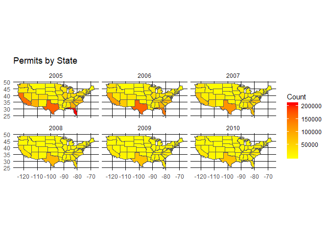
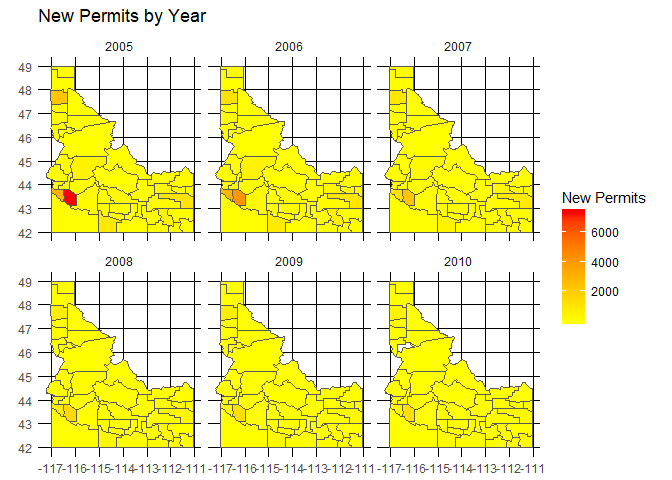

##Background
You have been asked to support a story for the local paper (that has a web presence) that looks back on the housing collapse and the early effects of residential construction. You have data on residential building permits from 1980 through 2010 for each county in the United States. Your colleague that is writing the article would like a few maps and graphics that highlight the single family building permit patterns across your state as well as the patterns in the US.

Remember the big story is the collapse of new building permits at the initial stages of the [mortgage crisis](https://en.wikipedia.org/wiki/Subprime_mortgage_crisis). Make sure your graphics highlight the collapse in a clear and honest manner.

##Reading
This reading will help you complete the tasks below.

o [Tidy Spatial Data (Blog Post)](https://en.wikipedia.org/wiki/Subprime_mortgage_crisis)

o [rnaturalearth R Package](https://github.com/ropenscilabs/rnaturalearth)

o [geofacet for ggplot2 in R](https://hafen.github.io/geofacet/)

##Tasks


```r
ggplot() + 
  geom_sf(data = Combined, aes(fill = countOfPermits)) +
  facet_wrap(~year) +
  scale_fill_gradient(low = "yellow1", high = "red1") +
  theme_minimal()  +
  labs(fill = "Count",
       title = "Permits by State")
```

<!-- -->

<div style="padding-left:30px;">

The mortgage crisis occurred during 2007 to 2010. In this graphic above we are able to see how states were building a lot during 2006 and 2005. Then we see an almost immediate drop in building, which almost levels out completely by 2010. It is very interesting to note that Texas was so high in their permits.  

</div>


```r
ggplot(data = Idaho2) +
  geom_sf(aes(fill = value)) +
  facet_wrap(~year) +
  scale_fill_gradient(low = "yellow1", high = "red1") +
  theme_minimal()  +
  labs(fill = "New Permits",
       title = "New Permits by Year")
```

<!-- -->

<div style="padding-left:30px;">

I really like the fire in Idaho in regards to building like crazy. They really kept it lively, especially in the entire state other than the Boise area. In sincerity, it is also interesting that there is only a little portion of the state that goes through dramatic change. Having said that, it always amazes me that in psychology we look for the phenomena or the anomole in the group, yet data shows that trends hold true. Idaho followed the national trend of dying out at the same pace and quickness as the rest of the nation. 

</div>


