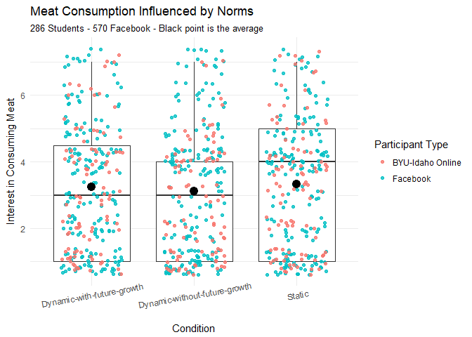
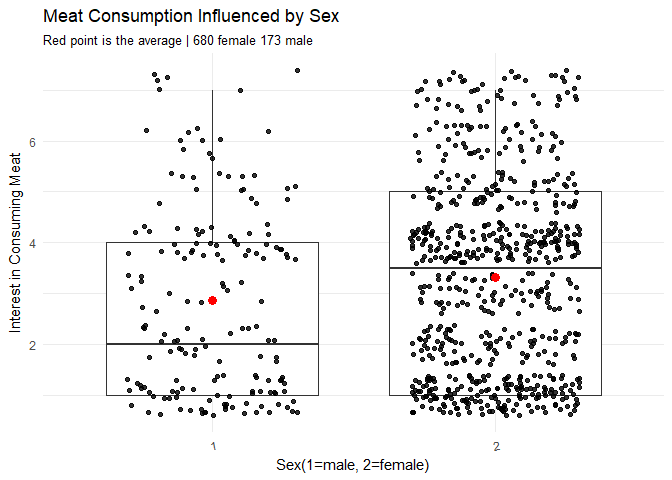
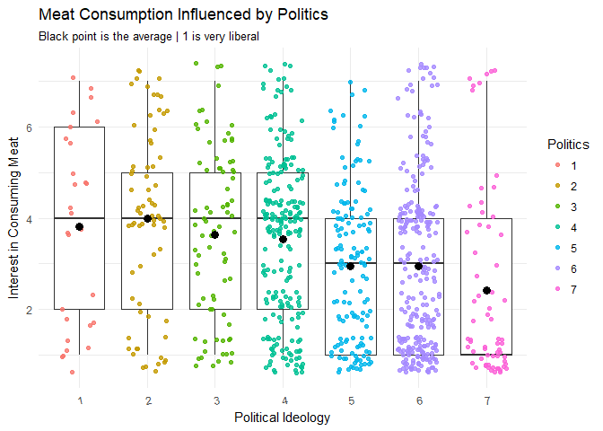
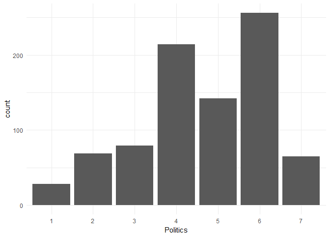

<script type="text/javascript">
 function showhide(id) {
    var e = document.getElementById(id);
    e.style.display = (e.style.display == 'block') ? 'none' : 'block';
 }
</script>


##Background

<div style="padding-left:30px;">

In 2017 [Sparkman et al.](http://journals.sagepub.com/doi/abs/10.1177/0956797617719950) ran a study looking to understand more fully normative influence. We are replicating experiment three in their study in efforts to provide evidence to help further their findings. In experiments three, participants were asked to take a survey on Amazon Turk in order to earn a few cents towards the Amazon marketplace.

In our replication, we used the same survey, but we pushed it through facebook with the incentive of a $25 gift card. The survey was set up to test how likely people would be to conform to a given norm. The norms were the independent variables and the interest reported was the dependent variable. The dynamic norm with future growth means that the trend would continue and the other dynamic norm meant that it would begin to decrease. The last norm is the static norm where the group was told that 30% of people don't eat meat. My graphical analysis is aiming to see which demographic is most telling about a person's interest in following the crowd.


</div>

## <a href="javascript:showhide('Data Manipulation')">Data Manipulation </a>

<div id="Data Manipulation" style="display:none;">


```r
dt1 <- read_csv("C:/Users/Cortland/OneDrive/School/Psychology/Experiencing Research/Student March 29.zip")

dt2 <- read_csv("C:/Users/Cortland/OneDrive/School/Psychology/Experiencing Research/Facebook March 29.zip")

Student <- dt1 %>% 
  select(Finished, ResponseId, Q16, Q32, Q18, Q26,Q29,Q5,Q8,Q9,Q10) %>% 
  mutate(Type = "BYU-Idaho Online",
         Condition =
           case_when(!is.na(Q18)~"Static",
                     !is.na(Q26)~"Dynamic-with-future-growth",
                     !is.na(Q29)~"Dynamic-without-future-growth",
                     TRUE ~ "Missing")) %>% 
  slice(3:n()) %>% 
  rename(Consent = Q16,
         US = Q32,
         Static = Q18,
         DynamicUp = Q26,
         DynamicDown = Q29, 
         Interest = Q5,
         Politics = Q8, 
         Sex = Q9,
         Vegan = Q10) %>% 
  filter(Condition != "Missing",
         Interest != "NA") %>% 
  mutate(Interest = parse_number(Interest)) 


Norms <- dt2 %>% 
  select(Finished, ResponseId, Q16, Q32, Q18, Q26,Q29,Q5,Q8,Q9,Q10) %>% 
  mutate(Type = "Facebook",
         Condition =
           case_when(!is.na(Q18)~"Static",
                     !is.na(Q26)~"Dynamic-with-future-growth",
                     !is.na(Q29)~"Dynamic-without-future-growth",
                     TRUE ~ "Missing")) %>% 
  slice(3:n()) %>% 
  rename(Consent = Q16,
         US = Q32,
         Static = Q18,
         DynamicUp = Q26,
         DynamicDown = Q29, 
         Interest = Q5,
         Politics = Q8, 
         Sex = Q9,
         Vegan = Q10) %>% 
  filter(Condition != "Missing",
         Interest != "NA") %>% 
  mutate(Interest = parse_number(Interest)) 

Student <- Student %>% 
  filter(Vegan == "2")

Norms <- Norms %>% 
  filter(Vegan == "2")

CombinedNorms <- Norms %>% 
  bind_rows(Student) %>% 
  filter(Sex!="3")
```

<div style="padding-left:30px;">

The data was taken from a raw source called Qualtrics, a survey engine used by BYU-Idaho. I manipulated the title names of the columns and then selected to keep the specific columns that we were trying to examine. In taking on the data, we chose to set forward a few exclusions. First, they had to give consent and answer the question regarding their interest in consuming less meat. After that I went in and changed the column names to be represnted better, while eliminating the first three rows, which did not contain responses. I then also excluded those that did not give a reason for which condition they were given, because this disallowed us to make connections. Lastly, for statistical analysis, I turned the Interest column into a number so that the analysis could be run and excluded those that did not disclose sex, and that claim to be vegan as this presents a heavy bias.

</div>

</div>

##Graphics

### <a href="javascript:showhide('sample')">Sample Vs Interest </a>

<div id="sample" style="display:none;">


```r
ggplot(data = CombinedNorms, aes(x = Type, y = Interest)) +
  geom_boxplot() +
  geom_jitter(width = .3, alpha = .8) +
  stat_summary(fun.y = "mean", geom = "point", size = 3, color = "Red") +
  theme_minimal() +
  theme(axis.text.x = element_text(angle = 10, vjust = 1, hjust = .5)) +
  labs(color = "",
       fill = "",
       x = "Participants",
       y = "Interest in Consuming Meat",
       title = "Meat Consumption Interest Across Samples",
       subtitle = "Red point is the average")
```

<!-- -->

<div style="padding-left:30px;">

This graphic is simply showing us how the two different samples addressed their interest in consuming less meat. This does not take into consideration the norms of which the participants were introduced. Given this information one can notice that the Facebook sample has many more participants and cal also see that the median score of the facebook participants is higher. 

</div>
</div>

### <a href="javascript:showhide('condition')">Condition Vs Interest </a>

<div id="condition" style="display:none;">


```r
ggplot(data = CombinedNorms, aes(x = Condition, y = Interest)) +
  geom_boxplot() +
  geom_jitter(mapping = aes(color = Type), width = .3, alpha = .8) +
  stat_summary(fun.y = "mean", geom = "point", size = 4, color = "Black") +
  theme_minimal() +
  theme(axis.text.x = element_text(angle = 10, vjust = 1, hjust = .5)) +
  labs(color = "Participant Type",
       fill = "",
       x = "Condition",
       y = "Interest in Consuming Meat",
       title = "Meat Consumption Influenced by Norms",
       subtitle = "286 Students - 570 Facebook - Black point is the average")
```

<!-- -->

<div style="padding-left:30px;">

Again in this graphic we are able to see that the norm that the participants were given did not really change how the participants responded. We see a little difference, but it is not really life changing. 

</div>
</div>

### <a href="javascript:showhide('sex')">Sex Vs Interest </a>

<div id="sex" style="display:none;">


```r
ggplot(data = CombinedNorms, aes(x = Sex, y = Interest)) +
  geom_boxplot() +
  geom_jitter(width = .3, alpha = .8) +
  stat_summary(fun.y = "mean", geom = "point", size = 3, color = "Red") +
  theme_minimal() +
  theme(axis.text.x = element_text(angle = 10, vjust = 1, hjust = .5)) +
  labs(color = "",
       fill = "",
       x = "Sex(1=male, 2=female)",
       y = "Interest in Consuming Meat",
       title = "Meat Consumption Influenced by Sex",
       subtitle = "Red point is the average | 680 female 173 male")
```

<!-- -->

<div style="padding-left:30px;">

Here again we are able to see a few things. First, there are a lot more females than males that participated. That being said, the large number of females may have pushed the scores more towards the four mark, which is nuetral. 

</div>
</div>


### <a href="javascript:showhide('politics')">Politics Vs Interest </a>

<div id="politics" style="display:none;">


```r
ggplot(data = CombinedNorms, aes(x = Politics, y = Interest)) +
  geom_boxplot() +
  geom_jitter(mapping = aes(color = Politics), width = .3, alpha = .8) +
  stat_summary(fun.y = "mean", geom = "point", size = 3, color = "Black") +
  theme_minimal() +
  theme(axis.text.x = element_text(angle = 10, vjust = 1, hjust = .5)) +
  labs(color = "Politics",
       fill = "",
       x = "Political Ideology",
       y = "Interest in Consuming Meat",
       title = "Meat Consumption Influenced by Politics",
       subtitle = "Black point is the average | 1 is very liberal")
```

<!-- -->

<div style="padding-left:30px;">

This last graphic is the most interesting to me. How is it that there is a drop between the different political ideologies. Is it the stubbornness of the conservative individuals, or is the the wishy-washy ideology of the liberals that makes the difference (negative terms were used against both sides to bring forth humor). It is interesting to note that the participants who made politicals claims went something like this. Starting at 1(Very Liberal) the count went like this; 28, 69, 79, 214, 142, 256, 65.


```r
ggplot(CombinedNorms, mapping = aes(x=Politics)) +
  geom_bar( stat = "count") +
  theme_minimal()
```

<!-- -->

We almost had a normal distribution bar plot with the observations, except the Conservative(6) group was the largest. Therefore our data was right skewed, but is still interesting to see. 

</div>
</div>

##Results

<div style="padding-left:30px;">

Based on the observations of our amateur experiment, we were unable to find significance in the relationship between condition and interest, but we have found interest in how politics plays into the mix. Although our sample size is small, it is interesting. Now, conservatives may just love their meat and liberals may love their plants, but it is interesting nonetheless. It will be interesting to consider this in the future as we are considering normative influence again. Maybe use something other than meat consumption.

</div>


